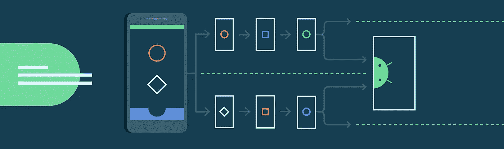
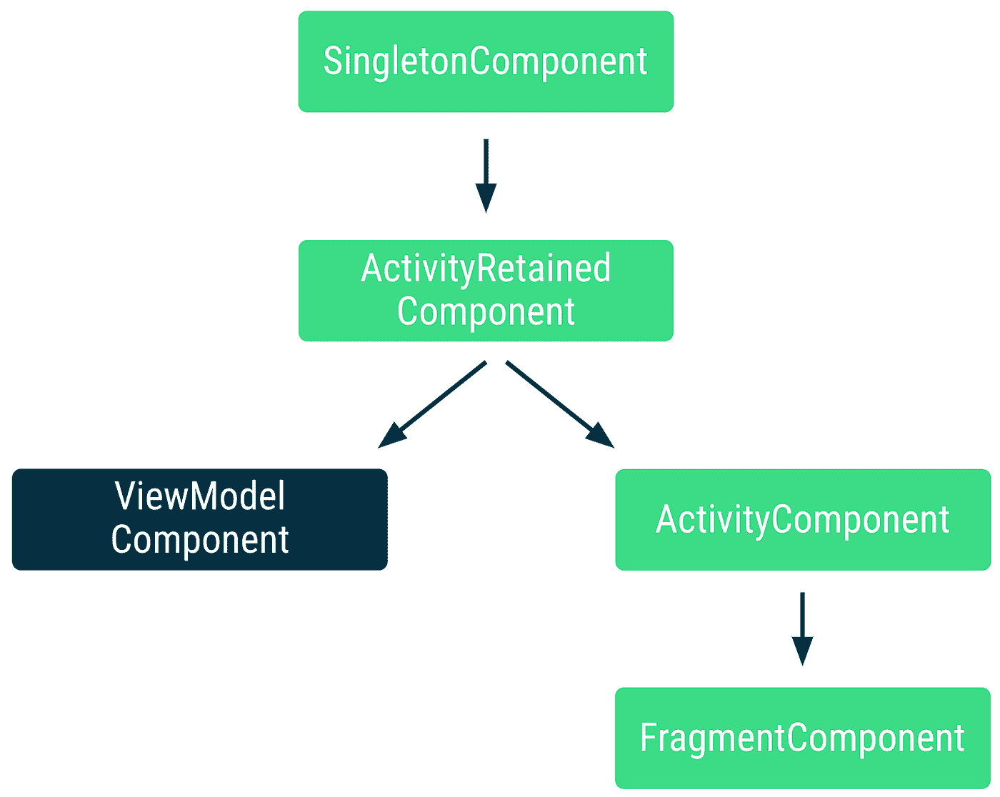

# 使用 Hilt 的视图模型组件

> 原文：<https://medium.com/androiddevelopers/using-hilts-viewmodelcomponent-53b46515c4f4?source=collection_archive---------2----------------------->

`ViewModelComponent`是[柄的组件层次结构](https://developer.android.com/training/dependency-injection/hilt-android#component-hierarchy)中的一个组件，它遵循视图模型的生命周期，并允许对其类型进行限定。

在`ViewModelComponent`被添加到 Hilt 之前，视图模型类是由`ActivityRetainedComponent`创建和注入的。因此，视图模型的依赖项只能使用未划分的类型或作用于`SingletonComponent`或`ActivityRetainedComponent`的类型，它们的实例由所有视图模型共享。

如果应用程序的每个屏幕都是一个活动，那么上面的问题可能不会出现，因为将一个类型的范围限定为`ActivityRetainedComponent`将意味着每个 ViewModel 类将接收该类型的不同实例。然而，对于大多数应用程序来说，每个屏幕都有一个活动并不是这样。

此外，`SavedStateHandle`类型在`ActivityRetainedComponent`中不能作为默认绑定使用。

现在，视图模型是由遵循视图模型生命周期的`ViewModelComponent`创建和注入的。每个 ViewModel 实例都有一个不同的`ViewModelComponent`实例，为了给它确定一个类型的范围，可以使用`@ViewModelScoped`注释。

*Position of the ViewModelComponent in a simplified Hilt’s component hierarchy*

`ViewModelComponent`从`ActivityRetainedComponent`伸出。因此，作用域为`ViewModelComponent`的类型可以依赖作用域为`ActivityRetainedComponent`和`SingletonComponent`的类型。除此之外，ViewModelComponent 还包含一个与其 ViewModel 相关联的`[SavedStateHandle](https://developer.android.com/reference/androidx/lifecycle/SavedStateHandle)`的默认绑定。

# ViewModelComponent 的范围

与其他组件相比，使用`@ViewModelScoped`来确定`ViewModelComponent`的作用域，从而确定 ViewModel 的作用域，可以为您提供更大的灵活性和粒度。视图模型经受住了配置的变化，它的生命周期可以由一个活动、片段甚至一个[导航图](https://developer.android.com/reference/androidx/navigation/NavBackStackEntry)来控制！

尽管如此，`ActivityComponent`和`FragmentComponent`的作用域仍然是有用的，因为这些组件不能经受住在某些场景中可能需要的配置更改。此外，`FragmentComponent`扩展了`ActivityComponent`，这是多个`ViewModelComponent`无法实现的行为

因此:

*   为了让所有的视图模型共享同一个类型的实例，用`@ActivityRetainedScoped.`对其进行注释
*   要将一个类型限定在一个 ViewModel 中，使其在配置更改后仍然存在，并且/或者由导航图控制，可以用`@ViewModelScoped`对其进行注释。
*   要将某个类型的范围限定到活动中，并且不使它在配置更改后继续存在，那么可以用`@ActivityScoped`或`@FragmentScoped`进行注释，如果您希望将该行为的范围限定到片段中的话。

# 使用@ViewModelScoped

该注释允许您将类型的范围限定为 ViewModel 的实例。相同的实例将被注入 ViewModel 及其依赖项拥有的所有依赖项中。

在下面的例子中，`LoginViewModel`和`RegistrationViewModel`使用了包含可变状态的`@ViewModelScoped UserInputAuthData`类型。

由于`UserInputAuthData`的作用域是 ViewModel，`RegistrationViewModel`和`LoginViewModel`将接收到`UserInputAuthData`的*不同实例*。然而，每个视图模型的未划分的用例依赖使用其视图模型使用的*相同的实例*。

# 向 ViewModelComponent 添加绑定

您可以像添加任何其他组件一样将绑定添加到`ViewModelComponent`。如果在上面的代码片段中，`ValidateUsernameUseCase`是一个接口，您可以告诉 Hilt 使用如下的实现:

`ViewModelComponent`遵循视图模型的生命周期，并允许对其类型进行范围界定。由于 ViewModel 的生命周期可以由一个活动、片段或者甚至一个[导航图](https://developer.android.com/reference/androidx/navigation/NavBackStackEntry)来控制，所以在您可以确定范围的地方的数量上，您获得了更多的灵活性和粒度。

要将一个类型限定在一个视图模型中，可以用`@ViewModelScoped`对其进行注释。为了让所有的视图模型共享同一个类型的实例，用`@ActivityRetainedScoped`对其进行注释。