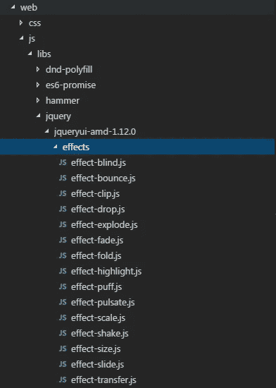

# 在 Oracle JET 中使用 jQuery UI 效果

> 原文：<https://medium.com/oracledevs/using-jquery-ui-effects-within-oracle-jet-6da80737d428?source=collection_archive---------0----------------------->

我最近在尝试使用 jQuery UI 模块“effect”时遇到了一个问题。我的用例是，当一个表单验证失败时，我想在一个按钮上包含一个摇动效果。

尽管您的 JET 安装中包含了 jQuery UI，但还是需要花点时间来了解如何在应用程序中实际使用 shake 效果。


**node_modules/jquery-ui/ui/effects**

问题在于 Oracle 工具导入 jQuery UI 的方式。它在构建时漏掉了**node _ modules/jquery-ui/ui/effects**文件夹。因此，为了包含这些文件，您必须手动对您的 **oraclejet-build.js** 文件(位于 **scripts/grunt/config** 中)进行一些更改。我们希望在构建期间将丢失的文件夹复制到暂存文件夹中。

在此文件中，取消对 copyCustomLibsToStaging 块的注释，并将以下内容添加到文件列表中，使其看起来如下所示:

```
copyCustomLibsToStaging: {
  fileList: [
      {
         cwd: 'node_modules/jquery-ui/ui/effects',
         src: '*.js',
         dest:'web/js/libs/jquery/jqueryui-amd-1.12.0/effects'
      }
  ]
},
```

现在，如果您运行您的应用程序，您将看到 web 目录中的 effects 文件夹:



**web/js/libs/jquery/jquery-amd-1.12.0/effects**

然后，您希望在视图模型中定义新的效果:

*(* ***注:*** *我只是在定义我正在使用的效果，你可以用你想要使用的效果来改变‘效果-摇动’，或者定义多个效果)*

```
define(['ojs/ojcore', 'knockout', 'jquery', '**jqueryui-amd/effects/effect-shake**']
```

就是这样！通过遵循这两个简单的步骤，您将能够将 jQuery UI 效果绑定到 JET 应用程序中的组件。

— DC