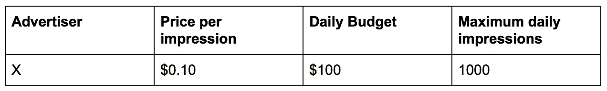
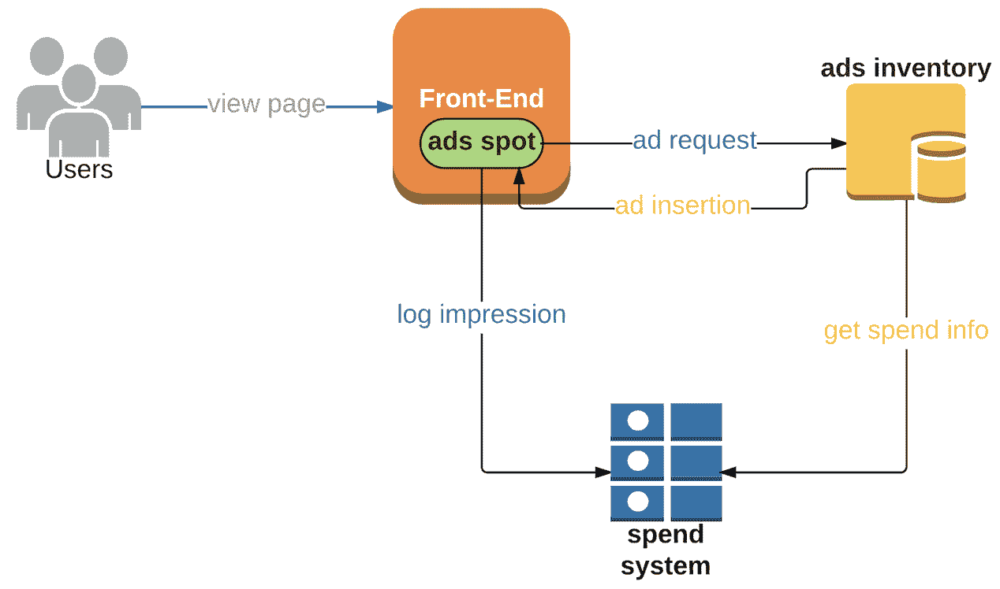
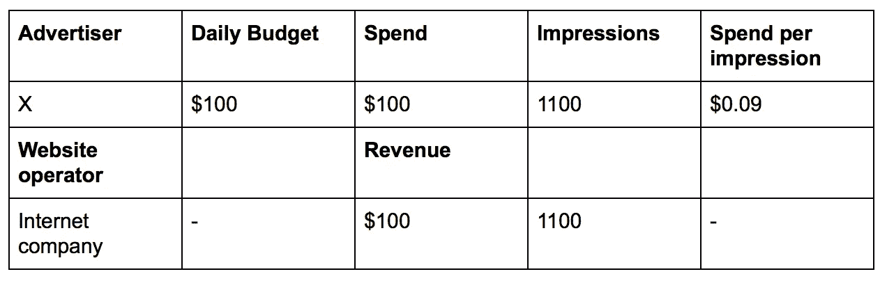
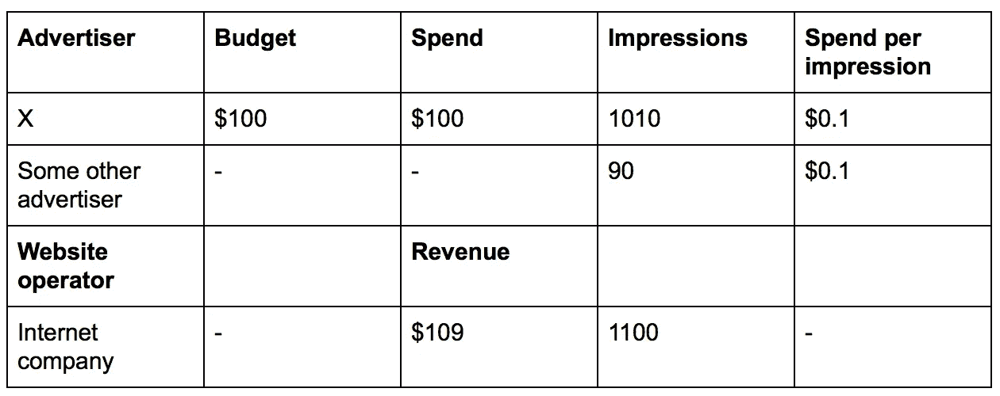
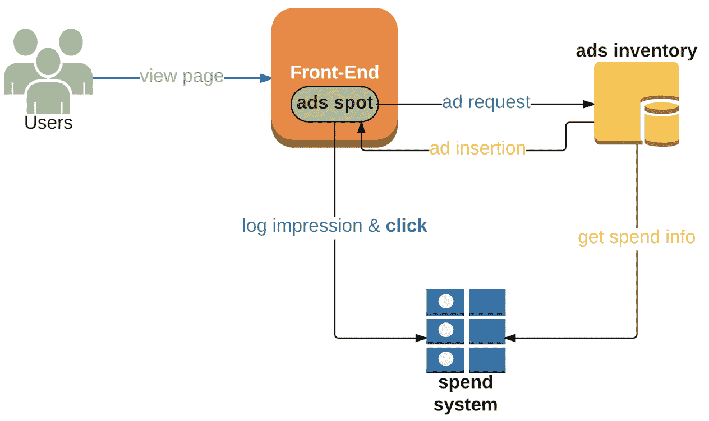
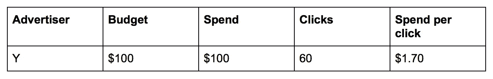
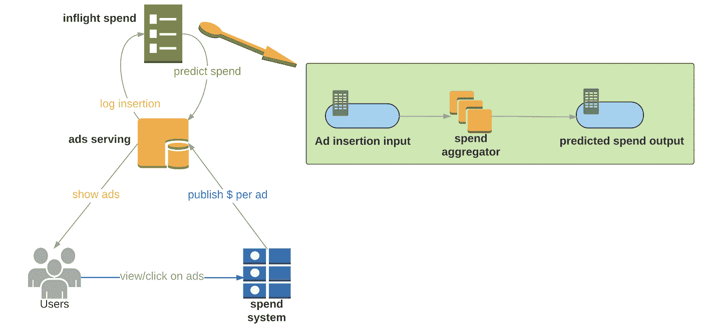
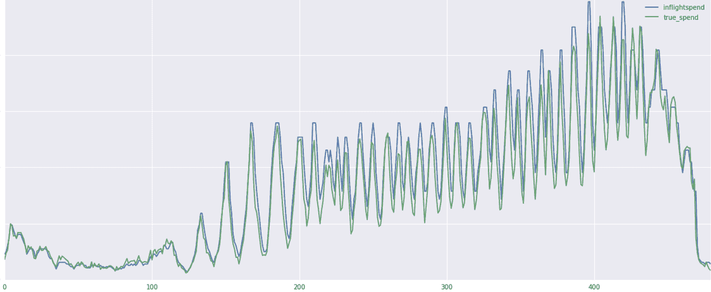

# 使用 Kafka Streams API 进行预测预算

> 原文：<https://medium.com/pinterest-engineering/using-kafka-streams-api-for-predictive-budgeting-9f58d206c996?source=collection_archive---------1----------------------->

陈博阳| Pinterest 工程师，Ads 基础设施

在 Pinterest，我们使用 Kafka Streams API 在几秒钟内为数千个广告服务器提供机上消费数据。我们的广告工程团队努力确保我们为广告合作伙伴提供最佳体验。作为其中的一部分，我们必须建立系统来防止广告过度投放。在本帖中，我们将解释超额交付，并分享我们如何使用 [Kafka Streams](https://kafka.apache.org/documentation/streams) 构建预测系统，以减少我们的广告系统中的超额交付，并提供关于机上消费的近即时信息。

# 超额交货

当免费广告展示给超出预算的广告客户时，就会出现超额投放。这减少了有可用预算的广告商让他们的产品和服务被潜在客户发现的机会。

过量交货是一个难以解决问题，原因有二:

1.  实时花费数据:关于广告投放的信息需要在几秒钟内反馈到系统中，以便关闭超出预算的活动。
2.  预测性支出:快速的历史支出数据是不够的。该系统需要能够预测未来可能发生的支出，并减缓接近达到预算的活动。这是因为插入的广告仍然可以被用户使用。这使得花费信息很难在短时间内准确测量。这样的自然延迟是不可避免的，我们唯一能确定的就是广告插入事件。

这里有一个如何工作的例子。想象一下，广告客户 X 以每天 100 美元的总预算向一家基于互联网的公司支付每**印象 0.10 美元。这最多产生 1000 个每日印象。**

该公司很快为广告商实施了一个简单的系统:

当一个新的广告位(即展示广告的机会)出现在公司网站上时，前端向广告库存发送广告请求。广告清单然后基于广告客户 X 的剩余预算来决定是否显示他们的广告。如果预算仍然可用，广告库存将向前端插入广告(即嵌入用户应用程序的广告条目)。在用户查看广告之后，印象事件被发送到消费系统。

然而，当该公司检查他们的收入时，这并没有发生。

在一天之内，广告商 X 的广告被显示了 1100 次，每次显示 0.09 美元。额外的 100 次展示是免费的，可以被其他广告商使用。这个例子说明了过度交付的常见行业挑战。

那么过度交付是如何发生的呢？在这个例子中，假设支出系统反应太慢。事实上，假设在它解释一个用户印象之前有五分钟的延迟。所以这个例子中的互联网公司做了一些优化改进系统，结果多了 9 美元！这是因为该公司为其他预算盈余的广告商展示了 90 次展示，而超额投放率仅为 10/1000 = 1%。

后来，另一个广告客户 Y 联系了同一家互联网公司，希望每天花费 100 美元，以每次**点击**(即用户点击广告链接并到达广告客户 Y 的网站)2.0 美元的价格展示他们的广告，每天最多 50 次点击。互联网公司将广告客户 Y 添加到流量中，并将他们的点击事件跟踪添加到系统中。

一天结束时，这家互联网公司的系统又一次超额交付了。

广告商 Y 最终获得了 10 次免费点击！互联网公司需要找出为什么系统不能预见插入的广告是否会被点击，无论系统有多快。如果没有未来支出的信息，他们总是会超额交货。

为了完成这个例子，该公司最终找到了一个绝妙的解决方案:计算每个广告客户的**飞行花费**。飞行花费是尚未收费的广告插入费用。**如果实际花费+飞行中花费>每日预算，则不显示该广告商的广告。**

# 建立预测系统

## 动机

每天，我们都帮助 Pinners 在我们的应用中发现个性化的想法，从推荐到搜索到推广的 pin。我们需要一种可靠且可扩展的方式来为 Pinners 提供广告，并确保我们尊重广告合作伙伴的预算。

## 要求

我们开始设计一个开支预测系统，目标如下:

*   能够为不同的广告类型工作(例如，印象，点击)。
*   必须能够每秒处理数万个事件。
*   能够将更新分散到 1，000 多台消费类计算机。
*   端到端延迟应小于 10 秒；
*   确保 100%正常运行时间。
*   重量轻，易于工程师维护。

## 卡夫卡为什么流

我们评估了各种流媒体服务，包括 [Spark](https://spark.apache.org/streaming/) 和 [Flink](https://flink.apache.org/) 。这些技术符合我们的规模要求，但在我们的案例中，Kafka Streams 提供了额外的优势:

*   毫秒级延迟:Kafka streams 有毫秒级延迟保证，打败了 Spark 和 Flink。
*   轻量级:Kafka Streams 是一个 Java 应用程序，没有像专用集群那样的严重外部依赖性，从而最大限度地降低了维护成本。

# 具体的计划

从较高层面来看，下图展示了我们的机上消费系统:

-广告服务:向用户分发广告，记录广告插入，并从“机上消费”服务中获得预测消费。

花费系统:聚集广告事件并使广告服务系统了解每个广告客户的当前花费。

-机上消费:

*   广告插入输入:每次新的插入发生时，广告服务系统与输入主题通信。该消息看起来像是:

{key: adgroupId，value: inflight_spend}，其中

*   adgroupId =在相同预算约束下的广告组的 Id。
*   飞行中花费=价格*印象率*行动率

-支出聚合器:Tails 输入主题，并使用 Kafka 流基于广告组聚合支出。我们为每个广告组维护了一个 10 秒钟的[窗口存储](http://docs.confluent.io/current/streams/developer-guide.html#windowing)。输出主题将由广告服务系统消费。当收到新的预测花费时，ads 服务器将更新飞行中的花费。

**价格:这个广告的价值。*

**Impression_rate:一次插入到印象的历史转化率。请注意，插入并不保证转换为印象。*

**Action_rate:对于按点击付费的广告客户，这是用户点击该广告插入的概率；对于按印象付费的广告客户，这是 1。*

# 预测支出

实际上，我们的支出预测非常准确。应用预测预算系统后，我们显著减少了超额交付。下面是实际支出与预测支出的测试示例。

*例:*横轴是三个 3 分钟宽的时间间隔；纵轴是按时间间隔的实际花费。蓝线代表飞行中的花费，绿线代表实际花费。

# 主要学习内容

1.  糟糕的窗口存储设计会严重影响性能。通过使用[滚动窗口](https://docs.confluent.io/current/streams/developer-guide.html#tumbling-time-windows)而不是[跳跃窗口](https://docs.confluent.io/current/streams/developer-guide.html#windowing-hopping)，我们看到了 18 倍的性能提升。我们最初的实现使用跳跃窗口来计算前三分钟的预期花费。例如，时间范围可以是三分钟长，间隔 10 秒钟。在这种情况下，将有 180 秒/ 10 秒= 18 个打开的窗口。Kafka Streams 处理的每个事件可能会更新所有 18 个窗口，从而导致冗余计算。为了解决这个问题，我们从跳跃窗口切换到翻滚窗口。与跳跃窗口不同，滚动窗口不会彼此重叠，这意味着每个事件一次只会更新一个窗口。通过将更新次数从 18 次减少到 1 次，切换到滚动窗口使总吞吐量增加了 18 倍。
2.  消息压缩策略。为了最小化对消费者的高扇出效应，我们对广告组 id 使用了[增量编码](https://en.wikipedia.org/wiki/Delta_encoding)，对消费数据使用了[查找表编码](https://en.wikipedia.org/wiki/Lookup_table)。这种压缩策略将邮件大小减少了 4 倍。

# 结论

使用 Apache Kafka Streams 的 API 来构建预测性支出管道是我们 ads 基础设施的一项新举措，事实证明它快速、稳定、容错且可扩展。我们计划继续探索 [Kafka 1.0](https://cwiki.apache.org/confluence/pages/viewpage.action?pageId=71764913) 和 [KSQL](https://www.confluent.io/product/ksql/) 带来的未来系统设计！

鸣谢:非常感谢来自 Pinterest 的 Tim Tang、Liquan Pei、Zack Drach 和 Jerry Liu 提供的整体设计、数据分析、性能调整和编码逻辑，以及来自 Confluent 的提供的 Kafka Streams 使用说明和故障排除。