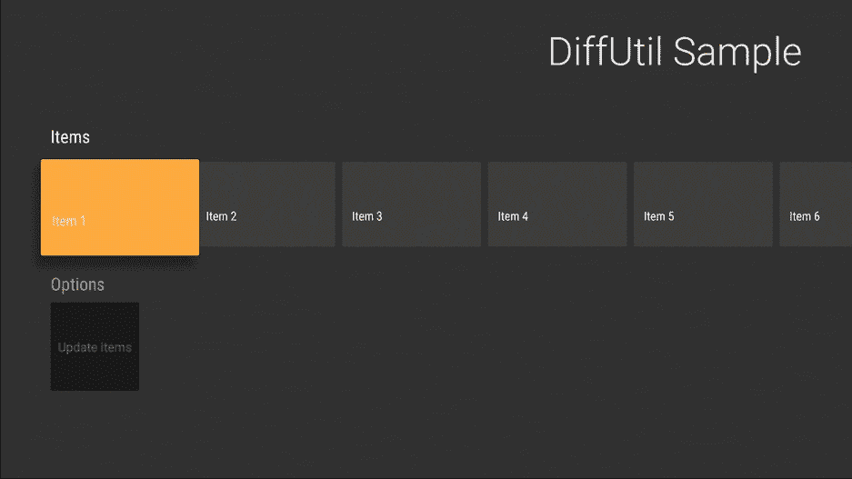
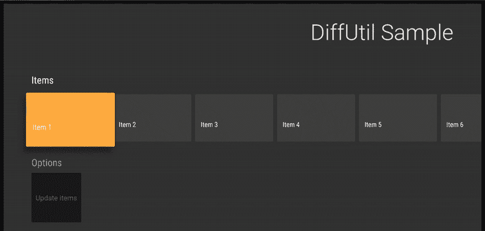
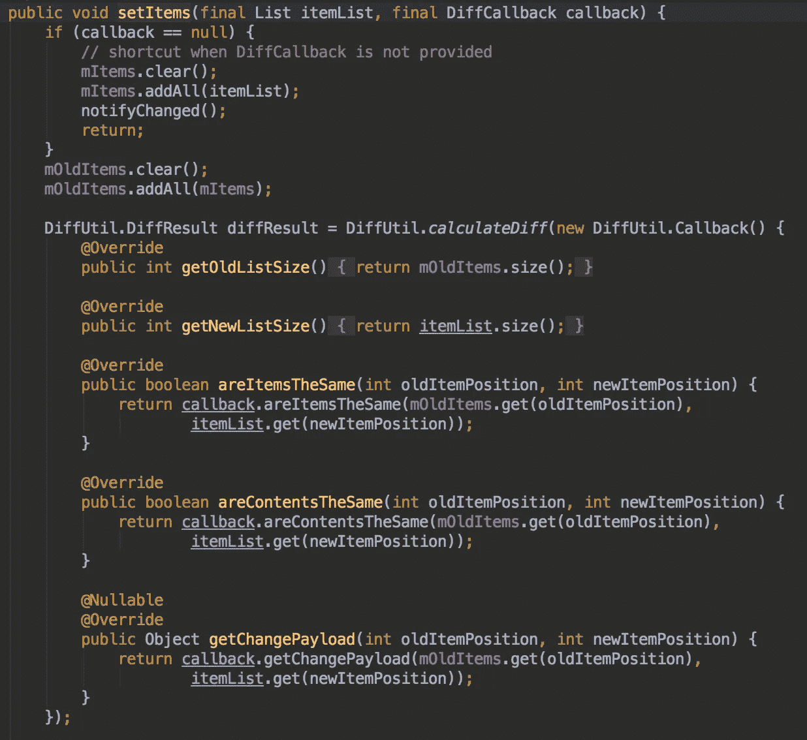

# 使用 leanback 的 DiffCallback

> 原文：<https://medium.com/androiddevelopers/using-leanbacks-diffcallback-77d47949212b?source=collection_archive---------6----------------------->

## 不同回调之间的区别

在支持库的[版本 24.2 中引入了一个名为](https://developer.android.com/topic/libraries/support-library/rev-archive.html#24-2-0-api-updates)`[DiffUtil](https://developer.android.com/reference/android/support/v7/util/DiffUtil.html)` 的类，它使得更新一个`[RecyclerView.Adapter](https://developer.android.com/reference/android/support/v7/widget/RecyclerView.Adapter.html)`变得很简单。在向后倾斜支持库的[版本 27.0 中，添加了一个支持](https://developer.android.com/topic/libraries/support-library/revisions.html#27-0-0)`[ArrayObjectAdapter](https://developer.android.com/reference/android/support/v17/leanback/widget/ArrayObjectAdapter.html)`的`DiffUtil`抽象。

`[ArrayObjectAdapter](https://developer.android.com/reference/android/support/v17/leanback/widget/ArrayObjectAdapter.html)`有一个叫做`[setItems(final List itemList, final DiffCallback callback)](https://developer.android.com/reference/android/support/v17/leanback/widget/ArrayObjectAdapter.html#setItems(java.util.List,%20android.support.v17.leanback.widget.DiffCallback))`的新方法，它接受一个叫做`[DiffCallback](https://developer.android.com/reference/android/support/v17/leanback/widget/DiffCallback.html)`的新类。`DiffCallback`看起来像`[DiffUtil.Callback](https://developer.android.com/reference/android/support/v7/util/DiffUtil.Callback.html)`，缺少了一些方法。

列表大小方法消失了！适配器中的`setItems()`方法知道旧项和新项。当适配器创建`DiffUtil.Callback`时，它会覆盖`[getOldListSize()](https://developer.android.com/reference/android/support/v7/util/DiffUtil.Callback.html#getOldListSize())`和`[getNewListSize()](https://developer.android.com/reference/android/support/v7/util/DiffUtil.Callback.html#getNewListSize())`，让您可以专注于比较列表中的项目。

```
val diffCallback = object : DiffCallback<DummyItem>() {
    override fun areItemsTheSame(oldItem: DummyItem, 
                                 newItem: DummyItem): Boolean = 
        oldItem.id == newItem.id override fun areContentsTheSame(oldItem: DummyItem, 
                                    newItem: DummyItem): Boolean =
        oldItem == newItem
}itemsAdapter.setItems(randomItems(), diffCallback)
```

适配器更新项目并调度动画。



ArrayObjectAdapter will dispatch the appropriate animations

你不必用一个`DiffCallback`来称呼`setItems()`。如果您不提供`DiffCallback`，适配器会清除当前项目并添加所有新项目，这可能会导致您的内容在屏幕上闪烁。



The content in the row jumps as items are removed and added

查看`setItems()`的源代码，我们可以看到`ArrayObjectAdapter`是如何从`DiffUtil`中抽象出样板文件的——给开发者一个更干净的 API。



Part of the source code for `setItems()` in ArrayObjectAdapter

如果你想尝试一下`DiffCallback`，看看这个[要点](https://gist.github.com/benbaxter/6c9fbb568d05d8cb4b3829dbdb23e0cb)就可以开始了。

如果你正在开发 Android TV 的应用程序，我很想知道你喜欢什么，你的痛点是什么。如果您想继续讨论，请在 [Twitter](https://twitter.com/benjamintravels) 上给我留言。