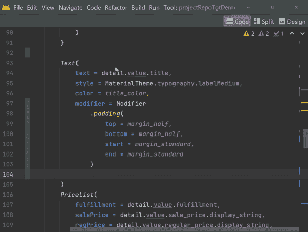

# 使用实时模板提高 Android 开发效率

> 原文：<https://medium.com/google-developer-experts/using-live-templates-to-improve-android-development-productivity-ca796ff78678?source=collection_archive---------1----------------------->

Android Studio (AS)中我最喜欢的一个工具是“Live Templates”。这是一种创建简单代码模板的方法，可以通过自动完成的快捷方式访问这些模板。

使用它们是生产力的助推器，因为它们将为你自动化许多样板代码。

# 使用内置模板

AS 中已经内置了大量的模板。

一个例子是在函数中键入 *logm* 。插入样板代码，该代码具有已经输入的方法名称和输入参数/值。

Example of using the `logm` Live Template

# 了解内置模板

这些短裤只有你知道它们才是好的。这是超级容易看到他们所有人的信息。

进入**设置**，搜索“实时模板”。从这里，您将看到各种类别，并可以深入查看每个模板的确切信息。

Listing of all the Live Templates available

了解存在哪些模板以及如何使用它们是提高工具使用水平和提高生产力的重要方法。

# 创建自定义模板

创建自己的模板真的很容易。

## 用例

我最近解决的一个最近的用例，与用 Jetpack Compose 测试一个项目有关。我需要给许多修改器添加 *testTag* 属性。

代码应该是这样的:

> 修饰语
> 
> 。填充()
> 
> **。testTag(" $ { TEST _ TAG } $ { item . id } "**

在我的 UI 中的每个元素上输入相同的样板文件将是乏味的。我可能需要在数百个位置添加该属性。我可以复制/粘贴，但这将是乏味的，容易出错。一遍又一遍地输入相同的语法既乏味又容易出错。

Manually typing the testTag() attribute

# 创建自定义模板

在我们之前使用的同一个**实时模板**屏幕中，您可以按下 **+** 按钮添加新模板。

我创建了一个名为“ *mtst”、*的模板，它有一个“ *$VAR$* ”参数，这个参数的值会随着每次使用而改变。

Creating a new `mtst` Live Template to add the testTag() attribute

# 使用自定义模板

现在我可以简单地输入 *mtst* ，然后为每个测试标签粘贴自定义值。

这比一遍又一遍地输入同样的东西要容易得多，也不容易出错。

Much quicker, particularly since I would be typing this over and over

# 高级模板定制

在这些模板中，您可以做许多高级的事情。有许多[预定义函数](https://www.jetbrains.com/help/idea/template-variables.html#predefined_functions)可以用来收集信息。

发现您可以使用的功能的一个好方法是查看现有的模板。点击标有**编辑变量**的按钮，查看现有模板如何收集信息进行显示。

例如， *logm* 模板的内容如下:

> groovy script(" def params = _ 2 . collect { it+' =[\ "+'+it+'+\ "]' }。join('，')；返回名为'+ (params.empty？'的' \"' + _1 +'():' with: ' + params) + '\ " ' "， **methodName()** ， **methodParameters()**

这看起来比实际更复杂。这只是一行基于两个预定义方法的结果格式化文本的 *groovy 语法*。

# 共享自定义实时模板

一旦你开始使用自定义模板，你会意识到它们是多么有用，并且会想与你的团队分享你新发现的生产力超能力。

很容易[共享您的自定义模板](https://www.jetbrains.com/help/idea/sharing-live-templates.html)，因为当您选择**文件|管理 IDE 设置|导出设置**时，它们会与其他 IDE 设置一起导出

我导出我所有的 IDE 设置，并将它们存储在一个 [Github 存储库](https://github.com/mwolfson/idesettings)中。我使用该存储库在多个环境中进行同步。

# 结论

我希望这个对实时模板的简单介绍能让你对使用现有的模板感兴趣，并创建一些你自己的模板。