# 在反应式微服务架构中使用机器学习和开源 BPM

> 原文：<https://medium.com/capital-one-tech/using-machine-learning-and-open-source-bpm-in-a-reactive-microservices-architecture-96bb8dc9e962?source=collection_archive---------3----------------------->


机器学习正在改变世界。无人驾驶汽车、对话式虚拟助手以及通过面部识别办理登机手续是我们前进方向的几个例子。在这些例子中，机器学习正在自动化人脑过去已经完成的过程，例如如何识别图像和处理语言。

这也延伸到世界各地的公司用来经营他们的业务的过程。业务流程通常是自动化的大好机会，[开源 BPM 产品](/capital-one-developers/comparing-and-contrasting-open-source-bpm-projects-196833f23391?source=user_profile---------4-------------------)可以帮助解决这个问题。将开源 BPM 和机器学习结合在一起，可以将自动化带到另一个层次。

例如，机器学习可以用于提供建议，这些建议可以改善业务流程中的决策。但是我们如何在一个[反应式微服务架构](/capital-one-developers/microservices-when-to-react-vs-orchestrate-c6b18308a14c)中集成机器学习和开源 BPM 呢？我们希望我们的服务是小型的，专注于做好一件事，同时是分离的和可独立部署的。在本文中，我们将讨论使用机器学习、开源 BPM 和反应式微服务来实现这一目标的集成模式。

# 机器学习背景

首先，让我们从提供机器学习的快速背景开始。它真的是人工智能(AI)的一种类型。下面是一个时间表历史，说明了我们将走过的不同阶段。

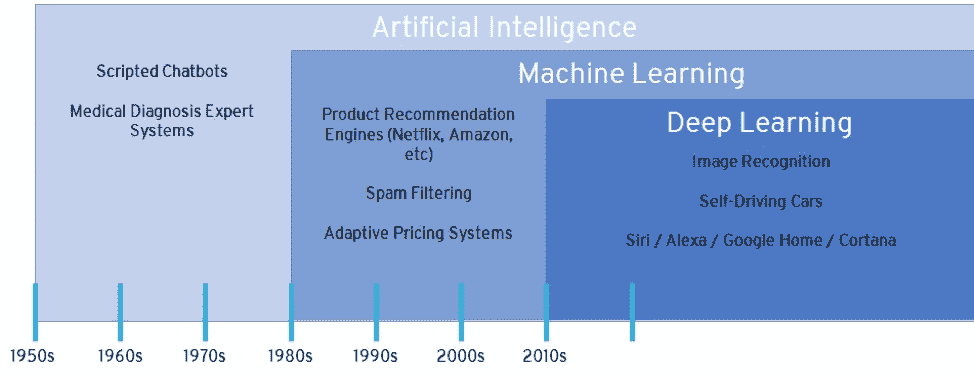

Diagram credit Patrick Wagstrom

人工智能始于 20 世纪 50 年代的 T4 专家系统。这些系统包含由人类编程的 if/then 逻辑。后来，机器学习软件的早期形式专注于线性回归、树、时间序列回归和无监督学习。在 20 世纪 80 年代，[神经网络](https://en.wikipedia.org/wiki/Artificial_neural_network)机器学习开始出现。在过去的 25 年里，机器学习软件有了很大的进步，其中大部分已经开源。

通过云计算获得计算能力也变得更加便宜和快捷。H2O 是一个开源内存大数据机器学习平台的例子。它提供了多种算法(如[广义线性模型](https://en.wikipedia.org/wiki/Generalized_linear_model)、[随机森林](https://en.wikipedia.org/wiki/Random_forest)、[梯度提升机](https://en.wikipedia.org/wiki/Gradient_boosting)、[主成分分析](https://en.wikipedia.org/wiki/Principal_component_analysis)等)。)用于训练机器学习模型以及生成显示所生成模型的准确性和性能的度量。

H2O 还将生成一个可部署的工件，您可以将它包含在您的项目中，比如 POJO (Plain Old Java Object)或者 MOJO ( Model ObJect，Optimized)工件。当 POJO 达到大小限制或需要更高的性能时，通常会使用 MOJO。

机器学习需要理解的下一个关键概念是两个高级类别——监督和非监督。

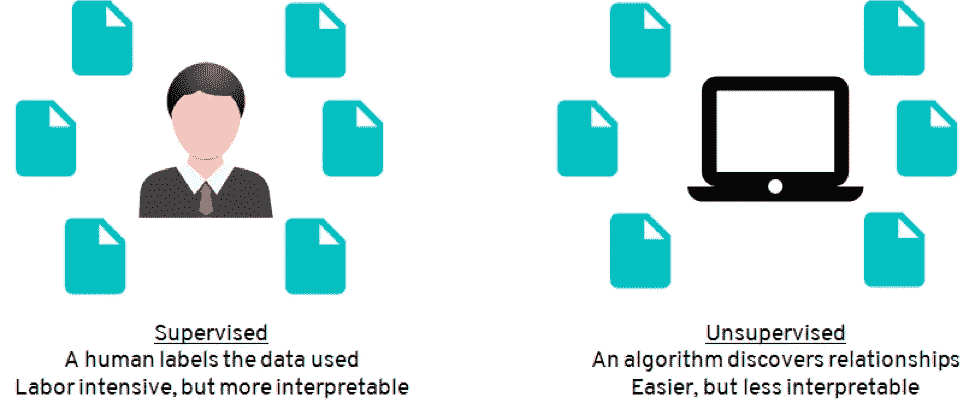

Diagram credit Patrick Wagstrom

*受监督的*是您标注数据并在数据集中包含特征和目标变量的地方。该目标变量表示您想要预测的数据元素，而特征是可用于预测目标的数据元素。目标变量在过去记录的数据集中提供，算法使用这些特征来确定如何预测所提供的目标变量。*无监督*是你不标注你的数据(不提供目标)，而是让软件去找关系。它通常通过将相似的数据分组在一起来实现这一点。

对于这两种情况，提供尽可能多的数据总是好的，因此机器学习软件可以尽可能准确。此外，确保数据无论如何都不会有偏差也很重要，否则模型就会有偏差。有了机器学习，模型只和数据一样好。

# 将机器学习集成到反应式微服务中

现在，您已经对机器学习有了一些了解，让我们来讨论它如何与微服务、反应式架构和开源 BPM 集成。到现在为止，你们可能都听说过[微服务](https://developer.capitalone.com/blog-post/delivering-microservices-for-enterprise-with-devops/)及其优势。

> 查看我以前的博客，了解更多关于[反应式架构](/capital-one-developers/microservices-when-to-react-vs-orchestrate-c6b18308a14c)和[开源 BPM](/capital-one-developers/comparing-and-contrasting-open-source-bpm-projects-196833f23391) 的信息。

首先让我们谈谈用例。设想一个场景，其中您有一个业务流程，该流程可能涉及某种程度的人工工作流以及系统 API 调用。机器学习可以用来帮助减少用户的工作流程。它还可以用来为用户提供额外的信息，以便做出更好的决策。

从设计的角度来看，您通常希望保持您的开源 BPM 业务流程轻便，并让它专注于它擅长做的事情。否则，您很快就会得到一个单一的应用程序。因此，让 BPM 专注于工作流，让外部服务专注于工作。

> 为了帮助实现这一点，您可以利用 Kafka 作为集成机制。【http://kafka.apache.org/ 

Kafka 是一个分布式流平台，可以用作反应式微服务架构中的事件流。微服务被提前预编程，以对 Kafka 中出现的特定事件做出反应。Kafka 本身速度快，吞吐量高，LinkedIn 证明了这一点，他们用它每天处理数十亿笔交易。在许多体系结构中，它也经常用于背压，充当生产者和消费者之间的缓冲，允许消费者以他们期望的速率读取。它还具有可配置的持久性，可用于微服务架构中的事件重放。这使得微服务能够在停机时弥补任何可能丢失的记录。

我最近构建的一个概念验证(与来自 Red Hat 的 David Murphy 一起)使用了开源 BPM 工具 Red Hat Process Automation Manager(PAM)的原生 Kafka 扩展。 *(Red Hat PAM 是 Red Hat BPM Suite 的新名称，两者都基于社区项目* [*jBPM*](http://www.jbpm.org/) *的老分支。)*扩展 Red Hat PAM 与 Kafka 集成，使业务流程能够直接生产和消费 Kafka 主题的事件。为了实现这一点，我们在 Red Hat PAM 中为 Kafka 创建了一个定制的工作项处理程序，以及 [Kie 服务器扩展](https://gitlab.com/murph83/kie-server-kafka)(由 Red Hat 的 David Murphy 开发)。工作项处理程序创建一个 Kafka 服务任务，可以在业务流程中使用该任务来生成 Kafka。Kie 服务器扩展更新使用来自 Kafka 的事件，进行一些解析，然后将这些事件作为信号事件发送给业务流程。下面是说明 Kie 服务器扩展的示例图，它基于 BPM Suite 6.2 的旧版本，并利用了 EJB 结构。

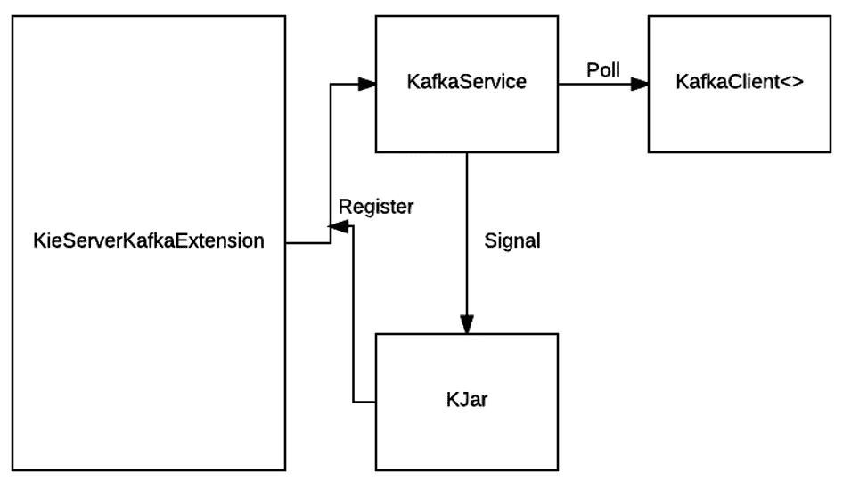

Diagram credit David Murphy

在 Red Hat PAM 7.0 中，架构看起来像这样，它删除了 EJB 构造并使用事件发射器概念:

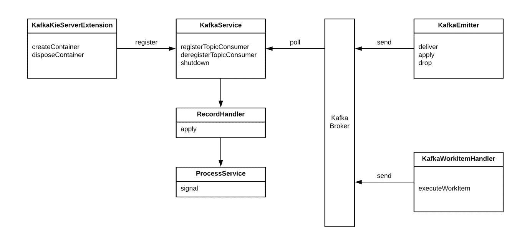

Diagram credit David Murphy

> 您可以在此处找到旧版本的源代码:
> 
> [墨菲/基-服务器-卡夫卡
> *GitLab.com*gitlab.com](https://gitlab.com/murph83/kie-server-kafka)

在将 Red Hat PAM 连接到 Kafka 之后，您可以编写一个业务流程来为 Kafka 生成将触发外部微服务的事件。这使得 Red Hat PAM 只需管理工作流，并让外部微服务完成工作。

这遵循了[“混合—和协调器之间的反应以驱动流”](/capital-one-developers/microservices-when-to-react-vs-orchestrate-c6b18308a14c)模式。下面是总体概念验证的架构图:

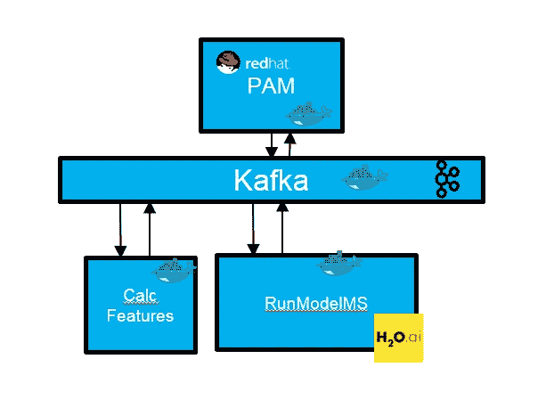

让我们更详细地看一下这个概念证明。您可以在下面找到它的源代码:

> [Andy 9876/machineellingreactivebpm
> *machineellingreactivebpm—Red Hat Session s 1506 演示:使用机器学习，Red Hat JBoss BPM 套件，以及…*github.com](https://github.com/andy9876/MachineLearningReactiveBPM)

我们在这个例子中实现的一个重要概念是命令和事件。命令是需要做的事情，而事件是过去已经发生的事情。

作为协调者，Red Hat PAM 向 Kafka 发出命令，外部微服务使用这些命令，进行一些处理，然后产生事件，这些事件由另一个微服务或 Red Hat PAM 使用。在这个概念验证中，我们有两个微服务。一个用于计算特征，另一个用于执行 H2O 模型。

我们有意将它们分开，以便在需要时可以单独扩展。这两者都被部署为 dockerized Java JARs，利用 Kafka API 消费和生产 Kafka。对于 H2O 模型，它使用分布式随机森林算法在来自 [Kaggle](https://www.kaggle.com/) 的样本信用卡欺诈检测数据集上进行训练。它包括 28 个十进制特征，以及时间、交易金额和一个指示交易是欺诈(1)还是非欺诈(0)的类变量。

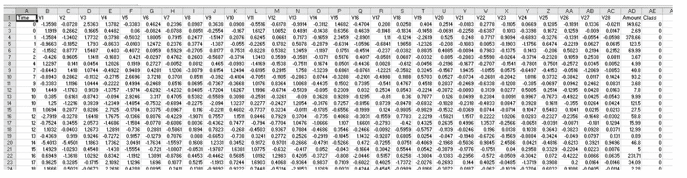

我们通过将 H2O 生成的 POJO 导入到我们的 java 项目中，将其集成到我们的 Java 微服务中:

```
import com.decisioning.drf_c79982d1_29c6_47bd_8950_897ba97ba737;
```

接下来，我们编写了一些包装器代码来创建模型的实例化:

```
hex.genmodel.GenModel rawModel = null;rawModel = (hex.genmodel.GenModel) new drf_c79982d1_29c6_47bd_8950_897ba97ba737(); EasyPredictModelWrapper model = new EasyPredictModelWrapper(rawModel);RowData row = new RowData();
```

接下来，我们将输入变量映射到 row 对象，该对象是 RowData 类的一个实例:

```
row.put("Time", time);row.put("V1", v1);row.put("V2", v2);row.put("V3", v3);row.put("V4", v4);row.put("V5", v5);row.put("V6", v6);row.put("V7", v7);row.put("V8", v8);row.put("V9", v9);row.put("V10", v10);row.put("V11", v11);row.put("V12", v12);row.put("V13", v13);row.put("V14", v14);row.put("V15", v15);row.put("V16", v16);row.put("V17", v17);row.put("V18", v18);row.put("V19", v19);row.put("V20", v20);row.put("V21", v21);row.put("V22", v22);row.put("V23", v23);row.put("V24", v24);row.put("V25", v25);row.put("V26", v26);row.put("V27", v27);row.put("V28", v28);row.put("Amount", amount);
```

然后我们执行模型:

```
BinomialModelPrediction p = null; try { p = model.predictBinomial(row); } catch (PredictException e) { e.printStackTrace(); }
```

然后写出 p.label 的内容(1 表示欺诈，0 表示非欺诈)和 p.classProbability 以获得结果:(下面的 JSON 是硬编码的，用于示例目的)

```
//if the H2o model thinks its fraud, return Fraudulent Transactionif (p.label.equalsIgnoreCase("1")) line = "{\"id\":\"" + appid + "\",\"action\": \"Fraudulent Transaction\",\"data\": {\"timestamp\": \"" + ts + "\"},\"p.label\":\"" + p.label + "\",\"p.classProbability\":\"," + p.classProbabilities[0] + "\"}";else  //if h2o model does not think its fraud, return Transaction OK line = "{\"id\":\"" + appid + "\",\"action\": \"Transaction OK\",\"data\": {\"timestamp\": \"" + ts + "\"},\"p.label\":\"" + p.label + "\",\"p.classProbability\":\"," + p.classProbabilities[0] + "\"}";return line;
```

让我们更深入地了解红帽 PAM 盒子。在本例中，Red Hat PAM 正在执行一个业务流程，该流程正在侦听由 Kie 服务器扩展处理的来自 Kafka 的信号事件(用圆圈中的三角形表示)。

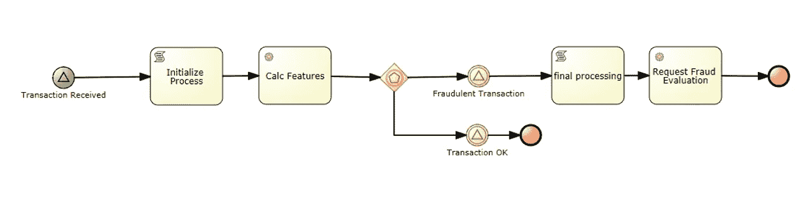

Calc Features 任务是我们创建的 Kafka 服务任务，它使您能够直接为 Kafka 主题生成消息。它需要三个输入。KafkaKey、值(要写入 Kafka 的数据)和要生成的主题。在本例中，它写入 card.transaction 主题，并作为命令发送“Calc Features”的值(这是 appInit 变量中的内容)。

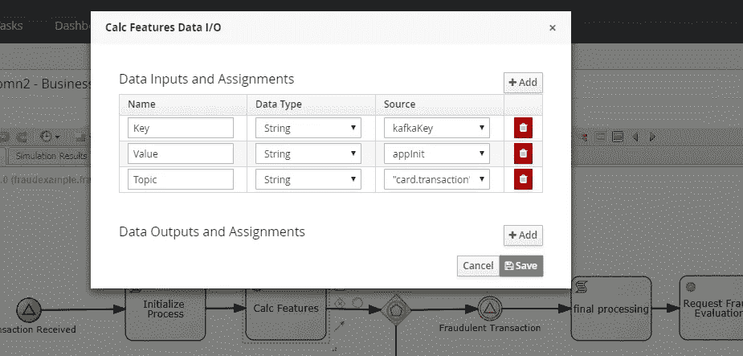

这在卡夫卡的主题中表现为:

```
{“id”: “b0e0193b-9c2c-46d0–8dfe-12d2ac88adf3”,”action”: “Calc Features”}
```

接下来，Calc Features 微服务被编程为当它在 Kafka 中看到具有“Calc Features”动作的事件时做出反应。它计算 28 个不同的数字特征，然后将它们写回卡夫卡:

```
{“id”:”b0e0193b-9c2c-46d0–8dfe-12d2ac88adf3",”action”: “Features Calculated”,”data”: {“timestamp”: “2018–07–10 16:38:52.578”, “time”: “7891”, “v1”: “-1.585505367”, “v2”: “-3.261584548”,”v3": “-4.137421983”,”v4": “2.357096252”,”v5": “-1.405043314”,”v6": “-1.879437193”,”v7": “-3.513686871”,”v8": “1.515606746”,”v9": “-1.207166361”,”v10": “-6.234561332”,”v11": “5.450746067”,”v12": “-7.333714067”,”v13": “1.361193324”,”v14": “-6.608068252”,”v15": “-0.481069425”,”v16": “-2.60247787”,”v17": “-4.835112052”,”v18": “-0.553026089”,”v19": “0.351948943”,”v20": “0.315957259”,”v21": “0.501543149”,”v22": “-0.546868812”,”v23": “-0.076583636”,”v24": “-0.425550367”,”v25": “0.123644186”,”v26": “0.321984539”,”v27": “0.264028161”,”v28": “0.13281672”,”amount”: “1”}}}
```

运行模型微服务被编程为当它看到计算的特征时做出反应，然后执行 H2O 模型并写回模型的输出，并指示交易是否可以:

```
{“id”:”703d2ff8–9a60–43f6–8d76–0065ec3528a0",”action”: “Transaction OK”,”data”: {“timestamp”: “2018–07–10 16:38:44.633”},”p.label”:”0",”p.classProbability”:”,0.40568148708343504"}
```

或者如果是欺诈交易:

```
{“id”:”b0e0193b-9c2c-46d0–8dfe-12d2ac88adf3",”action”: “Fraudulent Transaction”,”data”: {“timestamp”: “2018–07–10 16:38:52.591”},”p.label”:”1",”p.classProbability”:”,0.022"}
```

Red Hat PAM 有一个信号事件，用于查找 OK 或欺诈交易值，并结束该过程或写回 Kafka，指示需要进一步评估:

```
{“id”: “b0e0193b-9c2c-46d0–8dfe-12d2ac88adf3”,”action”: “Evaluate Fraud”}
```

下面是一个帮助说明流程的序列图:

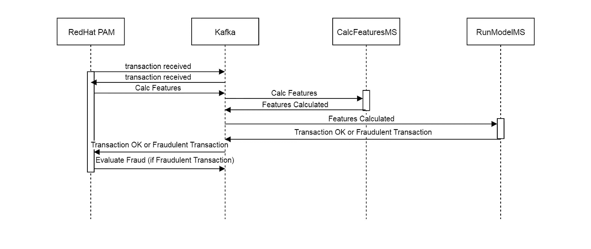

通过使用 REST 服务，我们可以看到 Red Hat PAM 中工作流所采用的整体路径:

[http://IP:port/kieserver/services/rest/server/containers/card Kafka/images/processes/instances/instance #](http://IP:port/kieserver/services/rest/server/containers/CardKafka/images/processes/instances/instance#)

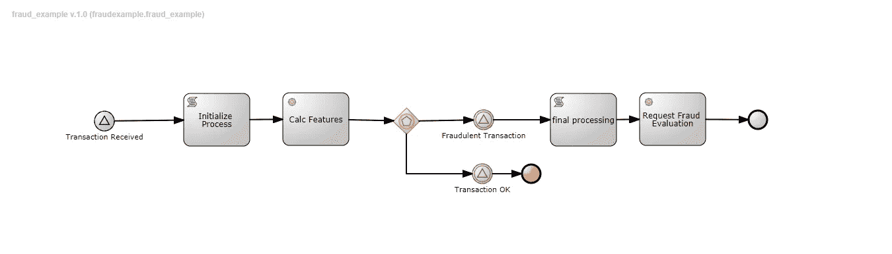

Request Fraud Evaluation Workflow Path

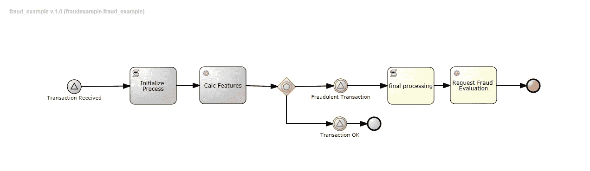

Transaction OK workflow path

# 摘要

总之，这个概念验证提供了一个工作示例，说明如何在反应式微服务架构中集成机器学习，同时还集成了开源 BPM。如果将 BPM 作为混合协调器模式来实现，这里有一些重要的事情需要考虑:

> *●应用协调器模式:*
> 
> *1。存在异步处理的同步块。*
> 
> *2。有必要在设计时和运行时查看整个端到端业务流程。*
> 
> *3。需要尽可能地去耦合，以消除依赖性。*
> 
> *●协调器可以是单点故障。确保它值得权衡并简化您的架构。评估主动/主动(应用程序和数据库层)的多部署。*
> 
> *●利用事件中的关联 id 来拼凑不同的事件。*

我希望这篇博客对你有所帮助。您可以在这里找到概念验证[的现场演示。我要感谢 RedHat 的 David Murphy 对本博客的贡献。谢谢！](https://youtu.be/hrDPirhjCSQ)

[](https://medium.com/capital-one-tech/microservices/home)

*披露声明:这些观点仅代表作者个人观点。除非本帖中另有说明，否则 Capital One 不属于所提及的任何公司，也不被其认可。使用或展示的所有商标和其他知识产权都是其各自所有者的所有权。本文为 2018 首都一。*