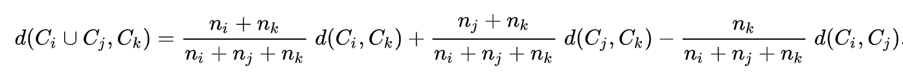
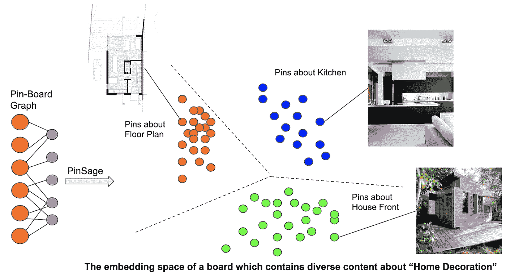

# 使用机器学习自动组织电路板

> 原文：<https://medium.com/pinterest-engineering/using-machine-learning-to-auto-organize-boards-13a12b22bf5?source=collection_archive---------0----------------------->

Dana Yakoobinsky [Web 工程师，策展产品]和 Dafang He |[机器学习工程师，家庭饲料]

虽然如今规划一个人的生活可能看起来有所不同，但我们的洞察力告诉我们，人们比以往任何时候都更多地为未来储存想法。例如，上个月，Pinterest 创建的董事会数量比去年增加了 60%，董事会参与度同比增长了近 75%。为了帮助 Pinners 更好地组织和规划他们的生活，今天我们[推出了](https://newsroom.pinterest.com/en/post/better-planning-with-pinterest)新的董事会组织工具，包括建议的董事会部分和自动分组到这些部分的引脚。这些建议可以帮助任何 Pinner 开始规划一个项目，并采取猜测出如何组织成部分的想法。

把我们新的和改进的主板看作是某种个人助理。我们使用我们的数据语料库(数百万 Pinners 保存和标记的数十亿个想法)和机器学习来确定 pin 应该如何在相关主题中分组。例如，也许一个 Pinner 是烹饪新手，但已经保存了数百个食谱别针。有了这个新工具，Pinterest 可能会建议像“素食餐”和“开胃菜”这样的板块，以帮助 Pinner 将他们的董事会组织成一个更可行的膳食计划。

这是一个需要解决的具有挑战性的用户问题，因为我们必须准确地将相似的图钉聚集在一起，并预测图钉师可能想要如何组织他们的图板(按颜色、主题、类别？).利用机器学习和我们自己的 [PinSage](/pinterest-engineering/pinsage-a-new-graph-convolutional-neural-network-for-web-scale-recommender-systems-88795a107f48) 技术，我们建立了一个 Pin 聚类解决方案，以确定 Pin 应该在哪里以及如何组织，允许我们将类似的 Pin 分组在一起，并建议具有适当名称的新电路板部分。

我们的目标是让那些在项目中需要帮助的人在 Pinterest 上近乎自动化地进行规划，让 Pinners 更有可能回到他们的董事会，并对他们已经保存的东西采取行动。

# UX 流

当一个 Pinner 导航到一个有合适部分建议的板时，我们向他们显示一个横幅，上面有建议的部分名称和新部分的 Pins 预览。合格的建议是我们的聚类算法认为有资格作为一个部分的任何可用管脚组。

如果他们选择创建建议的部分，我们将他们带到一个模式，其中包含我们的算法选择的适合新部分的所有引脚。他们可以保存所有的图钉，或者取消选择任何不想添加到该部分的图钉。

Pinners 然后可以命名他们的部分或使用建议的名称。

当 Pinner 回到他们的板上时，他们的全新部分已经创建，他们的板现在更有组织性。

当然，真正神奇的是我们如何找到这些建议。

# 聚类算法

这项工作的最大挑战是将相似的引脚组合在一起，以创建有用的新电路板部分。为了实现这个任务，涉及两个子任务:(1)特征化管脚以更好地捕获它们的信息，以及(2)选择用于在每个板内对管脚进行分组的聚类算法。

**具有销座嵌入的特征销**

为了特征化引脚，需要考虑几个重要方面:

*   与 Pin 相关联的文本信息
*   从图像中提取的视觉特征
*   图形结构

我们的 [PinSage](/pinterest-engineering/pinsage-a-new-graph-convolutional-neural-network-for-web-scale-recommender-systems-88795a107f48) 嵌入已经在 Pinterest 中广泛用于用户建模、检索和推荐。它将每个 Pin 映射到一个密集的向量中，该向量捕获了上述三个方面，这使它成为我们的集群应用程序的一个强大功能。[1][2]

**选择病房聚类对图钉进行分组**

沃德聚类[3]是一种广泛使用的凝聚聚类算法。当选择合并聚类时，它优化最小方差目标[4]。具体来说，在每个分组阶段，让我们将 Ci、Cj、Ck 表示为三个集群。可以使用下面的公式来计算分组的聚类 Ci、Cj 与 Ck 之间的距离。d(Ci，CJ)表示两个聚类之间的距离，可以预先计算。因此，我们可以递归地优化最终目标，并逐渐将引脚组合在一起形成集群。

—来自维基百科[4]

我们在这里采用它有两个主要原因。首先，与其他几种聚类算法(如 k-means)相比，它显示了更好的离线性能。使用 Ward 聚类，我们根据大头针与其他用户创建的真实截面的对齐程度来评估它们。第二，虽然许多聚类算法需要预定义的聚类数，但 Ward 聚类不需要..因为我们不知道每个棋盘上有多少不同的事件或想法，所以不需要群集数量的算法是更好的。

# 生成命名建议

在我们有了针对特定主板的集群建议后，我们需要找到一个人类可读的标签，适合用作我们向品酒师展示的追加销售中的建议部分名称。为此，我们分几步分析集群中的引脚。

大头针与一组注释相关联。单个注释是捕获 Pin 主题的真实单词或短语。通过查看与管脚相关联的不同信号来计算注释，例如它的标题或它所属的电路板的名称。机器学习算法评估这些信号以生成注释。此外，算法为每个注释分配一个分数，该分数类似于关于注释准确性的置信度。

为了生成名称，我们首先获取与给定集群中所有引脚相关的所有注释。然后，我们过滤掉分数低于特定阈值的所有注释，以确保我们获得足够高质量的注释。接下来，我们根据分数和注释在聚类中重复的频率对聚类中的所有注释进行排序。

在这一点上，我们有一个注释的排序列表，我们相当有信心准确地描述了引脚群。还有一个问题需要解决:我们如何知道这些注释是特定于这个集群的，而不是描述电路板上的所有或大部分引脚？为了确保建议的名称具有足够的特异性，我们采取了最后一个步骤，从同一个电路板中过滤出跨集群通用的注释。

最后，我们返回该集群排名最高的注释，作为我们对新部分名称的建议。

# 下一步是什么？

# 个性化

区段建议的当前版本可以被视为引脚板上所有引脚操作的集合，以创建集群。然而，一些 Pinners 可能更喜欢更详细的部分，而其他人则更喜欢每个部分涵盖相对更广泛的主题。一个未来的方向是基于每个 Pinner 创建的节以及相似 Pinner 创建的节来自动学习聚类超参数，这将实现更个性化的节建议。

# 更多覆盖面

目前，我们只在还没有分区的板上建议分区，这使得建议新分区更加简单，不会有与板上现有分区冲突的风险。然而，在未来，我们建议 Pinners 在现有的节中添加图钉，以使组织板更加精简，即使对于已经知道节的用户也是如此。

鸣谢:我们要特别感谢 Jessica Chen、Jacqueline Leung、Q Pinyokool、Steven Garcia、Thomas Thachil、Wu、、Aditya Pal、Pong Eksombatchai、Avantika Gomes、Tao Cheng、Chun 和。

**参考文献:**

[1]汉密尔顿、威尔、之桃·英和朱尔·莱斯科维奇。"大型图上的归纳表示学习."*神经信息处理系统的进展*。2017.

[2][https://medium . com/Pinterest-engineering/pin sage-a-new-graph-convolutionary-neural-network-for-web-scale-recommender-systems-88795 a107f 48](/pinterest-engineering/pinsage-a-new-graph-convolutional-neural-network-for-web-scale-recommender-systems-88795a107f48)

[3]小沃德，乔·h .〈优化目标函数的层次分组〉。美国统计协会杂志 58.301(1963):236–244。

[https://en.wikipedia.org/wiki/Ward%27s_method](https://en.wikipedia.org/wiki/Ward%27s_method)