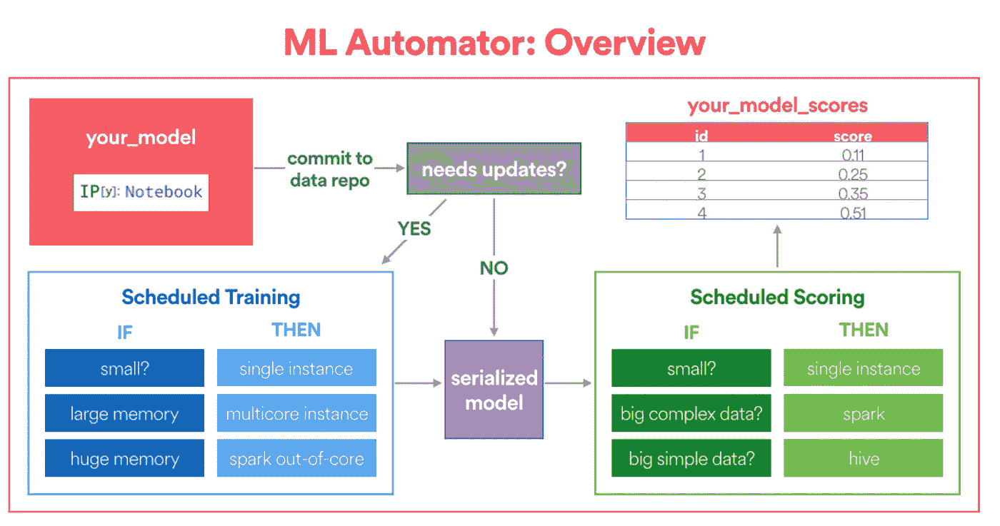

# 使用机器学习来预测 Airbnb 上的房屋价值

> 原文：<https://medium.com/airbnb-engineering/using-machine-learning-to-predict-value-of-homes-on-airbnb-9272d3d4739d?source=collection_archive---------0----------------------->

罗伯特·张

**Amazing view from a Airbnb Home in Imerovigli, Egeo, Greece**

# 介绍

数据产品一直是 Airbnb 服务的重要组成部分。然而，我们早就认识到制造数据产品的成本很高。例如，个性化搜索排名可以让客人更容易地发现房屋，智能定价可以让主机根据供求关系设定更具竞争力的价格。然而，这些项目都需要大量专门的数据科学和工程时间和精力。

最近，Airbnb 机器学习基础设施的进步大大降低了将新的机器学习模型部署到生产中的成本。例如，我们的 ML Infra 团队构建了一个通用特征库，允许用户在他们的模型中利用高质量的、经过审查的、可重用的特征。数据科学家已经开始将几个 AutoML 工具整合到他们的工作流中，以加快模型选择和性能基准测试。此外，ML infra 创建了一个新的框架，可以自动将 Jupyter 笔记本电脑转换为气流管道。

在这篇文章中，我将描述这些工具如何协同工作来加快建模过程，从而降低 LTV 建模的一个特定用例的整体开发成本——预测 Airbnb 上的房屋价值。

# 什么是 LTV？

客户终身价值(LTV)是电子商务和市场公司中的一个流行概念，它捕捉用户在固定时间范围内的预计价值，通常以美元衡量。

在 Spotify 或网飞等电子商务公司，LTV 经常被用来制定定价决策，如设定订阅费。在 Airbnb 这样的市场公司，了解用户的 ltv 使我们能够更有效地在不同的营销渠道之间分配预算，根据关键词计算更精确的在线营销投标价格，并创建更好的列表细分。

虽然人们可以使用过去的数据来[计算现有列表的历史价值](/swlh/diligence-at-social-capital-part-3-cohorts-and-revenue-ltv-ab65a07464e1)，但我们进一步使用机器学习来预测新列表的 LTV。

# 用于 LTV 建模的机器学习工作流

数据科学家通常习惯于机器学习相关的任务，如特征工程、原型制作和模型选择。然而，将模型原型投入生产通常需要一组正交的数据工程技能，而数据科学家可能并不熟悉这些技能。

幸运的是，在 Airbnb，我们有机器学习工具，可以抽象出生产 ML 模型背后的工程工作。事实上，如果没有这些神奇的工具，我们不可能将我们的模型投入生产。这篇文章的其余部分分为四个主题，以及我们用来处理每项任务的工具:

*   **特征工程:**定义相关特征
*   **原型制作和训练:**训练一个模型原型
*   **型号选择&确认:**进行型号选择和调整
*   **生产化:**将选定的模型原型投入生产

# 特征工程

> **使用的工具:Airbnb 的内部特征库——zip line**

任何有监督的机器学习项目的第一步都是定义与所选结果变量相关的相关特征，这一过程称为特征工程。例如，在预测 LTV 时，可以计算未来 180 个日历日期中列表可用的百分比，或者列表相对于同一市场中可比列表的价格。

在 Airbnb，功能工程通常意味着编写 Hive 查询来从头创建功能。然而，这项工作是乏味和耗时的，因为它需要特定的领域知识和业务逻辑，这意味着特性管道通常不容易共享，甚至不容易重用。为了使这项工作更具可扩展性，我们开发了**zip line**——一个培训功能库，提供不同粒度级别的功能，如主机、客户、列表或市场级别。

这个内部工具的**众包**性质允许数据科学家使用其他人为过去的项目准备的各种高质量、经过审查的功能。如果所需的功能不可用，用户可以使用如下所示的功能配置文件创建自己的功能:

当构建训练集需要多个特征时，Zipline 将自动执行智能键连接，并在后台回填训练数据集。对于上市的 LTV 模型，我们使用了现有的滑索功能，还增加了一些我们自己的功能。总之，我们的模型中有超过 150 个特性，包括:

*   **位置**:国家、市场、街区和各种地理特征
*   **价格**:每晚房价、清洁费、相对于类似列表的价格点
*   **可用性**:可用夜总数，手动封锁夜的百分比
*   **可预订性**:在过去 X 天内预订的房间数或住宿数
*   **质量**:点评分数、点评数量和舒适度

A example training dataset

定义了我们的特征和结果变量后，我们现在可以训练一个模型从我们的历史数据中学习。

# 原型制作和培训

> **使用的工具:Python 中的机器学习库—**[**scikit—learn**](http://scikit-learn.org/stable/)

正如上面的示例训练数据集一样，在拟合模型之前，我们通常需要执行额外的数据处理:

*   **数据插补:**我们需要检查是否有数据丢失，以及该数据是否随机丢失。如果没有，我们需要调查原因并了解根本原因。如果是，我们应该估算缺失的值。
*   **编码分类变量**:通常我们不能使用模型中的原始类别，因为模型不知道如何适应字符串。当类别数量较少时，可以考虑使用[一热编码](http://scikit-learn.org/stable/modules/generated/sklearn.preprocessing.OneHotEncoder.html)。但是，当基数较高时，我们可以考虑使用[顺序编码](https://www.kaggle.com/general/16927)，按每个类别的频率计数进行编码。

在这一步，我们不知道什么是最适合使用的特性，所以编写允许我们快速迭代的代码是非常必要的。管道构造是一种非常方便的原型制作工具，通常在 [Scikit-Learn](http://scikit-learn.org/stable/modules/generated/sklearn.pipeline.Pipeline.html) 和 [Spark](https://spark.apache.org/docs/latest/ml-pipeline.html) 等开源工具中可用。管道允许数据科学家指定高级蓝图，描述特征应该如何转换，以及应该训练哪些模型。更具体地说，下面是我们的 LTV 模型管道的代码片段:

在更高的层次上，我们使用管道为不同类型的特征指定数据转换，这取决于这些特征是二进制的、分类的还是数字的。[特征联合](http://scikit-learn.org/stable/modules/generated/sklearn.pipeline.FeatureUnion.html)在最后简单地按列组合特征，创建最终的训练数据集。

使用管道编写原型的优势在于，它使用[数据转换](http://scikit-learn.org/stable/data_transforms.html)来抽象掉繁琐的数据转换。总的来说，这些转换确保了数据在训练和评分中得到一致的转换，这解决了将原型转化为产品时数据转换不一致的常见问题。

此外，管道还将数据转换与模型拟合分开。虽然上面的代码中没有显示，但数据科学家可以添加最后一个步骤，为模型拟合指定一个[估计器](http://scikit-learn.org/stable/tutorial/machine_learning_map/index.html)。通过探索不同的估计值，数据科学家可以执行模型选择，以挑选最佳模型来改善模型的样本外误差。

# 执行型号选择

> **使用的工具:各种** [**AutoML**](/airbnb-engineering/automated-machine-learning-a-paradigm-shift-that-accelerates-data-scientist-productivity-airbnb-f1f8a10d61f8) **框架**

如前一节所述，我们需要决定哪个候选模型最适合投入生产。为了做出这样的决定，我们需要权衡模型的可解释性和模型的复杂性。例如，稀疏线性模型可能非常容易解释，但不够复杂，无法很好地概括。基于树的模型可能足够灵活来捕捉非线性模式，但是不太容易解释。这就是所谓的 [**偏差-方差权衡**](http://scott.fortmann-roe.com/docs/BiasVariance.html) 。

Figure referenced from Introduction to Statistical Learning with R by James, Witten, Hastie, and Tibshirani

在保险或信用审查等应用中，模型需要是可解释的，因为避免无意中歧视某些客户对模型来说很重要。然而，在诸如图像分类之类的应用中，拥有一个高性能的分类器比一个可解释的模型更重要。

鉴于模型选择可能相当耗时，我们尝试使用各种 [AutoML](/airbnb-engineering/automated-machine-learning-a-paradigm-shift-that-accelerates-data-scientist-productivity-airbnb-f1f8a10d61f8) 工具来加速这一过程。通过探索各种各样的模型，我们发现哪些类型的模型往往表现最好。例如，我们了解到[极端梯度提升树](https://github.com/dmlc/xgboost) (XGBoost)明显优于均值响应模型、岭回归模型和单一决策树等基准模型。

Comparing RMSE allows us to perform model selection

考虑到我们的主要目标是预测列表值，我们觉得使用 XGBoost 生产最终模型很舒服，XGBoost 更注重灵活性而不是可解释性。

# 将模型原型投入生产

> **使用的工具:Airbnb 的笔记本翻译框架——ML Automator**

正如我们前面提到的，构建生产管道与在本地笔记本电脑上构建原型是完全不同的。例如，我们如何进行周期性的再训练？我们如何高效的给大量的例子打分？我们如何构建一个管道来监控模型性能？

在 Airbnb，我们建立了一个名为 **ML Automator** 的框架，它可以自动将 Jupyter 笔记本转换为 [Airflow](/airbnb-engineering/airflow-a-workflow-management-platform-46318b977fd8) 机器学习管道。这个框架是专门为数据科学家设计的，他们已经熟悉了用 Python 编写原型，并且希望用有限的数据工程经验将他们的模型投入生产。

A simplified overview of the ML Automator Framework (photo credit: Aaron Keys)

*   首先，框架要求用户在笔记本中指定模型配置。这个模型配置的目的是告诉框架在哪里定位训练表，为训练分配多少计算资源，以及如何计算分数。
*   此外，数据科学家需要编写特定的*拟合*和*转换*函数。fit 函数指定训练将如何精确完成，而 transform 函数将被包装为 Python UDF，用于分布式评分(如果需要)。

下面是一个代码片段，演示了如何在我们的 LTV 模型中定义*拟合*和*转换*函数。fit 函数告诉框架将训练一个 XGBoost 模型，并且数据转换将根据我们之前定义的管道来执行。

笔记本合并后，ML Automator 会将训练好的模型包装在一个 [Python UDF](http://www.florianwilhelm.info/2016/10/python_udf_in_hive/) 中，并创建一个[气流](https://airflow.incubator.apache.org/)管道，如下图所示。数据工程任务，如数据序列化、定期再培训的时间安排和分布式评分，都被封装为这个每日批处理作业的一部分。因此，这个框架大大降低了数据科学家的模型开发成本，就好像有一个专门的数据工程师与数据科学家一起将模型投入生产一样！

A graph view of our LTV Airflow DAG, running in production

**注意:** *除了生产化之外，还有其他主题，比如随着时间的推移跟踪模型性能，或者利用弹性计算环境进行建模，这些我们不会在本文中讨论。请放心，这些都是正在开发的活跃领域。*

# 吸取的教训和展望未来

在过去的几个月里，数据科学家与 ML Infra 建立了非常密切的合作关系，许多伟大的模式和想法都源于这种合作。事实上，我们相信这些工具将为如何在 Airbnb 开发机器学习模型开启一个新的范式。

*   **首先，模型开发的成本显著降低**:通过结合不同工具的不同优势:用于特征工程的 Zipline、用于模型原型的 Pipeline、用于模型选择和基准测试的 AutoML，以及用于生产化的 ML Automator，我们极大地缩短了开发周期。
*   **其次，笔记本驱动的设计降低了准入门槛**:不熟悉该框架的数据科学家可以立即接触到大量现实生活中的例子。生产中使用的笔记本保证是正确的、自我记录的和最新的。这种设计推动了新用户的强烈采用。
*   **因此，团队更愿意投资 ML 产品创意**:在撰写这篇文章的时候，我们有几个其他的团队正在探索 ML 产品创意，他们采用了类似的方法:区分列表检查队列的优先级，预测列表将增加共成本的可能性，以及自动标记低质量的列表。

我们对这个框架的未来和它带来的新范例感到非常兴奋。通过弥合原型和生产之间的差距，我们可以真正使数据科学家和工程师能够追求端到端的机器学习项目，并使我们的产品变得更好。

*想要使用或构建这些 ML 工具？我们一直在寻找* [*优秀人才加入我们的数据科学和分析团队*](https://www.airbnb.com/careers/departments/data-science-analytics) *！*

*特别感谢参与此项工作的数据科学& ML Infra 团队成员:* [*亚伦·凯斯*](https://www.linkedin.com/in/aaronkeys/) *，* [*布拉德·亨特*](https://www.linkedin.com/in/brad-hunter-497621a/) *，* [*哈默尔·侯赛因*](https://www.linkedin.com/in/hamelhusain/) *，* [*贾英石*](https://www.linkedin.com/in/jiaying-shi-a2142733/) *，* [*克里什纳·普塔斯*](https://www.linkedin.com/in/krishnaputtaswamy/) [*瓦兰特*](https://www.linkedin.com/in/vzanoyan/)*[*沃恩*](https://www.linkedin.com/in/vquoss/) *等附加感谢* [*【邓特希*](https://www.linkedin.com/in/thegarytang/)*[*贾森·古德曼*](/@jasonkgoodman)*[*杰夫·冯*](https://twitter.com/jtfeng)***