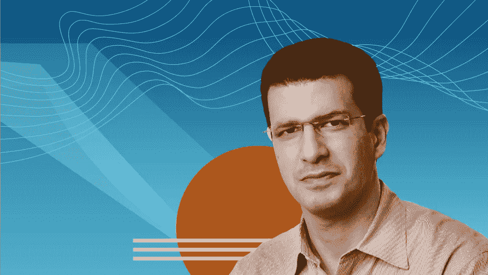

# 使用机器学习重新思考客户体验范式

> 原文：<https://medium.com/capital-one-tech/using-machine-learning-to-re-think-the-customer-experience-paradigm-a58ce380b8be?source=collection_archive---------0----------------------->

## *信用卡部高级副总裁 Youssef Lahrech。艾，大写一*

## **欺诈是一个极其个人化且经常造成精神创伤的事件**

2008 年秋天，我的父母从摩洛哥搬到了秘鲁。我妈妈找到了一份外交官的新工作，我爸爸卖掉了他的诊所，退休后专注于人道主义工作。在同一个地方生活了几十年后，对他们来说，打包行李，横跨半个世界，搬到一个全新的国家和全新的文化，这是一个很大的变化，但他们很兴奋，期待着开始他们生活的新篇章。

然而，在抵达利马后不久，我母亲的借记卡被盗用，她的银行账户被清空。多年的积蓄——我父母的安全网——顷刻间化为乌有。花了几天时间才解决这个问题，并让银行将资金返还到我母亲的账户上，她形容那段等待时间是她一生中最不确定、压力最大的时期之一。那次经历，尤其是在她生命中如此关键的时刻，粉碎了我母亲对银行的信任。

## **欺诈是一个蓬勃发展的行业**

根据尼尔森的数据，今年信用卡欺诈损失总额预计超过 300 亿美元，而一项 CompareCards 调查估计仅去年一年就有 3300 万美国人——七分之一的成年人——是潜在的信用卡欺诈受害者。

像几乎每个行业的创新者一样，欺诈者越来越依赖技术。具体来说，他们依靠大数据、API、分布式计算和机器学习来获取客户的卡号和身份，然后在黑暗的网络上出售。

## **机器学习如何对抗欺诈并建立信任**

不幸的是，对于欺诈者来说，我们 Capital One 也在转向技术，以彻底改变我们打击欺诈的方式。我们正在利用强大的算法、机器学习驱动的工具、大量数据和令人难以置信的人才。有了这些工具，我们挑战自我，为我们的客户改进欺诈检测和解决的整个周期。我们怎样才能把一次经常引起恐惧和焦虑的经历(比如我母亲经历的那次)转化成对我们产生信任和信心的东西呢？

我们如何使用机器学习、数据和以客户为中心的方法来打击欺诈的一个例子是通过我们的主动智能助理 Eno。Eno 会实时自动提醒客户潜在的欺诈行为，并在必要时锁定他们的卡。Eno 的独特之处在于，它主动、智能地传达上述所有信息，这意味着当客户收到潜在欺诈企图的警报时，他们可以用自己的方式和语言对我们做出回应。当客户对我们的警报做出回应以帮助我们了解哪些是欺诈，哪些不是，他们还向我们提供了有关他们如何沟通的数据。所有这些数据增强了我们的算法，从而减少欺诈，为客户带来更快、更流畅、更自然的整体体验。

如果 2008 年发生在我母亲借记卡上的事情今天发生在她的信用卡上，我们在将机器学习应用于欺诈方面取得的进展可以帮助她在不到一分钟的时间内解决她的欺诈问题，只需在她的移动设备上轻敲几下。

我们相信，如果我们继续为更多以客户为中心的用例设计机器学习系统，就像那些激发 Eno 欺诈增强功能的用例一样，那么我们可以促进人类和机器之间的合作，并为我们的客户带来更广泛的体验。

这些是作者的观点。除非本帖中另有说明，否则 Capital One 不隶属于所提及的任何公司，也不被其认可。使用或展示的所有商标和其他知识产权均为其各自所有者所有。本文为 2018 首都一。