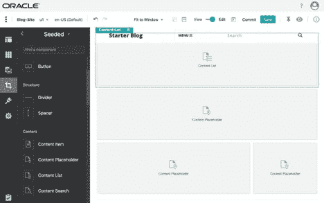

# 在 Oracle Content and Experience 中使用宏

> 原文：<https://medium.com/oracledevs/using-macros-in-oracle-content-and-experience-2cc3a52b280d?source=collection_archive---------1----------------------->


# 概观

这个博客演示了如何在 Oracle Content and Experience 中使用宏来为组件提供动态内容。宏可以在 JavaScript 中定义，并在富文本组件、上下文列表查询和其他组件中使用。此用例将浏览博客列表，并在特定博客的 URL 上使用一个 slug 进行深入查看以获取详细信息；URL 中定义页面内容的部分称为 slug。一个宏将被用来从 URL 中获取用于内容列表查询的 slug。

# 博客示例设置

这个用例为一个示例博客使用了内容资产和主题。Oracle Content and Experience Toolkit 提供了一个名为 **BlogTemplate.zip** 的模板包。

去 https://github.com/oracle/content-and-experience-toolkit 的[T3](https://github.com/oracle/content-and-experience-toolkit)点击**克隆或者下载**。选择**下载 ZIP** ，将会下载**content-and-experience-toolkit-master . ZIP**。将文件**content-and-experience-toolkit-master . zip**解压到用户主目录 **~/** 。


输入**CD ~/content-and-experience-toolkit-master/sites/CEC-components/data/templates**进入目录。从该目录上传 **BlogTemplate.zip** 到 Oracle Content and Experience。


在**开发者>模板**部分，点击**创建**并选择**导入模板包**。


选择模板包并导入它。


# 创建博客网站

我们现在将创建一个企业站点。在我们创建站点之前，必须创建一个存储库。在**资产>仓库**中，点击**创建**。创建一个名为 **Blog-Repository** 的仓库。在**内容类型**字段中，选择**起始博客作者**和**起始博客文章**。


保存并关闭**创建存储库**屏幕。

现在我们将创建本地化策略。在**资产>本地化政策**中，点击**创建**。


输入**博客本地化政策**作为名称。选择**英语(美国)(en-US** )作为所需语言，选择**英语(美国)(en-US** )作为默认语言。保存并关闭**创建本地化政策**屏幕。


最后，使用 **BlogTemplate** 创建一个站点。输入**博客网站**作为**的名字。**为**资产库**选择**博客库**，为**本地化策略**选择**博客本地化策略**。点击**创建**创建站点。


创建站点后，选择站点并点击**查看**。该网站将呈现博客的摘要。


在浏览器中，将鼠标悬停在显示博客标题的链接上，您将看到如下 URL:

**http://<host>:<port>/sites/preview/Blog-Site/Post-detail/Starter-Blog-Post/core 234835 cb5d 594 a6 FB 39662 df 2376874 b/Blog-Site-1481786063051-developing-content-layout-for-content-and-experience-cloud**

URL 以 *post-detail* 页面结尾，后跟“/<content type>/<asset GUID>/<SiteName>-<GUID>-<Slug>”。URL 中定义页面内容的部分称为 slug。在示例 URL 中，slug 将是“为内容和体验云开发内容布局”。

在这篇博客中，我们将修改内容布局生成的 URL，使其更加简单，方法是将 URL 后缀改为:

"…/post-detail . html #<Slug>"

这将使 URL 更具可读性。我们将创建一个自定义宏，使用 JavaScript 来读取 URL 中的 slug。通过显示指向详细博客的 slug，我们将能够驱动获取详细博客的内容查询。

# 修改内容布局并指定友好的 URL

首先，让我们修改**Starter-Blog-Post-Summary**的内容布局，使 slug 通过“post-detail.html#”之后的 URL 传递。进入**开发>查看所有组件**并选择**开始-博客-帖子-摘要**内容布局。选择**打开**并导航至**资产**文件夹。下载**layout.html**并在编辑器中打开。将锚标签上的**href = " { { scsdata . detail page link } }**"更改为**href = " post-detail . html # { { slug } } "**。

```
<!--
Copyright (c) 2019 Oracle and/or its affiliates. All rights reserved.
Licensed under the Universal Permissive License v 1.0 as shown at [http://oss.oracle.com/licenses/upl](http://oss.oracle.com/licenses/upl).
-->
<div class="post-preview">
    <a **href="post-detail.html#{{slug}}**">
        <h2 class="post-title">
            {{blogTitle}}
        </h2>
        <h3 class="post-subtitle">
            {{blogSummary}}
        </h3>
    </a>
    <p class="post-meta">Posted by {{blogAuthor}} on {{blogFormattedDate}}</p>
</div>
<hr>
```

对于 REST 调用返回的 JSON，要获得博客列表，每个博客看起来如下，带有一个 slug 值:

```
…
      },
      **"slug": "blog-site-1481786063051-developing-content-layout-for-content-and-experience-cloud",**
      "status": “draft"
  }
…
```

slug 值由{{slug}}表达式返回。保存修改并将**layout.html**的新版本上传至 Oracle Content and Experience。

在同一个 Oracle Content and Experience 目录下选择 **render.js** ，下载到本地。在编辑器中打开它。添加下面一行， ***内容= $。extend(content，this . contentitemdata)；"*、**到**渲染**功能。在 **render.js** 中需要这一行，以便**layout.html**中的“{{slug}}”表达式可以被 **Mustache.js** 正确替换。

```
…
  ContentLayout.prototype = {
    contentVersion: '>=1.0.0 <2.0.0',
    render: function (parentObj) {
      var template,
          contentClient = this.contentClient,
          fields = this.contentItemData.fields,
          content = {
            blogImageRenditionURL: contentClient.getRenditionURL({
                'id': fields['starter-blog-post_header_image'].id
            }),
            blogSummary: fields['starter-blog-post_summary'],
            blogTitle: fields['starter-blog-post_title'],
            blogContent: fields['starter-blog-post_content'],
            blogFormattedDate: dateToMDY(this.contentItemData.updatedDate.value)
          },
          contentType,
          secureContent = false; **content = $.extend(content, this.contentItemData);** if (this.scsData) {
      content = $.extend(content, {
        'scsData': this.scsData
      });
      contentType = content.scsData.showPublishedContent === true ? 'published' : 'draft';
      secureContent = content.scsData.secureContent;
    }
…
```

保存修改并将新版本的 **render.js** 文件上传到 Oracle Content and Experience。

现在，我们将告诉 Oracle Content and Experience 对内容类型 **Starter-Blog-Post** 使用友好的 URL。转到**资产>内容类型**。选择*，选择**编辑**。选择**友好网址**。勾选**启用 URL** 和*的友好项目名称。*为其下的字段选择**无默认前缀** 。保存并关闭资源编辑器。*

**

*在指定友好 URL 被内容类型 **Starter-Blog-Post** 使用之后，我们可以在 assets 中的内容项中指定友好 URL。转到**资产**，限制**数字资产**中的**文档**和**内容项**中的 **Starter-Blog-Post** 显示的资产数量。*

**

*对于显示的所有博客内容项目，选择并编辑内容项目。更改 URL 的**友好项目名称中的值，以删除站点名称和 GUID。例如，**blog-site-1481786063051-developing-content-layout-for-content-and-experience-cloud**将更改为**developing-content-layout-for-content-and-experience-cloud**。保存并关闭资源编辑器。对所有博客文章内容项目重复上述步骤。***

**

*最后，进入**站点>博客站点**并选择**视图**来运行站点。在浏览器中，将鼠标悬停在显示博客标题的链接上。您将看到更简单、友好的 URL，例如:*

```
*http://<host>:<port>/sites/preview/Blog-Site/**post-detail.html#developing-content-layout-for-content-and-experience-cloud***
```

# *定义自定义宏并在内容查询中使用它*

*现在，内容布局正在为每个内容项呈现“post-detail . html #*<slug>*”，我们将定义使用 JavaScript 读取 URL 中的 slug 的自定义宏。通过显示指向详细博客的 slug，我们将能够驱动获取详细博客的内容查询。*

*首先，我们来定义一下宏。宏是在主题的布局中定义的。去**开发者>查看所有主题**。在**博客开始主题>布局**下导航。由于**帖子详情**页面使用了**post-detail.html**页面布局，我们将选择并本地下载**post-detail.html**。在编辑器中打开下载的**post-detail.html**。*

*在 header 部分的末尾，添加以下代码段，它定义了{{getSlugMacro}}。它将获取 URL 中“#”之后的字符串，并通过表达式{{getSlugMacro}}返回它。该字符串将成为详细博客的一部分。保存修改并将新版本上传到**post-detail.html**。*

```
*<!--
Copyright (c) 2019 Oracle and/or its affiliates. All rights reserved.
Licensed under the Universal Permissive License v 1.0 as shown at [http://oss.oracle.com/licenses/upl](http://oss.oracle.com/licenses/upl).
-->
<!DOCTYPE html>
<html lang="en"><head>
  …
  <!--$SCS_RENDER_INFO-->
  <!--$SCS_SITE_HEADER-->
  <!--$SCS_PAGE_HEADER--> **<!-- {{getSlugMacro}} -->
  <script type="text/javascript">
  window.SCSMacros = window.SCSMacros || {};
  window.SCSMacros.getSlugMacro = window.location.hash.substring(1);
  </script>**</head>
…*
```

*我们将为博客添加一个内容列表组件到**帖子详细信息**页面。让我们在 Site Builder 中打开**帖子详细信息**页面。转到编辑模式并创建更新。编辑**帖子详细信息**页面。将植入组件**内容列表**添加到第一行**内容占位符**的上方。*

**

*编辑内容列表的设置。对于**内容类型**字段，选择**开始-博客-文章**。在**附加查询字符串**字段中输入文本**slug eq " { { getslug macro } } "***。为**项目视图**字段选择**标题**。**

****

****附加查询字符串**的条件将应用于**首发-博文内容列表**的查询。REST 调用返回的获取博客列表的 JSON 现在如下所示，每个博客都有一个 slug 值:**

```
 **…
      },
      **"slug": "developing-content-layout-for-content-and-experience-cloud"**,
      "status": “draft"
  }
  …**
```

****附加查询字符串**条件将 slug 值与我们从 **{{getSlugMacro}}** 获得的值进行匹配，并返回匹配的博客。**

**关闭**内容列表设置**。向下滚动**文章详细信息**页面，删除所有三个内容占位符。**

****

**保存并提交站点构建器更改。关闭站点生成器。**

**选择**网站>博客网站**并点击**查看**。该网站将呈现博客的摘要。将鼠标悬停在博客标题上，可以看到带有“ **#** ”的 URL，后面跟有 slug。**

****

**点击博客标题，**帖子详细信息**页面将呈现所选博客。**

****

****注意:**这个博客向下钻取的用例在 Site Builder 中不起作用。它的工作包括调用渲染器，这超出了博客的范围。**

# **摘要**

**这是在 Oracle Content and Experience 中使用宏的一个示例。它包括使用 JavaScript 在主题中定义自定义宏。宏在内容列表的附加查询字符串字段中用于选择详细博客。总之，您可以通过自定义宏以多种方式扩展 Oracle 内容和体验。**