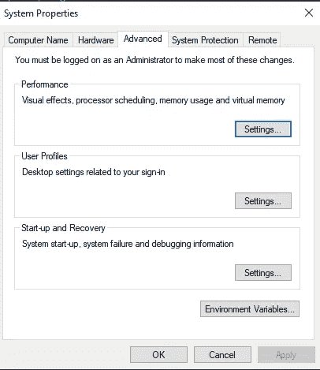
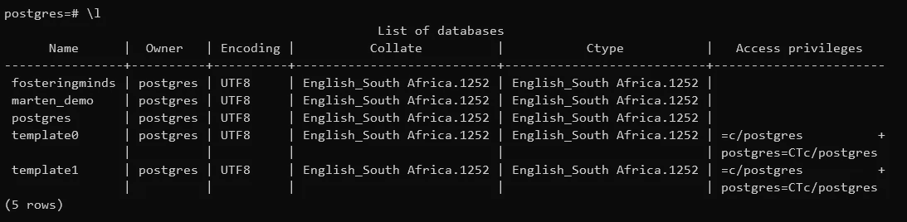
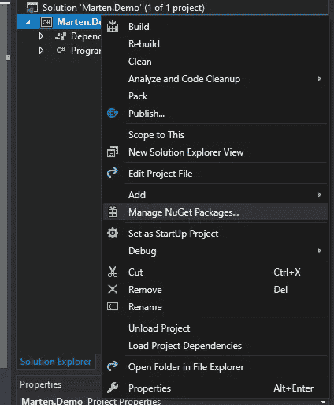

# 用 Marten 和 Postgres 作为文献数据库

> 原文：<https://medium.com/quick-code/using-marten-with-postgres-as-a-document-database-5481567a3630?source=collection_archive---------2----------------------->

在过去的两周里，我一直在学习 AWS DynamoDB 的学习材料。AWS DynamoDB 是很好的服务，但似乎很难有效使用。在这篇文章中，我将探索一个名为 Marten 的 C#库。它使用 Postgres 作为 NoSQL 商店。为什么？Postgres 非常支持 JSON 类型。它为 NoSQL 选项(如 DynamoDB)提供了一个很好的替代方案。将我的解决方案捆绑到像 DynamoDB 这样的服务上，感觉就像我将自己捆绑到一个特定于供应商服务的特定实现上。假设我需要将我的解决方案部署在云服务之外的其他地方。Postgres 是一种独立于云服务的关系数据库管理服务。其他地方可能不会使用 DynamoDB。貂皮的[网站将其描述为:](https://martendb.io/)

> 多语言持久性。NET 系统使用坚如磐石的 PostgreSQL 数据库

这一切意味着什么？多语言是那些精通多种语言和框架的开发人员使用的术语。他们可以根据相似的标准编写解决方案，而不管技术如何。给他们 NodeJS，。NET、Java——没关系。怎么翻译成貂皮？根据[维基百科](https://en.wikipedia.org/wiki/Polyglot_persistence)的说法，多语言持久性意味着混合使用多种存储技术。Postgres 仍然是一个关系数据库——没有什么可以阻止您将其用作关系存储。也没什么能阻止你把它当作 NoSQL 的商店。

SQL 是我必须克服的个人弱点。我更喜欢写 C#之类的代码。SQL 极其强大。在我工作过的大多数环境中，SQL Server 是中流砥柱。探索不同的事物是使用 Postgres 学习 SQL 的一个重要原因。

# 在 Windows 10 上安装 Postgres

首先让我们下载并安装 Postgres。我用的是 Windows 10——只有下载[合适的软件包](https://www.postgresql.org/download/windows/)才有意义。出于我的目的，我将使用 12.1。我不是波斯特格雷专家。事实上，我是个彻头彻尾的 00b。然而，我确实喜欢用不同的方式解决问题。下载 Postgres 后，我逐步完成安装步骤。

我过去曾短暂地使用过 pgAdmin。我记得它没有那么精致。我发现导航有点简洁。出于我的目的，我将尝试使用 CLI 与数据库引擎进行交互。我将安装 pgAdmin 以防万一。我尝试使用 HeidiSQL 连接到 Postgres，但发现它有点问题。HeidiSQL 非常适合 MySQL 或 MariaDb。

Postgres 安装包含两个部分—Postgres 数据库引擎的安装是第一部分。第二部分是 StackBuilder 配置——我跳过了。我将只通过 C#的 SDK 连接到数据库。根据以前的经验，StackBuilder 添加了 npg SQL——这是我通过 Nuget 添加的。在包级别定义依赖关系似乎是一个更好的主意。

# 在环境变量中设置 Postgres

我希望 Postgres 命令可以在 CLI 中使用。确保将其添加到环境变量下的 path 变量中。

# 使用 CLI 创建示例数据库

在 path 变量中设置 Postgres 允许您通过 CLI 客户端(如 Windows 终端)连接到 Postgres 实例。我们也需要一个示例数据库来编写文档。启动 Windows 终端。使用`psql -U postgres`通过一个 CLI 客户机(比如 Powershell Core)连接到 postgres 实例。

-U 标志是数据库的用户名，在我的例子中是它的 postgres。该用户名与安装过程中提供的用户名相同。系统将提示您提供密码，该密码与安装过程中使用的密码相同。

让我们创建一个数据库，并将其命名为`marten_demo`。类型`CREATE DATABASE marten_demo;`。分号非常重要，它终止了一行。

您可以使用`\l`命令来验证数据库是否存在。

# Marten 演示 C#项目

创建好数据库后，让我们编写一些代码来存储和读取文档。对于演示，我使用 Visual Studio 2019 社区版。启动 Visual Studio 并选择**创建一个新项目**:

选择控制台应用程序(。NET Core)从模板。

给这个项目起个名字`Marten.Demo:`

通过右键单击项目来添加 Marten nuget 包。选择**管理 NuGet 包…**

在 Nuget 浏览器中，选择“浏览”选项卡—默认情况下选择“已安装”。在搜索文本框中输入 Marten:

单击安装按钮:

创建以下代码:

按 ctrl + f5 测试它。您应该会看到`han`出现在控制台中。

好吧，这里发生了什么？我们基本上将 User 类的一个实例作为 JSON 存储在 postgres 数据库中。不过需要注意的重要一点是，JSON 并不是以字符串的形式存储的。

导航回 CLI 窗口。键入`\c marten_demo`连接到我们创建的数据库。键入`\dt`获取数据库中的表列表:

用户对象存储在`mt_doc_user`表中。您可以执行选择来查看数据:

如果您键入命令`\d+`，您将得到表格的定义:

数据列有一个`jsonb`类型。不是一串。我见过很多应用程序使用 SQL Server 将 JSON 或 XML 存储为字符串。意义何在？其意义在于，你的数据被存储为 JSON 而不是字符串。

# 参考

*   马腾:[https://martendb.io/](https://martendb.io/)
*   Postgres 创建数据库:[https://www.guru99.com/postgresql-create-database.html](https://www.guru99.com/postgresql-create-database.html)