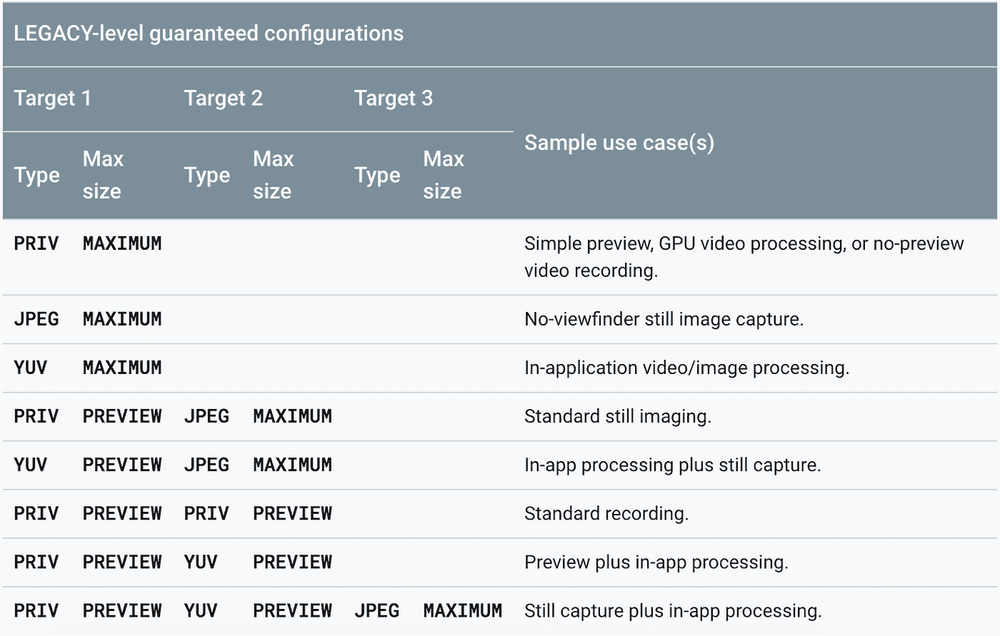

# 同时使用多个摄像机流

> 原文：<https://medium.com/androiddevelopers/using-multiple-camera-streams-simultaneously-bf9488a29482?source=collection_archive---------1----------------------->

这篇博文是当前关于安卓相机系列的最新一篇；我们之前已经介绍过[摄像机枚举](/androiddevelopers/camera-enumeration-on-android-9a053b910cb5)和[摄像机捕获会话和请求](/androiddevelopers/understanding-android-camera-capture-sessions-and-requests-4e54d9150295)。

# 多个摄像机流的用例

一个相机应用程序可能希望同时使用多个帧流，在某些情况下，不同的帧流甚至需要不同的帧分辨率或像素格式；一些典型的使用案例包括:

*   视频录制:一个流用于预览，另一个流被编码并保存到文件中
*   条形码扫描:一个用于预览，另一个用于条形码检测
*   计算摄影:一个流用于预览，另一个流用于人脸/场景检测

正如我们在[之前的博客文章](/androiddevelopers/understanding-android-camera-capture-sessions-and-requests-4e54d9150295)中所讨论的，当我们处理帧时，有一个不小的性能成本，当进行并行流/管道处理时，这个成本会成倍增加。

像 CPU、GPU 和 DSP 这样的资源也许能够利用框架的[再处理](https://developer.android.com/reference/android/hardware/camera2/CameraDevice#createReprocessCaptureRequest(android.hardware.camera2.TotalCaptureResult))能力，但是像内存这样的资源将会线性增长。

# 每个请求多个目标

通过执行某种官僚程序，多个摄像机流可以合并成一个 [CameraCaptureRequest](https://developer.android.com/reference/android/hardware/camera2/CaptureRequest) 。此代码片段说明了如何设置相机会话，其中一个流用于相机预览，另一个流用于图像处理:

如果您正确地配置了目标表面，该代码将只产生满足由 [StreamComfigurationMap 确定的最小 FPS 的流。GetOutputMinFrameDuration(int，Size)](https://developer.android.com/reference/android/hardware/camera2/params/StreamConfigurationMap#getOutputMinFrameDuration(int,%20android.util.Size)) 和 [StreamComfigurationMap。GetOutputStallDuration(int，Size)](https://developer.android.com/reference/android/hardware/camera2/params/StreamConfigurationMap.html#getOutputStallDuration(int,%20android.util.Size)) 。实际性能会因设备而异，尽管 Android 为我们提供了一些支持特定组合的保证，这取决于三个变量:**输出类型**、**输出大小**和**硬件级别**。使用不支持的参数组合可能会在低帧速率下工作；或者它可能根本不工作，触发一个失败回调。[文档](https://developer.android.com/reference/android/hardware/camera2/CameraDevice#createCaptureSession(java.util.List%3Candroid.view.Surface%3E,%20android.hardware.camera2.CameraCaptureSession.StateCallback,%20android.os.Handler))非常详细地描述了保证工作的内容，强烈建议完整阅读，但我们将在此介绍基本内容。

# 输出类型

**输出类型**指帧编码的格式。文档中描述的可能值有 PRIV、YUV、JPEG 和 RAW。文档最好地解释了它们:

> PRIV 是指使用[streamconfigurationmap . get output size(Class)](https://developer.android.com/reference/android/hardware/camera2/params/StreamConfigurationMap#getOutputSizes(java.lang.Class%3CT%3E))找到其可用大小的任何目标，没有直接的应用程序可见格式
> 
> YUV 是指使用[图像格式的目标表面。YUV_420_888](https://developer.android.com/reference/android/graphics/ImageFormat#YUV_420_888) 格式
> 
> JPEG 是指[ImageFormat.JPEG](https://developer.android.com/reference/android/graphics/ImageFormat#JPEG)格式
> 
> RAW 是指 [ImageFormat。RAW_SENSOR](https://developer.android.com/reference/android/graphics/ImageFormat#RAW_SENSOR) 格式。

当选择应用程序的输出类型时，如果目标是最大化兼容性，那么推荐使用 [ImageFormat。YUV_420_888](https://developer.android.com/reference/android/graphics/ImageFormat#YUV_420_888) 用于帧分析，而[ImageFormat.JPEG](https://developer.android.com/reference/android/graphics/ImageFormat#JPEG)用于静止图像。对于预览和录制场景，您可能会使用`SurfaceView`、`TextureView`、`MediaRecorder`、`MediaCodec`或`RenderScript.Allocation`。在这些情况下，不要指定图像格式，出于兼容性目的，它将被计为 [ImageFormat。私有](https://developer.android.com/reference/android/graphics/ImageFormat#PRIVATE)(不考虑引擎盖下实际使用的格式)。给定设备的 [CameraCharacteristics](https://developer.android.com/reference/android/hardware/camera2/CameraCharacteristics) ，使用以下代码查询设备支持的格式:

# 输出大小

当我们调用[streamconfigurationmap . getoutputsizes()](https://developer.android.com/reference/android/hardware/camera2/params/StreamConfigurationMap.html#getOutputSizes(int))时，所有可用的**输出大小**都被列出，但是就兼容性而言，我们只需要担心其中的两个:预览和最大值。我们可以把这些尺寸看作上限。如果文档中说预览大小可以工作，那么任何小于预览大小的都可以工作。同样适用于最大值。以下是来自[文档](https://developer.android.com/reference/android/hardware/camera2/CameraDevice)的相关摘录:

> 对于最大尺寸栏，预览是指与设备屏幕分辨率或 1080p (1920x1080)最匹配的尺寸，以较小者为准。录制是指摄像设备支持的最大录制分辨率，由[摄像机配置文件](https://developer.android.com/reference/android/media/CamcorderProfile.html)决定。最大值是指来自[streamconfigurationmap . getoutputsizes(int)](https://developer.android.com/reference/android/hardware/camera2/params/StreamConfigurationMap.html#getOutputSizes(int))的该格式或目标的摄像设备的最大输出分辨率。

请注意，可用的输出大小取决于格式的选择。给定 [CameraCharacteristics](https://developer.android.com/reference/android/hardware/camera2/CameraCharacteristics) 和一种格式，我们可以像这样查询可用的输出大小:

在相机预览和录制用例中，我们应该使用目标类来确定支持的大小，因为格式将由相机框架本身来处理:

获取最大尺寸很容易，只需按区域对输出尺寸进行排序并返回最大的尺寸:

获取预览大小需要更多的思考。回想一下，预览指的是与设备屏幕分辨率或 1080p (1920x1080)匹配的最佳尺寸，以较小者为准。请记住，长宽比可能不完全匹配屏幕的长宽比，所以如果我们计划以全屏模式显示它，我们可能需要对流应用字母框或裁剪。为了获得正确的预览尺寸，我们需要将可用的输出尺寸与显示器尺寸进行比较，同时考虑到显示器可能会旋转。在这段代码中，我们还定义了一个助手类`SmartSize`,它将使大小比较变得稍微容易一些:

# 硬件级别

为了确定运行时的可用能力，相机应用程序需要的最重要的信息是支持的**硬件级别**。再一次，我们可以依靠文档向我们解释这一点:

> 支持的硬件级别是对相机设备功能的高级描述，将多种功能总结到一个字段中。每个级别都在前一个级别的基础上增加了额外的功能，并且总是前一个级别的严格超集。排序是传统的< LIMITED < FULL < LEVEL_3.

With a [CameraCharacteristics](https://developer.android.com/reference/android/hardware/camera2/CameraCharacteristics) 对象，我们可以用一条语句检索硬件级别:

# 把所有的碎片放在一起

一旦我们了解了输出类型、输出大小和硬件级别，我们就可以确定哪些流组合是有效的。例如，这里有一个由具有[传统](https://developer.android.com/reference/android/hardware/camera2/CameraMetadata#INFO_SUPPORTED_HARDWARE_LEVEL_LEGACY)硬件级别的`CameraDevice`支持的配置的快照。快照取自 [createCaptureSession](https://developer.android.com/reference/android/hardware/camera2/CameraDevice.html#createCaptureSession(android.hardware.camera2.params.SessionConfiguration)) 方法的文档:

由于 LEGACY 是可能的最低硬件级别，我们可以从上表中推断出，使用正确的配置，每个支持 Camera2(即 API 级别 21 及以上)的设备都可以同时输出多达三个流，这非常酷！然而，在许多设备上可能无法实现最大的可用吞吐量，因为您自己的代码可能会产生开销，从而引发其他限制性能的约束，如内存、CPU 甚至散热。

现在我们已经了解了在框架的支持下设置两个同步流的必要知识，我们可以更深入地研究目标输出缓冲区的配置。例如，如果我们的目标是一个具有[传统](https://developer.android.com/reference/android/hardware/camera2/CameraMetadata#INFO_SUPPORTED_HARDWARE_LEVEL_LEGACY)硬件级别的设备，我们可以设置两个目标输出表面:一个使用 [ImageFormat。私有](https://developer.android.com/reference/android/graphics/ImageFormat#PRIVATE)和另一个使用[图像格式。YUV_420_888](https://developer.android.com/reference/android/graphics/ImageFormat#YUV_420_888) 。根据上表，只要我们使用预览大小，这应该是一个受支持的组合。使用上面定义的函数，获得相机 ID 所需的预览大小现在非常简单:

我们必须等到`SurfaceView`准备好使用提供的回调，就像这样:

我们甚至可以通过调用[surface holder . setfixedsize()](https://developer.android.com/reference/android/view/SurfaceHolder#setFixedSize(int,%20int))来强制`SurfaceView`匹配相机输出大小，但就 UI 而言，采用类似于 GitHub 上的 [HDR 取景器示例中的](https://github.com/googlesamples/android-HdrViewfinder) [FixedAspectSurfaceView](https://github.com/googlesamples/android-HdrViewfinder/blob/9cd7531ea34b4515b3f300a354149dded9d99332/Application/src/main/java/com/example/android/hdrviewfinder/FixedAspectSurfaceView.java) 的方法可能会更好，它会考虑纵横比和可用空间来设置绝对大小，同时在触发活动变化时自动调整。

用期望的格式设置来自`ImageReader`的另一个表面甚至更容易，因为不需要等待回调:

当使用像`ImageReader`这样的阻塞目标缓冲器时，我们需要在使用完帧后将其丢弃:

我们应该记住，我们的目标是最小公分母——具有传统硬件水平的设备。我们可以添加条件分支，并在具有有限硬件级别的设备中为输出目标表面之一使用记录大小，或者甚至为具有完整硬件级别的设备将其提升到最大大小。

# 摘要

在本文中，我们介绍了:

1.  使用单个相机设备同时输出多个流
2.  在单个捕获请求中组合不同目标的规则
3.  查询和选择适当的输出类型、输出大小和硬件级别
4.  设置和使用由`SurfaceView`和`ImageReader`提供的`Surface`

有了这些知识，现在我们可以创建一个相机应用程序，它能够显示预览流，同时对单独的流中的传入帧进行异步分析。