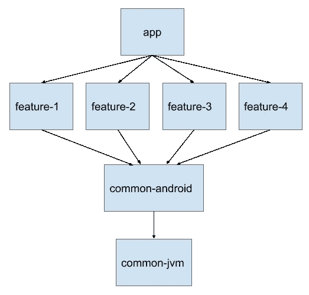

# 在大型银行应用程序中使用导航架构组件

> 原文：<https://medium.com/google-developer-experts/using-navigation-architecture-component-in-a-large-banking-app-ac84936a42c2?source=collection_archive---------0----------------------->

来自 [Jetpack](https://developer.android.com/jetpack) 的导航库最近到达 RC1，所有 Android 开发者应该开始考虑在新应用中使用它。我负责[德国航空银行](https://www.airbank.net/)的应用架构，这是一家新的移动优先的德国银行。我们的应用程序有一个多模块、单活动的架构，包含来自架构组件的视图模型。集成导航组件是一个合乎逻辑的步骤，但也存在一些问题。在这篇博文中，我想分享我们是如何解决这些问题的。这是一篇更高级的文章，所以我假设读者了解[官方文档](https://developer.android.com/topic/libraries/architecture/navigation/)。

# 在多模块项目中，将导航 XML 文件放在哪里？

多模块项目是构建新应用程序的推荐方式。优点是更快的构建时间和代码库中更好的关注点分离。这是我们 Gradle 模块的简图:



有几个放置导航 XML 文件的选项:

## “应用”模块

官方文档和 Android Studio 假设了这一点。但是你需要能够从一个特性导航到另一个特性(并且特性不依赖于‘app’模块)。这可以通过将导航目的地的所有 id 放入“common-android”模块内的 ids.xml 文件中来解决。然后导航工作，但你不能使用安全的参数。您需要手动构造向目的地传递参数的包。

## “应用”模块中的主图形，功能模块中的子图形

这类似于在“应用程序”模块中有一个大图表，但更具结构性。您可以在功能中使用安全参数，但不能在导航到不同功能时使用。也可以使用“common-android”模块中的 id。

## “通用安卓”模块

所有功能都依赖于“common-android ”,因此您可以使用安全的参数在任何地方导航。然而，它有两个缺点:

*   因为‘common-Android’模块不依赖于特性，所以片段类在 Android Studio 中是红色的。您没有片段类的自动完成功能，但是它编译起来没有任何问题。
*   有一个错误阻止了深度链接的意图过滤器的生成。它已经被分配了，所以希望它能在最终版本中被修复。

这两个问题对我们来说并不是障碍，在任何地方使用安全参数确实是一个很大的优势。因此，我们的首选是将文件放在“common-android”模块中。

# 如何从视图模型中导航？

我们的应用程序使用了从 [Android 架构组件](https://developer.android.com/topic/libraries/architecture)推荐的 MVVM 架构。文档显示了如何从片段开始导航，但是这个逻辑应该在视图模型中。我们试图将所有样板代码放到 BaseFragment 和 BaseViewModel 中，以简化所有其他片段/视图模型的代码。

## 命令

我们使用命令模式在视图模型和片段之间进行通信。这些是我们用于导航的命令:

```
sealed class NavigationCommand {
  data class To(val directions: NavDirections): NavigationCommand()
  object Back: NavigationCommand()
  data class BackTo(val destinationId: Int): NavigationCommand()
  object ToRoot: NavigationCommand()
}
```

ViewModel 将它们发布到片段监听的 LiveData 对象中。但这必须是一次性的事件。为此，我们使用建筑蓝图中的 [SingleLiveEvent。](https://github.com/googlesamples/android-architecture/blob/dev-todo-mvvm-live/todoapp/app/src/main/java/com/example/android/architecture/blueprints/todoapp/SingleLiveEvent.java)

## 碱基片段

BaseFragment 从视图模型中监听导航命令，如下所示:

```
override fun onActivityCreated(savedInstanceState: Bundle?) {
  super.onActivityCreated(savedInstanceState)
  vm?.navigationCommands?.observe { command ->
    when (command) {
      is NavigationCommand.To ->      
        findNavController().navigate(command.directions)
        …
```

## 视图模型

BaseViewModel 有以下助手方法:

```
fun navigate(directions: NavDirections) {
  navigationCommands.postValue(NavigationCommand.To(directions))
}
```

然后从 ViewModel 导航非常简单，就像这样:

```
navigate(CardListFragmentDirections.cardDetail(cardId))
```

# 如何在视图模型中使用参数？

视图模型通常需要导航参数来加载一些数据。我们的 BaseFragment 自动将参数传递给视图模型，如下所示:

```
override fun onCreate(savedInstanceState: Bundle?) {
  super.onCreate(savedInstanceState)
  if (savedInstanceState == null) {
    vm?.setArguments(arguments)
    vm?.loadData()
  }
}
```

然后，ViewModel 可以像这样轻松地使用参数:

```
override fun loadData() {
  val cardId = CardDetailFragmentArgs.fromBundle(args).cardId
  load(cardsRepository.getCard(cardId)) {
  …
```

# 如何显示带有深层链接的登录屏幕？

官方文档没有足够详细地描述[条件导航](https://developer.android.com/topic/libraries/architecture/navigation/navigation-conditional)。它基本上建议在最终目的地处理条件导航。例如，转到个人资料屏幕，然后转到登录屏幕，当用户登录时弹出它。我们不喜欢这种方法，原因如下:

*   登录屏幕应该像另一个根目的地一样。当用户按下登录屏幕上的后退按钮时，应用程序应该会关闭。用户不应该转到上一个屏幕——因为上一个屏幕需要登录，所以用户会陷入无限循环。
*   尤其是对于深度链接，当用户没有登录时，根本不应该创建目标片段。创建片段需要一些资源，它开始进行一些网络调用，这些调用由于用户没有登录而失败，等等。如果在这一切发生之前显示登录信息会更好。

我们尝试替换 NavHostFragment 中的导航图，并为登录屏幕创建一个不同的根目录。但在配置改变后，这并不奏效。最后，我们决定使用不同的登录活动。我们的应用程序不再是严格意义上的单一活动，但是登录是一个独立的流程，在这种情况下是有意义的。登录可以有自己的导航图，并且它像我们想要的那样工作——作为另一个导航根。

该应用程序直接启动或通过 MainActivity 的深层链接启动。我们可以通过尽快完成 MainActivity 并显示 LoginActivity 来防止加载任何片段:

```
override fun onStart() {
  super.onStart()  
  if (sessionRepository.isLoggedOut()) {
    startActivity<LoginActivity>()
    finish()
  }
}
```

但是深度链接呢？幸运的是，我们可以将所有意图参数传递给 LoginActivity:

```
val intent = Intent(this, LoginActivity::class.java)
intent.putExtra("deepLinkExtras", this.intent.extras)
startActivity(intent)
finish()
```

当用户登录时，我们可以将参数传递回 MainActivity:

```
val intent = Intent(this, MainActivity::class.java)
intent.putExtras(this.intent.getBundleExtra("deepLinkExtras"))
startActivity(intent)
finish()
```

这样，我们总是在需要时显示登录，深层链接在两种情况下都有效(用户注销或登录),后退按钮按预期工作。

这种方法有一个问题:从深层链接登录后，根目的地没有添加到 MainActivity 的 backstack 中。我们通过将所有活动的启动模式改为“singleTask”解决了这个问题。

# 如何导航到对话框？

我们的设计有很多[底层对话框](https://material.io/develop/android/components/bottom-sheet-behavior/)。它们包含一些像激活卡这样的多步骤流程。我们需要向对话框传递参数，这样可以方便地将它们作为其他片段保存在导航图中。有一个[特性请求](https://issuetracker.google.com/issues/80267254)给予官方支持，但是它没有多大优先权。幸运的是，这个库是非常可扩展的，其他导航目的地类型也是可能的。我们使用了这个要点来实现 DialogNavigator。

然后，您可以像这样指定对话片段:

```
<dialog
  android:id="@+id/nav_close_account"
  android:name="de.innoble.abx.closeacc.AccountCloseConfirmDialog"
    <argument
      android:name="iban"
      app:argType="string" />
</dialog>
```

安全参数和其他任何东西的工作方式都和常规片段一样。

然而，有一个很大的区别——对话框没有被添加到后台堆栈中。当有多个对话框并且后退按钮被按下时，用户希望看到下面的片段，而不是上一个对话框。它有一个恼人的副作用:当从一个对话框导航时，你需要使用下面片段的 FragmentDirections，而不是对话框。这有点违背直觉，但在开发过程中很快就被发现了(应用程序崩溃时会出现异常“导航目的地对此 NavController 未知”)。

# 如何返回一个结果？

类似于`startActivityForResult()`的东西会非常方便。Google 推荐使用一个[共享视图模型](https://developer.android.com/topic/libraries/architecture/viewmodel#sharing)来实现这一点，但是这个 API 并不直观。有一个关于这个的特性请求，但是它的优先级很低。在官方支持到来之前，我们一直在使用自己的解决方案。首先定义这个接口:

```
interface NavigationResult {
    fun onNavigationResult(result: Bundle)
}
```

在您想要接收结果的片段中实现这个接口。从另一个片段发送结果必须通过一个活动来路由。将此方法添加到您的活动中:

请注意，这个解决方案仅适用于片段导航目的地。

# TLDR；

*   在多模块项目中，将导航 XML 放入“common-android”模块。
*   通过单个 LiveEvents 命令从视图模型导航。将所有样板文件放入 BaseFragment/BaseViewModel。
*   使用安全参数并将片段参数自动传递给 ViewModel。
*   对登录屏幕使用不同的活动。来回传递额外意图以支持深层链接。
*   在这个要点的帮助下，在导航图中包含对话框。注意不要将对话框添加到后台堆栈中。
*   使用我们的解决方案导航返回结果，直到官方支持到达。