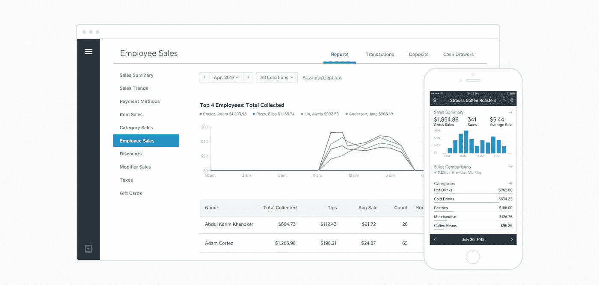

# 使用神经网络预测客户需求

> 原文：<https://medium.com/square-corner-blog/using-neural-networks-to-predict-customers-needs-63e5f2715e40?source=collection_archive---------0----------------------->

## **用于浏览和路径分析的深度学习。**

> 注意，我们已经行动了！如果您想继续了解 Square 的最新技术内容，请访问我们在 https://developer.squareup.com/blog[的新家](https://developer.squareup.com/blog)

Square 提供了一个名为*卖家仪表板*的强大分析工具，让我们的卖家能够洞察和跟踪他们的业务。使用这个工具，Square 卖家可以查看他们的日常销售总结，管理库存，确认存款，以及做更多事情来解决他们每天面临的复杂任务。

Square 的卖家仪表板团队的主要目标是在卖家出现问题时及时解决，同时继续增强和开发该产品的新功能。为了做好这一点，我们首先要了解卖家是否有效地使用了卖家仪表盘。

因为每个卖家使用仪表板的方式不同，所以为所有卖家的特定问题提供支持对于卖家和 Square 来说都是耗时且耗费资源的。因此，我们研究了为每个卖家自动化定制的个性化解决方案。

**数据**

当卖家点击并查看 Square 的网页时，Square 会分析这种行为。这些数据包含重要的线索，让我们了解卖家如何使用他们的仪表板。考虑到涉及的数据量巨大，最大的挑战是以能够为业务提供重要见解的方式压缩和聚合这些数据。

我们研究了各种监督和非监督机器学习技术，以分析网页流量数据。传统的分析技术，包括 [n-gram 分析](https://en.wikipedia.org/wiki/N-gram)和构建[马尔可夫链](https://en.wikipedia.org/wiki/Markov_chain)，提供了关于哪些页面使用最频繁以及哪些页面紧密链接在一起的宝贵见解。然而，在学习这种复杂的客户行为的背景方面，最有成效的是一种神经网络模型，它可以检测指示卖家遇到问题的使用模式。

**方法**

模拟生物神经元行为的人工神经网络已经成为模式识别的强大工具，并且近年来已经被利用，其性能优于传统的统计学习工具。前馈神经网络通过拾取数据的各种空间特征，在计算机视觉和语音识别方面表现良好，而递归神经网络是强大的工具，允许学习序列数据(如文本和音乐)中的依赖性。

我受到了最受欢迎的开源神经网络库之一 [Keras](https://keras.io/) 的主要作者[Fran ois Chollet](https://github.com/fchollet)的启发，他使用 LSTM(长短期记忆)的递归神经网络子集对 IMDb 电影评论 *进行分类。在这个研究实例中，可以从用户输入的自由形式文本中高精度地提取评论的情感。

手头的问题是类似的，因为我们想要一个二进制分类器，可以检测一系列信号。把网站上的每一页想象成一个单词的符号，不管某人需要帮助是积极的还是消极的结果，我们都有前述研究试图解决的完全相同的问题。有一些最后的障碍需要跨越，包括我们有一个不平衡的数据集，因为只有一小部分人在使用我们的产品时需要帮助。这通过探索传统的重采样选项得以缓解，例如对多数类欠采样或对少数类过采样，以便在训练我们的模型之前创建更平衡的样本。

**结果**

预测人类行为是一个相当难解决的问题。这是因为每个人的反应都不一样，即使他们看起来像是在做同样的事情。比如有的人通过支持文件主动寻求帮助；其他人向同事寻求帮助，或者寻找其他方法来解决他们的问题。鉴于这一事实，我们能够以 66%的高召回率检测支持信号，同时将我们的退出率保持在 24%左右。这是一个巨大的进步，否则我们用随机猜测会得到 5%的召回率。它也明显优于马尔可夫链模型和启发式方法。

Figure 1\. [ROC](https://en.wikipedia.org/wiki/Receiver_operating_characteristic) curve for Model Performance

**结论**

从页面流中正确识别信号的能力在本分析范围之外非常有价值。除了迅速帮助其他卖家获得更好的支持，这种方法还可以用来收集更多信号，并加强 Square 对自动化的关注，以增强客户体验。

* https://github . com/fchollet/keras/blob/master/examples/IMDB _ CNN _ lstm . py