# 使用 OCI 实例池和 KMS 部署 K3S

> 原文：<https://medium.com/oracledevs/using-oci-instance-pool-and-kms-to-deploy-k3s-fe8e2c0db926?source=collection_archive---------0----------------------->

为了继续我们在 OCI 上使用 K3S 的探索，我想使用 OCI 实例池来提供服务器和代理。在这个过程中，我还想使用嵌入式 etcd 作为数据存储。回想一下，[我们对 K3S 的第一次尝试](/oracledevs/k3s-on-oci-a-kubernetes-cluster-in-under-5-mins-d7c194c19d59)是采用嵌入式 sqlite 的单服务器设置。[随后的尝试](/oracledevs/travel-light-k3s-mysql-on-oci-9b2befda989c)是一个服务器和代理，但也有一个外部数据存储，形式为 [MySQL 数据库服务(MDS)](https://docs.oracle.com/en-us/iaas/mysql-database/index.html) ，我们只是为代理添加了另一个计算实例。在本帖中，我们将尝试另一种数据存储方法，采用[嵌入式 etcd](https://rancher.com/docs/k3s/latest/en/installation/ha-embedded/) 的形式，并为代理和服务器使用实例池。

## 安装 K3S 服务器

为了运行嵌入 etcd 的服务器，我们需要奇数台服务器。因此，我们将创建一台计算机，并将 K3S 安装为服务器:

```
NODE_IP=$(hostname -I | awk '{print $1}')curl -sfL https://get.k3s.io | K3S_KUBECONFIG_MODE="644" K3S_NODE_NAME=$NODE_IP K3S_CLUSTER_INIT="true" sh -
```

这将提供单个服务器节点。

## 使用 KMS

在[之前的示例](/oracledevs/travel-light-k3s-mysql-on-oci-9b2befda989c)中，我们还在代理上硬编码了 K3S_TOKEN 值。如果我们想实现自动化，那么我们需要找到一种安全可靠地存储这个令牌的方法，以便将来服务器或代理可以检索它们。我们可以用 [OCI KMS](https://docs.oracle.com/en-us/iaas/Content/KeyManagement/home.htm#top) 来做这个。按照文档[创建保险库](https://docs.oracle.com/en-us/iaas/Content/KeyManagement/Tasks/managingvaults.htm#createnewvault)。接下来，[创建一个秘密](https://docs.oracle.com/en-us/iaas/Content/KeyManagement/Tasks/managingsecrets.htm)并将令牌值存储在该秘密中。可以在以下位置找到群集的令牌:

```
cat /var/lib/rancher/k3s/server/node-token
```

## 为服务器配置 IAM

同样，这是手动的。如果我们也想自动化这一步呢？为此，您可以使用 [oci cli](https://docs.oracle.com/en-us/iaas/Content/API/Concepts/cliconcepts.htm) 。但是，为了让 oci cli 在实例上工作，您需要使用 oci 身份验证令牌，或者您可以设置一个具有正确策略的动态组，以允许实例创建机密。这将允许我们使用[实例 _ 主体](https://docs.oracle.com/en-us/iaas/Content/Identity/Tasks/callingservicesfrominstances.htm)。

首先，创建一个标记名称空间(k3s ),然后创建一个标记键定义，选择一个值列表(服务器、代理)。

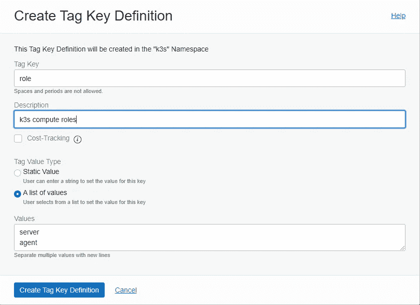

Creating a Tag Key definition with list of values

接下来，创建一个动态组(称之为 k3s-server ),并创建一个匹配规则，该规则使用以下标记选择服务器作为该动态组的一部分:

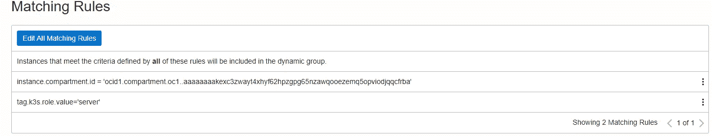

Dynamic Group matching rules using tag keys

接下来，创建一个策略，允许该组的成员使用密钥和保管库以及管理机密:

```
Allow dynamic-group dev-k3s-server to manage secrets in compartment id ocid1.compartment.oc1…
Allow dynamic-group dev-k3s-server to use keys in compartment id ocid1.compartment.oc1.
Allow dynamic-group dev-k3s-server to manage vaults in compartment id ocid1.compartment.oc1..
Allow dynamic-group dev-k3s-server to read secret-family in compartment id ocid1.compartment.oc1..
```

最后，在 OCI 控制台中导航到您的服务器实例，并设置 define 标记:

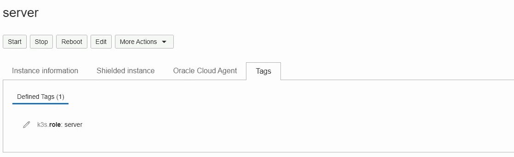

Setting tags on instance

下一次，在创建计算之前，我们可以在创建时设置标签。

我们现在可以使用 oci cli 和 instance_principal 来创建存储令牌的密码。该令牌相当长，当您以 base64 格式(OCI KMS 要求的格式)对其进行编码时，它可能会被截断。要避免这种情况，请通过将该值设置为 0 来禁用换行:

```
K3S_TOKEN_SECRET=$(base64 -w 0 /var/lib/rancher/k3s/server/node-token)
```

要将 oci cli 与实例主体一起使用，我们需要添加身份验证机制:

```
oci vault secret create-base64 --compartment-id ${compartment_id} --secret-name ${secret_name} --vault-id ${vault_id} --description "k3s token" --key-id ${key_id} --secret-content-content $K3S_TOKEN_SECRET --auth instance_principal
```

## 为剩余的服务器配置实例池

现在，我们可以创建一个实例池。因为我们需要奇数个服务器，所以我们可以创建一个 2 的实例池，使总数达到 3。

首先，创建一个实例配置来设置计算参数，如形状、子网和 NSG。滚动到底部，查找 cloud-init 脚本文件。您可以输入以下内容

```
NODE_IP=$(hostname -I | awk '{print $1}')dnf config-manager --enable ol8_developer && dnf -y install python3-oci-clifirewall-offline-cmd --add-port=6443/tcp
firewall-offline-cmd --add-port=10250/tcp
firewall-offline-cmd --add-port=2379/tcp
firewall-offline-cmd --add-port=2380/tcp
firewall-offline-cmd --add-port=8472/udp
systemctl restart firewalldwhile [[ $K3S_TOKEN = "" ]]
do
  K3S_TOKEN=$(oci secrets secret-bundle get --secret-id "${secret_id}" --auth instance_principal | jq '[.data."secret-bundle-content"."content" ]' | tr -d "[ \" ]" | base64 -d)
donecurl -sfL https://get.k3s.io | K3S_NODE_NAME=$NODE_IP K3S_CLUSTER_INIT="false" K3S_URL=${K3S_URL} K3S_TOKEN=$K3S_TOKEN INSTALL_K3S_EXEC="server" sh -s
```

K3S_URL 指向 https:// <server_ip>:6443/。用实际的 id 替换 secret_id。还要确保您已经设置了已定义的标签。通过设置 K3S_URL 变量，这将确保作为池的一部分调配的服务器将加入现有群集，通过将 INSTALL_K3S_EXEC 设置为“server”，这将确保节点池将作为服务器节点加入。</server_ip>

您现在可以创建一个实例池。

## 安装代理

创建实例配置和实例池。与服务器类似，为代理和策略创建第二个动态组，允许它读取机密:

```
Allow dynamic-group dev-k3s-agent to read secret-family in compartment id ocid1.compartment.oc1..
```

标签的匹配规则显然应该是匹配代理:

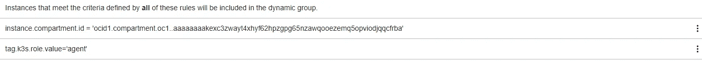

现在，您可以让代理从 OCI 保管库检索令牌，如下所示:

```
K3S_TOKEN=$(oci secrets secret-bundle get --secret-id "**${secret_id}**" --auth instance_principal | jq '[.data."secret-bundle-content"."content" ]' | tr -d "[ \" ]" | base64 -d)
```

上面的＄{ secret _ id }可以参数化，这可以通过 cloud-init 执行。

像以前一样使用云初始化安装 K3S 代理:

```
NODE_IP=$(hostname -I | awk '{print $1}')dnf config-manager --enable ol8_developer && dnf -y install python3-oci-clifirewall-offline-cmd --add-port=6443/tcp
firewall-offline-cmd --add-port=10250/tcp
firewall-offline-cmd --add-port=2379/tcp
firewall-offline-cmd --add-port=2380/tcp
firewall-offline-cmd --add-port=8472/udp# give 60s for policies to propagate
sleep 60while [[ $K3S_TOKEN = "" ]]
do
  K3S_TOKEN=$(oci secrets secret-bundle get --secret-id "${secret_id}" --auth instance_principal | jq '[.data."secret-bundle-content"."content" ]' | tr -d "[ \" ]" | base64 -d)
donecurl -sfL https://get.k3s.io | K3S_NODE_NAME=$NODE_IP K3S_URL=${K3S_URL} K3S_TOKEN=$K3S_TOKEN sh -
```

其中 K3S_URL 指向 https:// <server_ip>:6443/。正如您对服务器池所做的那样，相应地替换 secret_id。</server_ip>

设置完成后，您可以获得一个节点列表:

```
[opc@server ~]$ kubectl get nodesNAME          STATUS   ROLES                       AGE     VERSION10.0.0.18     Ready    control-plane,etcd,master   3h35m   v1.21.5+k3s2
10.0.0.19     Ready    control-plane,etcd,master   3h29m   v1.21.5+k3s2
10.0.0.22     Ready    control-plane,etcd,master   3h29m   v1.21.5+k3s2
10.0.74.32    Ready    <none>                      3h27m   v1.21.5+k3s2
10.0.86.229   Ready    <none>                      3h27m   v1.21.5+k3s2
10.0.99.46    Ready    <none>                      177m    v1.21.5+k3s2
```

从上面可以看到，我们有 3 个服务器和 3 个代理。

## 测试服务器高可用性

我们现在想通过模拟 1 个服务器节点的崩溃来测试服务器的高可用性。导航到您的计算实例页面，确定在服务器实例池中运行的一个实例，并终止它。我们想检查是否:

1.  实例池自动脱离另一台服务器(相当标准)
2.  新服务器也加入现有集群

如果您观察服务器的实例池，您将首先看到一个实例终止:

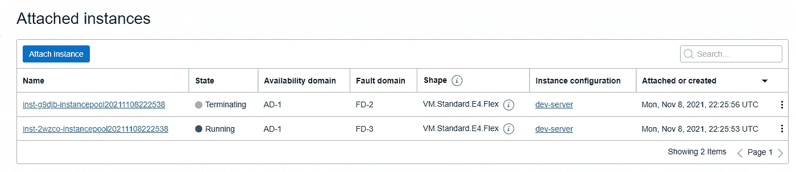

随后，服务器实例池将进入扩展模式，以满足其运行 2 个实例的义务:

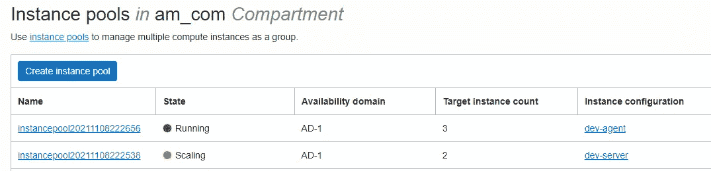

同时，我们的集群如下所示(10.0.0.22 是终止的实例，显示为 NotReady)。

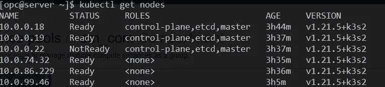

因为我们正在模拟一次崩溃，所以我们可以省去排水等细节，只需删除节点:

```
kubectl delete node 10.0.0.22 
```

当我们再次列出我们的节点时:

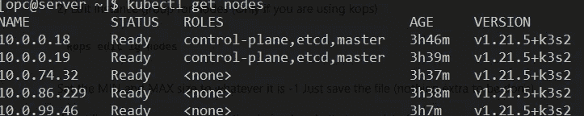

1 server node missing

我们看到少了一个服务器节点。过了一会儿，我们再次列出，我们可以看到一个新的节点已经加入。巧合的是，它也被分配了相同的 IP 地址。

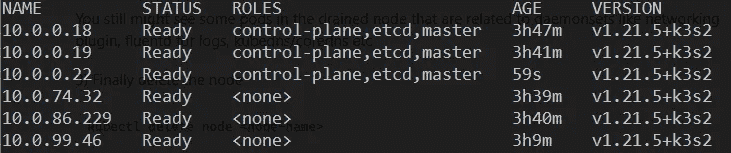

## 扩展代理

如果我们想扩展代理呢？我们可以增加代理池的大小。导航到实例池页面，对其进行编辑，并将大小设置为所需的数字。在这里，我将代理池的大小增加了两倍:

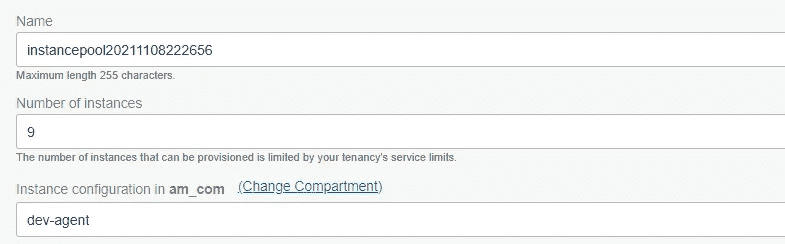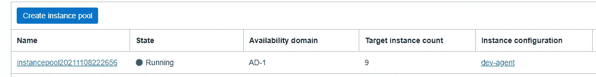

在所有代理加入后，我们现在可以看到代理数量的增加:

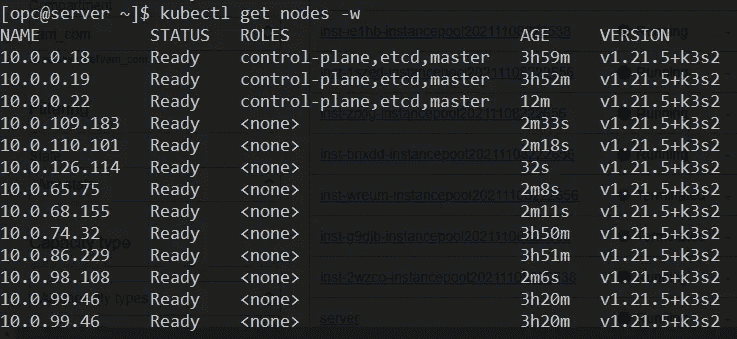

## 未来改进

我们还可以在其他几个方面有所改进:

*   初始服务器也可以创建为实例池的一部分
*   我们可以在 API 服务器前使用内部负载平衡器
*   我们可以生成一个秘密并预先存储在保险库中。这样，我们只需要向动态组授予读取权限。

但是现在，我对上述内容相当满意。我要感谢我的同事和朋友们对本文的贡献和非常有帮助的建议:[阿维·米勒](https://medium.com/u/963da490a63?source=post_page-----fe8e2c0db926--------------------------------)、[斯蒂芬·克罗斯](https://medium.com/u/9f864653bb16?source=post_page-----fe8e2c0db926--------------------------------)和[肖恩·利维](https://medium.com/u/a4deeec35158?source=post_page-----fe8e2c0db926--------------------------------)。