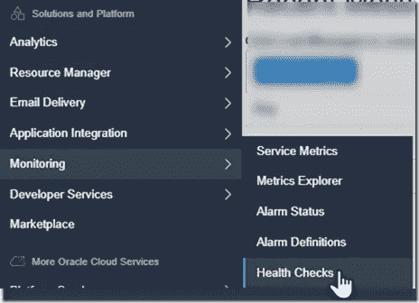
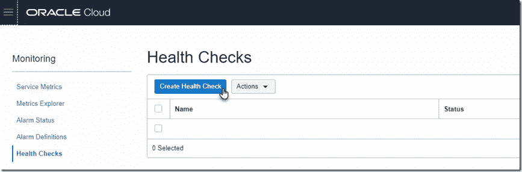
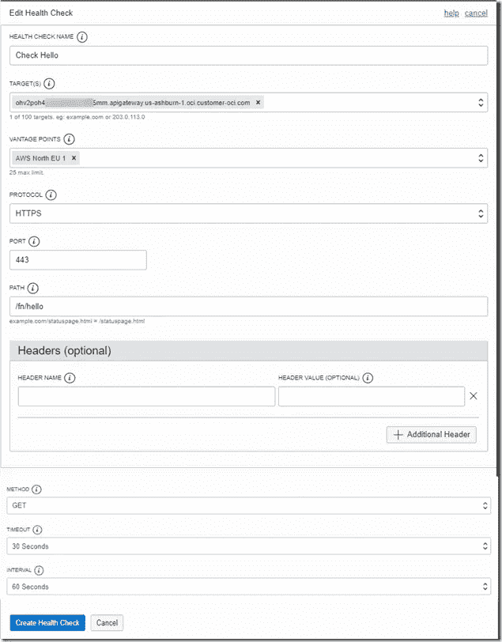
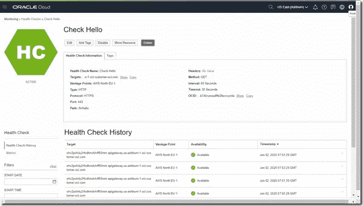
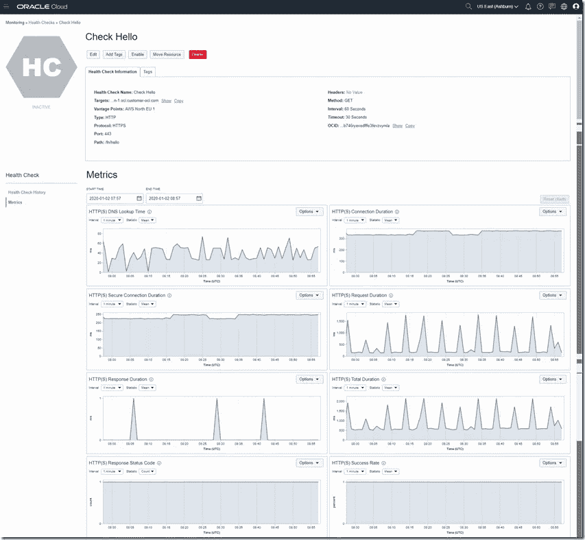
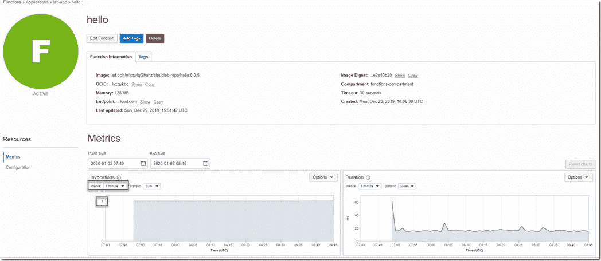

# 使用 OCI 监控运行状况检查来计划 Oracle 云基础架构上无服务器功能的执行

> 原文：<https://medium.com/oracledevs/using-oci-monitoring-healthchecks-to-schedule-execution-of-serverless-functions-on-oracle-cloud-ef233f887a5?source=collection_archive---------4----------------------->

根据时间表执行调度作业是一项常见的需求。Oracle 云基础架构上的作业通常使用云原生的、无服务器的功能来实施，这些功能可以通过 API 网关上的(公共)HTTP 端点来公开。我最近发表了一篇文章，描述了如何使用 IFTTT 来调度函数的执行。这很好。但是，有一种更好的方法，即在 Oracle 云基础架构上实现更细粒度、更易于监控和完全的云原生。

使用 OCI 监控服务，我们可以创建由定期 ping 或 HTTP 调用组成的健康检查。我们可以配置一个 Healthcheck，定期调用公共 API 网关上的一个端点，并将一个函数作为其后端。通过这种方式，我们可以很容易地安排每 X 秒|分钟|小时|天执行一次功能。下图描述了这种设置。

下图中显示的 hello 函数是在以前的文章中创建的；它是在 Node 中实现的，不做任何有用的事情。对于我们想要安排执行的后端功能，没有任何要求。

我们经历的步骤:

*   在 OCI 监控中为我们要调度的函数定义 API 网关端点和路由的健康检查
*   (检查该功能现在是否定期触发)

注意:健康检查不允许我们将身体传递给功能；HTTP 头*可以*指定。

要创建运行状况检查，请转到监控|运行状况检查:

单击创建运行状况检查:

配置健康检查——使用 API 网关端点和 APU 网关上的[URL]路径来触发功能。指明检查运行状况的频率；这对应于触发该功能的频率。

这里显示的运行状况检查每 60 秒触发一次；然后，它通过 HTTPS 对路径/fn/hello 处的 API 网关端点进行 GET 调用(HEAD 是另一个选项)——这导致了函数 *hello* 。请求中不包含任何标头。

保存新的运行状况检查配置。现在应该立即激活它。

几分钟后，控制台显示运行状况检查的以下详细信息，这表明它已经(成功)执行:

45 分钟后的详细指标让我们对函数调用的延迟有了一些了解。我认为峰值是由函数在一段时间后变冷引起的，在冷重启后调用会导致更长的响应时间。

我也许应该对此进行更详细的调查。

在函数方面，我们可以在指标中看到函数定期执行，大约每分钟一次。

使用健康检查——连同 API 网关——似乎是调度功能执行的一种相当优雅的方式。Oracle 很可能在不久的将来将调度作为云原生功能提供，但在此之前，这似乎是一个可行的替代方案。

*原载于 2020 年 1 月 8 日*[*https://technology . amis . nl*](https://technology.amis.nl/2020/01/08/using-oci-monitoring-healthchecks-to-schedule-execution-of-serverless-functions-on-oracle-cloud-infrastructure/)*。*