# 使用 Oracle 数据库和 ASP.NET 核心标识

> 原文：<https://medium.com/oracledevs/using-oracle-database-with-asp-net-core-identity-3216fab69eb?source=collection_archive---------0----------------------->


[ASP.NET 核心身份](https://docs.microsoft.com/en-us/aspnet/core/security/authentication/identity)是一个支持用户和角色认证和授权的. NET 接口。它管理用户、密码、配置文件、角色和其他属性，并将它们全部存储在一个数据存储中。只需几个简单的步骤，就可以将 ASP.NET 核心身份配置为使用任何 Oracle 数据库作为其数据存储，包括 Oracle 自治数据库。在这篇博文中，我将展示如何配置一个. NET 应用程序来集成 ASP.NET 核心身份和 Oracle 自治数据库。

Oracle 数据库和 ASP.NET 核心身份数据访问通过 Oracle Data Provider for 进行。NET(ODP.NET)和实体框架核心(EF 核心)。我在演示中使用了 EF Core 6、Visual Studio 2022 和 Oracle 自治数据库(ADB)。尽管如此，内部部署的 Oracle 数据库，加上早期的 EF Core 和 Visual Studio 版本也支持 ASP.NET 核心标识，步骤基本相似。

让我们开始吧。

# 创建 Oracle ASP.NET 核心身份应用程序

1.  在 Visual Studio 中，创建新的。NET 项目。从项目类型列表中选择【ASP.NET T2 核心 Web App(模型-视图-控制器)】。点击**下一个**按钮。

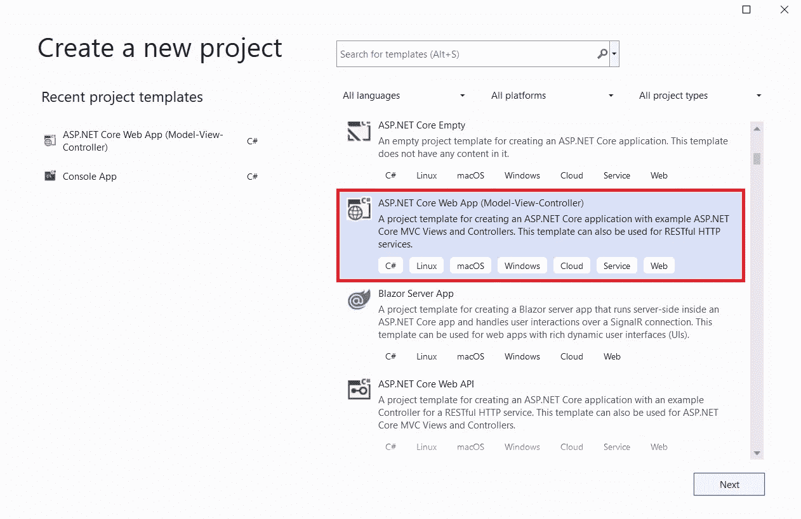

2.为项目命名，例如“Oracle ASP.NET 核心标识示例”。点击**下一个**按钮。

3.选择了。您要使用的. NET 运行时版本。我已经选择了。NET 6.0。在**认证类型**下，选择“个人账户”然后点击**创建**按钮。

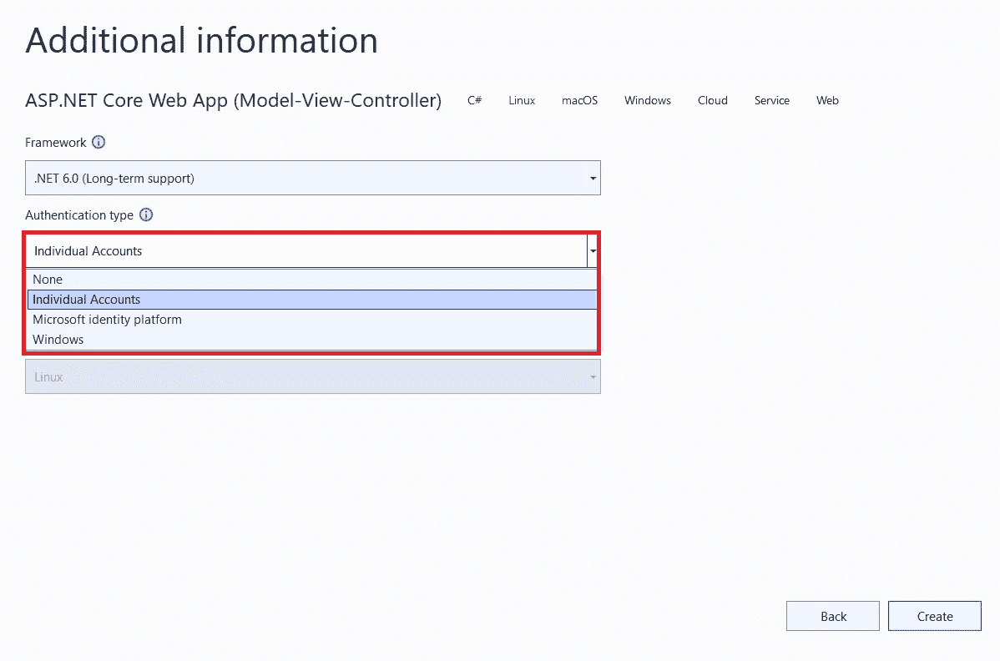

4.接下来，我们将安装 Oracle EF Core 来支持对 Oracle ADB 的数据访问。打开**解决方案浏览器**并右键单击“依赖”节点。选择“管理 NuGet 包…”。在 NuGet 包管理器中，在 NuGet 库中搜索 **Oracle。EntityFrameworkCore** 包。

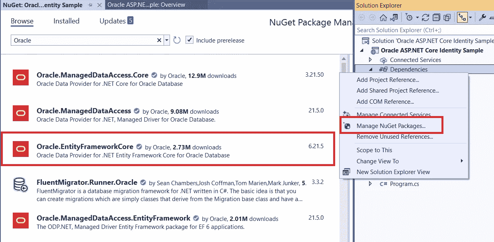

5.选择 Oracle EF 核心包。如果您使用的是 EF Core 6，请选择以主版本 6.x 开头的 Oracle EF Core 包。

点击右侧的**安装**按钮。点击 **OK** 按钮，完成 NuGet 包的安装和设置。

6.在您项目的 **appsettings.json** 文件中，用您的 ODP.NET 连接字符串替换“DefaultConnection”字符串。

```
"ConnectionStrings": {
    "DefaultConnection": "**User Id=<USER ID>;Password=<PASSWORD>;Data Source=<Data Source>**;"
},
```

对于**数据源**，您可以使用完整的 Oracle 连接描述符、网络服务名或 Easy Connect (Plus)。使用网络服务名时，可以将 **TNS_ADMIN** 操作系统环境变量或者 **Tns_Admin** 连接字符串属性设置为 **tnsnames.ora** 和 **sqlnet.ora** 文件所在的目录。

保存文件。

7.打开项目的 **Program.cs** 文件，编辑以下代码行:

```
options.**UseSqlServer**(Configuration.GetConnectionString("DefaultConnection")));
```

将文本 **UseSqlServer** 替换为 **UseOracle** 并保存文件:

```
options.**UseOracle**(Configuration.GetConnectionString("DefaultConnection")));
```

通过共享 Oracle ADB，您可以连接 mTLS(需要钱包)或 TLS(不需要钱包)。在本教程中，我使用 TLS。但是，mTLS 是默认值。在之前的博客文章中，我展示了如何配置 [Oracle 自治数据库，以便在没有钱包](/oracledevs/securely-connect-net-to-oracle-autonomous-database-without-a-wallet-nor-client-configuration-files-a1438893240a)的情况下使用 TLS。

8.在解决方案资源管理器中，右键单击**数据→迁移**文件夹并删除其所有内容。我们将指导 EF 核心为 Oracle 数据库创建新的迁移和 ASP.NET 核心身份模式对象。

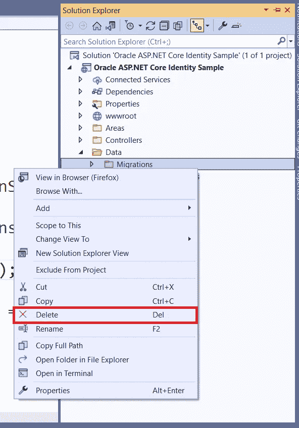

9.在 Visual Studio 中打开**包管理器控制台**。在提示符下执行以下 EF 核心迁移命令:

```
add-migration CreateASPNETCoreIdentitySchema -OutputDir Data\Migrations
```

成功执行后，输出将类似于以下内容。

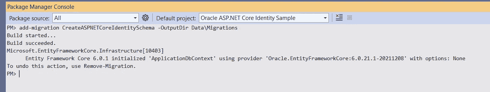

10.在**程序包管理器控制台**中执行以下命令，将迁移应用到 Oracle 数据库，这将创建 ASP.NET 核心身份模式对象:

```
update-database
```

您的设置现在已经完成。

# 运行 Oracle ASP.NET 核心身份应用程序

让我们尝试使用 web 应用程序来验证它是否按照预期在 Oracle 数据库中存储了身份数据。我们将创建一个新的应用程序用户，然后以该用户身份登录。

1.  在 Visual Studio 中，通过单击浅绿色箭头“启动而不调试”或按 Ctrl-F5 来运行应用程序。
2.  应用程序的欢迎页面将会出现。点击右上角的“注册”链接，开始创建新的应用程序用户。

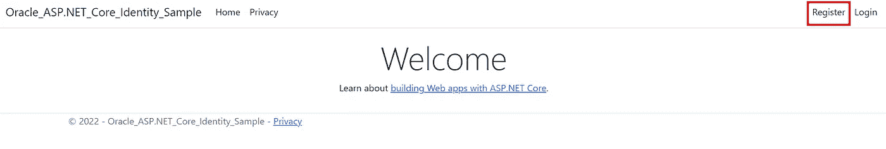

3.使用电子邮件和密码创建一个用户帐户。完成后点击**注册**按钮。

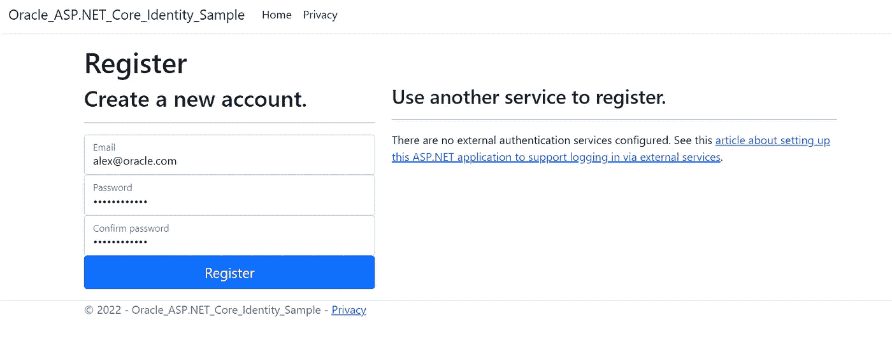

4.现在将出现注册确认页面。

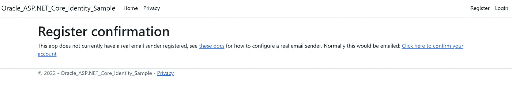

单击“单击此处确认您的帐户”链接完成注册。

5.账户确认后，点击右上角的“登录”链接。

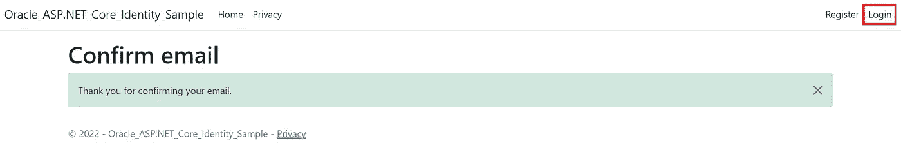

6.填写新用户的电子邮件和密码信息。接下来，单击“登录”按钮。

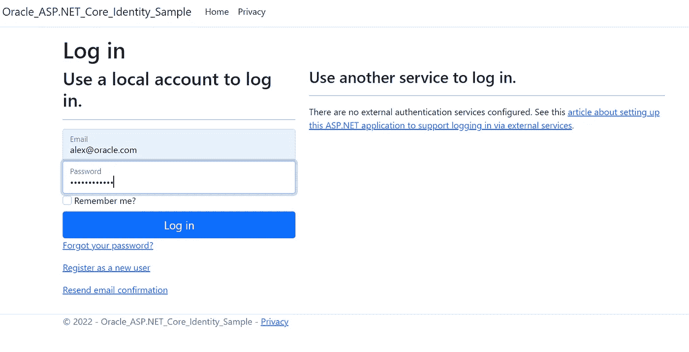

7.您现在将作为新用户登录。

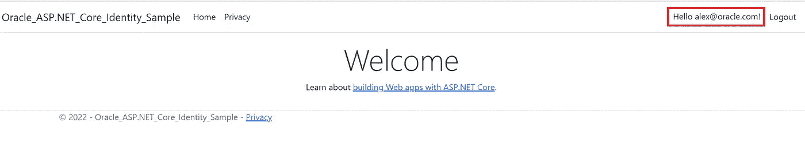

8.要浏览新创建的 Oracle 模式对象，请使用 Oracle Developer Tools for Visual Studio 或类似的数据库工具集。

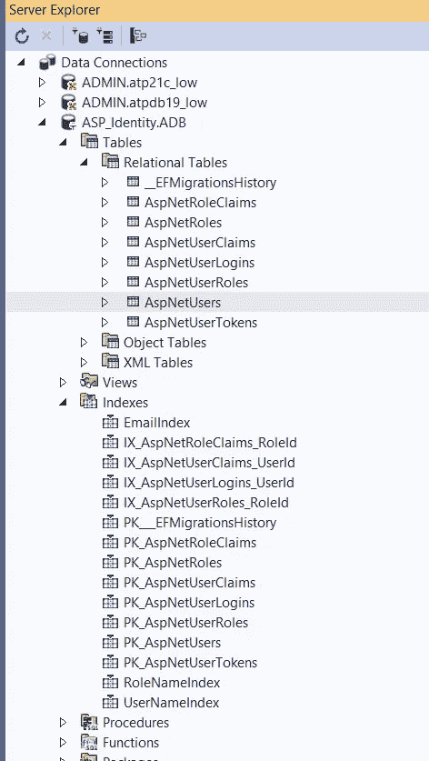

恭喜你！现在，您可以将 ASP.NET 核心身份功能用于 Oracle 数据库。

# 立即开始使用 Oracle 云免费层

您可以通过注册 [Oracle 云免费层](https://www.oracle.com/cloud/free/?source=:ex:tb:::::RC_WWMK220210P00062:Medium_aspodbk&SC=:ex:tb:::::RC_WWMK220210P00062:Medium_aspodbk&pcode=WWMK220210P00062)在 Oracle ADB 免费试用本教程。

如果你对甲骨文开发人员在他们的自然栖息地发生的事情感到好奇，请加入我们的[公共休闲频道](https://join.slack.com/t/oracledevrel/shared_invite/zt-uffjmwh3-ksmv2ii9YxSkc6IpbokL1g?customTrackingParam=:ex:tb:::::Medium_aspodbk)！