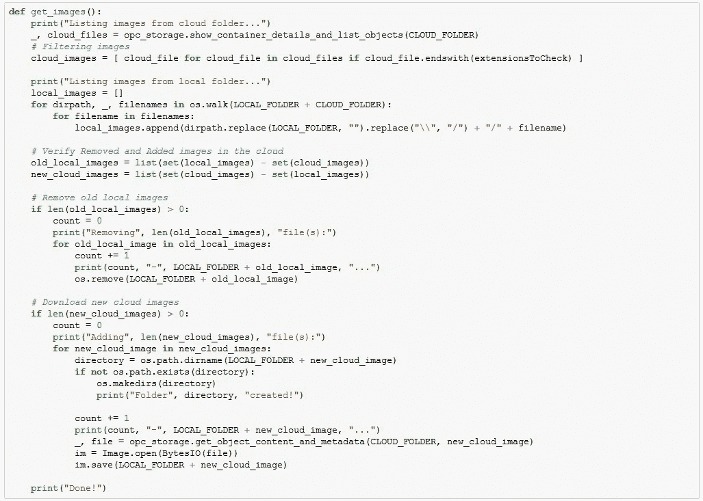
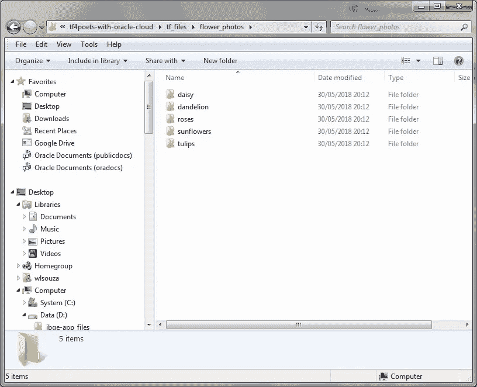
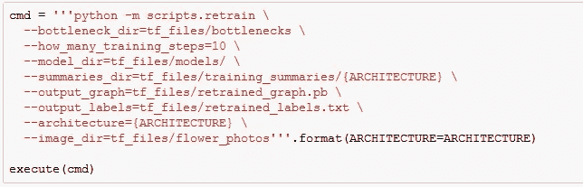
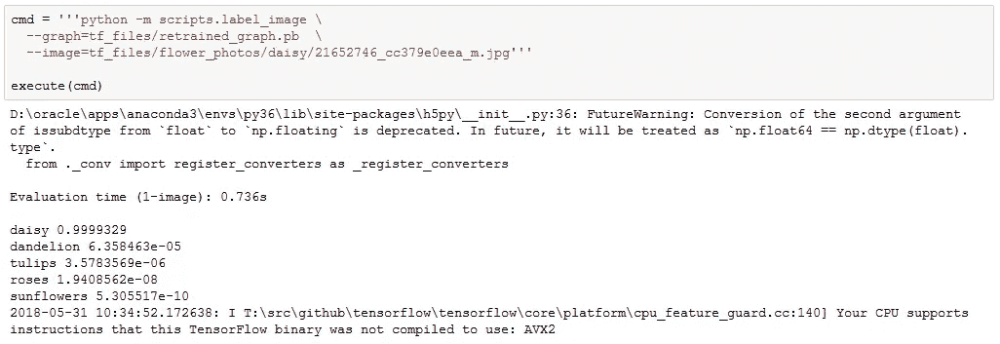

# 将 Oracle 存储云与 Tensorflow 结合使用

> 原文：<https://medium.com/oracledevs/using-oracle-storage-cloud-with-tensorflow-ca809e0f6612?source=collection_archive---------4----------------------->

你知道 Tensorflow 吗？TensorFlow 是一个用于高性能数值计算的开源软件库。也许现在它是最著名的用于机器学习和深度学习项目的库。这种解决方案负责像自动驾驶汽车和面部识别这样的项目。

有很多关于 Tensorflow 的教程，我最喜欢的一个是[迁移学习](https://www.tensorflow.org/tutorials/image_retraining)。迁移学习是一种允许我们在相关任务中重用已经训练好的模型的技术。换句话说，我们可以用一个经过训练可以识别猫和狗的模型来识别人脸。对于有一台没有 GPU 的计算机的人来说，迁移学习是一个很好的选择。

在一个对象识别项目中，我们需要用大量的图像来训练或重新训练我们的模型，一个伟大的存储云可能会有所帮助。

在这篇博文中，您将了解如何使用 Oracle Cloud Object Storage Classic 中存储的图像来训练您的模型。

请看这篇博文，了解如何将您的映像发送到 Oracle Cloud Object Storage Classic:[使用 FTM CLI](http://waslleysouza.com.br/en/2018/05/upload-files-to-oracle-object-storage-classic-with-ftm-cli/) 将文件上传到 Oracle Object Storage Classic。

TensorFlow 有一个很好的教程叫做“TensorFlow for Poets”，我用它创建了这个项目。从 Github 下载文件。

```
git clone https://github.com/waslleysouza/tf4poets-with-oracle-cloud
```

在 TF 4 poets-with Oracle-cloud 文件夹中，启动 Jupyter 笔记本。

```
jupyter notebook tf4poets-with-oracle-cloud.ipynb
```

笔记本很简单。
在第三行，我创建了一个代码，列出了本地和云文件夹中的所有图片。如果您在云文件夹中添加或删除图像，此代码将在您的本地文件夹中更新它。



当您第一次运行第四行时，所有的图像都被下载并保存到 tf_files 文件夹中。



最后两行执行原始脚本。
这段代码使用图片重新训练模型。



这段代码对一幅图像进行分类。在这种情况下，它试图识别花的类型。



玩得开心！

*原载于 2018 年 5 月 31 日*[*waslleysouza.com.br*](http://waslleysouza.com.br/en/2018/05/using-oracle-storage-cloud-with-tensorflow/)*。*