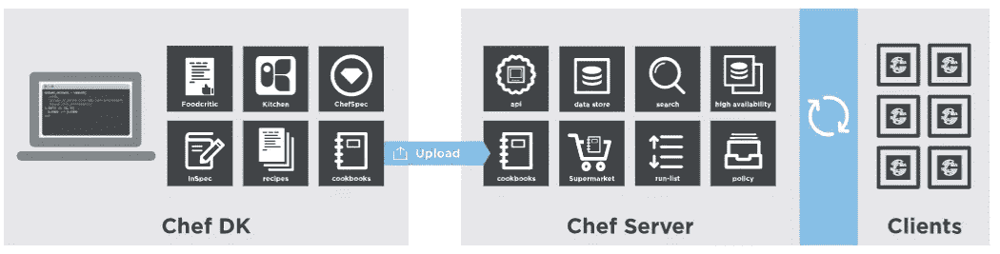

# 使用 Oracle Chef 插件在 Oracle 云基础架构中调配资源

> 原文：<https://medium.com/oracledevs/using-oracles-chef-plugin-to-provision-resource-in-oracle-cloud-infrastructure-5891100e20ab?source=collection_archive---------0----------------------->

本文介绍了如何使用 Chef 和 Oracle 提供的 Chef 插件在[**【Oracle 云基础设施(OCI)**](https://cloud.oracle.com/iaas) 中处理和调配资源。本文通过使用 [**托管的 chef**](https://manage.chef.io/login) 来演示这一点，然而，大多数步骤可以类似地用于您使用专用 chef 服务器安装的场景中。

# 厨师是什么

Chef 是一个强大的自动化平台，可以将基础设施转化为代码。无论您是在云中、内部还是在混合环境中运行，Chef 都会自动配置、部署和管理整个网络中的基础架构，无论其规模如何。

这个图表显示了如何开发、测试和部署您的 Chef 代码



Image Courtesy [https://docs.chef.io/platform_overview.html](https://docs.chef.io/platform_overview.html)

# OCI 厨师插件

**knife-oci** 插件允许用户通过 [**chef knife 与 Oracle 云基础设施进行交互。**](https://docs.chef.io/knife.html) 项目是开源的，由 Oracle 公司维护，项目的主页是 [**这里是**](https://docs.us-phoenix-1.oraclecloud.com/Content/API/SDKDocs/knifeplugin.htm) 。插件可以从 [**这个**](https://github.com/oracle/knife-oci/releases) 位置下载。以下是可用的刀-oci 插件命令。

*   启动一个 oci 实例，并将其引导为一个 Chef 节点:*刀 OCI 服务器创建*
*   请列出 OCI 的车厢。*刀 oci 隔间列表*
*   删除一个 oci 实例:*刀 OCI 服务器删除*
*   列出给定隔离专区中的 OCI 实例。注意:返回隔离舱中的所有实例，而不仅仅是那些 Chef 节点:*刀 oci 服务器列表*
*   在一个区间中列出图像:*刀 oci 图像列表*
*   列出一个区间中的 vcn:*刀 oci vcn 列表*
*   列出 VCN 中的子网:*刀 oci 子网列表*
*   列出可用于特定图像类型的形状:*刀 oci 形状列表*
*   列出您的租赁的可用性域: *knife oci ad list*

# 在 OCI 中设置和设置的步骤

# 1.创建您的托管厨师帐户

在托管 chef 模式中，用户的食谱、角色和节点定义存储在由 Chef，Inc .提供的基于云的 Chef 服务器中。用户只需上传食谱，Chef 就会完成剩下的工作。尽管人们可以在一定限制下免费试用，但是完整的企业级使用需要许可证。

*   在[**【https://manage.chef.io/login**](https://manage.chef.io/login)注册并创建您的账户
*   然后登录到您的帐户，创建一个组织。组织是 Chef 服务器中基于角色的访问控制的顶级实体。
*   最后，它会提示您下载初学者工具包(厨师报告)。将此文件下载到您的 Chef 工作站(即 ChefDK 安装的工作站),并在指定位置解压缩。Chef 存储库是您的工作区，用于组织所有工件，如食谱和角色等。knife 用于将数据从 Chef-Repo 目录上传到 Chef 服务器。
*   解压缩后的目录之一是**。厨师**。在这个目录中有一个文件 **knife.rb** 。这是一个配置文件，稍后您需要在其中配置您的 OCI 云帐户。
*   **对于后续步骤，将解压后的 Chef-Repo 目录作为您的工作目录**。

# 2.安装 ChefDK

从[**https://downloads.chef.io/chefdk**](https://downloads.chef.io/chefdk)下载并安装适用于您平台的 ChefDK 二进制文件。如果还没有，请确保您的路径设置正确，以执行 chef 可执行文件。

# 3.安装 Oracle 提供的插件以与 OCI 一起使用

确保正在安装的工作站或服务器具有互联网连接。您可能需要适当地设置 http 和 https 代理变量(参见[**https://docs.chef.io/proxies.html**](https://docs.chef.io/proxies.html))。然后运行以下命令来安装 Oracle 为 OCI 提供的名为 knife-oci 的 chef 插件

```
**chef gem install knife-oci**
```

# 4.识别并收集您的 OCI 帐户详细信息

*   确定一个您要在其中调配虚拟机的 OCI 云帐户。
*   收集以下 ocid(Pl。详见本 [**网址**](https://docs.us-phoenix-1.oraclecloud.com/Content/API/Concepts/apisigningkey.htm) 。)
*   **1)** 用户 OCID。此处见[](https://docs.us-phoenix-1.oraclecloud.com/Content/API/Concepts/apisigningkey.htm#Other)****知焉。****
*   ******2)** 租佃 OCID。看到 [**这里**](https://docs.us-phoenix-1.oraclecloud.com/Content/API/Concepts/apisigningkey.htm#Other) 就知道了。****
*   ******3)** 你的车厢 OCID。在您的云控制台中，单击顶部菜单中的身份，然后单击左侧菜单中的隔离专区，将显示隔离专区。识别您的隔离舱，然后单击“显示”查看该隔离舱的完整 OCID 值。****
*   ****以 ***PEM 格式(非 SSH-RSA 格式)*** 创建 SSH 密钥对，用于验证您的云帐户。见 [**此处**](https://docs.us-phoenix-1.oraclecloud.com/Content/API/Concepts/apisigningkey.htm#How) 知焉。这不是您将调配的虚拟机的密钥对。您稍后将创建的。****
*   ******1)** 在您指定的位置创建并提供两把钥匙****
*   ******2)** 上传公钥到你的 OCI 账户，生成指纹。见[此处**见**知焉](https://docs.us-phoenix-1.oraclecloud.com/Content/API/Concepts/apisigningkey.htm#How2)****
*   ****确定您要设置的区域****
*   ****确定您要预配的可用性域****

# ****5.配置刀-oci 插件配置文件****

****准备一个文本文件，比如说。并在其中配置以下参数。这是示例值，请使用您在环境中找到的值。key_file 的值是用于验证您的云帐户的私钥文件的完整路径。用户和租赁是您之前找到的用户帐户和您的租赁的 OCID 值。****

```
**[DEFAULT]user=ocid1.user.oc1..aaaaaaaafnfudi6p2twvkqbonbuvuuzzzvnyly74rhodbln6ax5k5bvccikqfingerprint=98:93:64:2d:b7:47:df:87:c9:57:83:04:83:a4:05:ackey_file=C:\Users\utanna\.oci\oci_api_key.pemtenancy=ocid1.tenancy.oc1..aaaaaaaawz52pbyqeud4ryne7ojegn2bzavhie4bgki3j6k7fwp5asbs5dqaregion=us-phoenix-1**
```

****接下来，在配置文件 **knife.rb** 中，我们在**中找到的。chef** 之前 Chef Repo 的目录，配置以下参数。请给出刚在以下 knife.rb 文件中准备的 oci.txt 的完整路径。如果您在 knife.rb 中配置了 compartment_id，当您发出 knife oci 命令时，此隔离专区将成为默认隔离专区。您可以通过在刀 oci 命令中给出不同的隔离舱 id 来覆盖它。****

```
**knife[:oci_config_file] = 'D:\oci.txt'knife[:compartment_id] = 'ocid1.compartment.oc1..aaaaaaaaldctk5h5nnvemgl6vudavygi276bq55wh6zbzldaewxqdcfw45fq'user=ocid1.user.oc1..aaaaaaaafnfudi6p2twvkqbonbuvuuzzzvnyly73rhodbln8ax6k5bvccikq**
```

# ****6.在 OCI 提供资源****

*   ****创建 SSH 公钥/私钥对，用于登录到所调配的实例/虚拟机。****
*   ****还要确保您也创建了 **openssh** 格式的私钥。在下面的命令中，这是您提供的内容****
*   ****确定子网的 OCID 值(从控制台或在运行服务器创建命令之前运行 knife oci 子网列表命令)****
*   ******1)** 同样，为您要预配的隔离专区确定 OCID。****
*   ******2)** 如果不知道，通过运行*刀 oci 图像列表*命令识别图像 id 的值。****
*   ******3)** 如果未知，通过运行*刀 oci 形状列表*命令来识别形状值。****
*   ****构建与下面类似的命令，并运行它以在 OCI 配置虚拟机。命令是没有换行符的单行。****

```
**knife oci server create    --availability-domain 'pmne:PHX-AD-3'   --compartment-id 'ocid1.compartment.oc1..aaaaaaaaldctk5h5nnvemgl6vudavygi276bq55wh8zbzldaewxqdcfw15fq'   --image-id 'ocid1.image.oc1.phx.aaaaaaaa4g2xpzlbrrdknqcjtzv2tvxcofjc55vdcmpxdlbohmtt7encpana'   --shape 'VM.Standard1.2'   --subnet-id 'ocid1.subnet.oc1.phx.aaaaaaaaf5nxlolz7k7v2on3rl94ythda4c7e5yhzgtyoamvrx5ret3v6d2q'   --ssh-authorized-keys-file D:\sample-public_key.pub   --display-name OCIinstance   --identity-file D:\sample-private-openssh-key.ppk   --region 'us-phoenix-1'**
```

****这将启动 VM，并引导新实例作为 Chef 服务器的客户机。然后，用户可以在他们的 chef 存储库中编写/使用 cookbook，并使用 knife 命令将其运行到新启动的实例。****