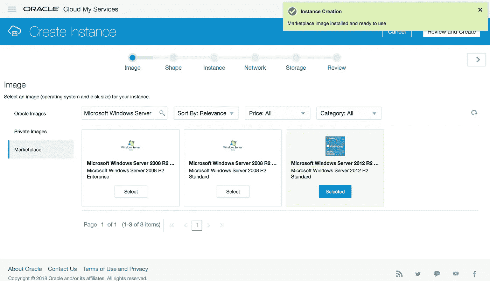
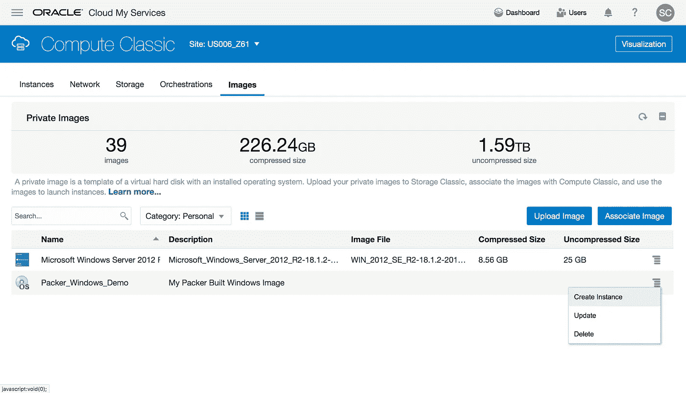

# 使用 Packer 为 Oracle 云基础架构 Classic 构建基于 Windows 的映像

> 原文：<https://medium.com/oracledevs/using-packer-to-build-windows-based-images-for-oracle-cloud-infrastructure-classic-e38545376dfc?source=collection_archive---------0----------------------->

Packer 在 2 月份推出了对在 Oracle Cloud infra structure Classic 上构建映像的支持。

*   [宣布面向 Oracle 云基础设施的 Packer Builder Classic](https://blogs.oracle.com/developers/announcing-packer-builder-for-oracle-cloud-infrastructure-classic)

自最初发布以来，packer `oracle-classic` builder 已经添加了对启用配置 Windows 映像的`WinRM`支持。在这篇文章中，我们将看看如何创建一个 WinRM 支持的打包配置

以下已经用`[**packer v1.2.2**](https://www.packer.io/downloads.html)`测试过了。这里是主`packer.json`配置文件

```
{
  "variables": {
    "username": "user@example.com",
    "password": "Pa55_Word",
    "domain": "example",
    "endpoint": "https://api-z61.compute.us6.oraclecloud.com/"
  },
  "builders": [
    {
      "type": "oracle-classic",
      "username": "{{user `username`}}",
      "password": "{{user `password`}}",
      "identity_domain": "{{user `domain`}}",
      "api_endpoint": "{{user `endpoint`}}",
      "shape": "oc3",
 **"source_image_list": "/Compute-{{user `domain`}}/{{user `username`}}/Microsoft_Windows_Server_2012_R2-18.1.2-20180110-070846",**      "dest_image_list": "Packer_Windows_Demo",
      "image_name": "Packer_Windows_Demo_{{timestamp}}",
      "image_description": "My Packer Built Windows Image",
 **"attributes_file": "./windows_attributes.json",
      "communicator": "winrm",
      "winrm_username": "Administrator",
      "winrm_password": "Pa55_Word"**    }
  ],
  "provisioners": [
    {
      "type": "powershell",
      "inline": "Write-Output(\"HELLO WORLD\")"
    }
  ]
}
```

`communicator`、`winrm_username`和`winrm_password`设置 packer builder 通过 WinRM 提供实例。其他需要配置的 Windows 实例特定属性是源图像列表和`opc-init`配置的属性文件

## 源图像列表

`**source_image_list**`必须是创建新映像的源映像的全限定引用。Oracle 云基础架构经典版的基本 Windows 服务器映像由 Oracle 在 [Oracle 云市场](https://cloud.oralce.com/marketplace)上提供。

允许访问您域中的 Windows 映像:

1.  在 Compute Classic 控制台中选择“**创建实例**”，然后选择“**显示所有图像**”选项
2.  从“ **Marketplace** ”部分选择所需的 Windows Server 版本。
3.  一旦镜像安装被确认，你可以**取消**这个“创建实例”流程



要找到窗口服务器映像的完全限定名，您可以使用`[**opc-cli**](http://www.oracle.com/technetwork/topics/cloud/downloads/opc-cli-3096036.html)`实用程序查询可用的映像列表，例如

```
$ **opc compute image-lists list /Compute-example/**
/Compute-example/user@example.com/Microsoft_Windows_Server_2012_R2-18.1.2-20180110-070846
```

## 属性文件

打包器配置中的`**attributes_file**`属性引用本地 json 文件，该文件包含在启动时提供给基本实例的`opc-init`实例供应属性。该文件至少必须包含配置有**的`administrator_password`，该**与为封隔器配置中的`winrm_password` 设置的**密码相同。**

```
{
    "**userdata**": {
        "**administrator_password**": "Pa55_Word",
        "**winrm**": {}
    }
}
```

可以配置附加的`userdata`属性来设置可信主机、创建用户和运行预引导脚本。有关更多详细信息，请参见[使用 opc-init](https://docs.oracle.com/en/cloud/iaas/compute-iaas-cloud/stcsg/automating-instance-initialization-using-opc-init.html#GUID-C63680F1-1D97-4984-AB02-285B17278CC5) 文档中的[Windows 实例上使用的用户数据属性](https://docs.oracle.com/en/cloud/iaas/compute-iaas-cloud/stcsg/automating-instance-initialization-using-opc-init.html#GUID-E3A674C1-855B-4AD4-BB3E-A4A8F24189E3)部分。

## WinRM 设置程序

启用 WinRM 后，打包程序可以使用`[powershell](https://www.packer.io/docs/provisioners/powershell.html)`和`[windows-shell](https://www.packer.io/docs/provisioners/windows-shell.html)`供应程序供应新实例。在这个例子中，我们只是输出一个“Hello World”消息来演示 provisoner 正在工作

```
 "provisioners": [
    {
      "type": "**powershell**",
      "inline": "**Write-Output(\"HELLO WORLD\")**"
    }
  ]
```

# 运行打包程序构建

现在我们已经完成了打包程序的配置，让我们运行构建来创建新的映像

```
$ **packer build packer.json****oracle-classic output will be in this color.****==> oracle-classic: Creating temporary ssh key for instance...** oracle-classic: Creating temporary IP reservation: ipres_Packer_Windows_Demo_1522198317_5abae72e-34f3-26b4-73dd-c445c3d92088
**==> oracle-classic: Not using SSH communicator; skip generating SSH keys...
==> oracle-classic: Configuring security lists and rules to enable WINRM access...
==> oracle-classic: Creating Instance...** oracle-classic: Created instance: 47a97edc-df17-41cd-a660-46420c402131.
**==> oracle-classic: Waiting for WinRM to become available...** oracle-classic: WinRM connected.
oracle-classic: #< CLIXML
oracle-classic: <Objs Version="1.1.0.1" ><Obj S="progress" RefId="0"><TN RefId="0"><T>System.Management.Automation.PSCustomObject</T><T>System.Object</T></TN><MS><I64 N="SourceId">1</I64><PR N="Record"><AV>Preparing modules for first use.</AV><AI>0</AI><Nil /><PI>-1</PI><PC>-1</PC><T>Completed</T><SR>-1</SR><SD> </SD></PR></MS></Obj><Obj S="progress" RefId="1"><TNRef RefId="0" /><MS><I64 N="SourceId">2</I64><PR N="Record"><AV>Preparing modules for first use.</AV><AI>0</AI><Nil /><PI>-1</PI><PC>-1</PC><T>Completed</T><SR>-1</SR><SD> </SD></PR></MS></Obj></Objs>
**==> oracle-classic: Connected to WinRM!
==> oracle-classic: Provisioning with Powershell...
==> oracle-classic: Provisioning with powershell script: /var/folders/b1/6p_97r4531b4zrtr7p3zs1f40000gn/T/packer-powershell-provisioner540599988** oracle-classic: HELLO WORLD
**==> oracle-classic: Creating Snapshot...** oracle-classic: Created snapshot: 47a97edc-df17-41cd-a660-46420c402131/276e9428-d77f-4852-9685-8f6673c4d4e4.
**==> oracle-classic: Adding image to image list...
==> oracle-classic: 404: {"message": "ImageList does not exist"}
==> oracle-classic: Destination image list Packer_Windows_Demo does not exist; Creating it...** oracle-classic: Image list https://api-z61.compute.us6.oraclecloud.com/imagelist/Compute-ptstest/stephen.cross%40oracle.com/Packer_Windows_Demo created!
oracle-classic: created image list entry
**==> oracle-classic: Deleting Snapshot...
==> oracle-classic: Terminating source instance...
==> oracle-classic: Terminated instance.
==> oracle-classic: Deleting temporary rules and lists...
==> oracle-classic: Cleaning up IP reservations...
Build 'oracle-classic' finished.**==> Builds finished. The artifacts of successful builds are:
--> oracle-classic: An image list entry was created:
Name: Packer_Windows_Demo_1522198317
File: image/47a97edc-df17-41cd-a660-46420c402131-276e9428-d77f-4852-9685-8f6673c4d4e4-snapshot.tar.gz
Version: 1
```

新创建的映像现在可用于启动新实例。

