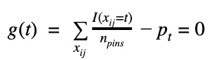
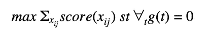
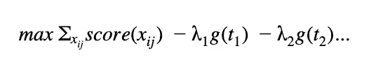
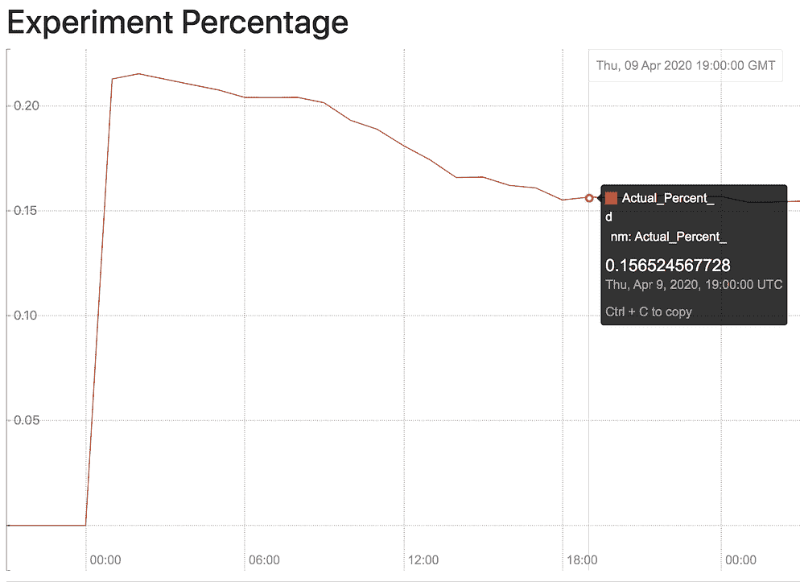
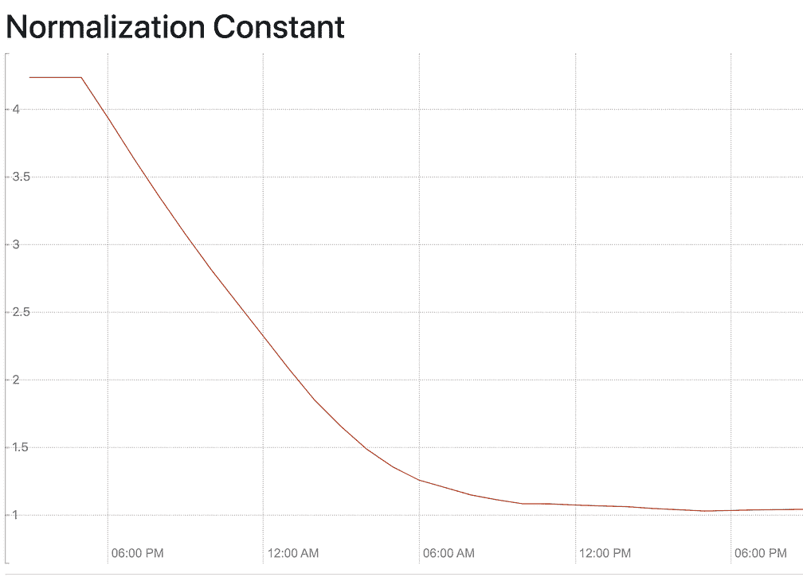
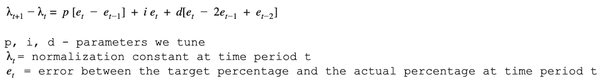
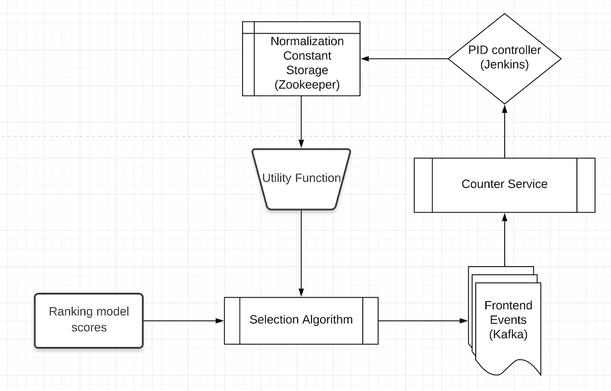
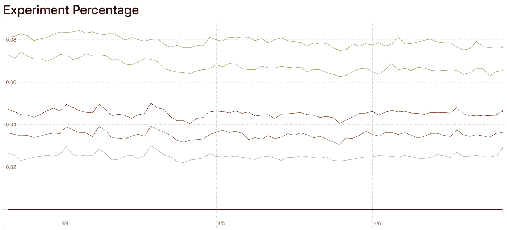

# 使用 PID 控制器来多样化家庭馈送上的内容类型

> 原文：<https://medium.com/pinterest-engineering/using-pid-controllers-to-diversify-content-types-on-home-feed-1c7195c89218?source=collection_archive---------0----------------------->

Yaron Greif |软件工程师，Homefeed 排名

每天都有数百万 Pinners 访问 home feed，在 Pinterest 上寻找灵感。作为 home feed 排名团队的一员，我的工作不仅是找出向 Pinners 展示哪些相关的 pin，还要确保这些 pin 将有助于维护整个 Pinterest 生态系统的健康。例如，相对于仅仅为了相关性而排名，我们可能会显示更多新创建的大头针，以确保我们的语料库不会变得陈旧，或者显示更多视频大头针，以展示创作者的可行想法。

传统的点击预测模型旨在最大化用户参与度，但它们无助于实现其他业务目标。为了解决这些其他目标，home feed 排名团队引入了**可控分发**，这是一个灵活的实时系统，在传统排名层之后应用，通过提高和降低内容类型的排名分数来控制相关性、新鲜度和创作者目标等领域之间的权衡。

# **背景**

在可控分发之前，我们通过代码库中的大量特例解决方案来解决那些业务约束。两个最常见的解决方案是简单地在大约每个 *n 个*槽中插入我们想要的更多内容，或者在 feed 上向上移动内容，直到返回的内容的最小百分比是特定类型。

出于实践和理论的原因，这些类型的解决方案是痛苦的。

在实践中，这些手动调整的增强很快变得难以控制，并相互干扰。更糟糕的是，随着时间的推移，他们经常停止工作——尤其是当排名模型更新时。我们经常不得不推迟非常有前途的新排名模型，因为它们打破了业务限制。

理论上，基于每个请求控制内容是不可取的，因为它阻止了个性化。如果我们向每个用户展示相同数量的视频引脚，我们就无法向真正喜欢看视频的人展示更多视频，反之亦然。

# **我们的解决方案**

可控分发用一个系统取代了那些硬编码的常量，在这个系统中，企业所有者可以为按内容类型划分的展示百分比指定一个全局目标。例如，如果 4%的源被设置为视频，则可控分发可以自动确定如何实现该分发，同时仍然尊重 Pinner 内容偏好。重要的是，可控分布实时地不断调整系统，因此它不会变得陈旧。

可控分发通过一个系统来实现这一点，该系统会跟踪过去视频占馈送内容的百分比，然后根据与目标视频的接近程度来提升或降低内容。这种提升是通过将排名系统的分数增加一个标量来实现的，我们称之为“归一化常数”

为了激励归一化常数，我们可以将 Pinterest 排名设置公式化为受可控分布所施加的约束的优化问题。归一化常数就是优化问题的拉格朗日量。

对于每个用户 *i* 槽 *j* 对，系统选择 pin Xij 以最大化排名分数。可控分布增加了一个约束，即每个引脚类型 *t* 都应构成进给的 Pt 百分比

优化问题就变成了:

拉格朗日形式是:

拉格朗日λ是我们的归一化常数。从经济角度来看，λ是选择 t 型销的影子价格或可接受的机会成本。我们愿意放弃预期约定的λ，以显示类型 *t.* 的销

上述优化问题在实践中是无法解决的，因为我们事先不知道将被排序的那组图钉。相反，在没有可控分布的情况下，通过贪婪地选择具有最高排名分数的引脚来近似解决方案。由于类型 *t* 的λ独立于用户和插槽，因此可以更新上述判定规则，以选择具有最高组合排序分数和归一化常数的管脚。

类型 *t* 的λ通过实时观察误差 *g(t)* 并相应调整λ来估算。

例如，在下面的实验中，我们希望某种类型的引脚的实际百分比为 15.5%。一开始很高，20%。当系统看到内容被过度分发时，它减少常数，最终百分比收敛到大约 15.5%。

我们使用 PID 控制器来寻找归一化常数。PID 控制器用于控制恒温器和巡航控制等日常系统。它们具有令人满意的特性，即它们不需要问题空间的模型就能工作。你的恒温器不需要知道你的窗户是否开着来维持你房子里的温度。同样，排名分数的分布也可能突然改变。因此，很难明确地对规范化常数和内容类型分布之间的关系进行建模。

相反，PID 控制器仅使用目标分布和实际分布之间的最近历史或误差来更新归一化常数。这些误差在实践中很容易存储。使用的算法是:

直观地说， *i* 项是上式中最重要的一项。如果我们显示多少内容有误差，我们就按比例增加我们的归一化常数。I 越大，我们的更新就越大。但是如果我的 T21 太大，我们就过头了。因此，我们需要 *p* 和 *d* 项根据误差项减少的速度来抑制我们的更新。

PID 控制器给我们带来的最大问题是，提升非常大的内容类型比提升小的内容类型需要不同的 *p、i* 和 *d* 项。但是根据内容类型调整 *p，i* 和 *d* 项是很难维持的。相反，我们发现，如果我们修改 PID 控制以在日志空间上工作，则相同的 PID 控制器适用于所有内容类型。

使用在线解决方案的一个很大的优势是，它可以很容易地扩展到处理没有过去数据的 AB 测试体验。相比之下，离线解决方案(例如使用前几周的数据来近似λ)必须等待数据生成。

**实施**

通过让[计数器服务](/pinterest-engineering/building-a-dynamic-and-responsive-pinterest-7d410e99f0a9)订阅前端印象的 Kafka 流，然后将集合存储在 RocksDB 中，可以跟踪错误术语。然后，PID 控制器从计数器服务中读取错误项的历史，并在 Zookeeper 中发布结果归一化常数，以供选择算法使用。PID 控制器被实现为每小时一次的 Jenkins 作业。

**进展如何**

在许多方面，该解决方案比预期的更容易实现。创建一个可行的 PID 控制器花费的时间比计划的要少。而且该算法很容易扩展到控制多种内容类型，这在设计审查期间是一个大问题。

然而，我们经常发现我们无法控制特定范围之外的内容。例如，我们可以将视频百分比定在 4%到 12%之间，但无法获得低于或高于该范围的视频。调试这些类型的问题是痛苦和乏味的，通常是由系统问题或遗留的硬编码常量引起的。

**影响**

可控分配被用于生产，并且已经被证明是非常有用的。它实现了最初的用例，即当模型被更新以实现业务约束时，允许模型被部署而没有代价高昂的延迟。我们还使用可控制的分布来反对遗留系统，例如“定期插入”，简化了代码并节省了大量工程时间。

我们还发现了超出最初预期的可控分发的新用例。例如，我们已经使用可控分发来测试不同内容类型的不同负载对系统的影响。下面我们使用可控分布来调整不同 AB 组的视频负载。

**下一步是什么**

传统上，Pinterest 和类似的网站将大部分建模工作都花在了检索和事件预测上。可控分布只是一个例子，说明了对排名分数进行建模和修改，以向 Pinners 和 creators 提供最佳结果是多么重要。

Pinterest 将在这个排名后的阶段继续投入，我们称之为 blending，向用户传递更好的励志内容。

*鸣谢:我们要特别感谢朱瑞民、李康南、张楠、Cosmin Negruseri 和 Ludek Cigler 对本项目的帮助*