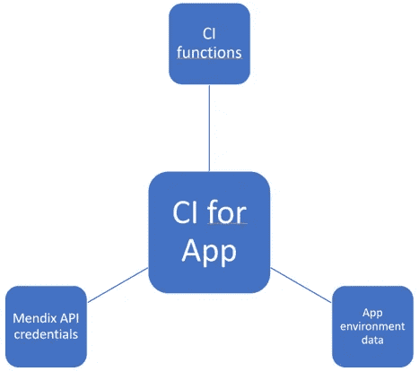
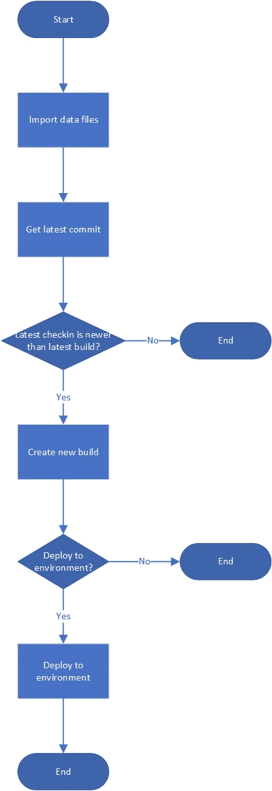
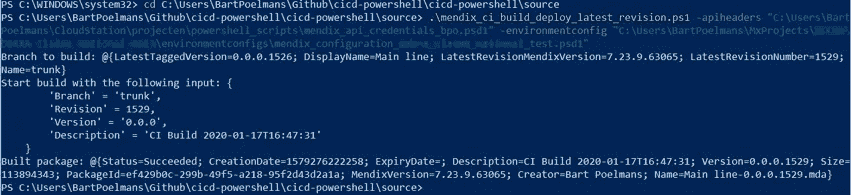
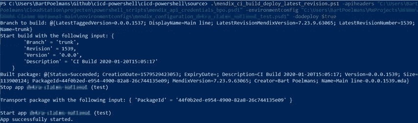
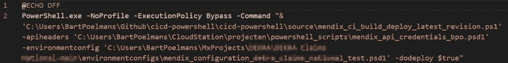
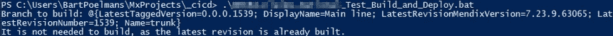

# 使用 PowerShell 在 Mendix 中应用 CI/CD

> 原文：<https://medium.com/mendix/using-powershell-to-apply-ci-for-mendix-35296748e800?source=collection_archive---------2----------------------->

Mendix 是一个构建各种大小应用程序的绝佳平台。Mendix 平台甚至为部署开发的 Mendix 应用程序提供了一个非常有用的服务门户。然而，所有这些都是手工完成的。必须有人手动创建部署包，然后将其部署到正确的环境中。当只有几个应用程序要部署时，这是可以的，但是当您构建越来越多的应用程序时，这就变得很麻烦了。这时，持续集成(CI)和持续交付(CD)为我们提供了更多的速度和控制。

# 如何用 Mendix 实现这一点

Mendix 提供了一个免费的 API 来与 CI 工具一起使用，也称为 Mendix Deploy API。所有功能的链接可以在[这里](https://docs.mendix.com/apidocs-mxsdk/apidocs/)找到。Mendix deploy API 具有为各种场景实现适当管道的所有功能。从检查新提交、构建新包到部署新构建的包。除了这些主要功能之外，还有更多功能可用于通过 API 配置完整的环境。想想常量、预定事件和自定义运行时设置。

# 让我们开始工作吧

在下面的示例中，我将使用 Windows PowerShell 作为为 Mendix 提供 CI 的工具。为什么选择 Powershell？首先，它预装在任何 Mendix 开发机器上，也就是 Windows 上。由于微软在开源社区中的贡献越来越大，PowerShell 的下一个版本 Powershell Core 也在其他操作系统中得到支持，如 Linux、macOS 甚至 ARM。这使得每个人都可以在本地和任何服务器上使用它，并有可能通过后台作业自动执行它。

我对它产生了兴趣，因为 PowerShell 示例已经出现在 [Mendix 文档站点](https://docs.mendix.com/apidocs-mxsdk/apidocs/example-implementation)上。这里提到的先决条件包括拥有当前的 Powershell，确保您可以使用'*Set-execution policy remote signed*'在您的系统上运行它，以及如何获得构建和部署应用程序的凭据。

现在，我想进一步增强脚本，使其更加模块化，并遵循一些最佳实践来共享脚本，而不损害安全性。所以我们把词的核心部分分开了。

The structure set up to keep a nice CI script that can be updated and shared.

1.  我们有一个脚本函数文件，其中包含所有的函数和逻辑，可以让它正常工作。这可以放在一些中央，像 Github 回购。
2.  我们有一个包含所有特定环境数据的脚本数据文件，可以在 CI 管道中使用。这可以放在你的应用程序的 Mendix 库里面。
3.  我们有一个带有 Mendix 凭证的脚本数据文件。你应该把这个留给自己。

通过将应用程序的脚本函数文件和脚本数据文件放在相应的存储库中，参与项目的每个人都可以自动完成更新。

# 一些关于文件的解释

脚本函数文件是完成工作最重要的文件，但它不包含关于应用程序和应用程序环境的数据和信息，也不包含任何安全细节。它包含了创建一个构建并将其部署到所选环境的所有功能。默认情况下，这将是 Test。

在撰写本文时，它包含四个参数。两个用于数据文件，两个用于脚本使用。我要直接部署吗？我是否希望在部署期间设置配置？后者仍在进行中。两者都是可选的，如果没有提供，则值被解释为“false”。

应用程序环境的脚本数据文件包含一些主要信息，例如，我们希望使用哪个分支进行构建，以及要部署到哪个环境。不久还包括了环境设置，如常数和预定事件。

Mendix API 凭证的脚本数据文件是不言自明的。

# 部署它的流程

The flow to get a new package deployed.

上面显示了在指定环境中进行新部署的步骤。第一个决定是为了增强性能，而不是每次为相同的版本创建一个新的构建。第二个是基于参数'-dodeploy '确定的。

# 让脚本在您的电脑上运行

请确保以管理员权限启动 PowerShell，以便可以执行该脚本。记住必需文件所在的绝对路径，并通过 PowerShell 控制台运行脚本。

Example with a build only.

Example with a build and a deploy.

# 自动化 it

现在我们已经设置了所有必要的方面，我们可以自动化它。创建一个批处理文件，用于计划任务(每 5 分钟一次)或在需要时双击。当然，请记住，这个批处理文件也不要在存储库中，除非您在批处理文件中共享相同的位置和文件名。现在你不需要去云门户，不需要等待，就可以走得更远。自动化可以为您每次部署节省 15 分钟或更多的时间，所以我建议如果可能的话，从一开始就这样做。

Example of batch file contents.

A test of the created batch file. It works!

# 接下来要做的事情

该脚本目前正在按照它应该做的那样工作。但是，我有一些可能会添加到脚本中的增强功能，比如为了可追溯性而记录到外部文件，以及设置环境配置。

我用来构建脚本和测试每个迭代的工具是 Powershell ISE 和带有 Powershell 扩展的 Visual Studio 代码。

我使用和更新的脚本可以在这里找到。该存储库还包括一些模板文件，可用于更改您的应用程序详细信息。

我希望你在项目的第一个 sprint 阶段花些时间做好准备，然后建立 CI-pipeline。这很简单，从一开始就能节省你很多时间。

再见！