# 使用 Prometheus 监控 Oracle 应用容器云上的应用

> 原文：<https://medium.com/oracledevs/using-prometheus-to-monitor-apps-on-oracle-cloud-7b75dea9f2f3?source=collection_archive---------0----------------------->

> 有关微服务主题的博客帖子的主目录，请参考—[https://medium . com/Oracle devs/bunch-of-microservice-related-blogs-57 b5 f1 f 062 e 5](/oracledevs/bunch-of-microservices-related-blogs-57b5f1f062e5)

监控很难..在生产中更是如此，如果生产环境恰好是*云*中的 *PaaS* 组件，情况就更是如此

*   您(通常)无法访问底层基础架构/容器/虚拟机
*   有太多的语言(多语言)，每一种都有无数的框架

有多种解决方案，其中**普罗米修斯**是一个(相对)新的但有前途的选择。借助一个简单的例子，这篇博客展示了如何使用 Prometheus 来监控在 [Oracle 应用容器云](https://cloud.oracle.com/application-container-cloud)上的 **Spring Boot** 应用

# 在我们开始之前…

..值得指出的是，Oracle 应用容器云支持以下基本结构

*   能够[使用 JFR 分析您的(Java)应用程序](https://docs.oracle.com/en/cloud/paas/app-container-cloud/dvcjv/java-mission-control-and-java-flight-recorder.html#GUID-70D59FA2-04D3-40B1-8F8E-8131300E25C7)并下载它们以供进一步分析
*   特定应用程序(每个实例)[内存指标](https://docs.oracle.com/en/cloud/paas/app-container-cloud/csjse/viewing-service-metrics-application.html)
*   访问[应用程序日志](https://docs.oracle.com/en/cloud/paas/app-container-cloud/dvcjv/retrieving-application-logs.html#GUID-19455093-3D4E-46AD-B203-37BA1BB51874)

# 让我们开始吧

> *Github 上有源代码*

[](https://github.com/abhirockzz/accs-prometheus-spring-boot-example) [## abhirockzz/accs-Prometheus-spring-boot-示例

### accs-prometheus-spring-boot-example-使用 Prometheus 监控 Oracle 应用程序容器上的 Spring Boot 应用程序…

github.com](https://github.com/abhirockzz/accs-prometheus-spring-boot-example) 

高级流程(和示例应用程序)非常简单

*   Prometheus 从 Spring Boot 应用程序(`HTTP GET`)中获取指标并存储它们(在本例中是本地存储)
*   然后，您可以使用 Prometheus UI 以图表的形式内省这些指标

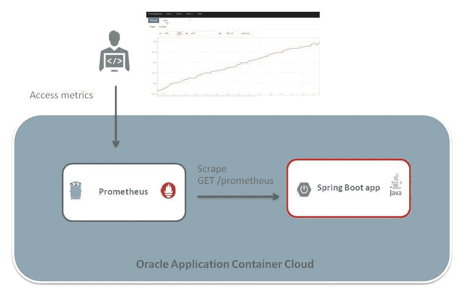

Solution overview

让我们探索一些重要的组件

## 普罗米修斯

这是一个开源监控服务，最初是由 *SoundCloud* 开发的

*   部分 [CNCF](https://cncf.io/)
*   支持时序数据模型和查询语言
*   与外部系统(如 Grafana 等)的集成挂钩。)

 [## 概述|普罗米修斯

### 一个具有维度数据模型、灵活的查询语言、高效的时间序列数据库…

普罗米修斯](https://prometheus.io/docs/introduction/overview/) 

## Spring Boot (+弹簧执行器)

我们的 Spring Boot 应用很简单，它使用`@RestController`公开了一个 REST 端点

Spring Actuator 使用 HTTP 端点自动启用应用程序监控部分

> *弹簧执行器(* `*spring-boot-starter-actuator*` *)暴露的端点有很多(如*`*info*`*`*health*`*`*dump*`*`*env*`*`*trace*` *等)。)，但是示例应用程序只激活了* `*metrics*` *端点，它公开了诸如 JVM 内存、线程、系统正常运行时间等信息。*****

**这些度量细节以 JSON 的形式公开——这不是普罗米修斯所理解的格式。因此，除此之外，示例应用程序使用适配器/转换器层，作为 Prometheus Java 客户端的*附加模块*提供。**

**它帮助将 Spring Actuator metrics info(最初是 JSON)转换成 Prometheus 可以使用的纯文本格式(默认情况下，它在`/prometheus`端点公开)**

**[](https://github.com/prometheus/client_java/tree/master/simpleclient_spring_boot) [## 普罗米修斯/客户端 _java

### 用于 JVM 应用程序的 client_java - Prometheus 检测库

github.com](https://github.com/prometheus/client_java/tree/master/simpleclient_spring_boot) 

下面的 Maven 依赖项是所有需要的

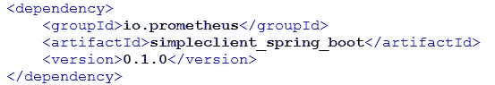

Maven dependency for Prometheus Spring Boot client

你需要做的就是使用注释(下面突出显示)来激活插件

```
[@SpringBootApplicatio](http://twitter.com/SpringBootApplicatio)n
[@RestController](http://twitter.com/RestController)
[***@EnablePrometheusEndp***](http://twitter.com/EnablePrometheusEndp)***oint*** [***@EnableSpringBootMetr***](http://twitter.com/EnableSpringBootMetr)***icsCollector***public class Bootstrap {public static void main(String[] args) {
 SpringApplication.run(Bootstrap.class, args);
 }
.....
}
```

这就是概述…现在是准备应用程序并将其发送到云的时候了** 

# **构建和部署**

**借助 Oracle Application Container Cloud，您在部署应用程序方面有多种选择。这个博客将利用 PSM CLI，这是一个用于管理 Oracle 云服务的强大命令行界面**

> ***其他部署选项包括*[*REST API*](https://docs.oracle.com/en/cloud/paas/app-container-cloud/apcsr/index.html)*[*Oracle 开发者云*](https://docs.oracle.com/en/cloud/paas/developer-cloud/csdcs/deploying-application-oracle-developer-cloud-service.html#GUID-6FE6D850-65DC-471D-A249-F7CCA9CAB56F) *当然还有* [*控制台/UI*](https://docs.oracle.com/en/cloud/paas/app-container-cloud/csjse/creating-application.html)***

**首先，在您的机器上下载并设置 PSM CLI(使用`psm setup` ) — [详情请见](https://docs.oracle.com/en/cloud/paas/java-cloud/pscli/using-command-line-interface-1.html)**

**从克隆 git repo 开始— `git clone [https://github.com/abhirockzz/accs-prometheus-spring-boot-example](https://github.com/abhirockzz/accs-prometheus-spring-boot-example)`**

## **构建 Spring Boot 应用程序**

*   **`cd [accs-springboot-app](https://github.com/abhirockzz/accs-prometheus-spring-boot-example/tree/master/accs-springboot-app)`**
*   **`mvn clean install`**

**构建过程将在`target` 目录中创建`accs-spring-boot-hello-world-dist.zip`**

## **将其推至云**

**`psm accs push -n SpringBootOnACCS -r java -s hourly -m manifest.json -d deployment.json -p target/accs-spring-boot-hello-world-dist.zip`**

> ***一旦执行，一个*异步*进程被启动，CLI 返回它的*作业 ID *，以便您跟踪应用程序创建***

**等待应用程序被创建，*记下它的 URL***

**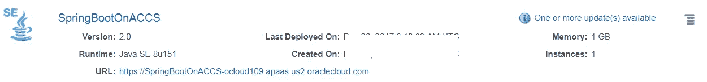**

**Simple Spring Boot app deployed to Oracle Application Container Cloud**

## **建造普罗米修斯服务器**

*   **`cd [prometheus-on-accs](https://github.com/abhirockzz/accs-prometheus-spring-boot-example/tree/master/prometheus-on-accs)`**
*   **从这里下载**普罗米修斯**并放入目录**

> ***有关最新发布版本，请参考下面的页面***

 **[## 下载|普罗米修斯

### 一个具有维度数据模型、灵活的查询语言、高效的时间序列数据库…

普罗米修斯](https://prometheus.io/download/)** 

> ***最后，你的目录结构应该是这样的***

**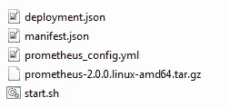**

**Prometheus artifacts**

*   **现在只需压缩/添加内容即可**

**在把普罗米修斯推到云端之前还有最后一件事…..**

## **更新普罗米修斯配置**

**编辑`prometheus_config.yml`文件，输入您在 Oracle Application Container Cloud 上的 Spring Boot 应用程序的 URL(您在上一步中部署的应用程序)**

**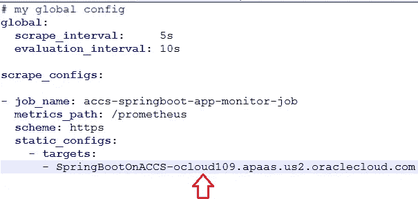**

**Replace this with the URL specific to your environment**

## **部署普罗米修斯服务器**

**只需一个命令，您就可以将 Prometheus 部署到 Oracle 应用容器云**

**`psm accs push -n PrometheusServer -r **golang** -e **dockerhub** -s hourly -m manifest.json -d deployment.json -p accs-prometheus-server.zip`**

**等待 Prometheus 服务器进行配置和引导**

****

**Prometheus on Oracle Application Container Cloud**

**单击应用程序名称导航至详细信息屏幕**

**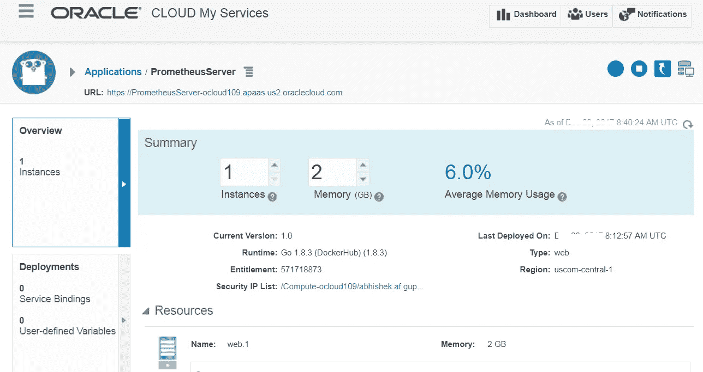**

**Prometheus server details**

# **试车**

**首先，让我们从几个健全性检查开始**

## **访问弹簧致动器指标端点**

**`curl -X GET [https://springbootonaccs-ocloud109.apaas.us2.oraclecloud.com/metrics](https://springbootonaccs-ocloud109.apaas.us2.oraclecloud.com/metrics)`**

**它应该返回一个带有度量信息和属性(如堆、线程等)的 JSON。**

**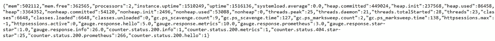**

**Spring Actuator metrics (JSON format)**

## **访问普罗米修斯端点**

**如前所述，弹簧执行器度量信息被转换成普罗米修斯(纯文本)格式，并在`prometheus` 端点上公开(默认)**

**`curl -X GET [https://springbootonaccs-ocloud109.apaas.us2.oraclecloud.com/prometheus](https://springbootonaccs-ocloud109.apaas.us2.oraclecloud.com/prometheus)`**

**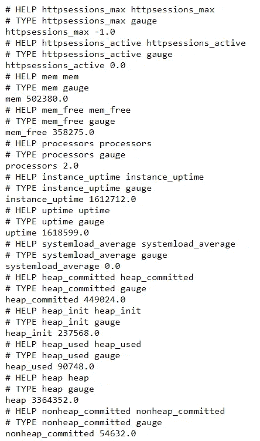**

**Metrics in Prometheus format**

## **检查普罗米修斯配置**

**访问 Oracle 应用容器云上的 Prometheus 服务器，打开其控制台，从**状态**菜单中选择**配置****

****目标**的值是您刚刚部署的 Spring Boot 应用程序，**度量 _ 路径**的值是 prometheus 格式的度量数据可用的端点**

**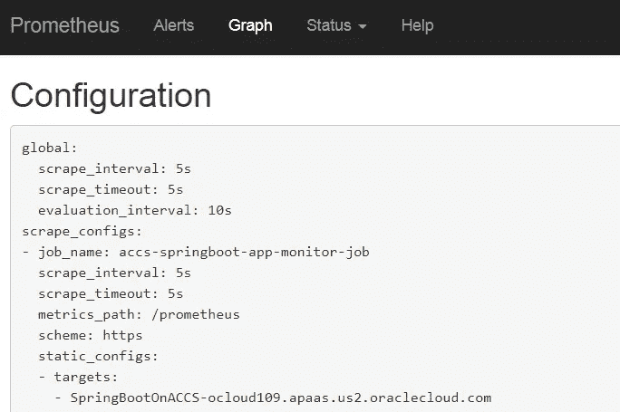**

**Prometheus configuration**

## **我的目标怎么样了？**

**在**状态**菜单下检查**目标**。您将看到 Spring Boot 应用程序已启动，正在被抓取以提取监控指标**

**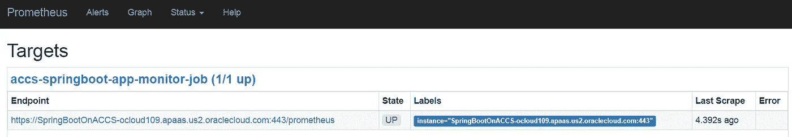**

**Prometheus target (Spring Boot app) status**

## **探索指标**

**在主页上，下拉列表显示了 Spring Boot 应用程序生成的所有可用指标，如类、堆等。**

**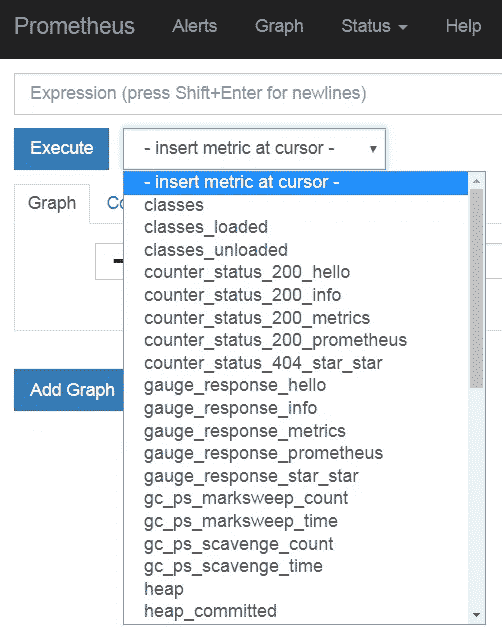**

**List of metrics extracted by Prometheus**

**有很多指标，但让我们快速看一下其中的几个— `used memory`、`free memory`和`used heap`**

**从 metrics 下拉列表中选择`mem`(JVM 使用的总内存)显示图表。这里我们看到，在 15 分钟的窗口中，内存利用率在增加**

**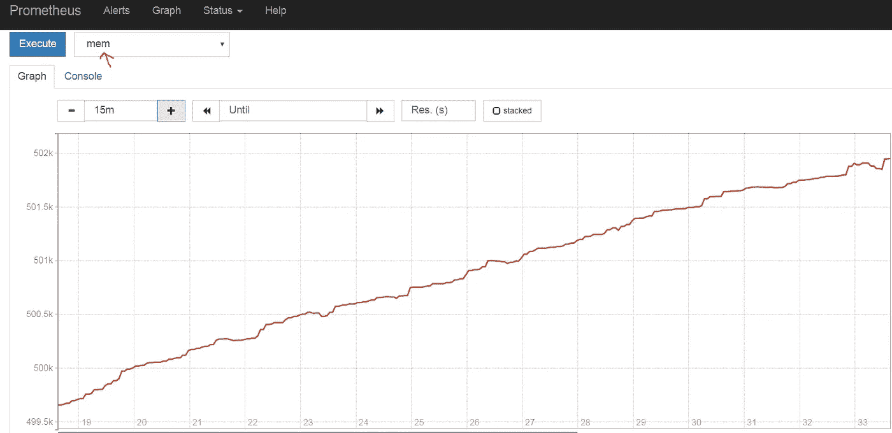**

**JVM utilized memory**

**通过分析，`mem_free`(JVM 的空闲内存)显示它呈下降趋势——这一点很明显，因为我们刚刚看到内存利用率在上升**

**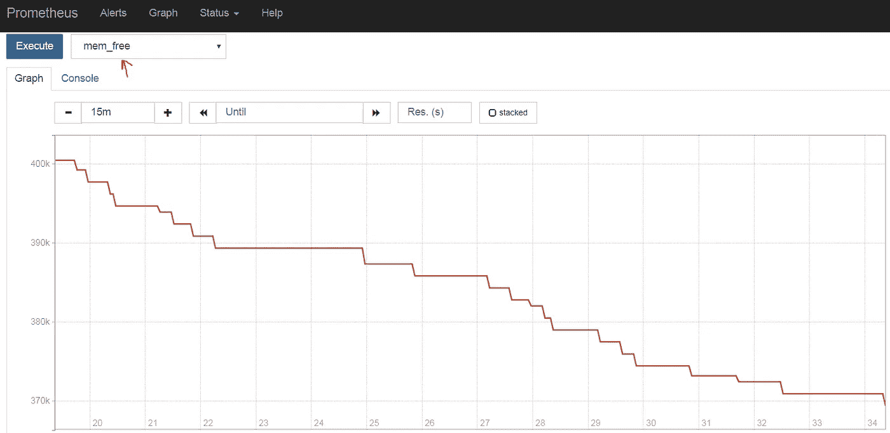**

**JVM free memory**

**堆的使用情况(使用`heap_used`指标很明显)是已用 JVM 内存的一部分(`mem`)。从图中可以明显看出，堆利用率(对于所选的 15 分钟时间窗口)呈上升趋势**

**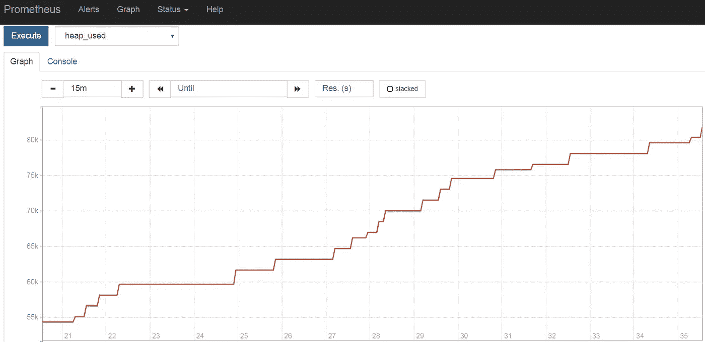**

**JVM heap utlization**

# **其他注意事项**

**有趣但未涉及的事情(也许是其他博客？)**

*   **自定义指标**
*   **非 Spring 应用程序**
*   **格拉夫纳集成**
*   **远程存储**

# **快速回顾一下我们做了什么**

*   **在 Oracle 应用容器云上部署 Spring Boot 应用**
*   **在 Oracle 应用程序容器云上部署 Prometheus 服务器(`golang` 运行时)**
*   **使用发送给 Prometheus 的指标监控 Spring Boot 应用程序(感谢 Spring Boot 执行器)**

**这篇博文到此为止！**

# **不要忘记…**

*   **查看 Oracle Application Container Cloud 教程—每个运行时都有适合的内容！**

 **[## Oracle 应用容器云服务—创建您的第一批应用

### Oracle 应用容器云服务教程。学习创建你的第一个应用程序。

docs.oracle.com](https://docs.oracle.com/en/cloud/paas/app-container-cloud/create-first-applications.html)** 

*   **关于应用程序容器云的其他博客**

**[](/tag/app-container-cloud/latest) [## 关于应用容器云的最新故事和新闻—中型

### 阅读关于应用容器云的最新文章。每天，成千上万的声音阅读、书写和分享重要的…

medium.com](/tag/app-container-cloud/latest) 

干杯！

> 本文表达的观点是我个人的观点，不一定代表甲骨文的观点。**