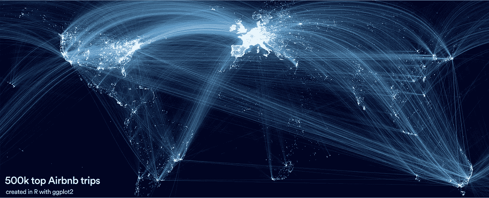
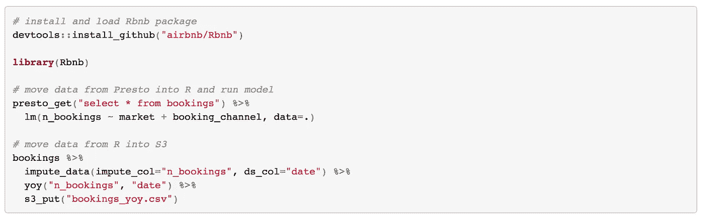
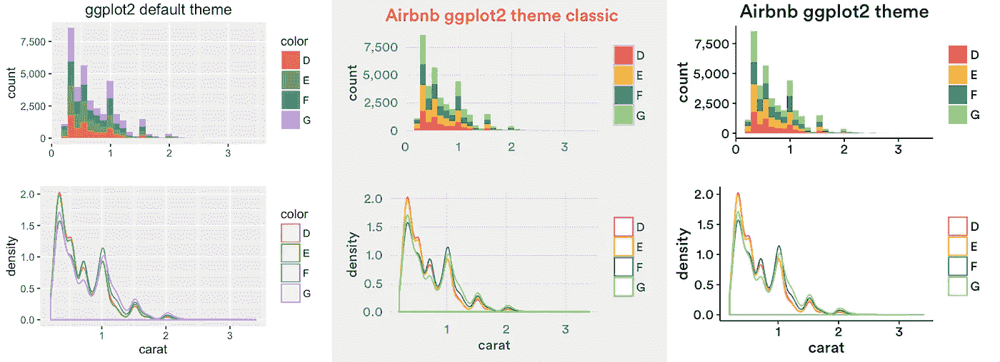
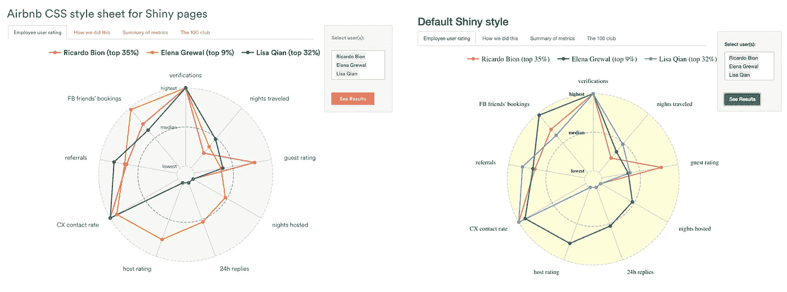
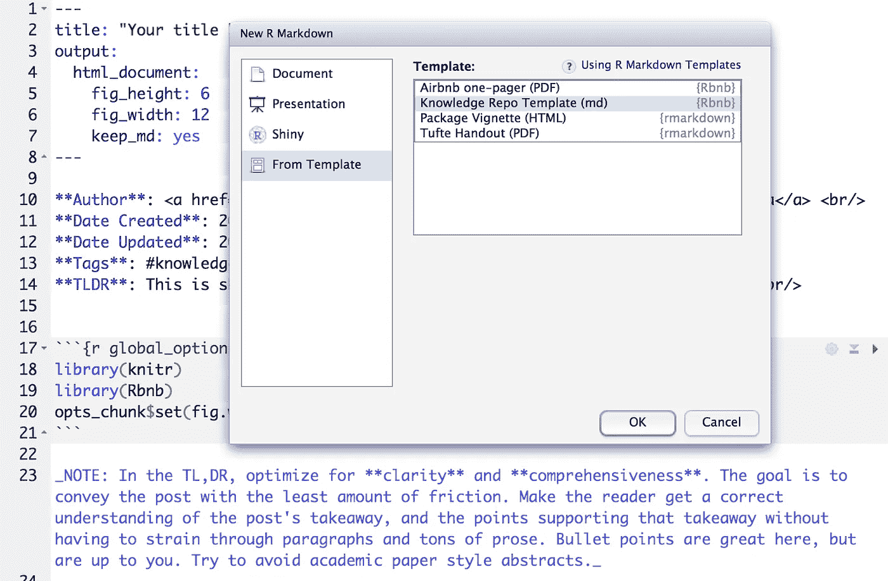
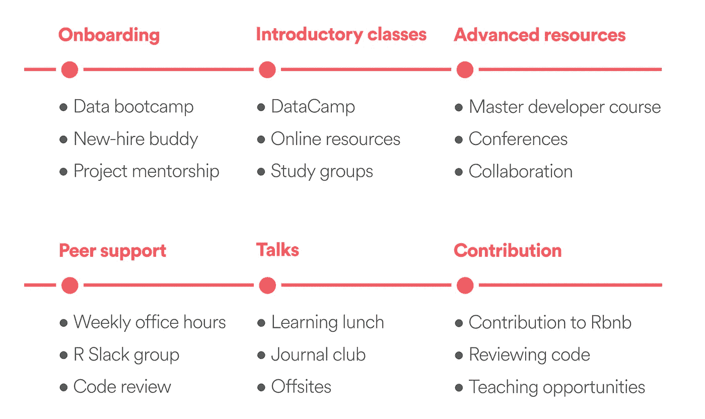

# 使用 R 包和教育来扩展 Airbnb 的数据科学

> 原文：<https://medium.com/airbnb-engineering/using-r-packages-and-education-to-scale-data-science-at-airbnb-906faa58e12d?source=collection_archive---------1----------------------->

作者[里卡多·比昂](https://twitter.com/ricardobion)

作为 Airbnb 的数据科学家，我最喜欢的事情之一是与多元化的团队合作，解决重要的现实世界问题。我们不仅在性别上[不同，而且在教育背景和工作经历上也不同。我们的团队包括数学和统计专业的毕业生，从教育到计算基因组学领域的博士，技术和金融领域的退伍军人，以及前职业扑克玩家和退伍军人。这种培训和经验的多样性是我们团队创造性思维和理解用户能力的巨大财富，但它也给协作和知识共享带来了挑战。到达 Airbnb 的新团队成员精通不同的编程语言，包括 R、Python、Matlab、Stata、SAS 和 SPSS。为了扩大协作和统一我们的数据科学品牌，我们依靠工具、教育和基础设施。在这篇文章中，我们将重点讲述我们在 Airbnb 构建 R 工具和教授 R 的经验。这些课程中的大部分也适用于 Python。](/airbnb-engineering/beginning-with-ourselves-48c5ed46a703)

我们的方法有两个主要支柱:包构建和教育。我们构建包来开发针对常见问题的协作解决方案，标准化我们工作的视觉呈现，并避免重新发明轮子。我们教育工作的目标是让所有数据科学家接触 R 和我们使用的特定软件包，并为那些希望深化技能的人提供进一步学习的机会。

# r 包

在小型数据科学团队中，个人贡献者通常编写单个函数、脚本或模板来优化他们的工作流。随着团队的成长，不同的人开发自己的工具来解决类似的问题。这导致了三个主要的挑战:(I)团队内部的重复工作，包括编写工具和审查代码，(ii)缺乏关于如何编写工具的透明性和缺乏文档，经常导致错误或不正确的使用，(iii)难以与其他用户共享新的开发，降低了生产率。

通过 Github Enterprise 共享的 R 包解决了这三个挑战，这使它们成为满足我们需求的绝佳解决方案。具体来说，(I)多人可以同时协作以改进工具和修复错误，(ii)贡献经过同行评审，以及(iii)新版本可以根据需要部署给所有用户。包是可复制 R 代码的基本单位。它们可以包括功能、文档、数据、测试、插件、简介和 R markdown 模板。大约两年前，我开始开发我们的第一个内部 R 包，叫做 Rbnb。它最初推出时只有几项功能。该软件包现在包括 60 多个功能，有几个活跃的开发人员，并被我们的工程、数据科学、分析和用户体验团队的成员积极使用。截至今天，我们的内部[知识回购](/airbnb-engineering/scaling-knowledge-at-airbnb-875d73eff091)已经有近 500 份 [R Markdown](http://rmarkdown.rstudio.com/) 研究报告使用了 Rbnb 包。

该包是在内部 Github 企业存储库中开发的。在那里，用户可以提交问题并提出改进建议。当新代码在分支中提交时，它由我们的 Rbnb 开发人员组进行同行评审。一旦变更被批准和记录，它们将作为包的新版本被合并到主代码库中。团队成员可以使用 [devtools](https://github.com/hadley/devtools) 直接从 Github 安装最新版本的 Rbnb。我们目前正在添加 [lintr](https://github.com/jimhester/lintr) 检查样式和语法，以及用 [testthat](https://github.com/hadley/testthat) 测试覆盖率。

该软件包有四个主要组成部分:(I)在我们的[数据基础设施](/airbnb-engineering/data-infrastructure-at-airbnb-8adfb34f169c)的不同位置之间移动数据的一致 API，(ggplot2 的品牌[可视化主题](https://github.com/ricardo-bion/ggtech)、比例和 geoms，(iii)不同类型报告的 R Markdown 模板，以及(iv)优化我们工作流程不同部分的自定义函数。

Rbnb 中最常用的函数允许我们将聚集或过滤的数据从 Hadoop 或 SQL 环境转移到 R 中，在 R 中可以更自然地进行可视化和内存分析。在 Rbnb 之前，将数据从 [Presto](https://prestodb.io/) 存储到 R 中以运行模型需要多个步骤。数据科学家必须使用他们的集群凭证进行身份验证，打开 SSH 隧道，输入 Presto 的主机、端口、模式和目录信息，下载一个 csv 文件，将该文件加载到 R 中，然后才运行所需的模型。现在，所有这些都可以通过[管道](https://github.com/smbache/magrittr)两个函数来完成，因为 Rbnb 负责所有的实现细节，同时与其他维护良好的包如 [RPresto](https://github.com/prestodb/RPresto) 一起工作。类似地，从 R 获取数据并将其转移到亚马逊 S3 只用一行代码就可以完成。数据科学家不再需要保存来自 R 的 csv 文件，使用我们的 API 密钥设置多因素身份验证，配置 AWS，并运行 bash 命令将 csv 文件移动到远程存储。更重要的是，所有函数都遵循类似的规范(即***【place _ action(origin，destination)*** )。

如果我们的数据基础设施发生变化——例如，如果一个集群移动或者我们的亚马逊 S3 认证细节发生变化——我们可以在不改变功能接口的情况下改变我们的 Rbnb 实现。

*Figure 1\. Sample code showing a few functions from Rbnb, our internal R package. All functions follow a similar specification, go through comprehensive code review, and substantially improve our workflow by abstracting away common tasks.*

该软件包还通过使用一致的数据可视化风格帮助我们在 Airbnb 上推广我们的工作——参见 [Bar Ifrach](/airbnb-engineering/how-airbnb-uses-machine-learning-to-detect-host-preferences-18ce07150fa3#.rx4kj4ntg) 和 [Lisa Qian](/airbnb-engineering/how-well-does-nps-predict-rebooking-9c84641a79a7#.1ulo05cgr) 的这些帖子。我们为 ggplot2 构建了自定义主题、比例和 geoms，为 [htmlwidgets](http://www.htmlwidgets.org/) 和 [Shiny](http://shiny.rstudio.com/) 构建了 CSS 模板，为不同类型的报告构建了自定义 R Markdown 模板。这些功能用与 Airbnb 品牌一致的字体和颜色覆盖 R 默认设置。

*Figure 2\. Airbnb branded themes and scales for ggplot2\. These extensions create a consistent internal data science brand, and can be found on* [*Github*](https://github.com/ricardo-bion/ggtech)*.*

*Figure 3\. Airbnb branded CSS style sheet for Shiny exploring employee Airbnb usage. These style sheets give our internal tools an aesthetic that is consistent with the Airbnb.com website, making them more familiar and engaging to users.*

*Figure 4\. Airbnb branded R Markdown template. These templates include the main requirements of different types of reports.*

Rbnb 包还有几十个我们创建的函数，用于自动执行常见任务，如输入缺失值、计算逐年趋势、执行常见数据聚合以及重复我们用来分析实验的模式。向包中添加新功能可能需要一些时间，但从长远来看，这种初始投资是值得的。通过使用相同的 R 包，我们开发了一种公共语言、可视化风格，以及作为构建模块的同行评审代码的基础。

# **教育**

如果人们不知道如何使用工具，你制造多少工具都没有用。经过一段时间的[快速增长](http://venturebeat.com/2015/06/30/how-we-scaled-data-science-to-all-sides-of-airbnb-over-5-years-of-hypergrowth/)，我们开始为新员工和现有团队成员组织为期一周的月度数据训练营。它们包括 3 小时的 R 工作坊，以及用 R 语言编写的训练营项目和用 R Markdown 语言编写的[的可选导师。](/airbnb-engineering/scaling-knowledge-at-airbnb-875d73eff091)

bootcamp R 类侧重于 Rbnb 包和用于重塑和操作数据帧( [tidyr](https://github.com/hadley/tidyr) 和 [dplyr](https://github.com/hadley/dplyr) )、可视化数据( [ggplot2](https://github.com/hadley/ggplot2) )以及编写动态报告( [R Markdown](https://github.com/rstudio/rmarkdown) )的通用 R 包。我们在上课前几天给参与者提供学习指南和材料。在课堂上，我们使用自己的数据完成了一个结构化的教程，包括我们在工作中经常遇到的挑战。

这种方法允许不熟悉 R 的用户在几个小时内开始编码，而不必担心更高级编程的复杂性。我们还向用户介绍了我们内部的[风格指南](http://adv-r.had.co.nz/Style.html)和许多有用的 R 包，比如[格式表](https://github.com/renkun-ken/formattable)、[绘图器](https://github.com/rich-iannone/DiagrammeR)和[扫帚](https://github.com/dgrtwo/broom)。最后，我们指导他们如何找到帮助和在线资源。

训练营结束后，我们鼓励用户继续学习。我们为[数据营](https://www.datacamp.com/courses)的个人会员提供赞助，并帮助团队成员围绕自定进度的交互式在线课程组织学习小组。我们还让新员工与有经验的同事配对，让他们担任导师。这些导师带领新团队成员完成他们作为数据科学家的第一次贡献。我们有一个内部的松弛通道，用户可以在其中提出任何与 R 相关的问题，并组织定期办公时间，有经验的开发人员可以帮助解决更复杂的编码挑战。我们的团队成员组织学习午餐和课程，主题包括 SparkR、R 对象系统和包开发。最近，四名团队成员参加了由 RStudio 组织的 Master R 开发者研讨会，并在会后与团队分享了他们所学到的东西。

我们也鼓励数据科学团队的成员向 Rbnb 贡献代码。通过全面的代码审查过程，用户可以开发对未来项目有价值的新技能。此外，他们感觉自己拥有一个重要的内部工具，并看到自己的贡献如何有利于同事的工作。我们在最佳实践、功能文档、测试和风格方面指导新的贡献者。

我们还与 Airbnb 之外更广泛的 R 社区合作。我们赞助像即将到来的 [rOpenSci Unconf](http://unconf16.ropensci.org/#sponsors) 这样的会议，为开源项目做贡献(例如 [ggtech](https://github.com/ricardo-bion/ggtech) 、 [ggradar](https://github.com/ricardo-bion/ggradar) ，并在像 [Shiny 开发者大会](https://www.rstudio.com/shinydevcon)和[用户大会](http://user2016.org/)这样的会议上发表演讲。去年，我们有幸邀请了一些有影响力的研发人员参观我们在旧金山的总部，包括 [Hadley Wickham](https://twitter.com/hadleywickham) 和 [Ramnath Vaidyanathan](https://twitter.com/ramnath_vaidya) 。

*Figure 5\. R education at Airbnb. The tools we develop become more impactful with structured learning resources.*

# **基础设施**

除了工具和教育，我们还投资于强大的数据基础设施。自三年前我们的服务器首次启动以来，我们闪亮的应用程序已经有近 10 万次页面浏览量。我们最近开始支持新的 [RStudio 服务器](https://www.rstudio.com/products/rstudio/download-server/)和 [SparkR](https://spark.apache.org/docs/1.6.0/sparkr.html) 集群。我们有一个单一的[主厨配方](https://docs.chef.io/recipes.html)，R 包和版本控制跨我们集群中的所有机器，允许快速更新和大规模部署。

# **总结**

强大的 R 工具、持续教育、R 社区的参与以及强大的数据基础设施帮助我们的数据科学团队不断壮大。自从我们在近两年前开始这个项目以来，我们已经看到以前从未开发过 R 的团队成员转变为强大的 R 开发人员，他们现在向我们的新员工教授 R。我们已经建立的基础允许我们雇用广泛的数据科学家，分享增长思维和学习新技能的兴奋感。这种方法帮助我们建立了一个多元化的团队，为我们的工作带来了新的见解和视角。

Rbnb R 包的创建启发了我们的 Python 开发人员发布了一个面向数据科学家的内部 Python 包，名为 Airpy。我们的开发人员相互协作，使得这些包具有相似的界面和功能集。我们鼓励团队成员为 Rbnb 和 Airpy 贡献代码，我们共同努力开发更有效的教育资源和工具来增强我们团队的能力。今天，我们团队中的许多成员都精通 R 和 Python，并且能够用这两种语言审查和编写可靠的代码。在最近对我们团队 66 名成员的调查中，我们发现 80%的数据科学家和分析师在使用 R 进行数据分析时更接近“专家”而不是“初学者”，尽管只有 64%的人使用 R 作为他们的主要数据分析语言。同样，47%的团队成员认为自己在使用 Python 进行数据分析方面更接近“专家”而不是“初学者”，尽管只有 31%的人将 Python 作为他们的主要数据分析工具。剩下的 5%说他们使用两种语言的比例差不多。我们致力于建立一个平衡的团队，拥有使用两种语言的优秀开发人员，在招聘过程中不会偏向任何一方。这是另一种方式，通过这种方式，技能、经验和背景的多样性有助于增加我们团队的影响力。

感谢[珍妮·布莱恩](https://twitter.com/JennyBryan)、[米恩·切廷卡亚-伦德尔](https://twitter.com/minebocek)、[斯科特·张伯伦](https://twitter.com/sckottie)、[加勒特·格罗勒蒙德](https://twitter.com/StatGarrett)、[阿米莉亚·麦克纳马拉](https://twitter.com/AmeliaMN)、[希拉里·帕克](https://twitter.com/hspter)、[卡蒂克·拉姆](https://twitter.com/_inundata)、[哈德利·威克姆](https://twitter.com/hadleywickham)，以及 [Airbnb 工程和数据科学](https://twitter.com/AirbnbNerds)团队对本文早期版本的评论。

## 在 [airbnb.io](http://airbnb.io) 查看我们所有的开源项目，并在 Twitter 上关注我们—[@ Airbnb eng](https://twitter.com/AirbnbEng)+[@ Airbnb data](https://twitter.com/AirbnbData)