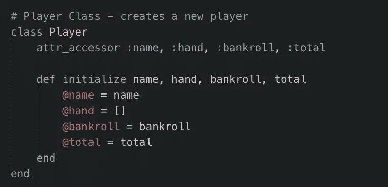
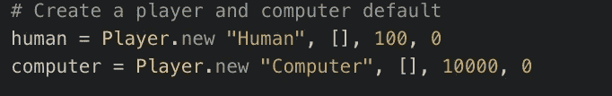
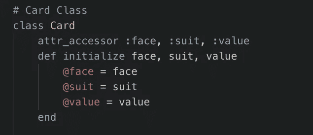
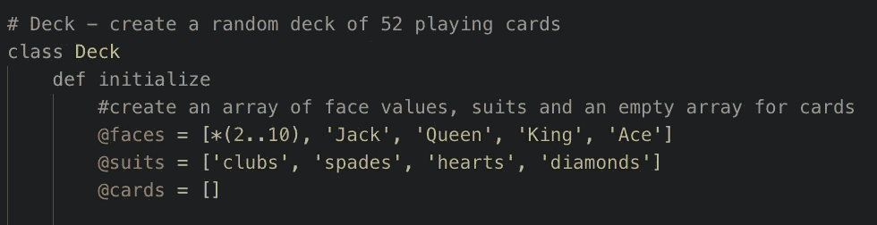
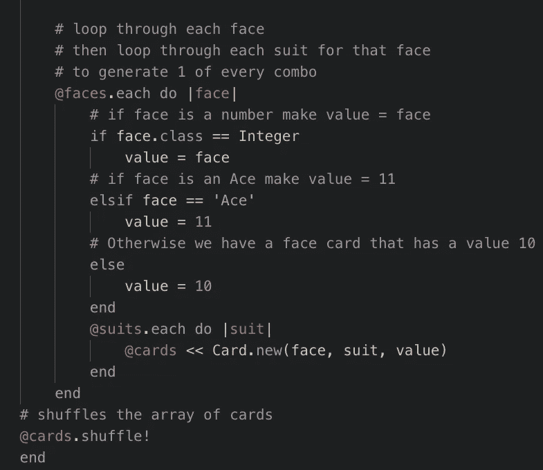
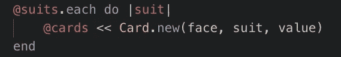
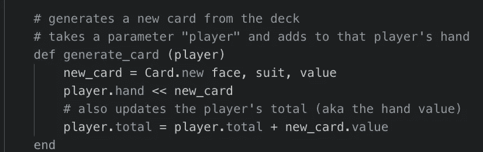
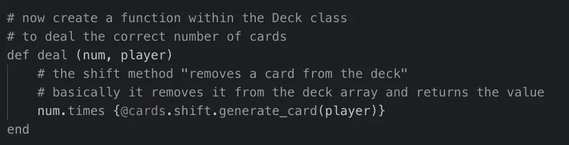
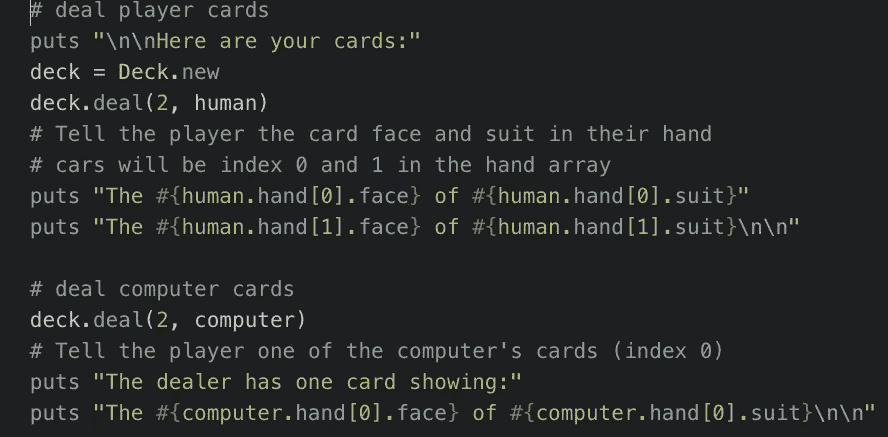

# 使用 Ruby 类实现 21 点游戏

> 原文：<https://medium.com/quick-code/using-ruby-classes-to-implement-a-game-of-blackjack-535a786c417?source=collection_archive---------2----------------------->

Ruby 是一种面向对象的编程语言，这意味着它有类和对象。类是我们用来定义对象的属性和行为的模型。这方面的例子有很多，比如汽车是一个具有品牌、型号和颜色等属性的对象，以及 drive()和 break()等行为。汽车的类别决定了使用的型号，例如，一个单独的对象将是我的红色本田思域。驱动(假)

为了更好地说明这一点，我将举一个我在最近的课堂项目中使用的例子:为一副 52 张牌设计一个数据结构，使用类来实现 21 点。在 Gayle Laakmann McDowell 的第六版《破解编码面试》中，我也看到了这是一个用于工作面试的编码挑战的例子，所以说这是一个流行的例子是一种保守的说法。

这个游戏有两个部分。第一个是为玩家、卡牌和卡片设置类。第二个是实际的游戏逻辑，包括终端提示和基于用户输入或输赢场景运行的 if 语句。出于本文的目的，我将把重点放在设置类上。

我创建的第一个类是“Player”。我最初是通过创建“玩家”和“庄家”类开始的，但很快意识到这是多余的。

我使用了“attr_accessor”，这是一个 Ruby 方法，它允许我在程序的其他地方更新这些对象的某些属性(名字、手牌、资金和总数)。

“def initialize”是一个函数，它允许我使用提供的属性基于这个模型创建一个新的对象。

Player Class — creates a new player

在这种情况下，“名称”将是用户提供的名称(或我创建的默认名称)，“手牌”将是一个空数组，我们稍后可以将卡对象推入其中，“资金”将是玩家当前拥有的钱数(他们每手牌可以赢钱和输钱)，“总数”将是玩家手牌的总价值。我们稍后将需要这个值来决定赢的情况:有一手总价值不超过 21 的最高牌。

Created two players

如您所见，我首先创建了一个手空(空数组)的人类玩家，银行中有$100，总手值为 0。

我还创建了一个空手(空数组)的电脑玩家，银行里有$10000，总手值为 0。

他们空手怎么玩？不用担心，还记得 attr_accessor 吗？这意味着我们可以在以后更新这些属性。

接下来，我们要创建我们的卡片类。这将是我们用来生成具有脸、花色和价值属性的个别牌的内容(记住，我们需要知道牌的价值来计算玩家手牌的总价值)。

Card Class — Creates A New Card

所以现在我们有了“卡”类，我们可以开始生成新的卡，就像我们对玩家做的那样，对吗？

嗯，没那么简单。我们需要生成 52 张牌，有 13 个等级，每个等级四张，每种花色一张。想象一下，如果我必须手动创建每张卡，那会有多乏味？谢天谢地，我不用。我可以创建另一个名为 Deck 的类来为我们生成这些卡片，然后使用该类来初始化我的卡片对象。每张牌实际上都是在创建一副牌时创建的，并从该副牌继承其属性。

现在是有挑战性的部分，初始化甲板。我首先简单地创建了三个数组:一个用于牌面，一个用于花色，还有一个空数组用于存放初始化后的所有牌。

您可能会注意到，对于 faces 数组，我有一个前面带星号的数字范围。如果你像我一样是 Ruby 新手，你可能对这个方法不熟悉，但是它叫做“splat ”,非常棒！[它有许多用途](https://www.honeybadger.io/blog/ruby-splat-array-manipulation-destructuring/)，其中之一是将一系列数字分解成单独的列表项。

Create a class “Deck”

接下来，我们需要创建我们的一副牌，但我们需要确保每种面值有四张牌，每副牌中有一种花色。我们可以通过迭代每个面，然后对每个面，迭代每个花色(循环中的循环)来实现这一点。

Loop through faces, then loop through suits

当我们遍历每个面值时，我还包含了一个 if 语句来根据面值确定卡的价值。如果面是一个数字或整数，我们希望值等于该数字。Ace 的值应该是 11(对于特殊情况，我们可以稍后将该值更改为 1)。其他每张脸牌(国王、王后和 j)的值都是 10。

接下来，对于每张脸，我们还将循环四种花色并创建一张新牌。

Pushing the newly created card into the cards array

认识语法吗？我们创建新卡的方式与创建新玩家的方式相同，只是这一次我们是在一个循环中完成的，所以这一行代码将运行 52 次并生成 52 个卡对象。我们使用这些<

现在我们有了自己的牌组，我们希望其中的牌被随机化。在真正的纸牌游戏中，我们会洗牌。在 Ruby 中，我们可以用@cards.shuffle 来洗牌！(结尾的感叹号表示原对象将被永久转化。)很酷吧？

现在，我们如何将这些牌发给我们的玩家，并有效地将这些牌添加到他们的牌组中？

为此，我使用了两个协同工作的函数，一个在名为“deal”的 Deck 类中，另一个在名为“generate_card”的 Card 类中。

让我们先浏览一下生成卡功能。

Function created to generate a card

为了让这个函数正常工作，我需要首先知道谁在收卡，所以我需要一个名为“player”的参数。

使用与前面相同的语法，我将创建一张有脸、花色和值的新卡(我将从牌组中收到)。

接下来，我将把新卡推到指定玩家的手中

最后，当我添加新卡时，我需要更新玩家手牌的总值。我只是让总数等于原来的总数加上新卡的价值。我也可以这样写(player.total += new_card.value)。

现在，我将在我的 Deck 类的 deal 函数中调用这个函数。

Creating a deal function to remove a card from the deck and add the card to the player hand

发牌函数需要两个参数，发牌的牌数和发牌的玩家。我本可以在游戏逻辑中按照需要的次数调用这个函数，而不是获取发牌的数量，但是这样写有点枯燥。

我使用了 Ruby 的 shift 方法，该方法从数组中移除第一个项目并返回该项目，以有效地从牌叠中取出一张牌，并将其放在玩家手中。我在这里调用了 generate_card 函数，用我从牌组中取出的牌的属性为玩家创建新的牌。

num.times 将决定这种情况发生的次数。

下面是我在游戏逻辑中如何调用这个函数的例子。

Examples of the deal function used in the gameplay logic

我用 deck.deal(2，人类)给人类玩家发了两张牌。然后我可以参考下面的卡片，索引为 0 和 1。我使用 deck.deal(2，computer)来处理计算机卡，然后向玩家展示其中一张。

后来，我使用了一些逻辑，允许玩家“打”牌或增加更多的牌，但这非常简单，因为我可以使用相同的 deck.deal()函数。

我希望你喜欢这篇关于如何用 Ruby 类设置 21 点游戏的教程。将来我可能会写第二部分来讨论实际的游戏性和控制台提示。