# 利用情感评分评估客户服务质量

> 原文：<https://medium.com/airbnb-engineering/using-sentiment-score-to-assess-customer-service-quality-43434dbe199b?source=collection_archive---------1----------------------->

基于人工智能的情感模型如何补充净推介值

由、[米娅赵](/@cenzhao06)、[倪媛媛](/@chloe.yuanyuan.ni)

在大多数面向客户的行业中，净推介值(NPS)是一个广为接受的客户满意度衡量指标。我们利用 Airbnb 的 NPS 来帮助衡量我们通过客户服务为我们的客人和主人社区提供的服务。但是 NPS 有两个主要缺点:1) NPS 是稀疏的，只有一小部分用户对调查作出回应，2) NPS 是缓慢的。至少需要一个星期才能有结果。Airbnb 在我们的核心产品和客户服务产品中大量使用 A/B 测试。在 A/B 测试领域，看到结果和解释实验花费的时间越长，迭代我们客户服务质量的时间就越长。这就是为什么我们需要一个更加敏感的指标。

为了解决这些限制，Airbnb 开发了一种基于人工智能的情感模型，以补充 NPS。情感模型处理用户发送给客户支持(CS)代表的消息，以提取反映用户情感的信号。与 NPS 相比，情感评分具有以下优势:

*   更高的*覆盖率*:我们不局限于那些提交调查的人，因此在一个给定的实验中，更多的用户注册了这个指标的值；
*   更好的*灵敏度*:在进行实验时，达到统计显著性需要更少的时间；
*   *因果关系*与长期客户忠诚度:我们可以将用户情感得分“转化”为长期商业价值。

这篇博客文章提供了关于我们如何开发情感模型和聚集原始情感分数来衡量客户情感的指标的见解。我们利用熵平衡( [Hainmueller，2012](https://web.stanford.edu/~jhain/Paper/eb.pdf) )创建了一个反事实组，以检测情绪指标和未来收入之间的关系。从我们的研究来看，我们显示了比 NPS 更好的情感度量结果。

# 情感模型开发

情感分析是衡量消费者对特定产品或服务的感觉的一个很好的方法。在 Airbnb 的客户支持中，我们的客人和主人的意见是我们打造更好的产品和服务的重要信号，并根据我们的社区做出改变。。

在客户支持领域开发情感模型时，我们面临两个主要挑战。

*   **歪斜** **数据** *:* 大部分文字输入在情绪上都是负面的。与给主人留下评论或信息不同，客人在遇到 Airbnb 问题时通常会联系客户支持。
*   **多语言输入:**Airbnb 的客服支持超过 14 种语言。主持人和来宾可能在同一个支持票证中使用不同的语言进行交流。

为了制作适合我们用例的情感模型，我们为客户支持消息开发了**定制评级指南**，以使我们的模型了解特定领域的知识和上下文信息。下面的例子说明了同样的消息作为 CS 消息与社交媒体帖子或 App Store 评论呈现时，标签是如何不同的。在 CS 领域，我们关注客户“认为”问题作为积极*迹象得到解决的程度，以及他们“认为”问题作为消极*迹象令人沮丧的程度。

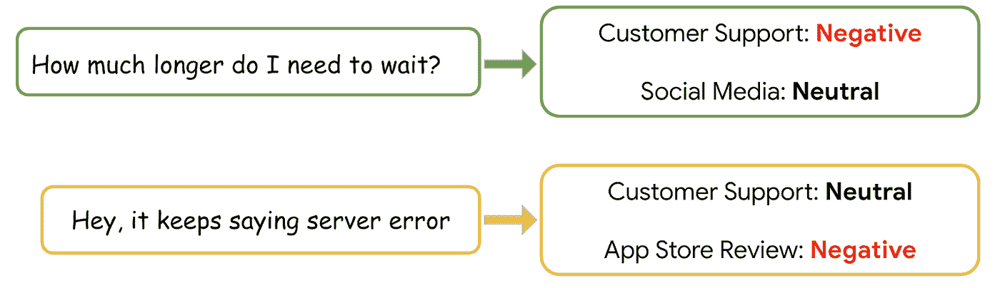

我们通过使用 ML 模型和使用新标记数据的再训练模型对人类注释的采样数据进行多次迭代来解决数据偏斜。第一轮注记基于随机采样进行，而后续注记数据集基于现有模型预测进行分层。这导致用于训练的更平衡的数据集。

我们构建并测试了两个深度学习架构，两者都支持多语言推理:

*   [WIDeText](/airbnb-engineering/widetext-a-multimodal-deep-learning-framework-31ce2565880c) 使用基于 CNN 的架构来处理文本通道，而所有分类特征都通过 WIDe channel 进行处理。
*   [XLM-罗伯塔](https://arxiv.org/pdf/1911.02116.pdf)使用基于 transformer 的架构，并利用预先训练的多语言模型，以 14 种语言训练 CS 消息。。

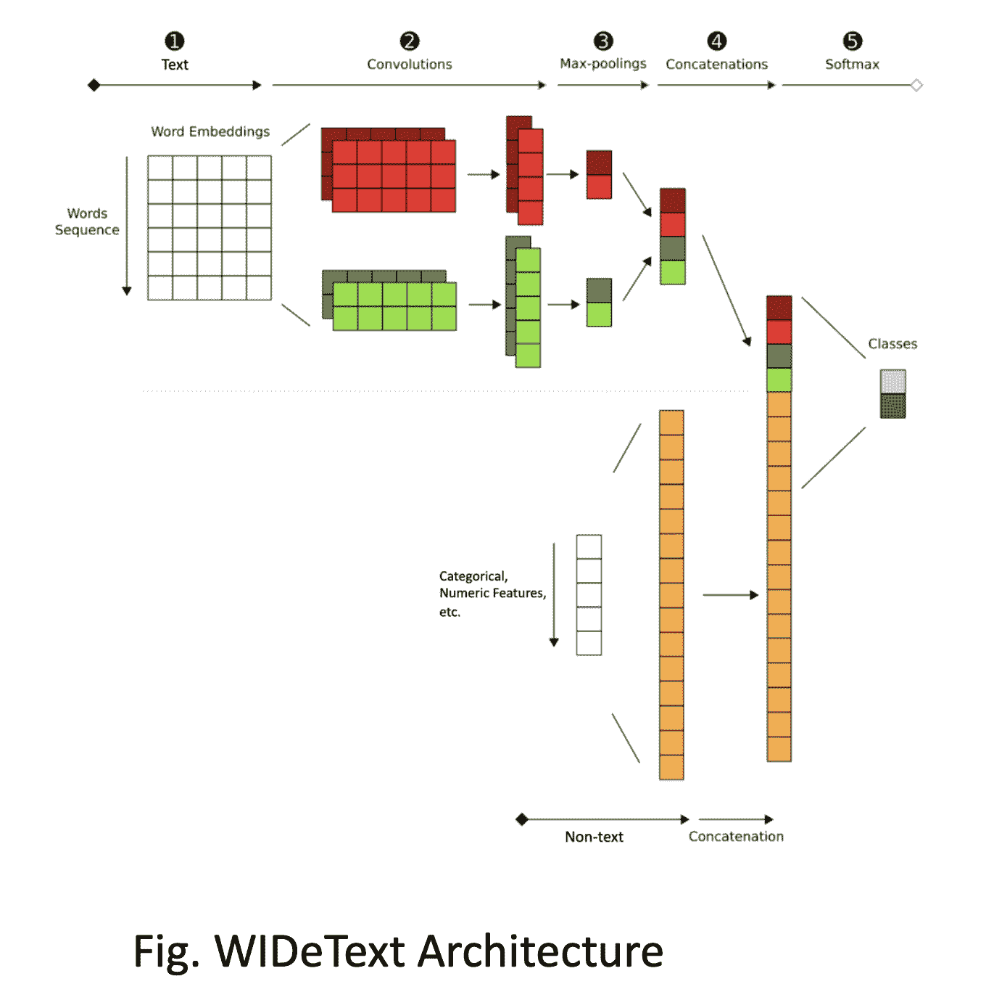

WIDeText Architecture

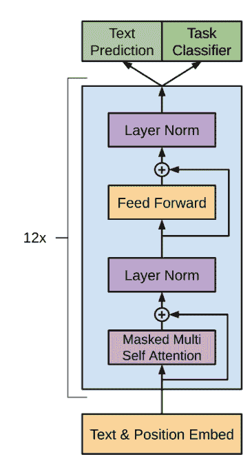

Transformer Architecture

基于 Transformer 的模型在英语情感分析上取得了稍好的性能，在不常用的语言上取得了好得多的性能。我们为产生式推理管道选择了基于转换器的分类器。

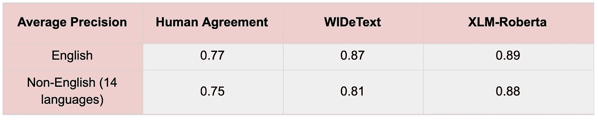

# 情感指标开发

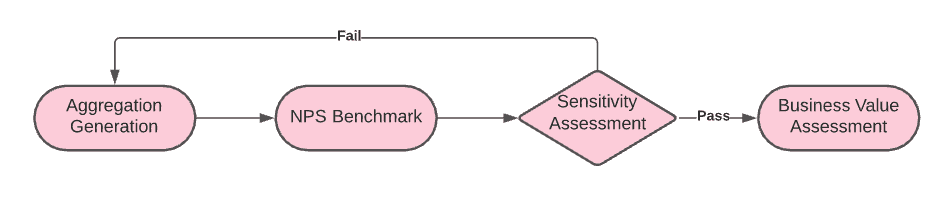

根据原始情感得分，我们开发了情感指标，旨在优化以下标准:

*   与 NPS 密切相关
*   实验的敏感性
*   可证明的与长期业务收益的因果关系

# 与 NPS 的相关性

尽管 NPS 有局限性，但它仍然被认为是用户情绪的黄金标准。希望使现在更加敏感和稳健的情绪度量与 NPS 很好地相关。我们测试了各种方法来设计指标，通过聚合消息级原始情感得分(例如，平均值、临界值、斜率)来与 NPS 相关联。

下面的两个图表说明了情绪得分和 NPS 与客人和主人情绪之间的良好相关性。

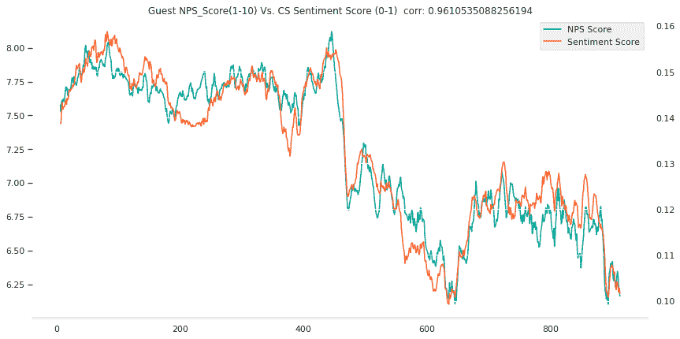

游客样本的 NPS(绿色)与情感指标(橙色)

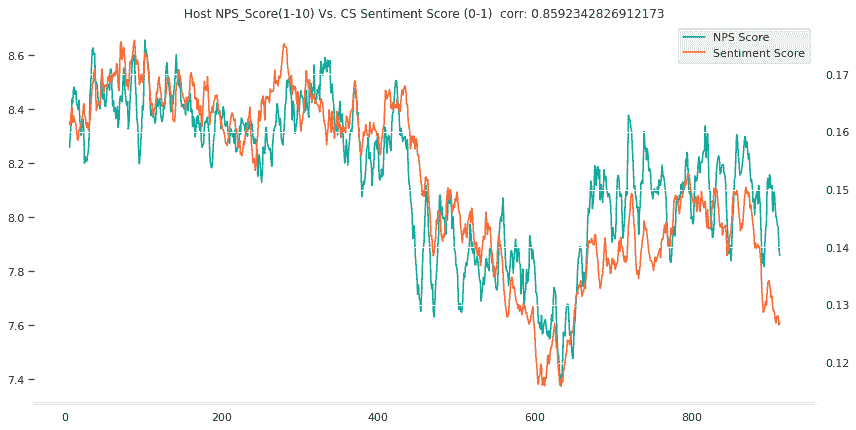

主机样本上的 NPS(绿色)与情感指标(橙色)

# 实验的敏感性

我们回顾了两种过去的实验(场景 1 和 2 ),以比较 NPS 和情感度量之间的实验灵敏度。目标是确定情感度量是否可以响应于用户情感转变而提供更快或更准确的反馈。

## 场景 1

在第一种类型的实验中，新产品/服务功能损害了来自用户研究的用户体验(例如，服务需要额外的步骤来联系支持代理)，然而这些功能在 NPS 中没有显示出任何统计上的显著变化。

例如，在我们的一个交互式语音应答(IVR)实验中，我们通过向我们的自动电话消息系统添加更多的问题，成功地降低了联系率。然而，这也增加了用户试图联系客户支持的摩擦。在实验结束时，NPS 趋势为负，但在运行 30 天后没有统计学意义。

当我们将情感指标应用于该实验时，我们能够检测到新情感指标的变化在 5 天内达到了统计显著性。

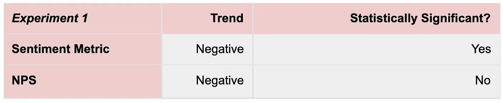

## 场景 2

第二种类型的实验在产品/服务中具有伤害用户体验的特征，并以统计上显著的方式影响 NPS。例如，我们的一个[聊天机器人](/airbnb-engineering/using-chatbots-to-provide-faster-covid-19-community-support-567c97c5c1c9)实验降低了 NPS 和情感指标，但 NPS 在第 10 天达到了统计显著性，而情感指标收敛得更快，在第 5 天检测到了转变。

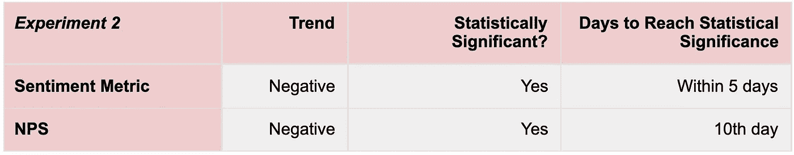

# 与长期客户忠诚度的关系

作为一个低频市场，Airbnb 的实验框架面临的挑战之一是难以评估产品迭代中的用户流失率和未来预订收入等长期客户忠诚度。对于客户支持团队来说，我们的产品对用户体验有着特别大的影响。这个实验应该有助于决策者回答这个问题:“如果一个产品/服务特性降低了成本，但损害了用户的满意度，我们是否应该推出它?”？"

我们的第三项评估使用情绪得分指标量化了客户服务对未来预订的影响。

如果有可能的话，用两个不同的代理库来运行 A/B 测试是非常昂贵的，这两个代理库为不同的用户群提供不同的服务标准。相反，我们使用一种新颖的因果推理技术，通过观察数据来检测情绪对用户未来一年预订收入的影响。

我们将用户分为两组:一组是*控制组*，其情绪得分相对较低，另一组是*治疗组*，其情绪更高、更积极。我们需要控制这两个群体在许多方面可能存在根本差异，例如他们对不同服务质量水平的容忍度、对我们平台的忠诚度以及历史预订体验。

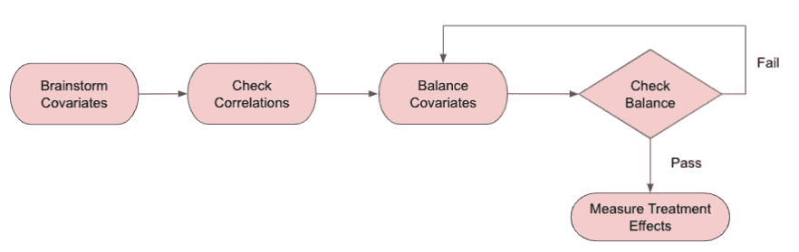

建立情感得分和未来收入之间关系的分析流程

为了评估提供良好客户服务的更可靠的长期效果，我们建立了一个程序:1)找出混杂因素，2)使用熵平衡控制这些协变量，3)使用加权数据评估治疗效果。

## 混杂变量选择

在我们能够缩小适当的混杂变量并生成协变量矩阵之前，需要几轮迭代。我们列出了应该考虑的所有可能的混淆变量。这涵盖了多个领域，包括用户账户信息、以前的预订行为、客户联系习惯等。然后，我们选择了与情绪和未来预订相关的相关变量。例如，有更多先前预订的用户倾向于预订更多，并且在与客户支持代理沟通时更加积极。最后，我们交叉检查所有变量之间的相关性，以去除多余的变量。这有助于我们选择混杂变量的简短列表。

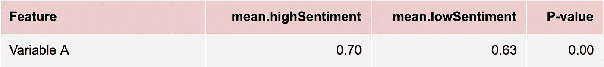

## 熵平衡

我们使用[熵平衡](https://web.stanford.edu/~jhain/Paper/eb.pdf)来实现协变量平衡。熵平衡是一种最大熵重新加权方案，用于创建满足一组约束的平衡样本。该方案有两个最重要的特点:

**1。协变量分布的均衡矩。**通过为每个样本单元分配权重 wi，我们希望治疗组和重新加权对照组之间的协变量分布(例如，平均值、方差和偏斜度)的矩相等(在等式 2 中定义)。典型的平衡约束用 mr 来表示，Mr 包含来自治疗组的给定变量 Xj 的 r 阶矩，而对于对照组，矩函数被指定为 cri(Xij)

**2。与基础重量的最小距离**。我们还想尽量减少。估计权重 wi 和基础权重 qi 之间的距离(通常设置为 1/n0，均匀分布)，以尽可能多地保留信息(在等式 3 中定义)。

与更常用的倾向得分匹配相比，熵平衡有几个经证实的优势:

*   **它擅长平衡结果，即使是高度的力矩**。与大多数其他预处理方法(涉及对模型和匹配进行多轮手动调整，直到达到平衡的结果，这通常在高维样本上失败)相比，熵平衡直接搜索可以在有限样本中实现精确协变量平衡的权重。它显著改善了通过其他方法获得的平衡，这些方法通过保险用例 [Matschinger (2019)](https://www.thieme-connect.de/products/ejournals/abstract/10.1055/a-1009-6634) 进行了验证。
*   **它保留有价值的信息而不丢弃单元**。熵平衡通过允许单位权重在单位之间平滑变化来保留有价值的信息，因此我们不必丢弃任何不匹配的数据。
*   **百搭。我们得到的权重可以用于几乎任何治疗效果的标准估计，例如加权平均和加权回归。**
*   它的计算成本很低。只需几秒钟就可以获得超过 100 万条记录的平衡结果。

评估治疗效果

使用熵重新加权后，我们能够对所有混杂变量得出平衡的结果:

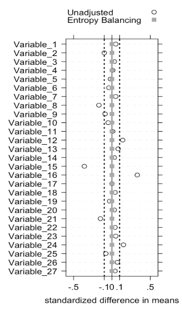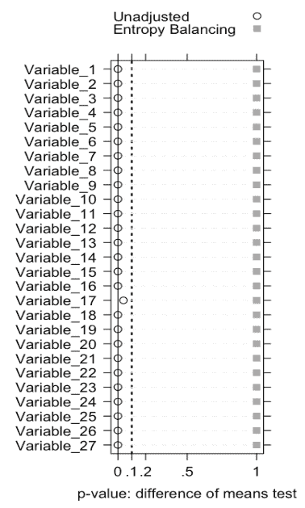

根据加权结果，我们发现，Airbnb 上情绪较高的**客人(情绪指标> = 0.1 的潜在良好 CS 体验)在接下来的 12 个月中会产生更多收入**。每当我们在成本和用户满意度得分方面看到相反的结果时，这一结果可以应用于权衡分析，并帮助我们在考虑长期收入的情况下做出正确的推出决策。

# 外卖食品

在这篇博文中，我们提供了情感模型开发的细节和评估情感指标的框架。

对于 ML 从业者来说，情感分析的成功依赖于特定领域的数据和注释指南。我们的实验表明，基于 transformer 的分类器比基于 CNN 的架构性能更好，尤其是在不常用的语言中。

对于与 NPS 的痛苦作斗争的客户服务提供商来说，情感分析提供了描述客户满意度的有希望的结果。如果你有用户交流文本，探索情感分析可能会解决 NPS 的持久之痛。然而，如果你只有电话录音，在探索音频中的情感检测之前，探索音频到文本的转录可能是一个好的开始。

对于数据分析师和数据科学家来说，根据新信号(模型输出)开发指标的框架是可重用的:考虑到许多用户反馈指标要么很慢要么很稀疏，数据专业人员可以从覆盖范围、敏感度和与业务价值的因果关系来评估新信号。对于因果分析挑战，值得花一些时间来探索新的熵平衡技术，这可能会节省您的倾向得分匹配时间。

如果你对这类工作感兴趣，可以看看我们的相关职位:

[高级数据科学家—分析、支持产品](https://grnh.se/049bfea61us)

[员工数据架构师，社区支持平台](https://grnh.se/36f092141us)

还有更多在 Airbnb 的[职业生涯！](https://careers.airbnb.com/)

# 承认

感谢顾志英和袁洛华为因果推理提供了重要的知识支持。感谢僧帽 Akhtari 和 Jenny Chen 就 [Airbnb 的未来增值体系](/airbnb-engineering/how-airbnb-measures-future-value-to-standardize-tradeoffs-3aa99a941ba5)进行知识分享。我们还要感谢曾博对情感建模的指导，感谢杨对度量迭代的指导，感谢 Aashima Paul、Evan Lin 和 Hu 对情感数据标注的辛勤工作。最后但同样重要的是，我们感谢 Joy Zhang、Nathan Triplett 和 Shijing Yao 的指导。

# 参考资料:

1.  Jens Hainmueller (2012)因果效应的熵平衡:在观察性研究中产生平衡样本的多变量重新加权方法，*政治分析*，20:2546 doi:10.1093/pan/MPR 025
2.  Herbert Matschinger，Dirk Heider，Hans-Helmut knig(2020)基于常规医疗保险数据的因果推断的匹配和加权方法的比较，或:如果 RCT 是不可能的怎么办， *Gesundheitswesen，*82(s02):S139-S150 DOI:10.1055/A-1009–6634

进一步阅读

[WIDeText: Multimodal 深度学习框架及其在房型分类上的应用](https://docs.google.com/document/d/1irNF89bKsTGgjNCmPoJXBVEaNPv00Fl3skwCAjBHK8M/edit)详细介绍 Airbnb 中使用的深度学习框架

[Bighead:一个与框架无关的端到端机器学习平台](https://ieeexplore.ieee.org/document/8964147)深入 Airbnb 机器学习基础设施的细节。 *DSAA* '2019

[Airbnb 如何衡量未来价值以实现权衡标准化](/airbnb-engineering/how-airbnb-measures-future-value-to-standardize-tradeoffs-3aa99a941ba5)详细介绍了 Airbnb 如何通过倾向得分匹配模型优化长期决策