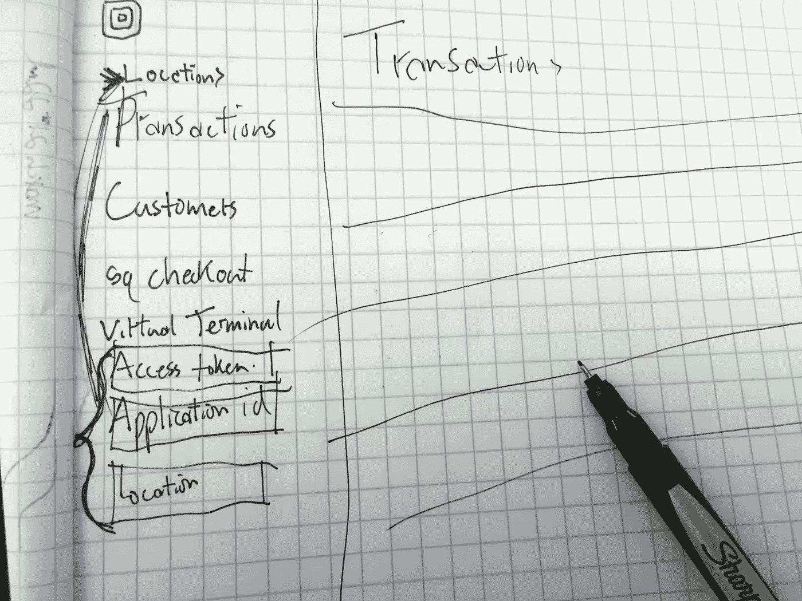
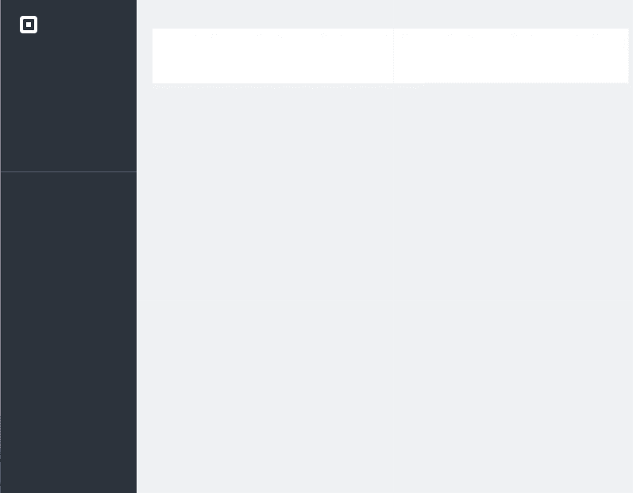
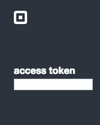
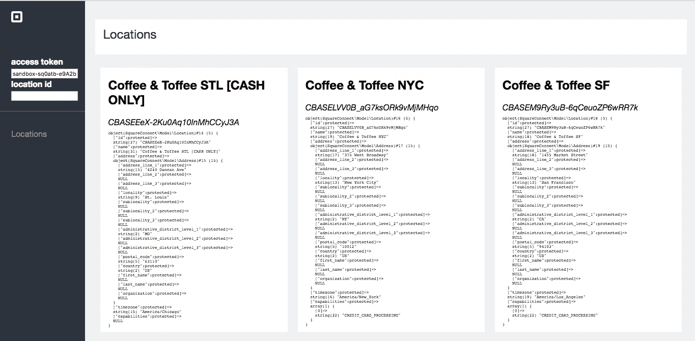

# 使用 Square 的 REST APIs 构建沙盒仪表板第 1 部分:身份验证和位置。

> 原文：<https://medium.com/square-corner-blog/using-squares-rest-apis-to-build-a-sandbox-dashboard-part-1-authentication-locations-3e5b5a551cc7?source=collection_archive---------0----------------------->

> 注意，我们已经行动了！如果您想继续了解 Square 的最新技术内容，请访问我们的新家[https://developer.squareup.com/blog](https://developer.squareup.com/blog)

我们最常从开发人员那里听到的一件事就是他们的沙盒账户缺少仪表板。这将是一系列文章中的第一篇，每篇文章都讨论我们 API 的不同部分。在本系列的最后，我们将为您的沙盒帐户提供一个仪表板。我们开始吧！



initial sketch… or entry in world’s worst handwriting contest?

## **搭建方形仪表盘**

在 Square，有一整个团队致力于我们的仪表板，我不打算复制他们所做的所有工作。不过，我将从一些设置页面一般结构的样板 HTML 开始，以及一些使页面更有用的 JavaScript 和 CSS。此外，沙盒帐户的仪表板将密切匹配真实仪表板的某些视觉元素。我的目标不是创建一个正方形仪表板的精确副本，而是创建一个可以使用沙盒凭证的功能性仪表板。我能够用几个`div`和一些 CSS `flex`属性的自由使用来制作左侧导航的一个相当简单的再现。我将导航分解到它自己的`header.php`文件中，因为它将在我的应用程序中的所有页面之间共享。现在，我的文件结构看起来像这样:

```
sandbox-dashboard/
----index.php   //The main page of the application
----header.php  //Navigation, shared code between pages
----style.css   //style 🕶
```

我的页面看起来像这样:



Almost looks like the real thing!

## 开发者沙箱

您的开发人员沙盒与您的生产或“真实”帐户工作方式相同，除了一个关键的区别:它是一个游乐场！您使用沙盒凭证进行的电子商务交易不会收费，您进行的任何客户操作都不会影响您的实际客户。在撰写本文时，您无法将 API 沙盒用于任何 v1 端点，包括项目和员工管理。

## 证明



使用 API 沙盒很容易，你所要做的就是使用你的沙盒访问令牌，而不是你的个人访问令牌，或者你将从 OAuth 获得的访问令牌。首先，我将在左侧导航中添加一个输入元素，让您输入想要使用的访问令牌。请记住，这只是给你们开发者的一个教程，你们 ***绝不会*** 想这样暴露你们的秘密。我决定使用 [PHP 的 sessions](https://www.w3schools.com/php/php_sessions.asp) 来跟踪您的凭证，并使其易于在访问令牌之间切换。只要您粘贴沙箱(或其他)访问令牌，或者做任何其他事情来触发 JavaScript `onchange`事件，一些页面内 JavaScript 就会将值发送到简单的 PHP 页面(`setter.php`)，该页面会将值存储在会话中。

```
//in-page javascript
function setAccessToken() {
   var at = document.getElementById('access-token').value;var xhttp = new XMLHttpRequest();
   xhttp.onreadystatechange = function() {
    if (this.readyState == 4 && this.status == 200) {
     alert("Access Token set");
     console.log(this.responseText);
    }
   };
   xhttp.open("POST", "setter.php", true);
   xhttp.setRequestHeader("Content-type", "application/x-www-form-urlencoded");
   xhttp.send("at="+at);
}
--------------------------------------------------//setter.php
<?php 
session_start();
if (isset($_POST['at'])){
 $_SESSION["at"] = $_POST['at'];
 echo 'success';
}
else{
 echo "failure";
}
?>
```

## 位置

几乎所有 Square 的 REST 端点都要求您在请求的 URL 中提供一个位置参数。方形仪表板让你选择一个位置，有一系列复杂的模式和下拉菜单。我将只列出位置，并让您指定想要使用的位置的 ID，但要做到这一点，我需要添加代码来列出位置。我将使用 [Square 的 PHP SDK](https://github.com/square/connect-php-sdk) 来调用列表位置端点，并在屏幕上显示它们。首先，我将添加一个`composer.json`文件，并将 SDK 的适当版本添加到其中。

```
{
    "require": {
        "square/connect": "dev-release/2.1.0"
    }
}
```

一个快速的`composer install`就安装好了所有的依赖项，我需要在我的`header.php`中包含的只是`require(‘vendor/autoload.php’);`来访问 SDK 的功能(比如`listLocations();`)。

我添加了一个新的`locations.php`文件，并添加了一些逻辑来列出所提供的访问令牌的位置，并简单地将它们转储到屏幕上。

```
<?php
 if(!$_SESSION['at']){
  echo 'Looks like you need to set your access token on the right. Go to your <a href="connect.squareup.com/apps/">Developer Portal</a> to find it.'; 
 }else{
  SquareConnect\Configuration::getDefaultConfiguration()->setAccessToken($_SESSION['at']);
  $locationApi = new SquareConnect\Api\LocationsApi();
  try {
   $result = $locationApi->listLocations();
   echo '<div style="display:flex">';
   foreach ($result->getLocations() as $location) {
    echo '<div class="location">';
    echo '<h2>',$location->getName(),'</h2>';
    echo '<em>',$location->getId(),'</em>';
    echo '<pre>';
    var_dump($location);
    echo "</pre>";
    echo '</div>';
   }
   echo '</div>';
  } catch (Exception $e) {
   echo 'Exception when calling LocationsApi->listLocations() with the access token <strong>',$_SESSION['at'],'</strong>', PHP_EOL;
   echo '<pre>';
   echo $e->getMessage();
  }
 }
```

制作我的文件结构:

```
sandbox-dashboard/
----index.php   //The main page of the application
----header.php  //Navigation, shared code between pages
----style.css   //style 🎉
----setter.php  // Sets session variables
----locations.php 
```

将所有这些放在一起，您可以快速查看您的位置和底层 json:



A dashboard for my sandbox locations

我希望你喜欢我们的沙盒仪表板系列的第一部分。关注 this blog 和 twitter 上的 [@SquareDev](https://twitter.com/SquareDev) 来了解第 2 部分，在这里我们开始报告交易。要了解更多关于 API 沙箱的知识，请查看我们文档中的使用 API 沙箱的[测试。](https://docs.connect.squareup.com/articles/using-sandbox)