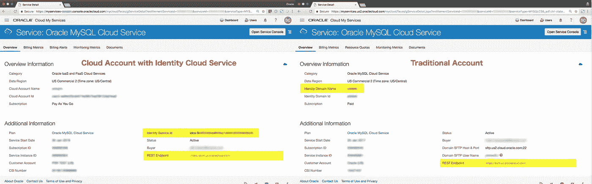
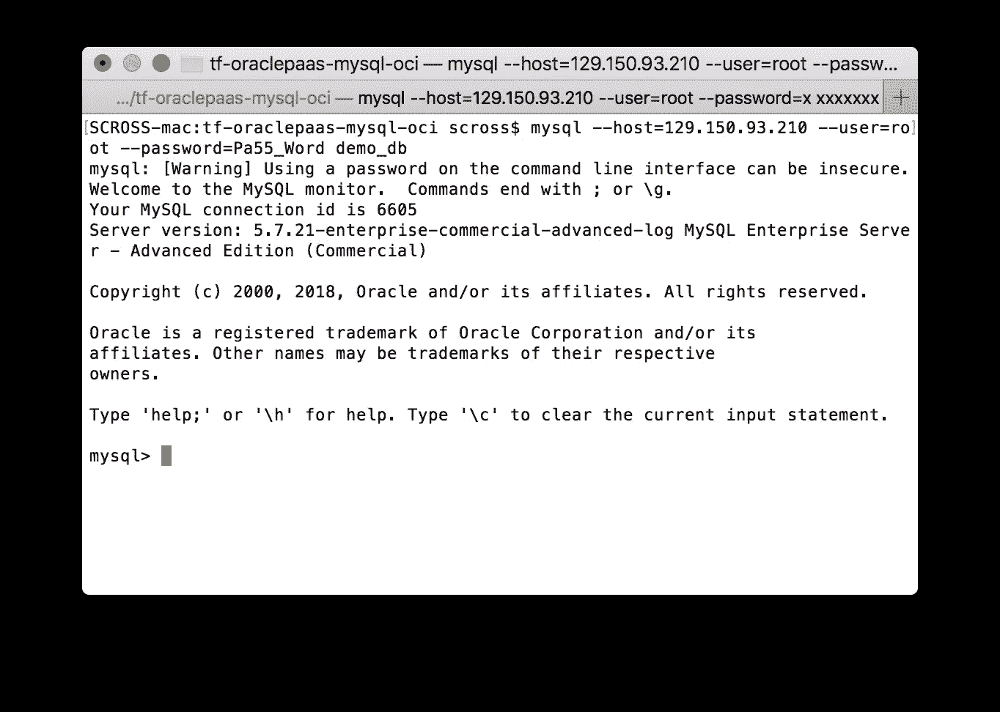
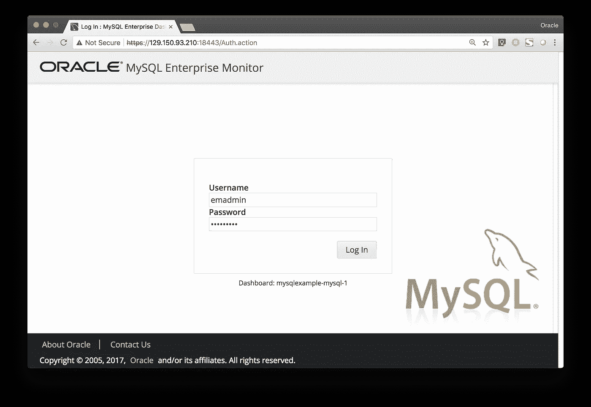
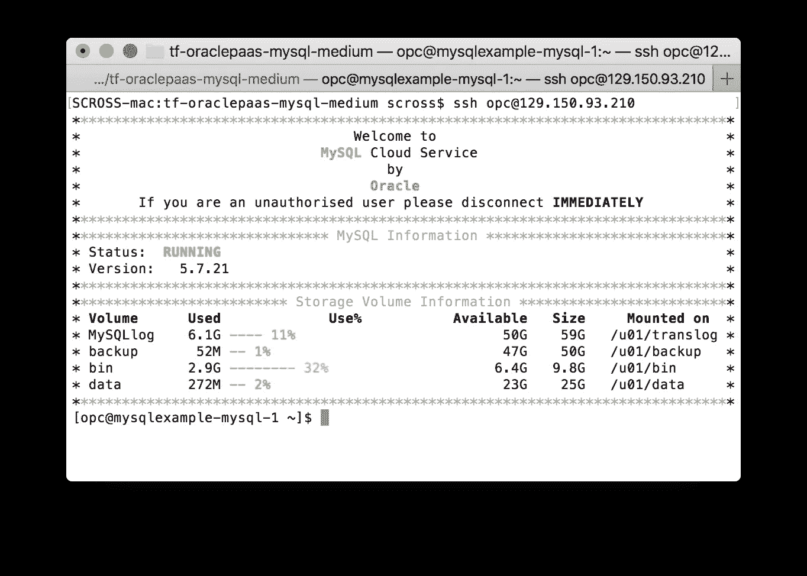

# 使用 Terraform 提供 Oracle MySQL 云服务

> 原文：<https://medium.com/oracledevs/using-terraform-to-provision-the-oracle-mysql-cloud-service-c5f450677bf6?source=collection_archive---------1----------------------->

用于 **Terraform** 的 [Oracle 云平台提供商](https://www.terraform.io/docs/providers/oraclepaas/index.html)现在支持在 Oracle Cloud Infrastructure 和 Oracle Cloud infra structure Classic 上供应 [**MySQL 云服务**](http://cloud.oracle.com/mysql) 实例，并增加了两项新资源:

*   `oraclepaas_mysql_service_instance`
*   `oraclepass_mysql_access_rule`

借助 Oracle Cloud MySQL 云服务，您可以轻松配置 MySQL 数据库实例，所有 **MySQL 企业版服务器**特性都包含在 Oracle MySQL 云服务中。

在本文中，我们将了解如何向您的 Terraform 配置添加 MySQL 云服务实例

# Oracle 云平台提供商设置

MySQL 云服务资源由`oraclepaas`提供商提供支持。

```
provider "oraclepaas" {
  version           = "~> 1.2"
  user              = "${var.user}"
  password          = "${var.password}"
  **identity_domain**   = "${var.identity_service_id}"
  **mysql_endpoint**    = "[https://psm.us.oraclecloud.com/](https://psm.us.oraclecloud.com/)"
}
```

在我的服务仪表板的 MySQL 云服务详细信息页面上可以找到`identity_domain`和`mysql_endpoint`设置所需的值。

*   对于使用身份云服务的**云帐户，`**identity_domain**`设置需要是您的**身份服务 Id** ，格式为`idcs-99ff99ff99ff99ff99ff99ff99ff99ff`**
*   对于**传统账户**，`**identity_domain**`设置为**身份云名称**，例如`mydomain`



Locating the Cloud Account settings

`mysql_endpoint`是服务详情页面上显示的 **REST 端点** URL。

# MySQL 云服务资源配置

让我们从查看完整的资源定义开始，然后我们将分解一些属性细节。

```
resource "oraclepaas_mysql_service_instance" "example" { name               = "mysqloci1"
  description        = "Created by Terraform"
  ssh_public_key     = "${file("~/.ssh/id_rsa.pub")}"
  backup_destination = "BOTH"
  metering_frequency = "HOURLY" # OCI settings
  region              = "us-ashburn-1"
  availability_domain = "ilMx:US-ASHBURN-AD-1"
  shape               = "VM.Standard2.1" mysql_configuration {
    db_name         = "demo_db"
    db_storage      = 25
    mysql_password  = "${var.mysql_password}"enterprise_monitor_configuration {
      em_username       = "emadmin"
      em_password       = "${var.em_password}"      
      em_agent_username = "emagent"
      em_agent_password = "${var.emagent_password}"
    }
  } backups {
    cloud_storage_container = "Storage-mydomain/mysql-backups"
    create_if_missing       = true
  }
}
```

## **Oracle 云基础设施**部署设置

对于 **Oracle 云基础架构**部署，您的环境必须已针对 OCI 上的 [PaaS](https://www.oracle.com/cloud/what-is-paas/) 部署进行了预配置。更多详细信息，请参见[**Oracle 云基础设施上 Oracle 平台服务的先决条件**](https://docs.us-phoenix-1.oraclecloud.com/Content/General/Reference/PaaSprereqs.htm) 。

必须将`region` `availability_domain`和`shape`设置为适当的 OCI 环境设置。

```
 region              = "us-ashburn-1"
  availability_domain = "ilMx:US-ASHBURN-AD-1"
  shape               = "VM.Standard2.1"
```

Terraform `oci`提供者可用于查找可用性域名，例如，获取租赁的第一个广告的名称

```
**data "oci_identity_availability_domains" "ADs" {
  compartment_id = "${var.tenancy_ocid}"
}**resource "oraclepaas_mysql_service_instance" "example" {
  ...
availability_domain = "**${lookup(data.oci_identity_availability_domains.ADs.availability_domains[0],"name")}**"  ...
}
```

## Oracle 云基础架构经典部署设置

对于**Oracle Cloud infra structure Classic**，必须设置`region`和`shape`设置，并且`ip_network`设置可用于在特定 IP 网络内部署 MySQL 实例。

```
 region     = "uscom-central-1"
  shape      = "oc3"
  ip_network = "/Compute-${var.compute_service_id}/${var.user}/myipnetwork"
```

## MySQL 云服务实例配置

`mysql_configuration`包含数据库特定的配置。在这里，我们设置数据库名称，以及要提供的初始 MySQL 管理员用户密码

```
 mysql_configuration {
    db_name         = "demo_db"
    mysql_password  = "${var.mysql_password}"
  }
```

可以添加附加属性来配置存储、端口号、字符集编码等。参见[资源文件](https://www.terraform.io/docs/providers/oraclepaas/r/oraclepaas_mysql_service_instance.html)了解全部细节。默认的 MySQL 数据库 post 是`3306`。

添加`enterprise_monitor_configuration`块在实例上配置 MySQL Enterprise Monitor，并配置初始用户凭证。

```
mysql_configuration {
    ...
    enterprise_monitor_configuration {
      em_username       = "emadmin"
      em_password       = "${var.em_password}"
      em_agent_username = "emagent"
      em_agent_password = "${var.emagent_password}"
    }
  }
```

## 备份

`backup_destination`属性可以设置为`NONE`、`OSS`或`BOTH`。如果设置了`OSS`或`BOTH`选项，则`backups`块还必须包含 Oracle 存储服务位置的详细信息，以存储备份。可以使用 OCI 经典对象存储或 OCI 对象存储。

对于 **OCI 经典对象存储**，将`cloud_storage_container`设置为格式`Storage-<domain_id>/<container_name>`中的存储容器位置。该容器应仅用于 MySQL 云服务备份(不要在同一容器中混合其他 PaaS 服务备份)。如果容器不存在，`create_if_missing`选项将创建容器。

```
 backups {
    cloud_storage_container = "**Storage-mydomain/mysql-backups**"
    create_if_missing       = true
  }
```

对于 **Oracle 云基础设施对象存储**，MySQL PaaS 备份的存储桶必须预先创建并配置为支持 Swift API 访问。有关更多详细信息，请参考 Oracle 云基础设施上的 Oracle 平台服务的[先决条件](https://docs.us-phoenix-1.oraclecloud.com/Content/General/Reference/PaaSprereqs.htm)。将`cloud_storage_container`设置为存储桶的 Swift URL，并提供适当的访问凭证。

```
 backups {
    cloud_storage_container = "[**https://swiftobjectstorage.${var.region}.oraclecloud.com/v1/${var.object_storage_namespace}/${var.object_storage_bucket**](https://swiftobjectstorage.${var.region}.oraclecloud.com/v1/${var.object_storage_namespace}/${var.object_storage_bucket)**}**"
    cloud_storage_username  = "${var.object_storage_user}"
    cloud_storage_password  = "${var.swift_password}"
  }
```

# 访问规则

可以添加访问规则来控制对 MySQL 服务实例的访问。创建一个默认访问规则，以允许 SSH 访问实例。下面添加了一个额外的规则，只允许从特定的 IP 地址访问 MySQL 数据库端口，例如，只允许访问将要连接数据库的应用服务器的 IP 地址。

```
resource "oraclepaas_mysql_access_rule" "db_access" {
 name                = "example_db_access"
 description         = "Created by Terraform"
  service_instance_id = "${oraclepaas_mysql_service_instance.example.name}"
 ports               = "${oraclepaas_mysql_service_instance.example.mysql_configuration.0.**mysql_port**}"
 source              = "**${var.my_ip_address}**"
 destination         = "mysql_MASTER"
 enabled             = true
}
```

`source`可以是单个 IP 地址或 CIDR，或者是逗号分隔的 IP 地址和 CIDR 列表。类似地，可以创建一个访问规则来允许访问 MySQL Enterprise Monitor 控制台端口

```
resource "oraclepaas_mysql_access_rule" "em_access" {
 name                = "example_em_access"
 description         = "Created by Terraform"
  service_instance_id = "${oraclepaas_mysql_service_instance.example.name}"
 ports               = "${oraclepaas_mysql_service_instance.example.mysql_configuration.0.**em_port}"
** source              = "**${var.my_ip_address}**"
 destination         = "mysql_MASTER"
 enabled             = true
}
```

# 供应和访问 MySQL 实例

调配之前的最后一步，让我们添加一些有用的输出，以获得连接到所调配的实例所需的详细信息。以下输出显示了如何获得:

*   已调配实例的 IP 地址
*   MySQL 数据库连接字符串
*   MySQL 企业监视器 URL

```
output "public_ip_address" {
  value = "${oraclepaas_mysql_service_instance.example.mysql_configuration.0.public_ip_address}"
}output "mysql_connect_string" {
  value = "${oraclepaas_mysql_service_instance.example.mysql_configuration.0.connect_string}"
}output "enterprise_monitor_url" {
  value = "[https://${oraclepaas_mysql_service_instance.example.mysql_configuration.0.public_ip_address}:${oraclepaas_mysql_service_instance.example.mysql_configuration.0.enterprise_monitor_configuration.0.em_port](https://${oraclepaas_mysql_service_instance.example.mysql_configuration.0.public_ip_address}:${oraclepaas_mysql_service_instance.example.mysql_configuration.0.enterprise_monitor_configuration.0.em_port)}"
}
```

Terraform 配置完成后，使用以下命令部署 MySQL 服务实例:

```
$ **terraform apply**
...
Apply complete! Resources: 1 added, 0 changed, 0 destroyed.Outputs:enterprise_monitor_url = [https://129.150.93.210:18443](https://129.150.93.210:18443)
mysql_connect_string = 129.150.93.210:3306/demo_db
public_ip_address = 129.150.93.210
```

供应完成后，您可以使用 MySQL 客户端连接到数据库，例如

```
$ **mysql --host=**<ip_address> \
        **--user=root --password=**<password> **demo_db**
```



访问 MySQL 企业监视器。使用提供的用户凭据登录



最后，您可以使用配置的 SSH 密钥直接访问 MySQL 实例计算主机:

```
$ **ssh -i** <path_to_private_key> **opc@**<ip_address>
```



# 了解更多信息

其他示例可在此处找到:

*   [Oracle Cloud infra structure Classic 上的 MySQL Cloud PaaS 服务配置示例](https://github.com/oracle/terraform-examples/tree/master/examples/oraclepaas/mysqlcs-instance-classic)
*   [Oracle 云基础设施上的 MySQL 云 PaaS 服务配置示例](https://github.com/oracle/terraform-examples/tree/master/examples/oraclepaas/mysqlcs-instance-oci)

# 相关故事

*   [宣布 Terraform 支持 Oracle 云平台服务](https://blogs.oracle.com/developers/announcing-terraform-support-for-oracle-cloud-platform-services)
*   [面向 Oracle 云平台的新平台提供商](https://www.hashicorp.com/blog/new-terraform-provider-for-oracle-cloud-platform)
*   [哈希公司平台调配&管理甲骨文云](https://www.hashicorp.com/resources/hashicorp-terraform-to-provision-and-manage-oracle)
*   [通过 Oracle PaaS 服务管理器(PSM)使用 Terraform】](/oracledevs/using-terraform-with-oracle-paas-service-manager-psm-d21f2ddbae3f)