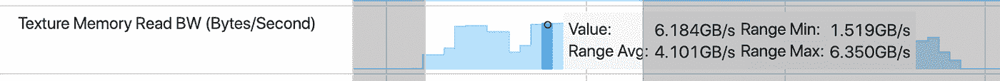
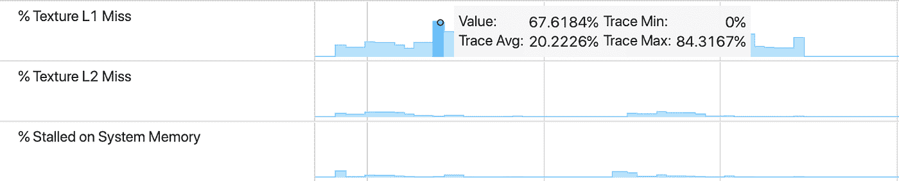
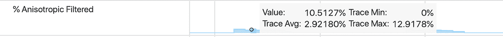
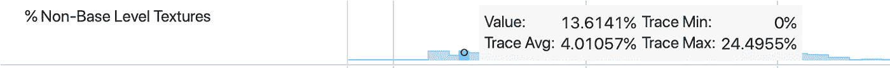

# 在 Android GPU 检查器中使用纹理计数器

> 原文：<https://medium.com/androiddevelopers/using-texture-counters-in-the-android-gpu-inspector-cc0f0dd4a798?source=collection_archive---------0----------------------->

Low poly Android GPU Inspector analyzing low poly game

Android GPU Inspector (AGI)让我们窥视 Android 上的内部 GPU 工作。最苛刻的 GPU 任务之一是从着色器中提取和过滤纹理数据。我们可以使用 AGI 通过捕获三类纹理 GPU 性能计数器来监控纹理相关的 GPU 工作负载:带宽、缓存行为和过滤。

a higher-bandwidth version of much of this information

我总是从查看纹理带宽开始，因为它表明一帧中有多少纹理数据被传输到 GPU，并且可以快速突出潜在的纹理性能问题。

当谈到纹理带宽时，一个好的经验法则是确保**纹理读取带宽**平均不高于 **1GB/s，并且其峰值保持在 5GB/s** 以下。

例如，这个游戏消耗了大量的纹理带宽，平均超过 4GB/s，在接近帧结束时达到峰值，超过 6GB/s。

预计后期处理步骤会对纹理带宽造成特别大的负担；你可能会同意在帧的末尾花费一部分带宽预算来制作像高光溢出和色调映射这样的特效。但是，如果游戏的颜色通道具有较高的纹理读取带宽峰值，您可能需要调查潜在的性能问题。

对于这款游戏，纹理带宽消耗非常大，需要进一步调查。

为了研究一个潜在的纹理带宽问题，我首先来看看纹理缓存的行为。我的重点是纹理暂停的百分比，L1 和 L2 获取失误。当在 L1 缓存中找不到纹理提取的纹理数据时，请求被转发到 L2 缓存，然后到系统内存。每一步都会引入更多的等待时间并消耗更多的能量。**平均 L1 缓存未命中应低于 10%，峰值应低于 50%** 。

该游戏的 GPU 系统捕获显示，L1 缓存未命中的平均百分比超过 20%，最高可达 80%或更多。

这些数字再次非常高。

高比例的纹理暂停的典型原因是未压缩的纹理、复杂的过滤(如各向异性过滤)和纹理未被纹理贴图。

为了调查纹理缓存未命中的潜在原因，我查看了各向异性过滤纹理提取的百分比，这在移动设备上非常昂贵，并查看了**非基本级别**纹理提取的百分比。

非基本级别纹理提取的百分比是对纹理小中见大贴图提取效率的估计。当这个数字为 0 时，意味着 GPU 总是访问纹理 mipmap 链的顶层，即最大的切片，或者纹理根本没有进行 mi pmap。

这在大多数 3D 游戏中都是一个问题，但在 2D 游戏中通常是可以接受的。

在渲染 GUI 或后期处理过程中，访问非小中见大贴图纹理是可以的，但在任何其他情况下，这会带来很大的性能损失，并导致缓存行为不佳。

事实上，获取纹理会消耗大量的系统带宽，并可能会带来延迟，增加电池寿命，并导致热量问题，从长远来看，这将进一步降低性能。

分析与纹理行为相关的 GPU 计数器有助于发现潜在的大而易举的结果，在修复后可以显著改善用户体验。

要找到这些与纹理相关的 GPU 性能问题，请使用[*Android GPU Inspector*](https://gpuinspector.dev/)跟踪您的游戏，并将 GPU 计数器的值和趋势与这里给出的准则进行比较。