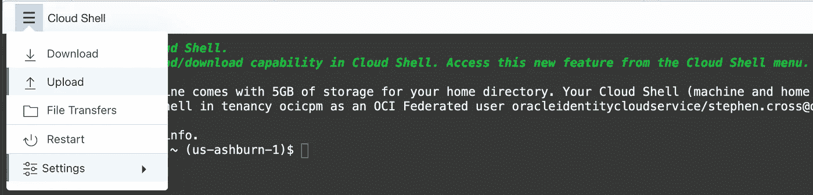
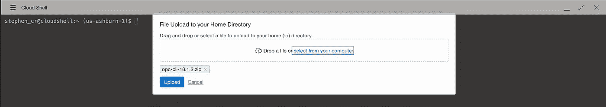
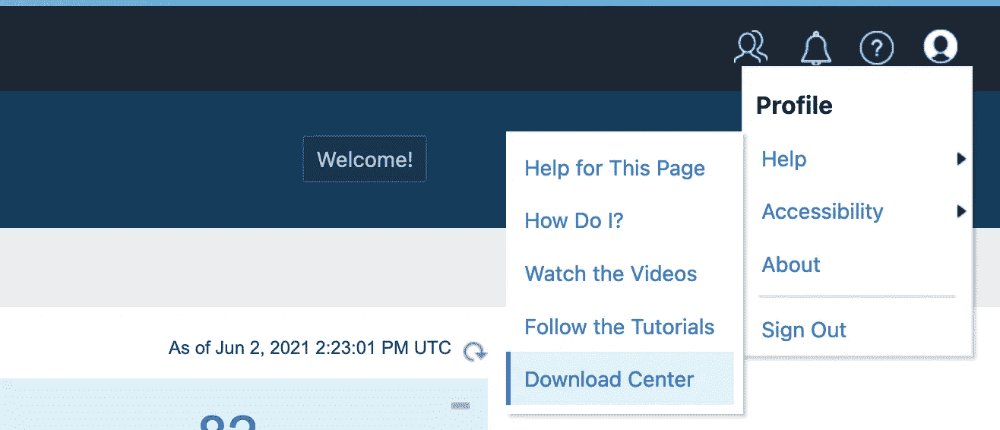
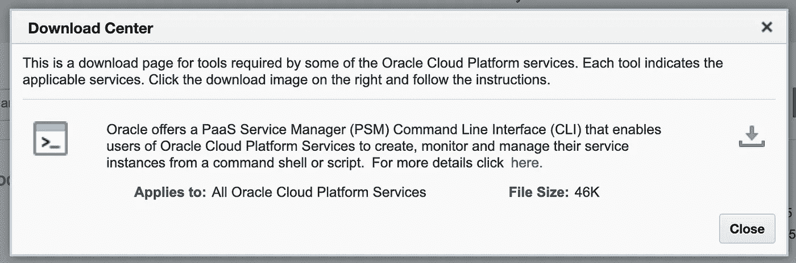

# 从 OCI 云壳使用 OCI 经典 CLI 实用程序

> 原文：<https://medium.com/oracledevs/using-the-oci-classic-cli-utilities-from-oci-cloud-shell-ee9776dc5f73?source=collection_archive---------0----------------------->

[OCI 云外壳](https://docs.oracle.com/en-us/iaas/Content/API/Concepts/cloudshellgettingstarted.htm)是快速使用 OCI CLI 和其他工具从命令行管理您的 OCI 环境的一种极好的方式，但是如果您仍然使用 OCI 经典服务呢？

如果您运行的环境能够访问 OCI 和 OCI 经典服务，或者您正在从 OCI 经典迁移到 OCI，那么以下提示将帮助您从 OCI 云外壳运行 OCI 经典命令行实用程序，以管理 [IaaS](https://www.oracle.com/cloud/what-is-iaas/) 和 [PaaS](https://www.oracle.com/cloud/what-is-paas/) 服务

*   OCI 经典计算、存储和网络的 cli
*   `ftmcli`用于 OCI 经典物件存储
*   `psm`OCI 经典平台服务、DBCS、JCS、SOACS 等的 cli。

## opc 命令行实用程序

`opc`命令行实用程序用于管理 OCI 经典计算服务资源。`opc` cli 可以管理 OCI 经典计算实例、网络、块存储和编排的生命周期。

将 opc cli 下载到您的本地机器[https://www . Oracle . com/downloads/cloud/OPC-CLI-downloads . html](https://www.oracle.com/downloads/cloud/opc-cli-downloads.html)。例如`opc-cli-18.1.2.zip`

在 OCI 控制台打开**云壳**，从菜单中选择**上传**选项，上传 opc cli zip 文件。



OCLI Cloud Shell Upload



Upload opc-cli-18.1.2.zip

在云壳终端解压上传的 zip 文件，得到 opc 命令行可执行文件。

```
$ **unzip opc-cli-18.1.2.zip linux/opc**
```

现在可以在云 Shell 中从`linux`目录运行`opc`命令。

```
$ **./linux/opc --help**
```

要在 OCI 经典环境中使用 opc cli，您需要创建所需的配置文件。

```
$ **mkdir -p ~/.opc/profiles**
$ **touch ~/.opc/password**
$ **chmod 600 ~/.opc/password**
```

创建文件`~/.opc/profiles/default`，设置适当的计算服务 ID、用户名和计算经典 REST 端点细节。

```
{
  "compute": {
    "user": "/Compute-a123456/user@example.com",
    "endpoint": "compute.uscom-east-1.oraclecloud.com",
    "password-file": "~/.opc/password"
  }
}
```

用您的帐户密码更新`~/.opc/password`文件。

现在，您可以针对传统环境运行 opc cli，例如列出所有计算实例。

```
$ **./linux/opc -F state,name compute instance list /Compute-a123456**
running /[Compute-](mailto:Compute-orcdevtest1/upendra.vellanki@oracle.com)a123456[/](mailto:Compute-orcdevtest1/upendra.vellanki@oracle.com)user@example.com/AppServer/977d8f95-d33e-4a28-a073-e44161d7f6ed
```

有关使用 **opc** cli 的更多详细信息，请参考 Oracle 云基础架构计算经典版的 [CLI 参考](https://docs.oracle.com/en/cloud/iaas-classic/compute-iaas-cloud/stopc/general-syntax-cli-commands.html#GUID-3BC4BB24-A03A-4011-A398-A8BE895DE013)

## ftmcli 命令行实用程序

`ftmcli`命令行实用程序用于管理 OCI 经典对象存储容器和对象

从[https://www . Oracle . com/downloads/cloud/storage-cloud-upload-CLI-downloads . html](https://www.oracle.com/downloads/cloud/storage-cloud-upload-cli-downloads.html)将 ftmcli 下载到您的本地计算机

在 OCI 控制台打开**云壳**，从菜单中选择**上传**选项，上传 ftmcli zip 文件。

在云 Shell 终端中，从上传的 zip 文件中提取`ftmcli.jar`文件，例如

```
$ **unzip** **ftmcli-v2.4.3.zip** **ftmcli-v2.4.3/ftmcli.jar**
```

您现在可以使用已经预装在 Cloud Shell 中的 java 命令运行`ftmcli`实用程序。

```
$ **java -jar ./ftmcli-v2.4.3/ftmcli.jar --help**
```

要使用 ftmcli 列出 OCI 经典对象存储容器，请在命令选项中设置用户名和存储 rest 端点，例如

```
$ **java -jar ftmcli.jar list** \
    **--user user@example.com** \
    **--rest-endpoint https://uscom-central-1.storage.oraclecloud.com/v1/Storage-a123456**

Enter your password: ********
```

有关使用 **ftmcli** 的更多详细信息，请参考[Oracle 云基础架构对象存储经典命令行参考](https://docs.oracle.com/en/cloud/iaas-classic/storage-cloud/csclr/general-syntax-ftm-cli-commands.html#GUID-6E51B750-1958-4FB3-98BB-AF24ECC882D7)

## psm 命令行实用程序

`psm`命令行实用程序可用于管理 OCI 和 OCI Classic 中多个平台服务的生命周期，包括 Database Classic(DBCS)Java Cloud Service(JCS)和 SOA Cloud Service (SOACS)。

从平台服务控制台下载 psm 实用程序。从用户**个人资料**图标中选择**帮助**下载中心>下载中心



OCI Classic Platform Service Console > Profile > Help > Download Center

下载 **PaaS 服务管理器(PSM)命令行界面(CLI)**



PaaS Service Manager (PSM) Command Line Interface (CLI) Download

在 OCI 控制台打开**云壳**，从菜单中选择**上传**选项，上传`psmcli.zip`文件。

在云 Shell 终端中，为本地用户安装作为 python 包的 psm 实用程序。

```
$ **pip3 install --user ./psmcli.zip**
```

现在，您可以从`.local/bin`目录运行云 Shell 中的`psm`实用程序

```
$ **.local/bin/psm --help**
```

运行 **setup** 命令来配置 psm cli 以连接 OCI 经典服务。请注意，身份域是传统帐户的租赁名称，或者是云帐户的 idcs ID。

```
$ **.local/bin/psm setup** Username: **user@example.com**
Password: ************
Retype Password: ************
Identity domain: **a123456**
Region [us]: 
Output format [short]: 
Use OAuth? [n]:
```

使用`psm` cli 管理您的经典平台服务，例如列出所有数据库经典服务。

```
$ **.local/bin/psm DBCS services**
```

有关使用 **psm** cli 的更多详细信息，请参考 [PaaS 服务管理器命令行界面参考](https://docs.oracle.com/en/cloud/paas/java-cloud/pscli/abouit-paas-service-manager-command-line-interface.html)