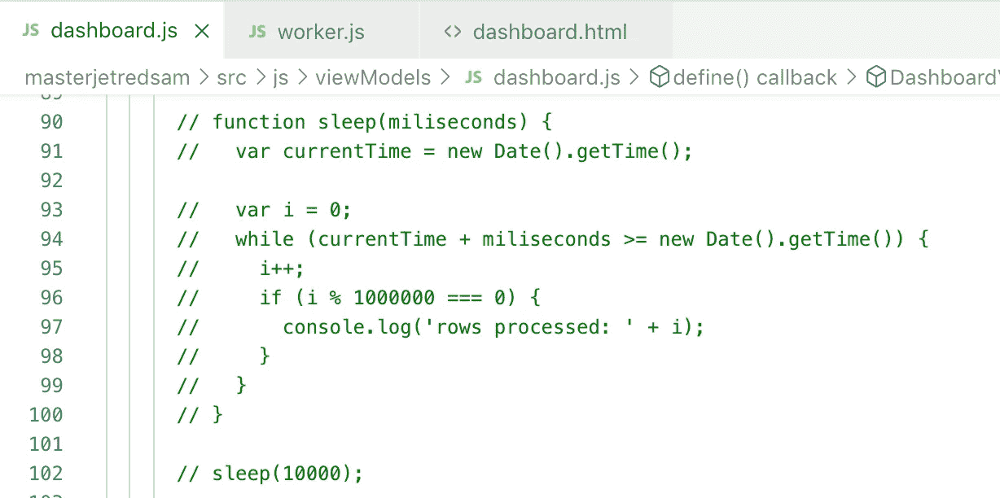
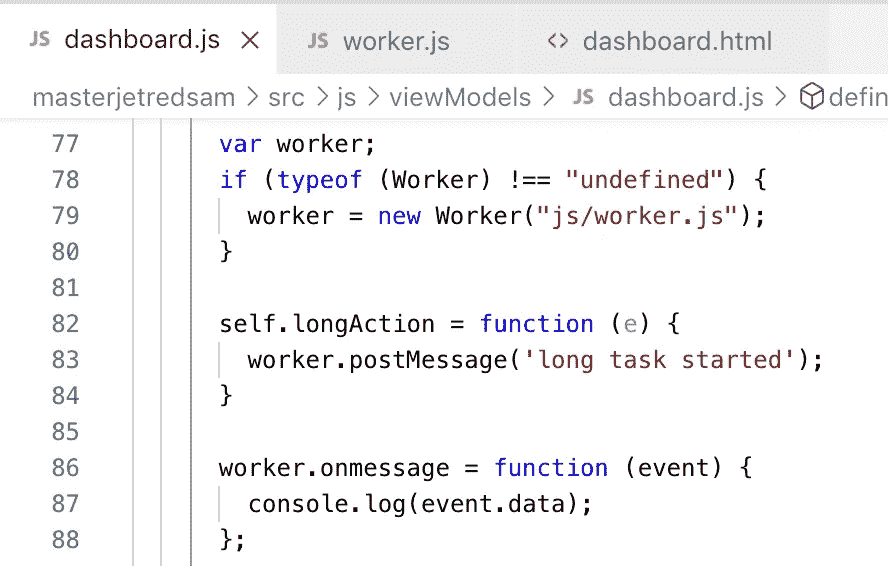
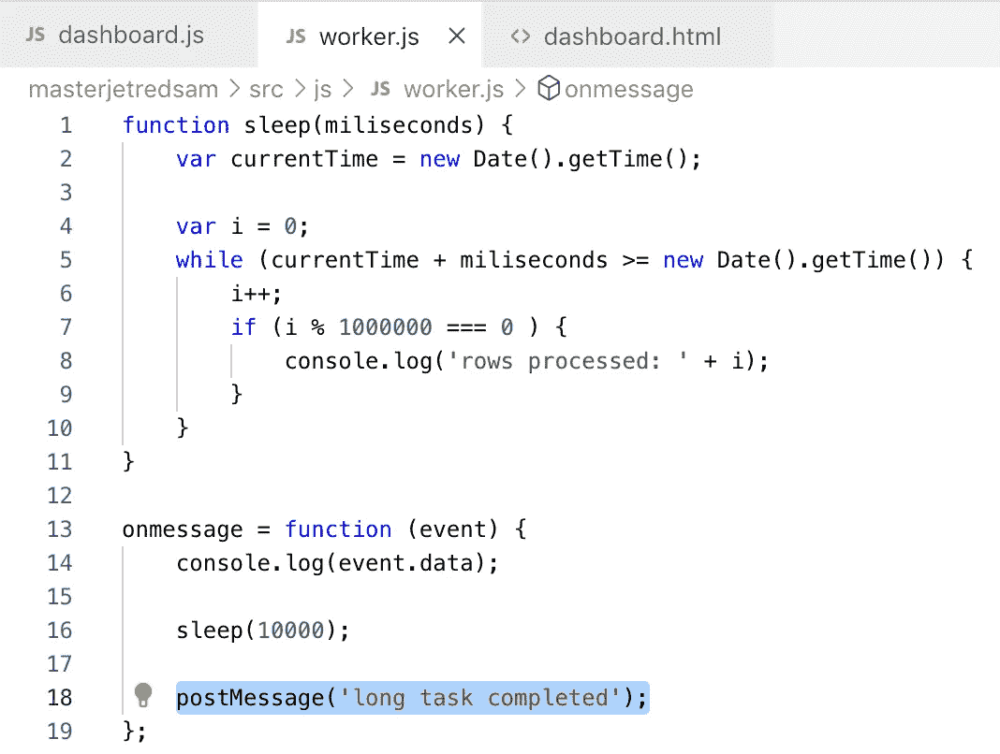

# 在 Oracle JET 中使用 Web Worker 处理长时间任务

> 原文：<https://medium.com/oracledevs/using-web-worker-for-long-tasks-in-oracle-jet-7f9f96cd66da?source=collection_archive---------0----------------------->

JavaScript 应用程序在单线程中运行。这意味着如果有一个长时间运行的资源密集型操作，线程将被阻塞，页面将保持冻结，直到操作完成。显然，这不是用户友好的，应该避免这种行为。我们可以使用 Web worker，通过 Web worker，我们可以在单独的线程中运行长时间运行的操作，而不会阻塞主线程。在 Web Worker 中运行的代码不能访问 UI DOM，这意味着在 Web Worker 中编码的逻辑应该与不直接与 UI 相关的逻辑一起操作。

示例应用程序包含 dashboard.js 中的注释代码。此代码阻塞主线程 10 秒钟，如果取消注释，您将看到应用程序冻结 10 秒钟:

Web Worker 是在 dashboard.js 中定义的。Web Worker 是一个单独的 js 文件，用于 Worker 对象。API 允许发送和接收消息，通过这种方式，我们可以与 Web Worker 进行通信(启动新任务并在任务完成时接收消息):

Web Worker 代码— *onmessage* 当消息从主线程到达时调用。postMessage 将消息发送回主线程:

示例应用程序可在 [GitHub](https://github.com/abaranovskis-redsamurai/masterjetredsam) repo 上获得。

【http://andrejusb.blogspot.com】最初发表于**。**