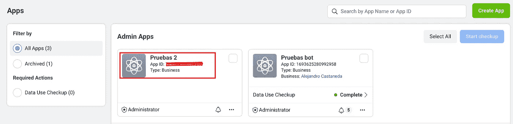
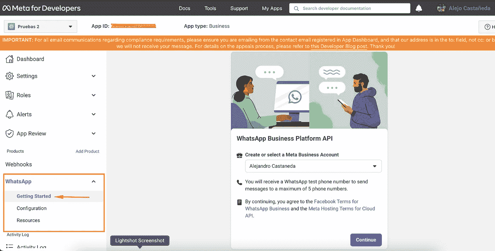

# 通过 AWS Lambda 使用 WhatsApp Business API Cloud。

> 原文：<https://medium.com/globant/using-whatsapp-business-api-cloud-with-aws-lambda-f776b763048b?source=collection_archive---------0----------------------->

[Click here to test the final project.](https://wa.link/o94qok)

在这个机会中，我们将使用 Meta 在 2022 年 5 月 19 日发布的 WhatsApp business API 实现一个从西班牙语到英语的 WhatsApp bot 翻译器，该 API 允许所有在 Meta 拥有帐户的人通过友好的集成为开发者更容易、更快地发送 WhatsApp 消息。

本文将回顾以下部分:

1.  在 Meta developer 的控制台中创建应用程序。
2.  附上 WhatsApp 产品。
3.  从元开发人员控制台发送测试消息。
4.  构建 webhook。
5.  将 webhook 部署为 lambda 函数。
6.  在 Meta developer 的控制台中将 lambda 函数 URL 配置为 webhook。
7.  结论。

1.  **在元开发者控制台内部创建应用:**[https://developers . Facebook . com/docs/development/Create-an-app/？locale=es_LA](https://developers.facebook.com/docs/development/create-an-app/?locale=es_LA) 这个链接提供了在 Meta developer 的控制台中创建应用程序的所有必要信息。

Example application panel in meta developers platform, Pruebas 2 was the app created to this exercise.

**2。附加 WhatsApp 产品:**选择创建的应用程序并将其附加到 WhatsApp 选项，您应该在菜单中找到 WhatsApp 产品，然后单击入门按钮，如果一切正常，您应该会看到下一个类似的屏幕:

On the left you should see the WhatsApp module, select getting started.

**3。从 meta 开发者的控制台发送测试消息:**此时，我们将能够使用 Meta 的图形界面发送消息，发送 WhatsApp 默认模板消息来测试功能，Meta 给我们一个测试号来发送消息，这个号有一些限制，但是对于测试环境来说已经足够了。

In this part, we can to send template message to test the functionality.

**4。构建 webhook:** 为了这个目标，我们将使用 lambda 函数中的节点 Js 在 Meta developer 的控制台中设置 webhook，这样，机器人收到的所有消息都将由该函数处理，记住目标是接收西班牙语消息，将它们翻译成英语，并将消息返回给用户。

对于翻译模块，我们将使用由 https://www.npmjs.com/package/translatte NPM 提供的名为 Translate [的免费库。](https://www.npmjs.com/package/translatte)

代码将作为公共存储库部署在 GitHub 中。

 [## GitHub-4 l3j 4 NDR 0/web hook-wahtsapp:这是 WhatsApp webhook 的一个例子。

github.com](https://github.com/4l3j4ndr0/webhook-wahtsapp) 

Webhook functionality to response translate message.

**5。将 webhook 部署为 lambda 函数:**要部署上面共享的代码，我们需要克隆存储库，执行 npm install 命令，使用 14 或更高的节点版本非常重要，然后，当安装完依赖项后，我们将压缩文件(。zip)通过控制台上传到 AWS lambda 模块(您可以在下面找到说明)。

要在 AWS 中部署 lambda 函数，我们必须导航到 lambda 函数模块选择函数部分，然后选择创建函数，在下一页中选择第一个选项(从头开始创作)，分配函数名称，对于运行时，我建议选择 Node.js 14x，体系结构选择 x86_64，在高级设置部分，选择启用函数 URL，对于验证类型，选择无选项，然后选择“创建函数”选项。

现在，我们将添加一个额外的设置来授予 webhook 的正确操作，在常规设置部分，我们将更改执行的超时，我认为 30 秒足够了，然后在环境变量部分，我们需要添加 2 个变量:

*   验证令牌=验证
*   WHATSAPP_TOKEN=这个值，我们可以从面向开发者的 Meta 控制台中获取。

接下来，我们必须上传带有 lambda 函数的代码和库的 zip 文件，要实现这一点，我们必须选择代码部分，然后选择“上传自”，接下来选择。“zip 选项”并从我们的机器中选择 zip 文件。

如果上面分享的说明令人困惑，我将添加描述这些步骤的截图。

5.1 搜索 lambda 模块并进入。

5.2.选择函数选项，然后选择创建函数。

5.3.选择第一个选项(从头开始创作)，分配名称，选择运行时和架构。

5.4.在“高级设置”部分，选择“启用函数 url ”,对于“验证类型”,选择“无”,最后选择“创建函数”选项。

5.5.添加额外配置创建 lambda 时，在常规配置的配置部分，将超时时间更改为 30 秒。

5.6.在相同的设置部分，单击环境变量选项并添加变量。

**6。将 lambda 函数 URL 配置为 Meta developers console 中的 webhook:**要结束项目并测试功能，我们只需在 Meta developers console 中将 lambda 函数设置为 web hook，要实现它，我们将获取函数 URL，并遵循下面的步骤。

6.1 在 Meta developer 的控制台中，选择“配置 Webhooks”选项。

6.2.在输入回调 URL 中，我们将添加 lambda 函数 URL 并添加'/webhook '端点，在验证令牌类型中写入' verify '，此文本将等于 lambda 函数中定义的环境变量。

6.3.接下来，在 webhook 字段部分，选择管理选项并订阅选项消息。

现在，我们的聊天机器人不仅可以发送消息，还可以监听用户消息，翻译文本并发送翻译后的响应，聊天机器人将能够与用户交互并快速发送响应。

[Example of interaction with the bot.](https://wa.link/o94qok)

**7。结论:**

*   随着对所有用户开放的关于 API cloud 的 Meta 的新发布，现在最容易创建 WhatsApp 聊天机器人，而无需提供商中介。
*   我们可以使用 AWS Lambda 作为 webhook，我们不需要创建任何网络基础设施，只需进行一点配置，我们就可以有一个端点来处理请求，就像本例中一样。
*   Meta 有免费层对话，您的 WhatsApp 商业帐户每月的前 1000 次对话是免费的。自由层对话可以由企业发起，也可以由用户发起。如果您没有使用每个月的 1000 次免费对话，剩余的对话不会延续到下个月。

感谢你的阅读，我希望你喜欢。