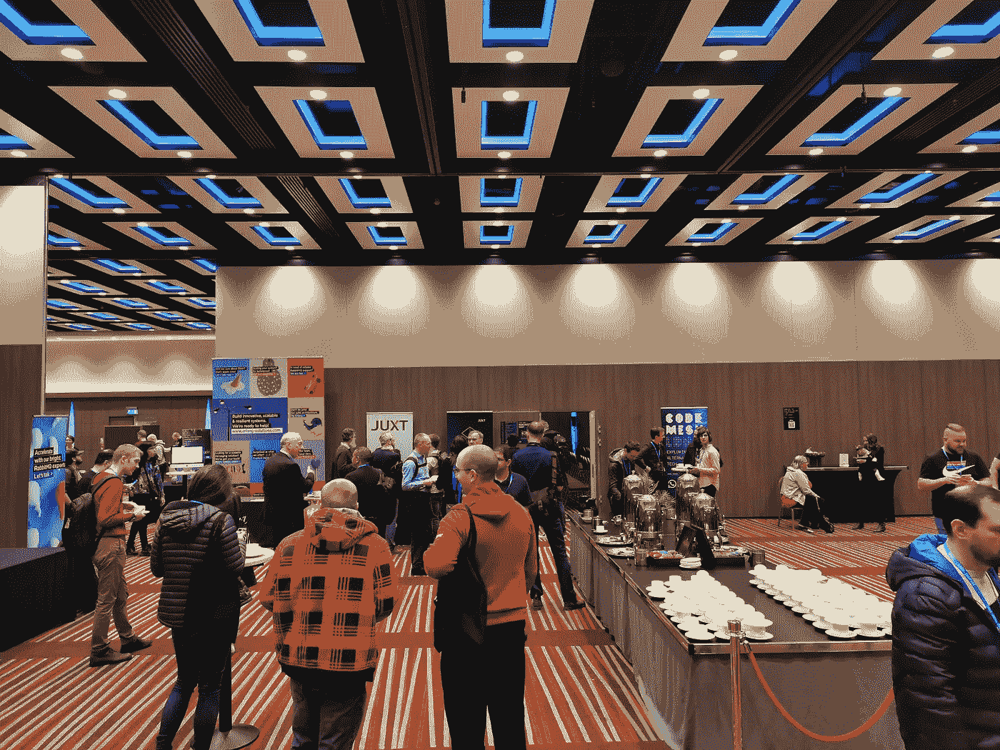
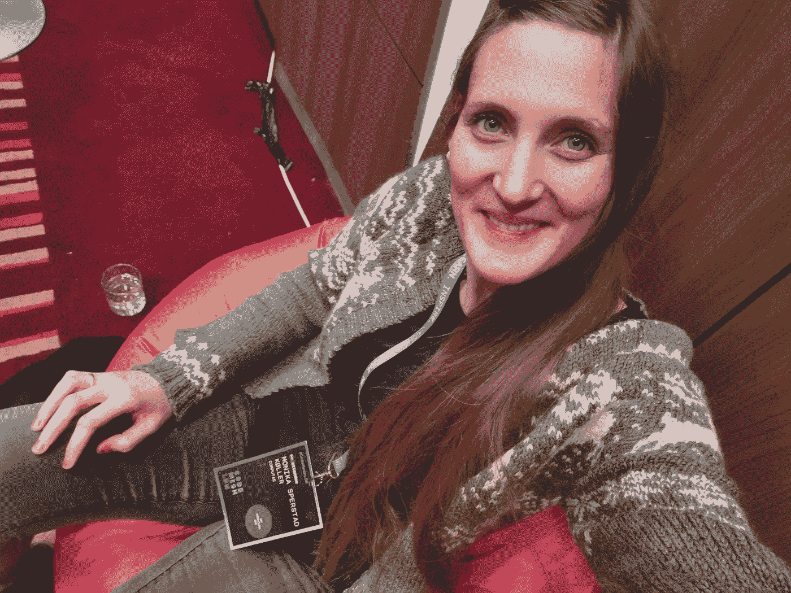
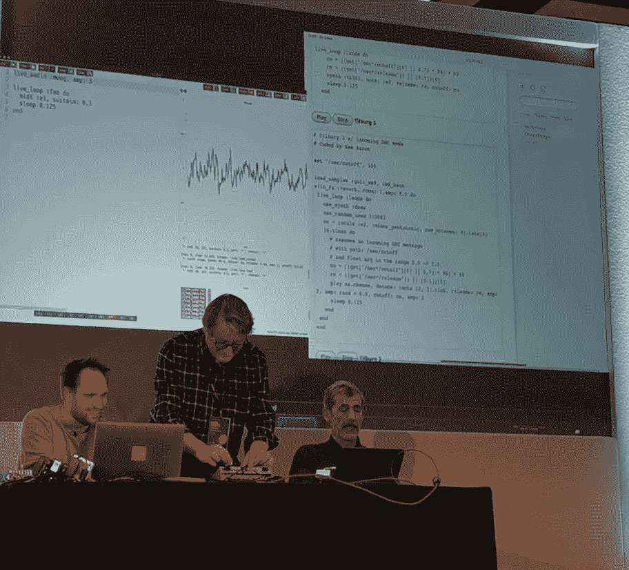

# Ut på tur — denne gangen til Code Mesh

> 原文：<https://medium.com/compendium/ut-p%C3%A5-tur-denne-gangen-til-code-mesh-8c008c9ac648?source=collection_archive---------2----------------------->

I år har jeg gått crazy bananas og meldt meg på konferansen [Code Mesh](https://codesync.global/conferences/code-mesh-ldn/) , som i år blir holdt i London 7.-8\. november. Dette er “ *The Alternative Tech Conference* ” som er for “ *people looking to scale up, find the holy grail, or search for a more satisfying career in programming* ”, og jeg er mildt sagt spent! Jeg er spent på størrelsen, jeg er spent på folkene, jeg er spent på temaene, og ikke minst er jeg spent på å kjenne om motivasjonen spirer eller om jeg vil føle meg druktet i alt for mye kompliserte greier.

Hvorfor i alle dager fikk jeg så lyst til å dra til Code Mesh i år? Jeg har deltatt på noen andre konferanser, og snakket med kollegaer og venner i miljøet om konferanser de har vært på, og Code Mesh har ikke vært nevnt så mye. Så hva fikk meg til å tenke på denne konferansen i år? For noen år siden møtte jeg [F#](https://fsharp.org/) . Det var et helt brutalt møte! Jeg fikk flashback til første året mitt på Universitetet, forkurs i Informatikk, et kurs for oss som skulle lære oss å programmere på universitetet uten å ha sett noe kode før. Dvs. jeg følte meg helt på jordet! Siden da har jeg tatt noen steg inn i funksjonell programmering nå og da, men aldri helt fattet det. Jeg tror det er noe grunnleggende der jeg ikke helt har klart å forstå. Dette er en av grunnene til at jeg vil til Code Mesh. Deres eget sitat “ *[…] bringing together users and speakers of different functional programming languages […]* ”, traff meg.

# Forberedelsen

Jeg er forberedt på at dette kommer til å bli faglig tøffe dager. Det er grunnen til at jeg denne gangen skal komme mer forberedt enn jeg vanligvis gjør. Jeg har sett på programmet, lest meg opp på en del av de forskjellige presentasjonene som skal holdes, og kommet opp med en foreløpig plan.

Den første presentasjonen jeg har planlagt å se er “ *Literary Theory Looks At Readable Code* ”. Hvem blir ikke giret av “ *We want to minimize misunderstandings in our code* ” og “ *We want that our abstractions, our models, make sense to others* ”. I seksjonen etter har jeg et interessedilemma. Enten et filosofiskt avbrekk for å tenke på “ *What is a computer program* ”, eller et krevende dypdykk i [CRDT](https://en.wikipedia.org/wiki/Conflict-free_replicated_data_type) og distribuerte systemer med låsefrie databaser. Jeg som ikke en gang visste hva CRDT var før jeg måtte lese meg opp på det nå!

Etter en lunsj ligger det perfekte foredraget og venter. Introduksjon til et nytt programmeringsspråk, [Gleam](https://gleam.run/) . Det gleder jeg meg til! Etter det har jeg valgt å ikke lage et nytt interessedilemma og velger å høre om historien bak [Erlang](https://www.erlang.org/) . Dette blir en programmeringsspråk-bolk.

Presentasjonene jeg finner mest spennende i neste seksjon er begge tunge temaer. Det ene handler om abstrakte datatyper og grafer, det andre om å “ *visualize concurrency”* . Siste seksjon gav seg selv, da skal jeg høre på “ *Let’s get more women into computer science* ”. Det vil hovedsaklig ta for seg kvinner i akademia, men jeg tenker det vil være interessant for meg å høre. For noen uker siden, etter [Javazone](https://2019.javazone.no/) som er en stor konferanse i Oslo, hørte jeg på en presentasjon med tittelen “ [*Survival Tips For Women in Tech*](https://2019.javazone.no/program/34e0e842-d2e8-4461-b395-7f7036768802) ”. Det var et skikkelig slag i trynet, og virkelig deprimerende å høre på. Grunnen til det var at det tok opp eksempler fra virkeligheten som ikke eksisterer i min virkelighet. Det har fått meg til å lure på om jeg ikke gjenkjenner kjønnsdiskriminering selv om det er rett fremfor nesen min, eller om jeg er en av de heldigste kvinnene innen IT.

Jeg er overbevist om at jeg på slutten av dagen kommer til å være både utslitt og motivert til å lære mer om minst tre ting jeg lærer den dagen.

Dag to starter med en keynote om AI, er spent på vinklingen i den! Deretter har jeg valgt å se John Hughes fortelle om property based testing. Det mest siden jeg har fått ham anbefalt som en god foredragsholder. Deretter blir det Rust, mer spesifikt “ *how Rust gives you superpowers* ”. Hvordan kan det ikke bli gøy!

Neste seksjon er enda ikke helt spikret fra planleggerne så den får jeg vente med å velge, den etter der og den siste har ingen som trigger interessen min. Tror jeg får ta siste del av konferansen på sparket basert på energinivå og hva jeg evt. vil lære mer om etter dag en og de første presentasjonene på dag to.

# Hvordan det ble

For en start jeg fikk av konferansen! Dette er virkelig mennesker som bryr seg om verden, og som ønsker å gjøre en forskjell for andre.

Nå kan konferansen starte!

## Hvordan var første dagen?

Keynoten tok for seg neste generasjon, barna i verden. Hvordan ruste dem for fremtiden, da i konteksten av vårt fagfelt. I Storbritania har de siden 2008 jobbet med å få computer science inn i grunnskolen, og er nå godt igang.

Deretter skuffet ikke Alvaro Videla med sin presentasjon “ *Literary theory looks at readable code* ”. Formatet han brukte for å presentere er et format jeg virkelig liker! I tillegg var temaet like spennende som jeg trodde det skulle være. Masse sitater opp igjennom tidene, sammenligninger med litteraturen, og bekreftelse, for min del, om at kodekvalitet har noe for seg. Dilemmaet i sesjonen etter løste seg da den ene som skulle presentere ble syk og en annen kom på banen. Det ble derfor presentasjonen “ *The art of challenging assumptions* ” på meg. Her var det mange tips jeg tenker å ta med meg. Ikke bare i jobbsammenheng, men dette gjelder for alt i livet. Det henger sammen med en del av det boken “ [*Thinking, Fast and Slow*](https://www.amazon.com/Thinking-Fast-Slow-Daniel-Kahneman/dp/0374533555) ” tar for seg. Det minnet meg på at jeg har den boken halvlest på padden.

Gleam-presentasjonen var mindre teknisk enn jeg trodde! Detta var en presentasjon av historien bak, med grunnleggende info om BEAM, Erlang og andre ML-språk, og fordeler og ulemper med dem. Vi så på mulige forbedringer, i en industriell kontekst, men ikke konkret på selve språket. Savnet litt å se kode, men fikk samtidig en god innføring i ML-språk og BEAM.

Bjarne Däcker, for en sympatisk type! Masse gode ord til sine kollegaer, og mange gode historier å dele med publikum. Hovedfokuset hans var, som forventet, på forhistorien til Erlang.

Som forventet ble abstrakte datatyper og grafer et tungt tema! Zainab Ali gjorde sitt beste i å snakke tydelig, forklare, gi oss publikum tid til å lese formler og kode, men her slet jeg grunnet manglende forståelse for syntaksen til språket hun illustrerte i. Det var et typet funksjonelt programmeringsspråk kalt [Idris](https://www.idris-lang.org/) , som mange av de i publikumet hadde kjennskap til fra før. Spennende, helt klart! Og motivasjonen for å se mer på språket er definitivt tilstedet! Så dette blir spennende å se mer på når jeg kommer hjem. For nå funderer jeg på hvordan jeg selv hadde implementert en direkte graf med metoder for å traversere rundt der metodene hadde garanti for at de alltid terminerte.

Siste presentasjon for dagen var en presentasjon jeg gruet meg litt til etter mitt forrige møte med temaet. For en dame! På saken, viser til forskning, bruker humor, bruker sitt eget liv som tidsreise, og snakker om konkrete fakta. Ikke noe “hjelp, full panikk”, men heller “dette vet vi, så hva kan vi gjøre med det”. Igjen blir jeg påminnet at boken “ *Thinking, Fast and Slow* ” tar for seg så viktige temaer, ubevisste biases.

Hva lærte jeg, ble jeg mer motivert til å lære mer om tre ting etter i dag? Ja, helt klart! Jeg må se mer på funksjonell programmering, må lese mer forskning på kodekvalitet, og ikke minst bli mer bevist mine egne biases.

## Dag to — kan ikke klage på noen ting!

Mine forventninger til keynotes har ikke blitt innfridd på denne konferansen. Igjen var det et alvorlig tema, men denne gangen mer dystert og presentert med mindre energi enn første dagen. Hun som presenterte klarte ikke helt å få meg ombord i skipet hun styrte, og det ble en litt langdrøyd start på dagen.

Property based testing, hvem kunne tro det var så motiverende og engasjerende å høre på? John Hughes er en fantastisk presenterer! Studentene som har han som underviser er heldige. Han tok oss igjennom eksempler som han beskrev godt og forklarte fordeler og ulemper med. Han gav konkrete tips, og jeg tror at alle i rommet som programmerer rene funksjoner (“pure functions”) ble rustet til å skrive property based testing for å få opp sikkerheten i at koden gjør som forventet.

Nedslående nyheter om at presentasjonen jeg hadde valgt, “ *Convincing your manager to let you try Rust* ” ble avlyst 5 minutt før det skulle holdes. Heiv meg inn på “ *Breaking Black box AI* ” holdt av Evelina Gabasova og heldigvis var det noen tekniske problemer i starten så jeg fikk lest meg litt opp på temaet. Snakk om flaks, denne presentasjonen var interessant, morsom og Evelina var veldig flink! Her ble forskjellige AI-metoder illustrert med live-demoer, der fokuset var på hvordan manglende kunnskap om metodene og/eller dataene dine kan gjøre at resultatet av prediksjonene dine blir helt feil. Noen eksempler hun viste til var bildeanalyse.

Etter lunsj kom valget på “ *In defence of uncertainty* ”. Den presentasjonen plukket opp tråden fra presentasjonen jeg var på før lunsj. Abeba Birhane pekte på konsekvensene av at vi, som utviklere, lager en forenklet modell av verden. En modell vi vet er feil, for vi må gjøre forenklinger for å klare å lage en løsning. Hvordan vi forenkler er påvirket av hvordan vi tenker, og dermed også våre fordommer. Siden modellene ikke representerer den virkelige verden helt korrekt, hvordan kan vi da forvente at algoritmer vi kjører på disse modellene gir oss riktige svar? Dataene vi putter inn i modellene blir her også pekt på som en påvirker av resultatet i uventet, og ofte uheldig, retning. Å basere seg på historisk data for f.eks. å filtrere ut kandidater som passer til en spesifikk jobb vil bli påvirket av f.eks. kjønn dersom de historiske dataene inneholder kjønn. Et annet spørsmål er, hvorfor kjører vi disse algoritmene? F.eks. algoritmer for å finne ut legningen til en person. Hva får vi ut av det? Mange spennende spørsmål som får en til å tenke.

Seksjonen etter ble brukt til å summe meg i en sakkosekk i mingleområdet.

En pust i bakken for å prosessere alle inntrykk

Siste presentasjon ble “ *Your brain on Software Development* ”, en presentasjon som ble lagt inn i programmet bare dager før konferansen startet. Det ble en litt kaotisk presentasjon, der mye skulle bli sagt uten at jeg helt forsto sammenhengen. Tror hensikten var å gjøre oss mer beviste på hjernens innflytelse på jobben vår som utvikler, der hun som presenterte også kom med tips til hvordan vi kunne utfordre “gamle vaner”.

Hele konferansen ble avsluttet med en keynote (før farewell drinks og siste mingling). Keynoten ble en hyllest til [Joe Armstrong](https://en.wikipedia.org/wiki/Joe_Armstrong_(programmer)) som gikk bort tidligere i år. Han var en hyppig speaker på konferansen, og det virket som om de fleste på konferansen kjente han. Hyllesten ble gjort på en veldig fin måte der noen av hans tidligere arbeidspartnere fortalte noen historier for deretter å avslutte med å spille musikk sammen.

En del av hyllesten til Joe Armstrong

# Frister det til gjentagelse?

Det er ingen tvil om at dette var konferansen for meg! Passe størrelse, ca 350 besøkende, variable temaer, ca 35 presentasjoner, engasjerte og sosiale mennesker, og ikke minst mye kunnskap samlet under samme tak! Så ja, dette frister veldig til gjentagelse!