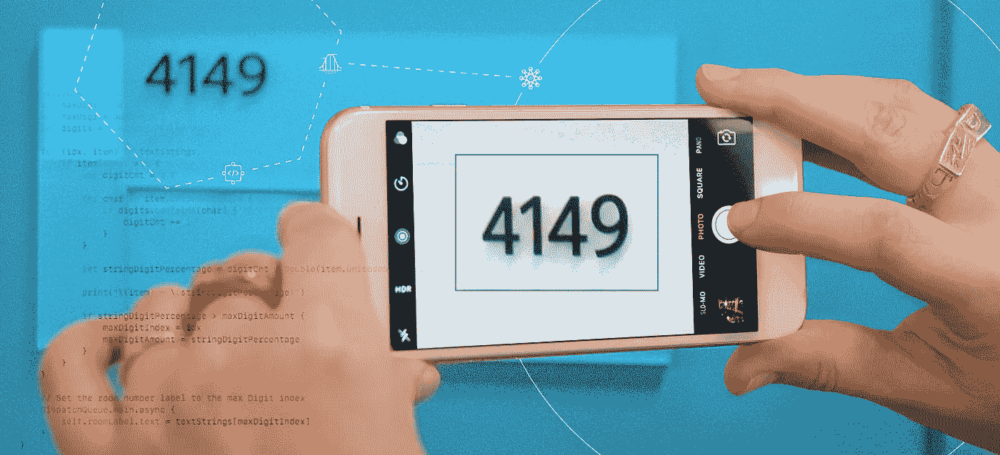
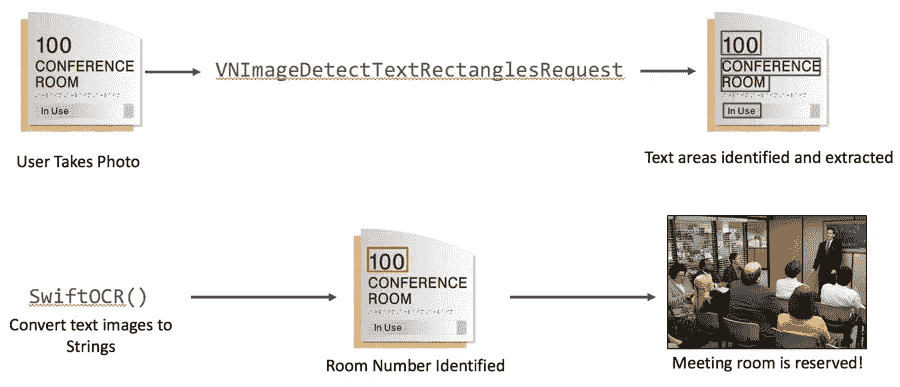
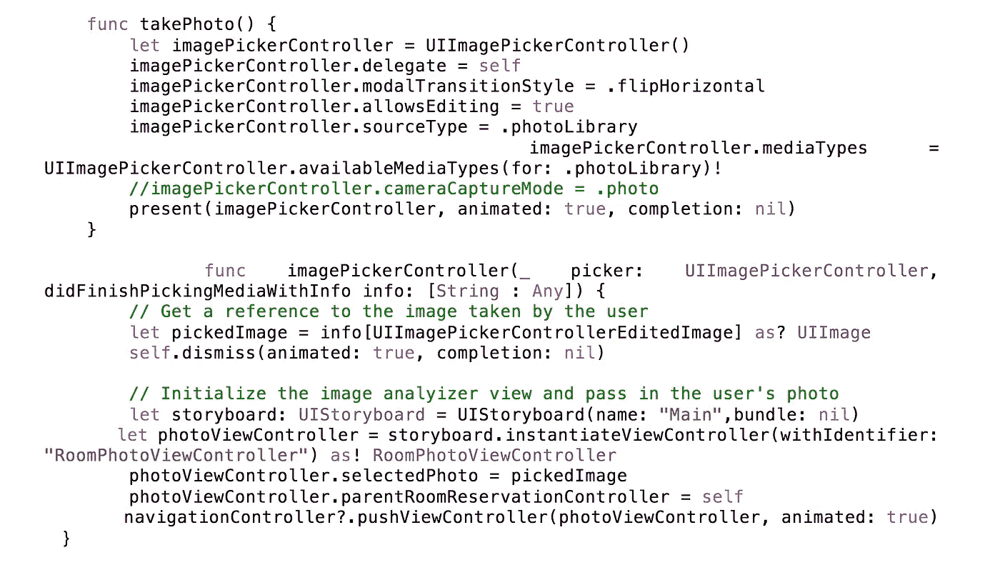
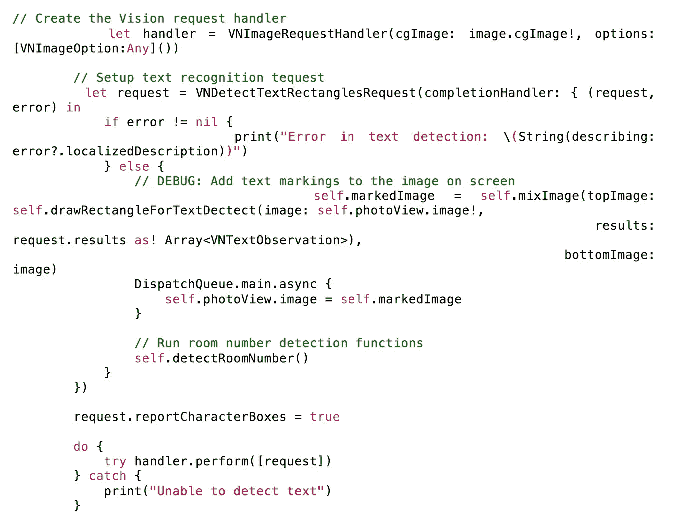
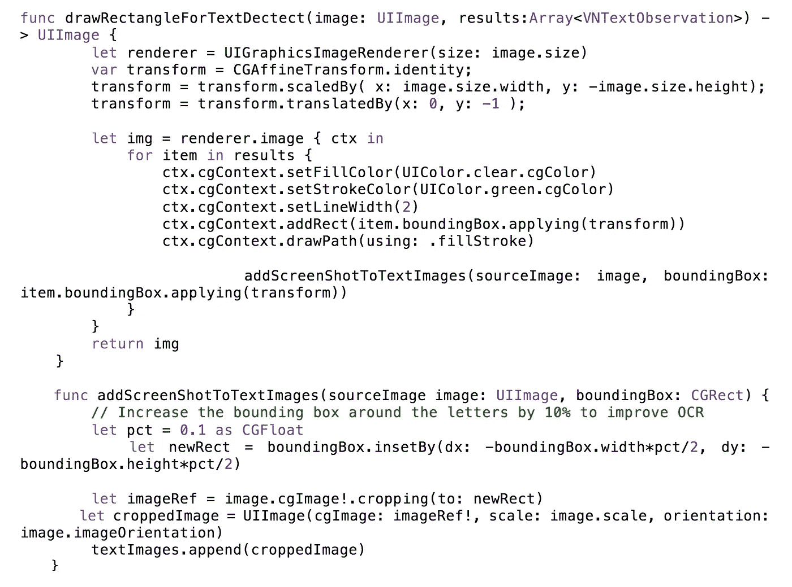
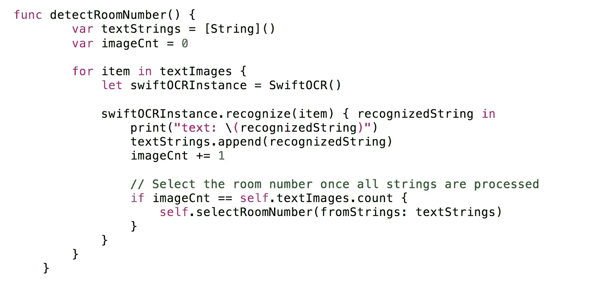
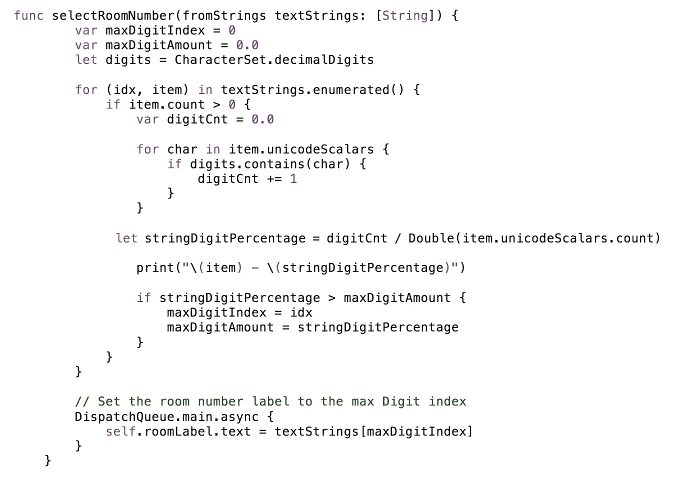
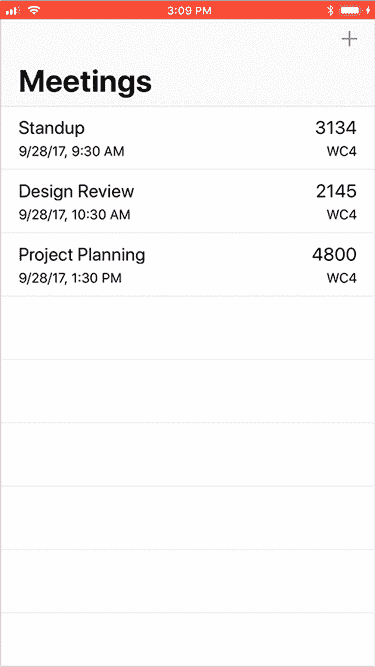

# 在 iOS 的 ML 框架中利用机器学习

> 原文：<https://medium.com/capital-one-tech/utilizing-machine-learning-in-the-palm-of-your-hand-with-ioss-ml-frameworks-60d97f96e8fd?source=collection_archive---------1----------------------->

第一资本公司首席软件工程师凯文·费雷尔

今年早些时候，苹果在 iOS 11 中推出了新的机器学习(ML)框架——Core ML 和 Vision——使开发人员能够轻松直观地将 ML 模型融入他们的应用程序，提高用户的速度、能力和整体体验。作为 Capital One 内部移动应用团队的开发人员，我想尝试一个用例来实现这些新框架，这将与我对改善员工工作场所体验的关注相结合。

## 使用案例

像许多拥有开放工作空间的大公司一样，Capital One 的员工预留了大量会议室；临时会议往往会导致最后一分钟的争夺，以确保一个空间。如今，这要求员工要么使用桌面应用程序来找到可用的房间，要么“蹲”在看起来空无一人的房间里，希望其他团队没有预订它。

为了解决这个问题，我们的团队正在开发一个新的移动应用程序，以使预订会议室的过程更加简单和简化。计划中的功能之一是通过照片预订房间，这将使员工能够拍摄会议室标志的照片，以确定它是否立即可用，然后直接通过他们的手机预订房间(再也不会被赶出会议室了！).

为了启用这个新特性，我们需要创建两个使用传统编程方法难以实现的函数:

1.  识别用户拍摄的会议室标牌图片中的文字区域；和
2.  将这些文本区域转换为文本字符串，以便它们可以用于预定会议室。

这就是苹果新的 ML 框架的用武之地。

## 行动中的 ML 框架

核心的 ML 和 Vision 软件框架使得合并 ML iOS 应用程序变得很容易。

Core ML 使开发人员能够通过原生对象接口直接在应用程序中使用预训练的 ML 模型，而 Vision 则基于 Core ML 执行 ML 驱动的操作，这些操作集成了设备的摄像头，如人脸检测、对象跟踪和文本识别。

Vision 支持以下现成的操作:

*   脸和面部特征(嘴、鼻子、眼睛等)。)检测
*   条形码检测和处理
*   图像对齐
*   地平线检测
*   目标跟踪
*   **文字检测**
*   定制核心 ML 型号

我在这里加粗了“文本检测”,因为我们将在代码示例中使用它。这里的另一个要点是，Vision 将检测图像中的文本，但不会提供将该文本转换为可以处理的文本字符串的功能。要将图像转换成字符串，我们需要使用另一个 ML 模型来识别文本字符。

下面的图表更广泛地概述了我们通过照片预订房间功能的工作流程:

1.  用户在会议室外面拍摄标牌的照片。
2.  照片通过*VNImageDetectTextRectanglesRequest*请求运行，以识别照片中的文本区域。
3.  文本区域被提取成单独的图像用于转换。
4.  这些单独的文本图像使用 *SwiftOCR* 库转换成*字符串*对象。
5.  转换后的字符串被处理以识别被预订的房间号。
6.  房间已在我们的资源系统中预订，随时可以使用！

## 逐步代码

**1。用户拍摄照片** 第一步很简单，使用一个简单的 *UIImagePickerController* 让用户拍摄房间标志的照片。该照片然后被传递到利用视觉框架的*roomtophotoviewcontroller，*。

**2。检测图像中的文本区域** 接下来，我们将使用视觉来识别照片中的文本区域。我们首先创建一个 *VNImageRequestHandler* 并传入照片；请求处理器用于处理视觉请求，并在用例需要时对视频流而不是静态图像进行操作。

然后我们创建一个*VNDetectTextRectanglesRequest，*它接受一个完成处理程序来处理结果。完成处理程序包含一个输入，该输入包含 *VNTextObservation* 结果集，从而识别图像中的所有文本区域。

**3。勾勒并提取文本图像** 现在我们已经有了一个 *VNTextObservation* 结果的数组，我们可以处理它们以准备转换为文本( *VNTextObservation* 结果实质上是一个矩形数组，它标识了 Vision 认为包含文本的照片部分)。

我们的第一个处理步骤是在照片上用一个绿框勾勒出这些图像区域，这样可以更容易地确定正确的文本区域。

接下来，我们将提取包含每个 *VNTextObservation* 项目的文本的图像。

请注意，这里我们提取的是照片中每个相邻的文本区域(即整行文本)。 *VNTextObservation* 数组也包含单独的字符框，但这对于这个用例来说并不需要。

**4。将图像转换成字符串现在我们有了一个图像数组，我们将遍历每个图像并将其转换成一个字符串。这里我们使用*swift OCR*——一个开源库，它使用神经网络 ML 模型来对图像进行字符识别——来执行字符串转换(注意，也可以使用其他库，包括 Google 开发的 Tesseract OCR 模型)。**

**5。识别房间号并预订房间** 此时，我们有了一个从用户照片中提取的文本字符串列表。现在我们将使用这些信息来识别房间号并预订房间。下面的代码使用了一种简单的方法，根据每个字符串中数字与字母字符的百分比来识别房间号。本质上，该函数根据哪个文本区域包含的数字最多来选择房间号。

虽然这是一种过于简单的识别房间号的方法，但我们在这里使用它是为了清楚地展示这个过程的 ML 方面。

## 把这一切联系在一起

下面的演示展示了从端到端的整个过程。正如你所看到的，Vision 正确地识别了绿色方框中的文本区域，这给人留下了深刻的印象，因为照片是从奇怪的角度拍摄的。接下来，SwiftOCR 框架正确地将图像转换为字符串，我们从文本区域组中选择房间号。

## 关键要点

开发我们新的应用程序功能原型让我对核心 ML、视觉以及更广泛地将机器学习融入应用程序有了一些了解:

*   *不要指望把一个 ML 模型放到你的应用程序中，就能看到它活过来*。将核心 ML 结果视为应用决策分析中的单个数据点。
*   *训练 ML 模特很难*。我可以为这个原型使用现有的 ML 模型，但是训练新的模型是复杂的。核心 ML 使合并 ML 模型的过程变得简单，但是对训练新模型没有帮助。
*   *机器学习经常会得到错误的答案*。确保用户有办法覆盖 ML 输入并收集结果，以便可以将反馈重新合并到模型中。
*   *确保你的测试集覆盖了合适的测试用例*。您可以使用自动化测试来评估对 ML 模型的更改，并在继续优化模型训练集时减少回归。

重要的是要认识到，虽然苹果已经推出了强大的新 ML 工具，但替代工具确实存在，可以帮助填补空白。

通用数据源和示例应用程序的所有代码都可以在 GitHub 上的 MIT license [下获得，并且可以自由地重用和修改。](https://github.com/kferrell/RoomFinderPro)

我们期待着这些新的应用程序功能在 Capital One 上启动和运行，并欢迎您的想法、反馈和贡献！

*以上观点为作者个人观点。除非本帖中另有说明，否则 Capital One 不属于所提及的任何公司，也不被其认可。使用或展示的所有商标和其他知识产权都是其各自所有者的所有权。本文为 2017 首都一。*