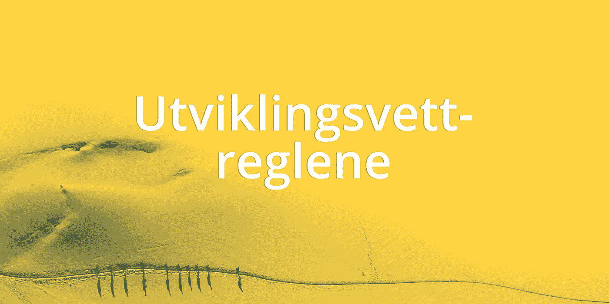

# Utviklingsvettreglene — fjellvettregler for utviklingsprosjekter

> 原文：<https://medium.com/compendium/utviklingsvettreglene-fjellvettregler-for-utviklingsprosjekter-a764a0c2c221?source=collection_archive---------4----------------------->

> Kan fjellvettsreglene brukes for utviklingsprosjekter?

Jeg er ikke et skimenneske, men i anledning påsken lurte jeg på om ikke fjellvettreglene fra Den Norske Turforeningen også kunne gi verdi i utviklingsprosjekter.

Som [Den Norske Turistforeningen](https://www.dnt.no/fjellvett/) sier: *Uansett om du er en fersking eller en dreven fjellvandrer, anbefaler vi at du har Fjellvettreglene med deg på tur — hele året* . Det samme gjelder selvfølgelig **utviklingsvettreglene.** :)

Legg aldri ut på prosjektlangtur uten utviklingsvettreglene (Foto av [Free-Photos](https://pixabay.com/users/free-photos-242387/))

# Utviklingsvettreglene

## 1\. Planlegg bare første del av prosjektturen og meld fra hvor du er til enhver tid.

*Nei, fossefall forkledd som smidig er ikke nok. Du blir ikke smidig bare fordi du har standup, retro og demo!*

## 2\. Tilpass oppgavene etter teamet, ikke omvendt

*Faste team er fantastisk. Og ja, det* ***er*** *faktisk mulig å få til — hvis du tør prøve!*

## 3\. Ta hensyn til utviklingsomgivelsene

*Bruk den teknologien som er best egnet til oppgaven, ikke den du syns er kulest.*

## 4\. Vær forberedt på A-feil, selv på enkle oppgaver

*“Skal bare” er nøkkelen til Pandoras eske (som i dette tilfellet er stappfull av onde bugs).*

## 5\. Ta med nødvendig utstyr for å kunne jobbe effektivt

*IDE’en din kan mer enn du tror — lær noe nytt om den i dag!*

## 6\. Ta trygge veivalg

*I “Bleeding edge” er hovedordet “bleeding”, ikke “edge”. Hot != godt.*

## 7\. Bruk kart og kompass

*Uten et* ***felles*** *målbilde, løper alle i hver sin retning og går seg vill i prosjekt-påskefjellet.*

## 8\. Vend i tide, det er ingen skam å snu

*“Vi har alltid gjort det sånn” er roten til alt ondt.*

## 9\. Spar på kreftene og søk ly om nødvendig

*Selv om du syns programmering er det gøyeste i verden, blir du sliten likevel. God jobb-fritidsbalanse er alfa og omega.*