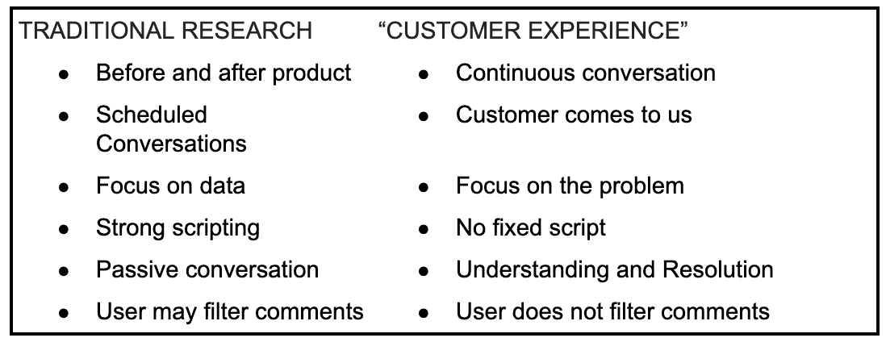
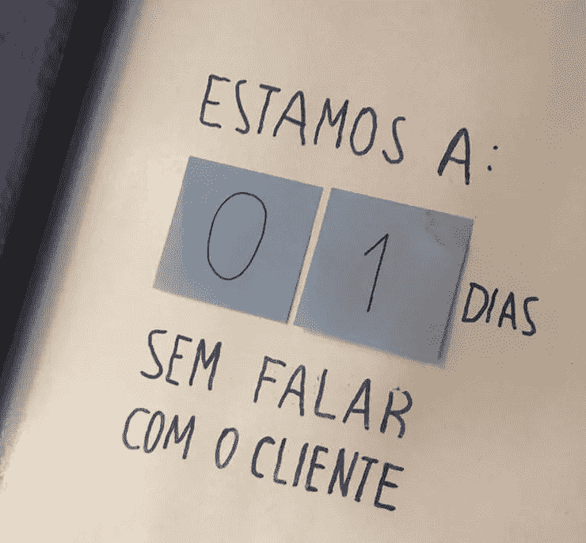

# UX 作为客户服务

> 原文：<https://medium.com/google-developer-experts/ux-as-customer-service-bbe9ba64bf0f?source=collection_archive---------4----------------------->

Photo by: Jan Kroon

## 持续的研究方法

*作为设计师，我们经常被看作是在电脑上戴着花哨耳机的人；这需要改变。我们为人服务，为了帮助他们，我们需要更亲近；这篇课文讲的就是这个。这是我用敏捷、协作和以人为本的方法为老年人开发数字产品的经历。*

你有没有想过用户反馈需要多长时间才能到达你或开发团队？

我有过，但我承认那是在我遇到一种持续研究的新方法之后，这种简单而自然的方法让我想知道为什么它不是到处都有。尽管我很想说我是一切的作者，但这一切的发生都是因为各种因素的完美结合:敬业和混合的团队以及与客户的近距离接触。

我在这里所做的只是分享这些知识。

一般来说，在较大的公司中，消费者不仅在物理上远离开发人员，而且有时看起来整个组织与客户背道而驰，这使得客户关系领域很难与产品设计和开发团队直接分享他们的经验。

整个客户前线通常分为销售、支持和售后三个部分，这更加剧了这种分散，并可能丢失对公司打造更好产品至关重要的宝贵信息。

最后但同样重要的是，这些团队更关心销售、支持产品或服务的使用，或者快速解决问题。他们在销售方面有不同的业绩指标，比如服务的人数，有时甚至服务的周期时间都让人担心。他们不太可能记下客户在电话或谈话中可能提出的每一个观点。

# 团队和需要解决的问题

银行在数字化过程的初始阶段雇用了我；这是我参加的第一个开发团队。换句话说,“团队”这个词指的是不同类型的专业人士，他们拥有互补的技能，组织起来攻击单一产品。

团队的所有成员都是公司的新员工，团队完全围绕敏捷软件开发构建；我的意思是，我们遵循 scrum 方法论，按照书上的方法执行所有的仪式，比如日常的 scrum，sprint 规划，然后开始以对我们更有意义的方式重新命名每一个，同时适应新的动态，比如设计 sprint 方法来产生想法，绘制草图和做出决定。

该产品是工资贷款，一种通过工资折扣支付的贷款；这正是为什么它为银行创造了更低的风险，并转化为更低的利率，这是退休人员、退伍军人、养老金领取者和公务员普遍采用的方式。

绝大多数用户年龄在 50-78 岁之间。我们最大的挑战之一是为老年人开发一个可访问的解决方案，因为他们中的许多人第一次拥有智能手机，很少或从未接触过数字世界和 Instagram 等应用程序。

经过一个阶段的研究和许多原型，我们开始了我们的最小可行产品(MVP)，这是第一个以移动用户为中心的软件版本，它综合了一整套要验证的假设，具有交付客户价值的必要功能。

一切都好，对吧？不完全是。

第一个版本在美学上非常优秀，值得在运球(设计师社区)上一页。尽管如此，在第一个接受测试的客户身上，我们意识到这只是审美。我们和第一个、第二个以及第三个客户谈过，一个疯狂的想法浮现在我们脑海中:重新设计所有的屏幕，不使用任何卷轴。

这是有道理的，因为 10%的顾客甚至不使用脸书，但他们使用 WhatsApp，在那里滚动是自动的。结果很快就出来了，我们意识到通过更接近我们的观众，我们可以学到更多的东西。

更重要的是，每次谈话都给我们带来新的东西，而且越来越多，它们在我们的日常生活中变得越来越固定。

# 这样或那样的日常对话

在某一点上，我们的 MVP 得到了一个小小的“帮助”按钮，通过点击它，用户可以选择使用 WhatsApp 或直接向我的办公桌打电话；就在那时，事情开始变得有趣起来，因为顾客开始直接向我们走来。

我们有一部专用电话，所以团队中的每个人都知道，来电意味着客户有问题或投诉，如果我们能够仔细倾听，每次都有一个独特的机会来了解我们的产品。

该产品仅面向该银行的部分客户群，这保证了有足够的线索产生足够的反馈，但还不至于需要有人专门负责。它有一个理想的平衡，事实上，我们在正确的数字。

该团队的产品负责人(PO)是一个独特的人，他几乎没有技术经验，但在银行工作了十多年，对人有着难以置信的同情心。除此之外，他说他讨厌“用户”这个词，因为这对他来说意味着消极和遥远的东西(我现在同意这一点)，也许这就是为什么当他接听电话的第一个电话时，他说:

> “早上好！巴拉那银行，客户体验。有什么可以帮你的吗？”

在没有意识到的情况下，他说出了我们的名字，从那一刻起，我开始意识到我们做的事情略有不同，略有改善。

从那一刻起，我决定将我们所做的一切与传统的 UX 研究进行比较，并创建了以下表格:

几天后，在我接的第一个电话中，我还没有完全了解银行的所有流程，所以我请求帮助解决问题，但我已经能够识别并分类它们。

这一快速流程改变了用户反馈的动态，不仅大幅增加了反馈的数量，还提高了反馈的质量，从而在我们不希望在银行内部发现的领域产生结果。

在其中一次对话中，我们发现了一个只出现在三星手机默认出现的所谓“互联网”浏览器中的漏洞，我们从未测试过这个漏洞，但它影响了很多用户。

试着想象一下，有人会这样说:

> “问题出在我的互联网上”

我们发现的错误在同一天解决了，3 个小时后，第二天，通过我们跟踪的转换漏斗的人数发生了即时变化。

"We are 01 days without talking to customers" — Inspired by Rafael Burity

我注意到的一点是，当人们来到你面前，认为你是某个服务台时，他们会更加诚实，这可能不仅仅是因为他们在那一刻仍然感到痛苦(正确的时间)，还因为设计面试使人们使用更好的词语(也不太精确)，试图更加礼貌，不伤害你的感情。

一件自然而然的事情是请求客户允许与说话者交谈；这个想法是让整个团队意识到一个问题；这也通过为每个人带来责任而增加了同理心。

大多数时候，这些对话会引发一些讨论，讨论什么更好、更快或更容易理解；我们还试图将这个电话与一个角色和一大群可能有同样经历的人联系起来。

这些对话可以分为:

需要修复的错误；
·可用性调整；
·产品洞察；
新功能。

# 流动

## 1.需要修复的错误

任何太关键或太快而无法解决的失败不一定会进入冲刺阶段，如果努力更重要的话。它将根据优先级映射到每周冲刺。

## 2.可用性调整

其他的一切都记录在便利贴上，放在显眼的地方，并在 sprint 规划之前每周作为“设计见解”提交给团队。我们调整了这些用户的需求，以及它们在后续开发冲刺中的分配方式。

举例来说，可用性调整就像 bug 一样，小到描述，大到改变一个完整的元素，几乎总是成为下一个 sprint 的任务。

## 3.产品洞察

你知道当有人告诉你一件事会改变一切吗？

偏偏发生了这样的事情。洞察是做事情的新方式:它可能是一个更短的用户流，一种更自然的交流形式。产品在时间上的优先顺序与我们对改进的感知和产生的洞察力有关；如果是简单的事情，比如一个文本或按钮的改变，改进可以在同一天发生，如果是更复杂的事情，比如一个新的用户流，洞察可能会成为下一个 sprint 的用户故事，甚至是产品 backlog 中的一个项目。

## 4.新功能

这可能是最罕见的情况，因为我们已经在 backlog 中映射了很多特性，其中一些因为新的见解而被优先化。

每个新功能都需要讨论，有时我们回到构思过程，他们中的一些人使用我从 Sprint Design 中提取的疯狂⁸方法，这是一个通过创造新想法让整个团队一起工作的好机会。

我们使用了设计冲刺阶段的许多方法；我们发现它们可以很容易地适应敏捷软件开发的现实。尽管如此，也许这一点是另一篇文章的主题。

# 结论

通过这种方法产生的日常对话可以改变团队的整体看法，建立共鸣，使我们更加了解不同类型受众的需求和愿望，以及有助于更快改进产品的客户反馈量。

“客户体验”方法保证了更真实的反馈；毕竟，越来越清楚的是，当人们接受采访时，他们会消除缺点，当我们将自己视为客户体验团队时，会产生完全不同的反馈。

但在我看来，最大的亮点是团队精神，对问题和客户越来越负责任的意识，对每个功能、每个设计元素和我们实现的每一行代码所产生的价值的更多同情和责任。

如果你知道人们依赖于此，你会更加关心；你看到这些人，你倾听他们，你知道他们的生活可能取决于你；它改变了你对自己所做事情的看法。

你也应该试试！

*感谢 Ricardo Porciúncula 为该方法的发展做出的贡献，感谢世行行长 Cristiano Malucelli 愿意在此分享这些经验，当然，还要感谢最初的 PB 团队:*

*雷纳托、栾、若昂、法比奥、比尼、木村、瓦格纳、梅吉、布鲁纳和爱德华多。你真棒！*

*参考资料:
(1)如果你有兴趣了解更多关于小队组织的知识，我推荐 Henrik Kniberg 和 Anders Ivarsson 写的《用部落、小队、章节& Guilds 扩展敏捷@Spotify》一文。*

*(2)设计冲刺(Design Sprint)是一种方法论，用于开发一个假设，建立一个想法的原型，并在现实环境中以尽可能少的投资，以协作和时间受限的方式快速测试它。*

*(3)“疯狂 8”是设计冲刺的一种速写方法，由将一张纸折成八个空格，在 8 分钟内速写八个创意组成。*

本文之前发表于:
[www.design2020.com.br](https://www.design2020.com.br/)