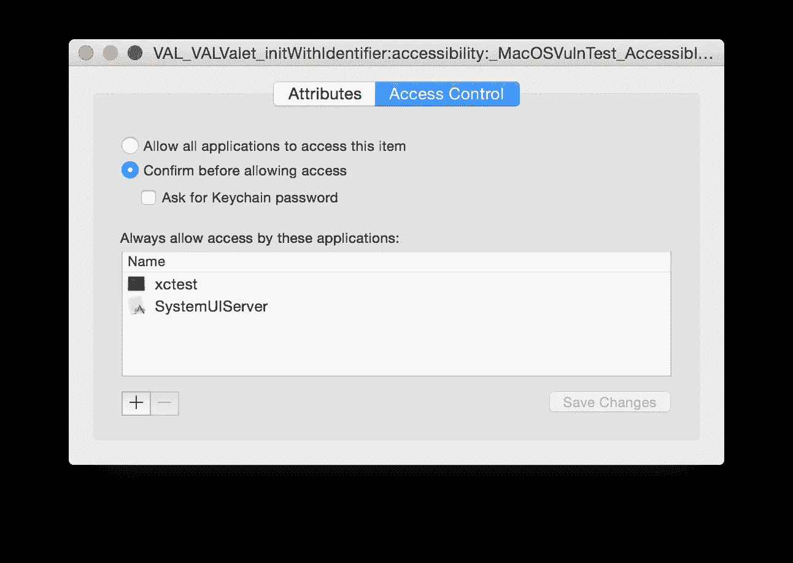
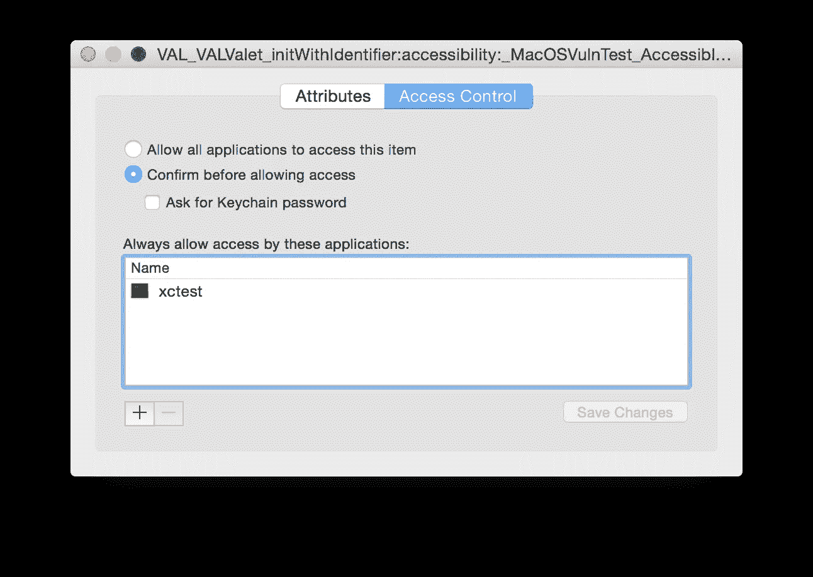

# 代客击败 OS X 钥匙链访问控制列表零日漏洞

> 原文：<https://medium.com/square-corner-blog/valet-beats-the-os-x-keychain-access-control-list-zero-day-vulnerability-3c45840c5b7f?source=collection_archive---------2----------------------->

## 我们如何使用测试驱动开发来复制攻击媒介并强化我们的代码来对抗它

> 注意，我们已经行动了！如果您想继续了解 Square 的最新技术内容，请访问我们的新家[https://developer.squareup.com/blog](https://developer.squareup.com/blog)

*写的* [写的*丹费德曼*](https://medium.com/u/5755ab427632?source=post_page-----3c45840c5b7f--------------------------------) *。*

# 世界着火了

[6 月 17 日，The Register 报告](http://www.theregister.co.uk/2015/06/17/apple_hosed_boffins_drop_0day_mac_ios_research_blitzkrieg)iOS 和 OS X 钥匙链中存在一个零日漏洞，危及储存在钥匙链中的安全数据。这篇文章声称，写入钥匙链的数据可能会被恶意应用程序读取。在 Square，我们编写移动资金的 iOS 代码。[安全性](https://squareup.com/security)始终是我们的第一要务，我们非常重视这些声明。如果这篇文章的断言是正确的，世界正在着火。

当我们在太平洋时间上午 8 点后意识到这个漏洞时，我们立即打开了描述攻击的[文件。我们发现攻击的工作原理如下:](https://drive.google.com/file/d/0BxxXk1d3yyuZOFlsdkNMSGswSGs/view)

1.  恶意应用程序会在钥匙串中搜索良性应用程序写入的密钥。恶意应用程序可以看到密钥的存在，但无法读取相关的秘密值。
2.  恶意应用程序会删除良性应用程序写入的密钥。
3.  然后，恶意应用程序将密钥添加回不带值的钥匙串，并将自己和良性应用程序添加到密钥的[访问控制列表](https://developer.apple.com/library/mac/documentation/Security/Conceptual/keychainServConcepts/02concepts/concepts.html#//apple_ref/doc/uid/TP30000897-CH204-CJBIBIBC) (ACL)，从而允许恶意应用程序读取良性应用程序后来写入这些密钥的任何秘密。

在这一点上，我们可以松一口气了:访问控制列表只存在于 Mac OS X——不存在于 iOS——所以尽管标题如此，**我们的应用程序并不容易受到攻击。然而，两周前我们刚刚开源了[代客](https://corner.squareup.com/2015/06/valet.html)，一个跨平台的钥匙链包装器，它的 OS X 组件很容易受到攻击。这对我们来说是不可接受的，所以我们加强了对这次攻击的防范。**

# 有毒的工具

Apple 的钥匙串只提供三种更新钥匙串的工具:添加、更新和删除。但我们现在知道，在 OS X，更新本身就不安全。我们不能相信 Keychain 中的现有密钥没有被破坏的访问控制列表。因此，我们只剩下添加和删除。

解决方案似乎显而易见。当更改钥匙串中某个项目的值时，不要更新现有的钥匙串条目，而是删除现有的项目，然后添加一个新项目。

但是[苹果的文档](https://developer.apple.com/library/mac/documentation/Security/Reference/keychainservices/index.html#//apple_ref/c/func/SecKeychainItemDelete)说得很清楚:不要先删除再添加——永远更新。为什么？因为“当您删除钥匙串项目时，您会丢失用户或其他应用程序添加的任何访问控制和信任设置。”虽然这听起来不吉利，但这正是我们想要的效果。更好的是，这个警告不适用于 Valet，它使用安全的[共享访问组](https://github.com/square/Valet/blob/master/README.md#sharing-secrets-among-multiple-applications)而不是 ACL 来共享 OS X 和 iOS 上的钥匙串值。

# 检验假设

我们的第一步是编写一个单元测试来检验我们的假设。我们希望测试尽可能模拟攻击；因此，我们首先将一个密钥插入在 ACL 中有多个应用程序的钥匙链中。使用与我们的测试 VALValet 相同的基本查询来添加这个受损的密钥，以便我们的 Valet 能够读取和写入受损的密钥。

```
VALValet *****valet **=** [[VALValet alloc] initWithIdentifier:@"MacOSVulnTest" accessibility:VALAccessibilityWhenUnlocked];

NSString ***const** vulnKey **=** @"AccessControlListVulnTestKey";
NSString ***const** vulnKeyValue **=** @"AccessControlListVulnTestValue";*// Add an entry to the keychain with an access control list.*
NSMutableDictionary *****keychainData **=** [valet.baseQuery mutableCopy];
keychainData[(**__bridge** **id**)kSecAttrAccount] **=** vulnKey;
keychainData[(**__bridge** **id**)kSecValueData] **=** [vulnKeyValue dataUsingEncoding:NSUTF8StringEncoding];

SecAccessRef accessList **=** NULL;
SecTrustedApplicationRef trustedAppSelf **=** NULL;
SecTrustedApplicationRef trustedAppSystemUIServer **=** NULL;
XCTAssertEqual(SecTrustedApplicationCreateFromPath(NULL, **&**trustedAppSelf), errSecSuccess);
XCTAssertEqual(SecTrustedApplicationCreateFromPath("/System/Library/CoreServices/SystemUIServer.app", **&**trustedAppSystemUIServer), errSecSuccess);
XCTAssertEqual(SecAccessCreate((**__bridge** CFStringRef)@"Access Control List",
                               (**__bridge** CFArrayRef)@[ (**__bridge** **id**)trustedAppSelf, (**__bridge** **id**)trustedAppSystemUIServer ],
                               **&**accessList),
               errSecSuccess);

keychainData[(**__bridge** **id**)kSecAttrAccess] **=** (**__bridge** **id**)accessList;
XCTAssertEqual(SecItemAdd((**__bridge** CFDictionaryRef)keychainData, NULL), errSecSuccess);
```

一旦我们运行了这段代码，我们就会在钥匙链中看到受损的值。



现在我们有了一个折衷的值，我们更改了 OS X 上的代客代码，在 setObject:forKey:上调用 SecItemDelete，然后调用 SecItemAdd。然后，我们在测试中添加了以下几行:

```
*// Update the vulnerable keychain value with Valet, and see that we have deleted the existing keychain item (rather than updating it) are therefore no longer vulnerable.*
NSString ***const** vulnKeyOtherValue **=** @"AccessControlListVulnOtherTestValue";
[valet setString:vulnKeyOtherValue forKey:vulnKey];
```

运行该代码后，我们看到该值不再受到损害。



然后我们添加了[几行代码](https://github.com/square/Valet/blob/master/ValetTests/ValetTests.m#L324)以编程方式测试受损的 keychain 条目确实在 setString:forKey 上被删除了。我们在我们的 Mac OS X Yosemite 机器上本地运行了测试——它通过了，我们推了！

# 还不清楚

然后令人惊讶的事情发生了。我们的 CI 测试失败了。具体来说，以编程方式测试受损的钥匙串条目是否已被删除的那一行出现了故障。我们的开发环境和 CI 环境之间最大的区别是[Travis CI](https://travis-ci.org/)——我们为公共 GitHub 项目提供的 CI 解决方案——运行的是 Mac OS X Mavericks (10.9)而不是 Yosemite (10.10)。所以我们在办公室里找到一台还没有升级到 Yosemite 的机器，在本地运行测试，瞧！我们的测试在同一个地方失败了。

经过一些实验和谷歌搜索，我们发现在 Yosemite 之前，SecItemDelete 实际上并没有删除与 ACL 相关联的钥匙串项目，尽管返回代码表明它已经成功。这意味着我们的补丁无法在 10.9 上运行，因为当有人恶意地将 ACL 添加到您的钥匙串项目时，就会出现漏洞。

我们在 10.9 版本的机器上简单地试验了使用 SecKeychainItemDelete(它确实能够删除带有 ACL 的项目)，但是随后发现 SecKeychainItem*和 SecItem*不能很好地配合使用。因此，我们没有使用 SecKeychainItem*为 10.9 重写所有的代客，而是将代客的最低版本提升到 10.10。

# 打补丁了！

在意识到这个漏洞后仅仅 8 个小时，我们就成功地为代客打了补丁。在 Mac OS X 上使用代客服务的开发者对黑客攻击免疫。

你觉得我们错过了什么吗？通过向[提交问题](https://github.com/square/Valet/issues)或向[提交针对](https://github.com/square/Valet/pulls)[代客](https://github.com/square/Valet)的公关来通知我们。如果您有兴趣为 10.9 版本创建 SecKeychainItem*解决方案，我们希望收到您的来信！

[](/@dfed) [## 丹·费德曼

### 请关注丹·费德曼在 Medium 上的最新活动。57 个人在关注丹·费德曼，看看他们的故事…

medium.com](/@dfed)