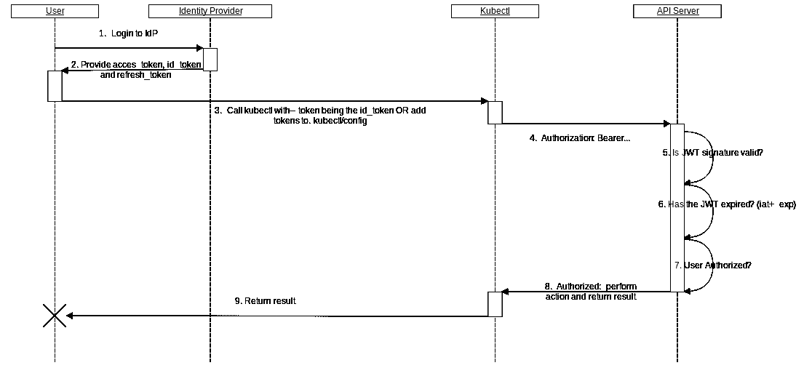

# Vanilla Kubernetes 深入的用户验证和授权

> 原文：<https://medium.com/globant/vanilla-kubernetes-user-authentication-and-authorization-in-depth-b26ec2626734?source=collection_archive---------0----------------------->

# 介绍

你好，

在本文中，我们将讨论 K8s 中最有争议的话题之一，它将解决许多关于用户认证和授权的未解问题。

当您管理普通 K8s 集群时，您需要解决一些问题，如入口服务、负载平衡、分布式存储和用户管理，然而，在本文中，我们将主要关注 RBAC。

用户[认证&授权](https://auth0.com/docs/authorization/authentication-and-authorization)，简单来说，就是验证用户是谁，验证他们可以访问什么，我们将在集群中使用 [RBAC](https://kubernetes.io/docs/reference/access-authn-authz/rbac/) 进行授权。

Kubernetes 可以使用客户端证书、无记名令牌、代理或 HTTP 基本身份验证，所有这些方法都将由 API 服务器进行验证，API 服务器用于身份验证的属性如下:

*   用户名:这是一个标识用户的字符串，在所有用户中应该是唯一的，(例如[admin@example.com](mailto:admin@example.com)，我的用户 id，x24diausu=，等等。)
*   UID:与 Username 的作用相同，但是它试图比后者更加一致，如果可能的话，你应该给它们赋予相同的值
*   Groups:一组字符串，以逻辑方式表示 K8s 中用户集合的成员关系，通常用于给组加前缀，例如`system:masters`或`oidc:devs`
*   额外字段:包含额外信息的字符串映射，可以被插件、连接器等使用。

kubernetes 的文档建议至少使用两种方法:

*   附加到 pod 的服务帐户的服务帐户令牌
*   至少另一种用户认证方法。幸运的是，我们将介绍 3 种方法。

废话少说，让我们切入正题。

我们将展示以下方法:

1.  **CSR(证书签名请求)方法**
2.  **WebToken 方法**
3.  **OIDC (OpenID 连接)方法**

# 资源

我们将使用[回购](https://github.com/JorgeReus/k8s-user-auth)，因此，克隆它！

# 证书签名请求方法

这种方法允许客户端请求由 CA 颁发 X.509 证书并交付给用户，您可以在 repo 中的 csr 目录中检查代码

# 手动过程

对于使用`minikube start`的测试环境 spin up minikube 实例，这是使用`minikube version: v1.13.0`测试的

1.  创建您的私钥`openssl genrsa -out myUsername.key 2048`
2.  创建 CSR 文件`openssl req -new -key myUsername.key -out myUsername.csr -subj "O=admin/CN=myUsername"`
3.  使用 kubectl 创建证书请求

```
cat <<EOF | kubectl apply -f -
apiVersion: certificates.k8s.io/v1
kind: CertificateSigningRequest
metadata:
  # This has to match the id that you will use
  name: myUsername
spec:
  groups:
  # This means we want to add this csr to all of the authenticated users
  - system:authenticated
  request: $(cat myUsername.csr | base64 | tr -d "\n")
  signerName: kubernetes.io/kube-apiserver-client
  usages:
  - client auth
EOF
```

4.作为管理员，通过`kubectl certificate approve MyUsername`批准请求。

5.用`kubectl get csr/MyUsername -o jsonpath="{.status.certificate}" | base64 -d > myUsername.crt`领证。

6.为管理组创建 clusterrole 绑定。

```
kind: ClusterRoleBinding
apiVersion: rbac.authorization.k8s.io/v1beta1
metadata:
  name: admin-binding
subjects:
- kind: Group
  # This value is the one that k8s uses to define group membership
  # Must be the same in the openssl subject
  name: admin
  apiGroup: rbac.authorization.k8s.io
roleRef:
  kind: ClusterRole
  name: cluster-admin
  apiGroup: rbac.authorization.k8s.io
```

7.用`kubectl config set-credentials myUsername --client-key=myUsername.key --client-certificate=myUsername.crt --embed-certs=true`将新凭证添加到 kubeconfig 中。

8.用`kubectl config set-context myContext--cluster=minikube --user=myUsername`添加上下文。

9.与`kubectl config use-context myContext`一起使用上下文。
您应该拥有集群的管理员权限。

# 使用 go k8s 客户端

1.  创建 rsa 私钥

```
func getPrivateKeyPEMBytes(key *rsa.PrivateKey) *[]byte {
	var privateKey = &pem.Block{
		Type:  "PRIVATE KEY",
		Bytes: x509.MarshalPKCS1PrivateKey(key),
	} var b bytes.Buffer
	err := pem.Encode(&b, privateKey)
	if err != nil {
		fmt.Println("Fatal error ", err.Error())
		panic(err)
	}
	var rsaBytes = b.Bytes()
	return &rsaBytes
}
```

2.创建企业社会责任

```
type RSAData struct {
	Csr *[]byte
	Key *[]byte
}func getCsrBytes(commonName string, organization string) *RSAData {
	reader := rand.Reader
	bitSize := 2048
	key, err := rsa.GenerateKey(reader, bitSize)
	keyBytes := getPrivateKeyPEMBytes(key)
	if err != nil {
		fmt.Println("Fatal error ", err.Error())
		panic(err)
	} subj := pkix.Name{
		CommonName:   commonName,
		Organization: []string{organization},
	} templateCsr := x509.CertificateRequest{
		Subject:            subj,
		SignatureAlgorithm: x509.SHA256WithRSA,
	} var b bytes.Buffer
	csrBytes, _ := x509.CreateCertificateRequest(rand.Reader, &templateCsr, key)
	err = pem.Encode(&b, &pem.Block{Type: "CERTIFICATE REQUEST", Bytes: csrBytes})
	sliceAddr := b.Bytes()
	var result = RSAData{
		Csr: &sliceAddr,
		Key: keyBytes,
	}
	return &result
}
```

3.在集群中创建 CSR

```
var csr = k8sCertsV1.CertificateSigningRequest{}
csr.Name = user
csr.Spec.Groups = []string{"system:authenticated"}
csr.Spec.Usages = []k8sCertsV1.KeyUsage{"client auth"}
csr.Spec.Request = *rsaData.Csr
csr.Spec.SignerName = "kubernetes.io/kube-apiserver-client"
_, err := k8sClient.CertificatesV1().CertificateSigningRequests().Create(ctx, &csr, k8sMetaV1.CreateOptions{})
check(err)
```

4.批准 CSR

```
func approveCsr(ctx context.Context, k8sClient *kubernetes.Clientset, csr k8sCertsV1.CertificateSigningRequest) {
	csr.Status.Conditions = append(csr.Status.Conditions, k8sCertsV1.CertificateSigningRequestCondition{
		Type:           k8sCertsV1.CertificateApproved,
		Reason:         "Approved by CICD",
		Message:        "This CSR was approved by CICD",
		Status:         "True",
		LastUpdateTime: k8sMetaV1.Now(),
	})
	_, err := k8sClient.CertificatesV1().CertificateSigningRequests().UpdateApproval(ctx, csr.Name, &csr, k8sMetaV1.UpdateOptions{})
	check(err)
}
```

5.创建 kubeconfig

```
func createKubeConfig(data KubeConfigData) {
	t, err := template.New("kubeconfig").Parse(kubeConfigTemplate)
	check(err)
	resultFile := fmt.Sprintf("/tmp/%v.kubeconfig", data.UserEmail)
	f, err := os.Create(resultFile)
	check(err)
	w := bufio.NewWriter(f)
	err = t.Execute(w, data)
	check(err)
	err = w.Flush()
	check(err)
}
```

这是模板:

```
apiVersion: v1
kind: Config
clusters:
- cluster:
    {{ .CAKey }}: {{ .ClusterCA }}
    server: {{ .ClusterEndpoint }}
  name: {{ .ClusterName }}
users:
- name: {{ .UserEmail }}
  user:
    client-certificate-data: {{ .ClientCertificateData }}
    client-key-data: {{ .ClientKeyData }}
contexts:
- context:
    cluster: {{ .ClusterName }}
    user: {{ .UserEmail }}
  name: {{ .User }}-{{ .ClusterName }}
current-context: {{ .User }}-{{ .ClusterName }}
```

# Webhook 令牌方法

出于演示目的，我们在本例中使用`k3d versionk3d version v3.0.1`和`k3s version v1.18.6-k3s1 (default)`。您可以检查 webhook 目录中的代码。这种方法允许通过验证不记名令牌进行身份验证。为此，您需要一个服务来处理用户向 API 服务器发送请求时 kubernetes 提供的令牌。我们将在下面详细说明该过程:

1.  创建一个包含以下内容的文件，并保存为`webhook-config.yaml`

```
apiVersion: v1
kind: Config
clusters:
  # The name of the service
  - name: myServiceName
    cluster:
      server: http://localhost:3000/authenticate
users:
  # The api configuration for the webhook
  - name: apiUsername
    user:
      token: secret
contexts:
  - name: webhook
    context:
      cluster: myServiceName
      user: apiUsername
current-context: webhook
```

2.对于这一部分，我们需要一个应用程序以某种方式处理承载令牌，并告诉 api 服务器用户已经过身份验证。api 服务器期望您的应用程序在`/authenticate`有一个带有 POST 方法的端点，下面我们在 GO 中有一个这样的例子

```
type AuthResponseStatus struct {
	Authenticated bool                    `json:"authenticated"`
	User          *AuthResponseStatusUser `json:"user,omitempty"`
}type AuthResponseStatusUser struct {
	Username string   `json:"username"`
	Uid      string   `json:"uid"`
	Groups   []string `json:"groups"`
}type AuthResponse struct {
	ApiVersion string             `json:"apiVersion"`
	Kind       string             `json:"kind"`
	Status     AuthResponseStatus `json:"status"`
}func authenticate(w http.ResponseWriter, r *http.Request) {
  # Accepts json
	w.Header().Set("Content-Type", "application/json") # Read the body as text
	reqBody, _ := ioutil.ReadAll(r.Body)
	var authRequest AuthRequest # Unmarshal the text into json
	err := json.Unmarshal(reqBody, &authRequest) if err != nil {
		json.NewEncoder(w).Encode(unauthorizedRespose)
		log.Printf("User : %v Cause: %v, ", reqBody, err)
		return
	}
	// Query github data username and groups of an org
	ctx := context.Background()
	ts := oauth2.StaticTokenSource(
		&oauth2.Token{AccessToken: authRequest.Spec.Token},
	) // Create and oauth2 client to connect to github
	tc := oauth2.NewClient(ctx, ts)
	client := github.NewClient(tc)
	req, _, err := client.Users.Get(context.Background(), "") if err != nil {
		json.NewEncoder(w).Encode(unauthorizedRespose)
		log.Printf("Cause: %v, ", err)
		return
	} user := *req.Login

  // Query the membership of the user to an specified organization
	membership, _, err := client.Organizations.GetOrgMembership(context.Background(), "", ",MY_GITHUB_ORGANIZATION>") if err != nil {
		json.NewEncoder(w).Encode(unauthorizedRespose)
		log.Printf("User : %v Cause: %v, ", user, err)
		return
	}

  // This is what kubernetes expects. See https://kubernetes.io/docs/reference/access-authn-authz/authentication/#webhook-token-authentication
	authRespose := AuthResponse{
		ApiVersion: authRequest.ApiVersion,
		Kind:       authRequest.Kind,
		Status: AuthResponseStatus{
			Authenticated: true,
			User: &AuthResponseStatusUser{
				Username: user,
				Uid:      user,
				Groups:   []string{*membership.Role},
			},
		},
	}
	json.NewEncoder(w).Encode(authRespose)
	log.Printf("User %v authenticated sucessfully", user)
}
```

3.使用 docker 构建图像(例如`docker build -t webhook-app:v1 -f app/Dockerfile ./app`)

4.创建 k3d 集群:

```
# Notice that authentication-token-webhook-config-file flag points to the file create previously
k3d cluster create webhook \
-v $PWD/config:/etc/webhook \
--k3s-server-arg "--kube-apiserver-arg=authentication-token-webhook-config-file=/etc/webhook/webhook-config.yaml"
```

5.将 webhook 服务映像导入 k3d: `k3d image import webhook-app:v1 -c webhook`

6.使用此应用程序创建 daemonset

```
cat <<EOF | kubectl apply -f -
apiVersion: apps/v1
kind: DaemonSet
metadata:
  labels:
    k8s-app: webhook-app
  name: webhook-app
  namespace: kube-system
spec:
  selector:
    matchLabels:
      k8s-app: webhook-app
  template:
    metadata:
      labels:
        k8s-app: webhook-app
      annotations:
        scheduler.alpha.kubernetes.io/critical-pod: ''
    spec:
      tolerations:
      # Allow the pods to be runned in master nodes (when the api server lives)
      - key: node-role.kubernetes.io/master
        effect: NoSchedule
      containers:
      - image: webhook-app:v1
        name: webhook-app
        ports:
        - containerPort: 3000
          hostPort: 3000
          protocol: TCP
      # This is for accessing it as localhost
      hostNetwork: true
      restartPolicy: Always
EOF
```

7.创建一个带有配置文件访问的 github 令牌(这是一个展示灵活性的例子，您可以实现另一个 auth 方法，重要的是您将 json 返回给 API 服务器，指定用户是否经过身份验证)

8.用`kubectl config set-credentials webhook --token=YOUR_GITHUB_TOKEN`将新凭证添加到 kubeconfig。

9.用`kubectl config set-context myWHContext --cluster=webhook --user=webhook`添加上下文。

10.使用带有`kubectl config use-context myWHContext`的上下文。
所以现在 kubernetes 使用您的 github 令牌来验证您是否属于某个组织。

# OIDC (OpenId 连接)方法

出于演示的目的，我们在这个例子中使用了`k3d versionk3d version v3.0.1`和`k3s version v1.18.6-k3s1 (default)`。你可以在 idc 目录下查看代码。

K8s 允许 OIDC 提供者作为身份提供者；这是来自官方文件的一个极好的序列图。



K8s OIDC workflow

正如您所看到的，当您作为用户登录 IDP 以获取和`id token`时，神奇的事情发生了，然后这个令牌被用作 kubectl 命令的不记名令牌。

在本例中，我们将构建自己的 [Dex](https://github.com/dexidp/dex) 实例，该实例可以作为上游提供者访问 Gitlab。

# 为什么是德克斯？

因为 Dex 可以有多个上游提供者，并展示了一个更复杂的 OIDC 身份验证示例

# 地形代码

```
# A keypair for ssh provisioning, this uses your default public key
resource "aws_key_pair" "ssh-key" {
  key_name_prefix = "dex"
  public_key      = file("~/.ssh/id_rsa.pub")
}locals {
  dex-config = {
    record-name      = "dex"
    domain-name      = "dex.mydomain.com"
    dex-home-path    = "/home/ubuntu/dex"
    gitlab-client-id = var.gitlab-client-id
    gitlab-secret    = var.gitlab-secret
    gitlab-groups    = var.gitlab-groups
  }
}# An static ip
resource "aws_eip_association" "eip_assoc" {
  instance_id   = aws_instance.dex.id
  allocation_id = data.aws_eip.selected.id
}# An EC2 instance containing dex
resource "aws_instance" "dex" {
  ami                    = data.aws_ami.ubuntu.id
  vpc_security_group_ids = [aws_security_group.allow_dex.id]
  key_name               = aws_key_pair.ssh-key.key_name
  instance_type          = "t3.micro" provisioner "remote-exec" {
    inline = ["mkdir -p /home/ubuntu/dex"]
    connection {
      type = "ssh"
      user = "ubuntu"
      host = self.public_ip
    }
  } # Dex config
  provisioner "file" {
    content     = templatefile("./templates/dex-server-config.yml", local.dex-config)
    destination = "${local.dex-config.dex-home-path}/server-config.yaml"
    connection {
      type = "ssh"
      user = "ubuntu"
      host = self.public_ip
    }
  } # Ssl certificates for dex
  provisioner "file" {
    source      = "certs"
    destination = "${local.dex-config.dex-home-path}/certs"
    connection {
      type = "ssh"
      user = "ubuntu"
      host = self.public_ip
    }
  }
} # Privision the dex instance sincrououlsy
resource "null_resource" "provisioner" {
  depends_on = [aws_instance.dex]
  provisioner "remote-exec" {
    script = "${path.root}/init.sh"
    connection {
      type = "ssh"
      user = "ubuntu"
      host = data.aws_eip.selected.public_ip
    }
  }
}
```

# 供应代码

```
#!/bin/bash# Dependecies
export GOPATH=/home/ubuntu/go
sudo apt update
sudo apt update
sudo apt install -y golang make
go get github.com/dexidp/dex
cd $GOPATH/src/github.com/dexidp/dex
make
mv web /home/ubuntu/dex/
sudo mv bin/dex /usr/bin/# Systemd Service
sudo tee /etc/systemd/system/dex.service > /dev/null <<'EOF'
[Unit]
Description=Dex service k8s OICD authentication
[Service]
ExecStart=/usr/bin/dex serve /home/ubuntu/dex/server-config.yaml
[Install]
WantedBy=multi-user.target
EOF
sudo systemctl daemon-reload
sudo systemctl start dex
```

如您所见，该脚本非常简单，它构建了 dex 并为 dex 创建了 systemd 服务。

# Dex 配置

```
# Use sqlite as the backend
issuer: https://${domain-name}/dex
storage:
  type: sqlite3
  config:
    file: ${dex-home-path}/dex.db# web & TLS config
web:
  https: 0.0.0.0:443
  tlsCert: ${dex-home-path}/certs/cert.pem
  tlsKey: ${dex-home-path}/certs/key.pem# html, css and js files
frontend:
  dir: ${dex-home-path}/web# Configuration for telemetry
telemetry:
  http: 0.0.0.0:5558

expiry:
  signingKeys: "10m"
  idTokens: "30m"logger:
  level: "debug"
  format: "json" oauth2:
  responseTypes: ["code", "token", "id_token"]
  skipApprovalScreen: true # Use gitlab as an example for oidc in here we need to use the group's id's for authentication
connectors:
  - type: gitlab
    id: gitlab
    name: GitLab
    config:
      baseURL: https://gitlab.com
      clientID: ${gitlab-client-id}
      clientSecret: ${gitlab-secret}
      redirectURI: https://${domain-name}/dex/callback
      useLoginAsID: false
      groups:
  %{ for group in gitlab-groups ~}
    - ${group} 
  %{ endfor ~}enablePasswordDB: True # Secret id and clientID for the kubelogin client
- id: kube-login-client
  name: Kube Login Client
  secret: qgODwpzNk7NmyxrXINFAHf1R
  redirectURIs:
    - http://localhost:8000
    - [http://localhost:18000](http://localhost:18000)
```

这是 dex 的基本配置，它支持 gitlab 组，你可以在 k8s 中将它们映射到组中

# 运行地形

你只需要做一个`terraform apply --auto-approve`，然后你可以使用 terratest 测试它是否工作，只需运行 tests 文件夹中的`go test`，如果测试没有失败，dex 就启动并运行了！

# K8s 配置

一旦有了 dex(可以使用不同的 oidc 提供者)，就需要更新 api 服务器标志来支持它:

*   oidc-issuer-url:这是 dex 发行者的 url
*   oidc-username-claim:这是 k8s 将用来识别用户的声明
*   oidc-client-id:这是客户端应用程序的标识符，它将应用程序作为一个整体来标识，在本例中是 k8s 集群
*   oidc-ca-file:dex 的认证机构 pem 文件，通常为 CA.pem
*   oidc-groups-claim:k8s 将用来定义组成员资格的声明，这在 rolebindings 中使用
*   oidc-groups-prefix:一个可选的前缀，不与 k8s 中的预定义组冲突，如`system:`
*   oidc-username-prefix:服务器与前一个目的相同，但用于用户。

k3d 中的一个例子是

```
k3d cluster create oidc \
-v /tmp/certs:/etc/self-ssl/ \
--k3s-server-arg "--kube-apiserver-arg=oidc-issuer-url=<your-dex-url>" \
--k3s-server-arg "--kube-apiserver-arg=oidc-username-claim=email" \
--k3s-server-arg "--kube-apiserver-arg=oidc-client-id=<your-dex-client-id>" \
--k3s-server-arg "--kube-apiserver-arg=oidc-ca-file=/etc/self-ssl/ca.pem" \
--k3s-server-arg "--kube-apiserver-arg=oidc-groups-claim=groups" \
--k3s-server-arg "--kube-apiserver-arg=oidc-groups-prefix=oidc:" \
--k3s-server-arg "--kube-apiserver-arg=oidc-username-prefix=oidc:"
```

注意指标证书所在的体积

# Kubectl 配置

1.  使用`kubectl krew install odic-login`下载安装 kube-login
2.  运行:

```
kubectl config set-credentials test-oidc --exec-api-version=client.authentication.k8s.io/v1beta1 \
--exec-api-version=client.authentication.k8s.io/v1beta1 \
--exec-command=kubectl \
--exec-arg=oidc-login \
--exec-arg=get-token \
--exec-arg=--oidc-issuer-url=<your-dex-url> \
--exec-arg=--oidc-client-id=<your-dex-client-id> \
--exec-arg=--oidc-client-secret=<your-client-secret> \
--exec-arg=--insecure-skip-tls-verify \
--exec-arg=--oidc-extra-scope="groups email" \
--exec-arg=--v=0 
```

3.用`kubectl get secret --user=test-oidc`测试一下

# 结论

正如我们所看到的，k8s 在用户认证和授权方面有很大的灵活性。只要 k8s 能够达到，你可以实现你想要的任何东西。务必使用 terratest、ansible tests 和/或 unittests 等工具测试您的解决方案！

作为总结，

1.  如果您没有包括任何 IDP，请使用证书申请(CRD ),这样您就不必担心轮换问题。
2.  如果你有用户 OIDC 和支持它的 IDP，这意味着你有许多用户使用几个 IDP 的，你想实施通用令牌。
3.  如果您有自己的身份验证和授权方法，或者想要完全控制令牌生命周期，请使用 WAF 令牌身份验证。

作为额外的提示，您可以在托管环境中使用 OIDC，如 EKS、GKE 等。使用 [kube-oidc-proxy](https://github.com/jetstack/kube-oidc-proxy) 。

**供稿人:**

豪尔赫·戈麦斯·雷乌斯【https://github.com/JorgeReus 

https://github.com/onurg