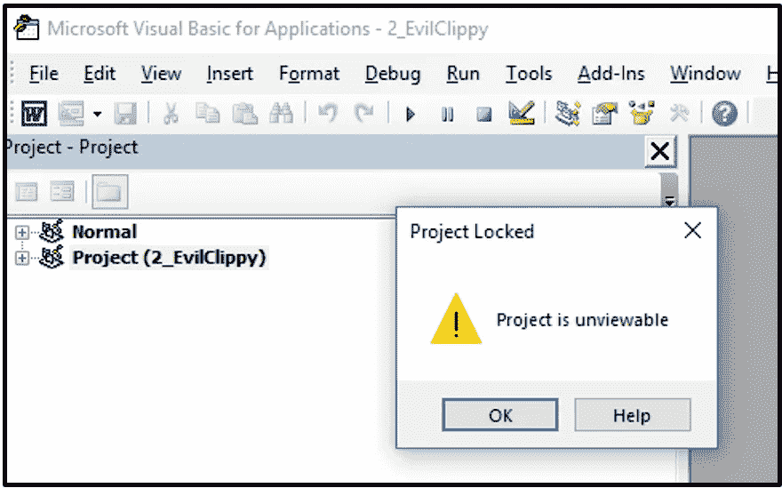
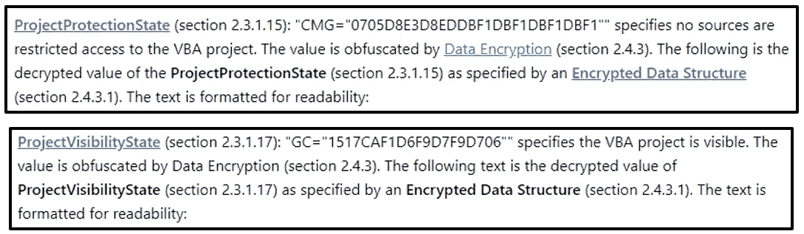

# VBA 项目已锁定；项目不可见

> 原文：<https://medium.com/walmartglobaltech/vba-project-locked-project-is-unviewable-4d6a0b2e7cac?source=collection_archive---------1----------------------->

作者:凯莉·罗伯茨( [@OrOneEqualsOne](https://twitter.com/OrOneEqualsOne) )

您可以保护 MS Office 文档中的宏(VBA 代码)在 VBA 编辑器中不被看到。大多数人都知道密码保护你的代码的选项，但是这个可以被绕过，就像这篇博客中显示的那样。还有一个无密码保护选项，简单地告诉用户项目被锁定，并且“不可查看”，如下图所示。

不可查看选项不能通过 MS office 应用程序本身设置，而是需要在保存文件后对其进行修改。这个特性在这里的 Office 文件[中被记录为项目流的*项目保护状态*和*项目可视状态*属性。](https://docs.microsoft.com/en-us/openspecs/office_file_formats/ms-ovba/dfd72140-85a6-4f25-8a17-70a89c00db8c)

*ProjectProtectionState* 和 *ProjectVisibilityState* 属性是加密的数据结构，但事实证明，如果您将它们设置为任意值，它将保护文档并使其锁定/不可见。如果您只更改了*项目可见性状态*，它仍然会显示项目结构，但是不允许查看单独的代码模块。如果您同时更改了这两个选项，在尝试展开项目的根目录时，您将立即得到锁定/不可查看的消息，并且将无法看到项目结构。

这里有一个关于如何将 office 文档更改为锁定/不可见的[演示，但是我想提供一个自动化的解决方案。自动化解决方案的一个主要优点是，它不仅可以设置这种保护，还可以从任何文档中删除这种保护。我在 Stan Hegt 的(](https://ratexcel.wordpress.com/2017/03/22/how-to-really-protect-your-code-making-vba-project-unviewable/)[@ Stan hacked](https://twitter.com/StanHacked))[evil clippy](https://github.com/outflanknl/EvilClippy)工具中加入了这个功能，可以如下使用。

要设置锁定/不可见属性，请使用“-u”选项:

**EvilClippy.exe-u macro file . doc**

要删除锁定/不可见的属性，请使用'-uu '选项:

**EvilClippy.exe-uu 宏文件. doc**

您也可以移除未使用 EvilClippy 锁定的文件的锁定/不可见属性。

在这项研究之前，使 VBA 项目锁定/不可见的更改据说是不可逆的，但我发现，如果您通过将[*Project clsid*](https://docs.microsoft.com/en-us/openspecs/office_file_formats/ms-ovba/20f4aad3-b646-4311-8301-5948fb1c2ded)*设置为全零并使用*ProjectProtectionState*(CMG)、*ProjectVisibilityState*(GC)和 *ProjectPassword* (DPB)的有效值来模拟受密码保护的文档，您可以撤销这种保护。*

***ID = { 000000000–0000–0000–0000–000000000 }***

***CMG = CAC 866 be 34 c 234 c 230 c 630 c 6
DPB = 94963888 c 84 Fe 54 Fe 5b 01 b 50 e 59251526 Fe 67 a1 cc 76 c 84 ed 0 dad 653 FD 058 f 324 bfd 9d 38 de 37
GC = 5 e 5 cf 2c 27646414741474***

*以上是将撤销保护的值，但是因为 MS Office 复合文件二进制格式(CFBF)对数据长度变化很敏感，所以您最好的选择是让[evilippy](https://github.com/outflanknl/EvilClippy)为您进行这些更改。*

*额外的好处:evicippy '-uu '选项还取消了 VBA 项目的任何密码保护。*