# VBA 跺脚——先进的马尔多克技术

> 原文：<https://medium.com/walmartglobaltech/vba-stomping-advanced-maldoc-techniques-612c484ab278?source=collection_archive---------0----------------------->

作者:柯克·塞尔( [@bigmacjpg](https://twitter.com/bigmacjpg) )、哈罗德·奥格登([@哈罗德·奥格登](https://twitter.com/haroldogden))和卡莉·罗伯特([@奥伦内夸尔松](https://twitter.com/OrOneEqualsOne))

# 介绍

有一些强大的恶意文档(maldoc)生成技术可以有效地绕过防病毒检测。我们称之为 *VBA 跺脚*的技术最初是由 Vesselin Bontchev 博士引起我们注意的(见[这里](https://github.com/bontchev/pcodedmp))。VBA 跺脚指的是销毁微软 Office 文档中的 VBA 源代码，只在文档文件中留下编译版的宏代码，即 p 代码。在这种情况下，仅基于 VBA 源代码的 Maldoc 检测会失败。在这篇博文中，我们将展示 VBA 跺脚的详细例子，并介绍一些额外的技巧。

# VBA 跺脚

首先，我们将演示 VBA 踩踏一个简单的，没有恶意的宏。当文档打开时，该文档只显示一个带有文本“ABC”的消息框。VBA 源代码和产生的消息框如下所示。

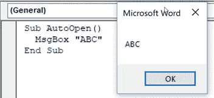

现在我们感兴趣的是修改上面显示的 VBA 源代码，同时保持中间的 p 代码不变。为了这篇博文的目的，我们将专注于当前。docx/。xlsx/。docm/。xlsm (Office 2007+)格式。然而，这里讨论的技术可以很容易地应用于老年人。doc/。xls 格式。在 Office 2007+文件中，VBA 源代码和 p 代码通常位于名为 vbaProject.bin 的文件中。请注意，这是默认文件名，但可以重命名。要手动修改这个文件，我们需要首先解压缩压缩的。docm/。xlsm 文件，然后在十六进制编辑器中打开 vbaProject.bin 文件。在本例中，我们将把“ABC”改为“XYZ”，但只是在 VBA 源代码存储位置，而不是在 p-code 部分。VBA 源代码以压缩形式存储，这解释了您在下图中看到的不可打印或奇怪的字符。

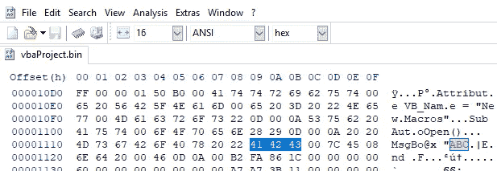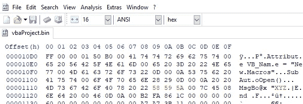

现在，我们已经手动编辑了 VBA 源代码，将“ABC”更改为“XYZ”，我们将在单击 按钮之前，打开文档并检查 VBA 源代码 ***。***

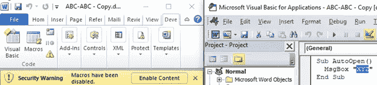

文档已打开，但未启用宏。在代码编辑器中检查宏时，会显示一个带有文本“XYZ”的消息框，但事实并非如此。事实上，只要内容被启用，就会显示一个显示“ABC”的消息框，并且代码编辑器中的源代码会被更新以与之匹配！

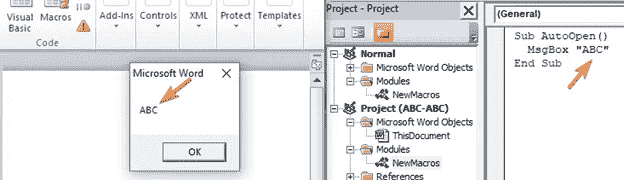

嗯，那肯定是误导。源代码说“XYZ”将显示在消息框中，但却显示了“ABC”。这是怎么回事？

正如 Bontchev 博士解释的那样，存储在文档中的 p 代码就是实际执行的代码，只要它与系统上当前的 VBA 版本兼容。此外，宏编辑器中显示的(一旦启用内容)不是解压缩的 VBA 源代码，而是反编译的 p 代码。有意思！

如果我们在不同版本的 Word(使用不同的 VBA 版本)中打开文档，p 代码将无法重用。这将强制 VBA 源代码被解压缩并重新编译成 p 代码，导致在消息框中显示“XYZ”。所以现在我们有一个文档，它在一个版本的 Office 上显示“ABC”，但在另一个版本上显示“XYZ”。

请注意，这是一个重要的警告。VBA 盖章的 maldoc 只能使用与创建该文档相同的 VBA 版本来执行。可以通过在 maldoc 生成之前对目标进行侦察以确定要使用的适当 Office 版本，或者通过生成具有多个 Office 版本的 maldoc 并将它们喷向目标来解决此限制。

从防守的角度来看，VBA 跺脚有什么影响？Maldoc 检测通常仅基于 VBA 源。甚至许多可用于分析文档的工具也不能识别 VBA 源代码和 p 代码之间的差异。Philippe Lagadec 通过 [olevba 脚本](https://github.com/decalage2/oletools/wiki/olevba)对被篡改的文档进行的分析仅显示了解压缩的源代码，缺少 p 代码细节。

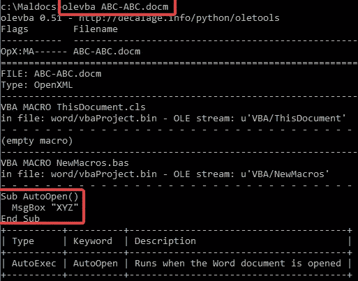

由 Didier Stevens 编写的 Python 脚本 [oledump.py](https://blog.didierstevens.com/programs/oledump-py/) 给出了类似的结果，除非使用 p-code dumper 插件运行。这种情况下的输出表明 p 代码将导致消息框显示“ABC ”,如下图所示。

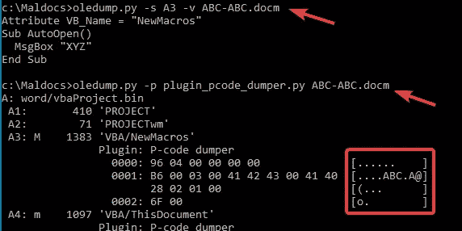

Bontchev 博士发布了一个名为 [pcodedmp.py](https://github.com/bontchev/pcodedmp) 的 Python 脚本，用于显示 p 代码，如下图所示。输出的额外好处是显示操作名，而不是上面的操作码。

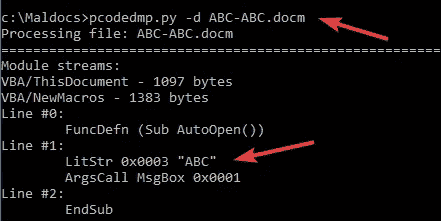

除了修改 VBA 源代码，我们可以通过用零或随机字节覆盖它来彻底清除它(“跺”它)。下面的截图显示了如何在一个十六进制编辑器中手动操作。

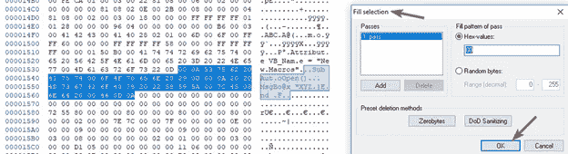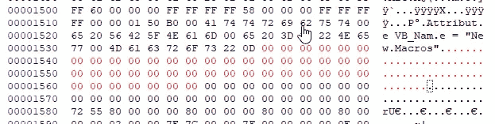

这种情况下的结果是 VBA 编辑器根本不显示宏代码，但在启用内容后，带有文本“ABC”的消息框仍然会出现。现在，我们对该文件重新运行 olevba，没有显示 vba 源代码，而是显示“没有发现可疑关键字或 IOC”语句，而不是之前突出显示我们使用了可疑关键字(AutoOpen)的表格。

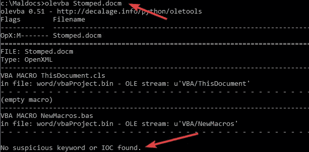

# 这是一个多大的问题？

我们现在将更深入地了解 Office 如何使用压缩的 VBA 源代码和 p 代码。这将在我们稍后讨论如何滥用 Office 功能来轻松修改 maldocs 以欺骗许多 AV 扫描器时发挥作用。

Office 文档包含两个可以提取 VBA 的地方，压缩的 VBA 源代码和 p 代码。下表详细说明了在以下情况下使用哪个 VBA 数据源:

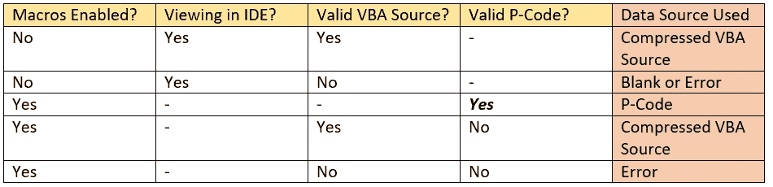

从这个表中我们可以看到，如果我们有有效的 p 代码，当启用宏时，压缩的 VBA 源代码将被忽略。所有宏功能都是通过运行 p 代码来执行的。作为一个攻击者，这告诉我们，我们可以完全破坏或修改压缩的 VBA 源代码，而仍然让我们的 maldoc 执行其所需的任务。

# 真实世界的例子

在一个玩具例子上展示这一点很好，但是这真的是一个合法的威胁吗？让我们通过处理一个已知的恶意文档来更进一步。在这种情况下，我们将从最近的 [Emotet](https://www.cyber.nj.gov/threat-profiles/trojan-variants/emotet) maldoc 开始，它目前被病毒总数上 36/59 的供应商检测为恶意。

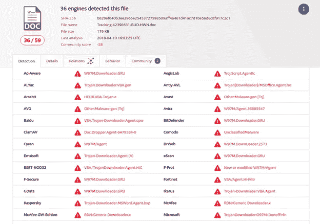

如果我们拿着这份文件，如上所述简单地践踏 VBA 源代码，检测率会下降到 58 个反病毒解决方案中的 7 个！

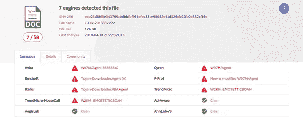

如你所见，这给网络维护者带来了一个严重的问题。即使手动分析这些文档也会有问题。在这一点上明显的问题是“*VBA 跺脚可以通过工具自动执行吗，还是我们总是必须手动编辑 Office 文档？*“这个问题的答案是 ***是的，用工具自动跺 VBA***当然是有可能的。我们开发了一个 POC 实用程序，可以自动踩踏任何 Office 文档中的压缩 VBA 源代码(这是用来 VBA 踩踏示例 Emotet 文档的，不，我们不会发布这个实用程序)。鉴于自动化 VBA 跺脚是多么容易，这是一个真正的威胁。

# 让事情变得更糟

考虑 maldoc 被设计成在执行恶意有效载荷之后立即关闭 MS Word 的情况。在与 VBA 跺脚结合使用时，在启用宏之前，任何脱机 VBA 源代码提取工具都不会显示 VBA 源代码，VBA 源代码甚至不会显示在 Office 宏编辑器窗口中。但是启用宏会导致 Word 立即退出，而不提供查看反编译源代码的机会。虽然我们已经展示了“类似汇编”的 p 代码是可提取的，但是该 p 代码很难解释，并且不能在 VBA 调试器中进行分析。此外，pcode 只能在特定的 VBA 版本上运行。由于这些原因，访问 VBA 源代码对分析师来说是一个很大的好处。但是对于这样一个文档，如何做到这一点呢？

经过一些试验，我们确定了一个简单的解决方案，一旦启用宏，就停止 MS Word 执行任何方法。请注意，此解决方案适用于 Office 2007+文档，正在进行额外的研究以解决较旧的文档格式。2007+解决方案是从的“word”目录中删除 vbaData.xml 文件。docm 文件，如下所示(使用 7-Zip 程序很容易做到这一点，无需手动解压缩和重新压缩文档)。

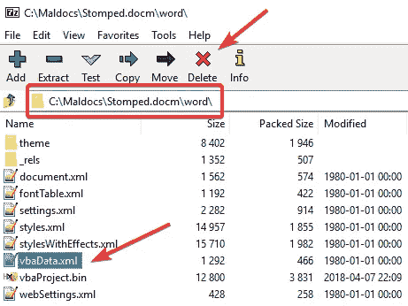

现在可以打开文档并启用内容，导致在 VBA 代码编辑器中显示反编译的 p 代码，但不执行代码。在恶意软件作者采取措施阻止分析师访问 VBA 源代码的情况下，这可能是救命稻草。

删除 vbaData.xml 的一个有趣的副作用是，它会导致 MS Word 在“宏”对话框中错误地没有列出任何宏(见下图)。

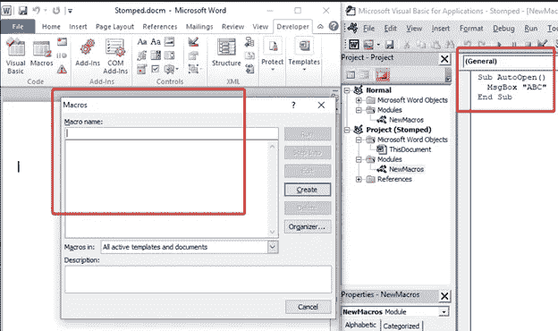

# 侦查

我们在 Office 文档中编写了一个用于检测 VBA 跺脚的开源工具，名为“VBA 地震仪”。该工具已经在 Ubuntu 16.04 下进行了测试，可以检测 Office 文档的编译 p 代码和 VBA 源代码中出现的声明的函数/变量名、字符串和注释行之间的差异。该工具可在[https://github.com/kirk-sayre-work/VBASeismograph](https://github.com/kirk-sayre-work/VBASeismograph)获得。

# 结论

在这篇博文中，我们展示了如何修改或破坏 Office 文档中的压缩 VBA 源代码，以击败反病毒扫描解决方案，并使 maldocs 的手动分析更加困难。对这种技术的防御包括检测和标记具有有效 p 代码但无效或丢失 VBA 源代码的文档，或者更一般地，检查压缩的 VBA 源代码和反编译的 p 代码之间的差异。目前，我们还不知道有任何商业反病毒解决方案进行这种检查，因此这是反病毒扫描解决方案可以改进的潜在领域。

参见[vbastomp.com](http://vbastomp.com)了解 VBA 跺脚的最新信息。