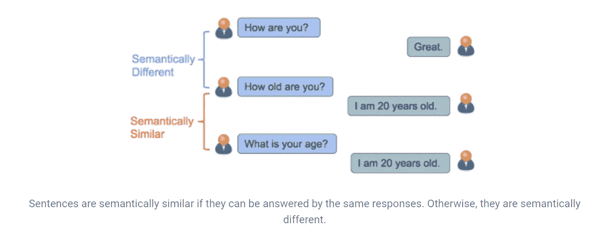
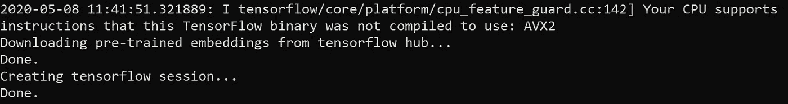
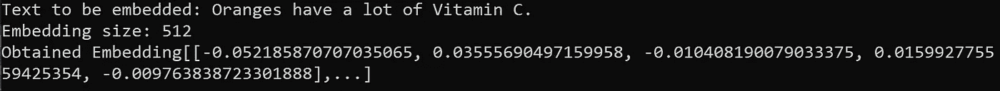
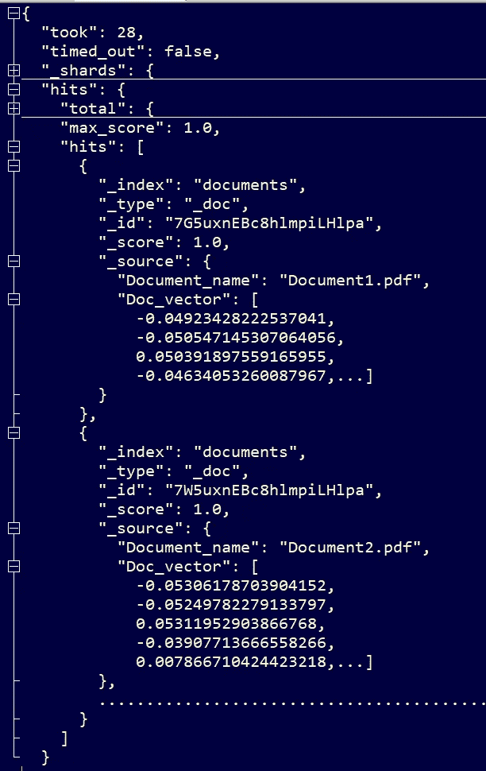

# 使用弹性搜索的基于向量的语义搜索

> 原文：<https://medium.com/version-1/vector-based-semantic-search-using-elasticsearch-48d7167b38f5?source=collection_archive---------1----------------------->

Photo by [Glenn Carstens-Peters](https://unsplash.com/@glenncarstenspeters?utm_source=medium&utm_medium=referral) on [Unsplash](https://unsplash.com?utm_source=medium&utm_medium=referral)

语义搜索是搜索引擎中通常使用的一种搜索形式，它为理解用户搜索查询的意图和含义的用户提供内容。[这个搜索比传统的文本](https://www.version1.com/it-service/intelligent-search/)和关键词匹配搜索领先一步。传统的关键字搜索不包括用户搜索短语的词汇变体或概念匹配。如果用户查询中使用的单词的精确组合没有出现在全部内容中，则不相关的结果将被返回给用户。此外，使用语义搜索，用户可以用自然语言而不是精确的关键字来提问。

语义搜索主要基于两个概念:

*   **用户的搜索意图:**这意味着理解用户询问特定查询的原因。这可能是想学习、寻找或购买某样东西，等等。如果很好地理解了意图，搜索引擎可以向用户提供最相关的结果。
*   **搜索短语中单词之间的关系:**重要的是理解搜索短语中所有单词的整体含义，而不是其中的单个单词。这意味着理解这些词之间的关系，从而显示与用户的查询在概念上更相似的结果。

**语义相似性搜索用例:**

*   **问答系统:**如果存在几个常见问题的集合，它将找到与用户的新查询意义相同的问题，并返回相似问题的存储结果。
*   **文档内容搜索:**设想一个场景，一个组织有几个文档，用户希望从这些文档中找到一个问题的答案。通过计算用户问题和查询内容之间的相似性来快速定位正确的文档比在找到正确的文档之前通读不同的不相关文档更容易。

有许多不同的方法来实现语义搜索。NLP 社区为我们提供了一种叫做文本嵌入的功能。文本嵌入是一种将单词和句子转换成固定大小的密集数字向量的技术。简而言之，非结构化文本可以转换成向量。这些向量有助于捕捉文本的语义，即可以用于找到用户查询和网页之间的相似性的文本的上下文含义。如果两个文本的文本嵌入是相似的，这意味着两个文本在语义上是相似的。这些向量可以在 Elasticsearch 中进行索引，以执行语义相似性搜索。

如今，python 中有许多技术可以将文本转换成向量，如单词包、潜在的狄利克雷分配(LDA)、n-gram 嵌入、Doc2Vec 等。在本文中，我们将使用一个称为通用句子编码器的开源预训练模型来轻松地将文本转换为向量。

**什么是通用句子编码器？**

通用语句编码器将文本转换为可用于 NLP 任务的数字密集向量。这个模型在 [Tensorflow-Hub](https://tfhub.dev/) 上公开。该模型接受任意长度的英语文本——句子、短语或段落，并输出一个 512 维向量。通过使用几个数据源来训练该模型，以完成各种 NLP 任务。通用语句编码器的一些重要应用有:

*   文本嵌入，可用于任何基于 NLP 的机器/深度学习项目的预处理阶段。
*   检测相似的段落/句子等。
*   以识别语义相似文本的聚类。

现在让我们看看如何利用这个模型来执行文本嵌入。确保安装 Python，然后安装 Tensorflow。

1.  **导入基本库**

> 导入 tensorflow 作为 tf
> 导入 tensorflow_hub 作为 hub

**2。将模型**下载到您的本地系统。该型号的大小约为 1GB。因此，根据您的互联网连接，下载可能需要一些时间。因此，建议只下载一次模型，使用下载的模型进行尽可能多的嵌入。

> 图形= tf。图表()
> 
> 用 tf。会话(图形=图形)作为会话:
> 
> 打印(“从 tensorflow hub 下载预训练嵌入…”)
> 
> 嵌入=集线器。模块(" https://tfhub . dev/Google/universal-sentence-encoder/2 ")
> 
> text_ph = tf .占位符(tf.string)
> 
> 嵌入=嵌入(text_ph)
> 
> 打印(“完成。”)
> 
> 打印(“创建 tensorflow 会话…”)
> 
> session = tf。会话()
> 
> session . run(TF . global _ variables _ initializer())
> 
> session . run(TF . tables _ initializer())
> 
> 打印(“完成。”)

其输出将类似于:

**3。定义一个函数来使用该模型。**

> #函数将文本转换为矢量
> 
> def embed_text(文本):
> 
> vectors = session.run(嵌入，feed_dict={text_ph: text})
> 
> return[vector . to list()for vectors in vectors]

**4。调用上面的函数就可以了。**

> text= "橙子含有大量维生素 c。"
> 
> text _ vector = embed _ text([text])[0]
> 
> print("要嵌入的文本:{}"。格式(文本))
> 
> print("嵌入大小:{}"。格式(len(text_vector)))
> 
> print("获得嵌入[{}，…]\n "。格式(text_vector[:5]))

这就是如何使用通用句子编码器模型来获得文本嵌入。现在让我们看看这些文本嵌入是如何与 Elasticsearch 集成的。最新版本的 Elasticsearch (7.3+)支持一种称为 *dense_vector* 的新数据类型，它具有不同的指标，如*余弦相似度*，欧几里德距离，并使用 *script_score* 进行计算。密集向量字段将保存文本嵌入，即数字向量。这些向量然后可以在弹性搜索中被索引，并且可以在用户的查询向量和被索引的内容向量之间获得相似性。我们将使用弹性搜索的余弦相似性特征来实现文档评分。

实现这一目标的步骤是:

1.  准备好一套文件。如上所述，使用通用语句编码器获得这些文档的文本嵌入。
2.  **索引这些嵌入到 Elasticsearch 中。**请参考我的[上一篇文章](/version-1/elasticsearch-store-search-and-analyse-large-volumes-of-data-quickly-and-in-real-time-234da6aeae5a)以了解更多关于弹性搜索设置和索引的信息。

为了索引向量，如下定义索引的映射是很重要的。

> { "设置":{ "碎片数量":2，"副本数量":1}，
> 
> " mappings": {"dynamic": "true "，" _source": {"enabled": "true"}，
> 
> "属性":{
> 
> "文档名称":{
> 
> "类型":"文本"
> 
> },
> 
> "文档向量":{
> 
> "类型":"密集向量"，
> 
> 【dims】:512
> 
> }}}}

映射是定义如何存储和索引文档及其包含的字段的过程。例如，使用映射来定义将存储在索引中的字段的数据类型。如果我们不提供任何映射，Elasticsearch 会自动检测字段的数据类型并创建索引。然而，对于 *dense_vector* ，明确提供维度映射是很重要的。这里，我们将向量维数保持为 512，因为通用句子编码器模型输出 512 维的向量。

当索引一个 *Doc_vector* 字段时，Elasticsearch 将检查它是否具有映射中指定的相同维数。在这里，我们在一个名为“ *documents* ”的索引中索引了所有这些向量。

一旦所有向量都被索引，如果你点击 URL[http://localhost:9200/cars/_ search？在你的浏览器中，它应该返回这个。](http://localhost:9200/cars/_search?pretty)

**3。获取一个用户查询，并将其转换为 vector。**通过使用与上述相同的通用语句编码器方法获得*用户查询向量*。

**4。计算弹性搜索中索引的 *User_Query_Vector* 和 *Doc_vector*** 之间的余弦相似度，如下所示。

> script_query = {
> 
> "脚本分数":{
> 
> " query": {"match_all": {}}，
> 
> "脚本":{
> 
> " source ":" cosine similarity(params . query _ vector，doc['Doc_vector'])"，
> 
> " params": { "查询向量":用户查询向量}
> 
> }}}
> 
> response = esclient . search(INDEX = INDEX _ NAME，body={"size": 10，" query": script_query，" _ source ":{ " includes ":[" Document _ NAME "]})

上述搜索将返回置信度得分递减的文档列表，最相似的文档位于顶部。

这是一个使用 Elasticsearch 执行语义相似性搜索的简单例子。

*感谢您阅读本文。*

*如有任何反馈，请在评论中告知或在*[*LinkedIn*](https://www.linkedin.com/in/sharanyashenoy/)*上取得联系。*

# **关于作者**

Sharanya Shenoy 是 Version 1 的助理顾问，自 3 月 19 日以来一直在创新实验室工作，用几项颠覆性技术进行创新。作为数据科学的研究生，Sharanya 的主要关注领域是机器学习和人工智能。

**参考文献:**

 [## 语义文本相似性研究进展

### 近年来，基于神经网络的自然语言理解研究进展迅速，特别是在学习方面

ai.googleblog.com](https://ai.googleblog.com/2018/05/advances-in-semantic-textual-similarity.html)  [## 基于向量场的弹性搜索中的文本相似性搜索

### 从一开始作为一个食谱搜索引擎，Elasticsearch 旨在提供快速和强大的全文…

www.elastic.co](https://www.elastic.co/blog/text-similarity-search-with-vectors-in-elasticsearch)  [## 张量流集线器

通用语句编码器将文本编码成高维向量，这些向量可用于文本分类、文本相似性…](https://tfhub.dev/google/universal-sentence-encoder/1)