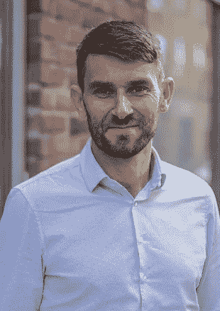

# 我的 IT 之旅:从毕业生到创新实验室负责人

> 原文：<https://medium.com/version-1/version-1-careers-john-bolger-head-of-innovation-labs-6ac7eedcc784?source=collection_archive---------2----------------------->

嗨！我叫约翰·博尔格，是总部位于爱尔兰和英国的 IT 咨询公司 [Version 1](https://www.version1.com/) 的首席顾问。我已经使用版本 1 15 年了，最初是在 2003 年我大学实习的时候加入的！我们现在有一个庞大而成熟的研究生项目——[加速](https://www.version1.com/careers/accelerate/)，它运行得非常出色，显示了第 1 版已经走了多远。然而，我喜欢认为自己是最初的毕业生！

在此期间，我与许多大型公共和私人客户合作过，设计并交付了各种产品，从面向税务专员的高姿态财产税等任务关键型税收系统，到面向公用事业公司的电子商务解决方案，再到抵押贷款申请系统(正好在经济衰退期间——doh！)对于一家国际银行来说。我甚至建立了一个创业公司，但最终都没有成功。

但这些角色都没有我现在的角色有趣，我是第一版创新实验室 [*的负责人*](https://www.version1.com/it-service/innovation-labs/)**。**

*回到几年前，在税务局长时间工作后，我觉得是时候改变一下了。我对技术有着特殊的热情，我想要一个可以探索最新技术并了解如何应用这些技术来颠覆或改善我们客户业务的角色。因此，我在“快速原型团队”工作了一段时间，在那里，我代表第 1 版客户领导了一个小型、高技能和专注的团队，探索颠覆性技术，如[区块链](https://www.version1.com/it-service/innovation-labs/blockchain/)、[机器学习](https://www.version1.com/it-service/digital-services/innovationlabs/artificial-intelligence/)和[聊天机器人](https://www.version1.com/it-service/innovation-labs/chatbots/)。对我来说，这是一个非常有趣的角色，它让我走上了倡导尖端技术的新道路。这甚至让我能够代表客户，并作为合并团队的一部分工作，进行 IT 分析和规划，其结果将是一个具有全球影响力的独角兽公司。*

***这段经历使我成为帮助创建和领导 2018 年启用的新版本 1 创新实验室的完美候选人。***

**

*从那以后，我一直领导着这个团队，制定技术方向，建立流程，招聘，管理预算，执行客户项目，参与咨询和早期客户项目，并告知组织的其他成员我们正在探索的颠覆性技术将如何影响第 1 版的其他部分和我们的客户。*

*2019 年，我们在这方面取得了巨大成功，为我们的客户开发了一些真正有趣的解决方案，这将带来真正的商业利益。请关注后续的博客帖子，我将在那里回顾我们在 2019 年创新实验室所做的工作！*

**

*对我来说，其中一个亮点是我们与爱尔兰养牛联盟(ICBF)合作的区块链“价值证明”项目。ICBF 是一家令人惊叹的农业科技公司，2019 年，我们与他们合作开发了一个区块链“价值证明”，旨在实现消费者可以访问的爱尔兰牛肉“从农场到餐桌”的可追溯性。这是区块链的一个真实用例，引起了国际关注。此后，我们在伦敦区块链峰会上介绍了这一点，最近在旧金山的甲骨文开放世界上也介绍了这一点。这也是几个主要出版物的特色，包括[福布斯](https://www.forbes.com/sites/oracle/2019/10/10/to-reduce-greenhouse-gas-and-produce-better-tasting-beef-a-cattle-federation-tests-blockchain/#2d127abc3d10)、[数码](https://diginomica.com/oracle-openworld-2019-irish-cattle-moo-ves-blockchain-conversation-along-meaty-trial)和 [ITPro](https://www.itpro.co.uk/business-operations/34453/icbf-looks-to-make-beef-supply-chain-more-sustainable-and-trackable-using) 。*

*我热爱技术，我喜欢了解事物是如何工作的，并且了解在非常不同的企业和部门工作的许多客户的业务是作为一名顾问的主要好处之一。*

*最终对我来说，生活就是与你周围的人建立牢固的关系，没有这些关系就没有意义。我认为这反映在我在第 1 版中和与我们的客户建立的关系中，我仍然定期与以前的客户见面，了解他们在个人和工作上的进展。作为一名顾问，我可以建立许多不同的联系，这只会帮助你成为一个更好的人。*

*我将继续专注于做我喜欢的事情——技术、交谈(我是我母亲的儿子)、建立关系和实现客户成功。我敦促你们所有人真正看看是什么在推动你的职业生涯，并确保你不会失去对什么让你滴答作响的关注。*

**创新实验室自 2018 年年中开始运营，有一个全职的专门团队探索尖端技术。我们已经提供了许多成功的 POV，并渴望与我们的客户合作，帮助他们探索可能会改变其业务的下一代技术。在下面的版本 1 中找到更多关于创新的信息。**

**原载于 2020 年 1 月 20 日*[*【https://www.version1.com】*](https://www.version1.com/version-1-careers-my-journey-from-graduate-to-the-head-of-innovation-labs-at-version-1/)*。**