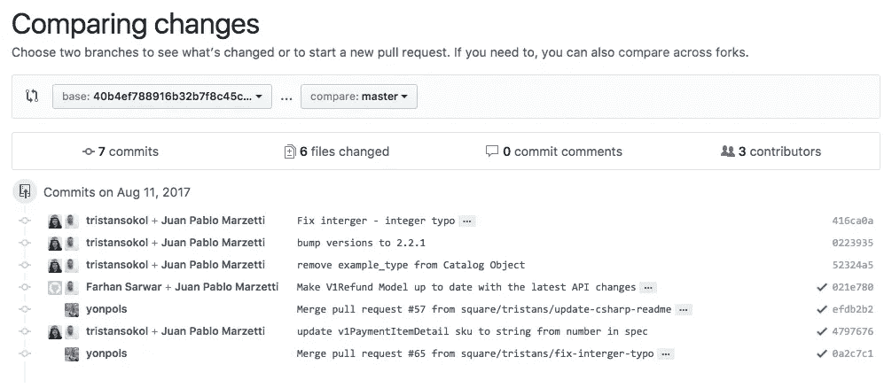

# 我们的 SDK 版本 2.2.1 现已发布

> 原文：<https://medium.com/square-corner-blog/version-2-2-1-of-our-sdks-are-now-live-972d7683b70c?source=collection_archive---------1----------------------->

## 查看最新版本的客户端库中的新增内容和我们修复的内容。

> 注意，我们已经行动了！如果您想继续了解 Square 的最新技术内容，请访问我们的新家[https://developer.squareup.com/blog](https://developer.squareup.com/blog)

如果你想更好地理解我们如何制作 SDK，以及我们的 API 规范如何与模板一起创建一个完整的 SDK，请查看[Square 如何制作其 SDK](/square-corner-blog/how-square-makes-its-sdks-6a0fd7ea4b2d)。下面我们将讨论 SDK 2 . 2 . 1 版本中的新特性和改进。

## API 规范变更

描述最新版本中的变化的最简单的方法之一是使用 GitHub 的 compare 视图查看 square/connect-api 规范。您会注意到在 2.2.0 和 2.2.1 版本之间，我们有来自不同团队成员的提交，甚至有来自我们的一个开发人员的错误修复。

Click on the image to view on GitHub

提交消息本身只显示了一些细节。您可以在[全差分](https://github.com/square/connect-api-specification/compare/40b4ef788916b32b7f8c45c52cba2d280224d9c4...master)中获得更多详细信息。这个版本修复了一些 v1 模型，在某些情况下，这些模型会阻止开发人员在使用 SDK 时从 API 获取所有信息。

## 页码

最令人期待的 SDK 特性之一是对 v1 分页的支持。所有的客户端库现在都有类似于 PHP 的`\SquareConnect\ApiClient::getV1BatchTokenFromHeaders($http_headers`的方法来处理返回的头并获得适当的令牌，然后您可以用它来请求下一页结果。

## 改进的文档

此版本的最后一个变化是改进了获取和设置属性的 SDK 模型方法的文档。查看为模型生成的文档(例如，PHP 的[事务模型](/SquareConnect/ApiClient::getV1BatchTokenFromHeaders($http_headers)))现在可以明确地告诉您需要使用哪些方法来访问底层数据。

你可以从你喜欢的软件包管理器下载或升级我们的 SDK 的最新版本。

如果您对我们当前的 SDK 有任何建议、修复或问题，请随时在相关的 GitHub 资源库中提出问题或起草 PR。你也可以在我们的开发者大会上讨论 SDKs 前往[squ.re/slack](https://docs.google.com/forms/d/e/1FAIpQLSfAZGIEZoNs-XryKqUoW3atFQHdQw5UqXLMOVPq3V4DEq-AJw/viewform#response=ACYDBNj5LFgPy8Tcac2gSgv_IjXvgWsPy2CO2xTXwnc0OSSxCvWFgc7SCDHvVQ)进行邀请。