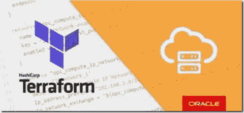

# Oracle 云基础架构的第一步是使用 Terraform 编写代码

> 原文：<https://medium.com/oracledevs/very-first-steps-in-oracle-cloud-infrastructure-as-code-with-terraform-d3179ecc043a?source=collection_archive---------5----------------------->

Oracle 云基础架构中的资源可以通过控制台(基于浏览器的 UI)进行管理。这很好，但是需要手动步骤——没有自动化——这需要时间并且容易出错(并且随着时间的推移变得非常无聊)。此外，这是一种相当个人化的工作方式，不适合大量的合作。资源也可以是…