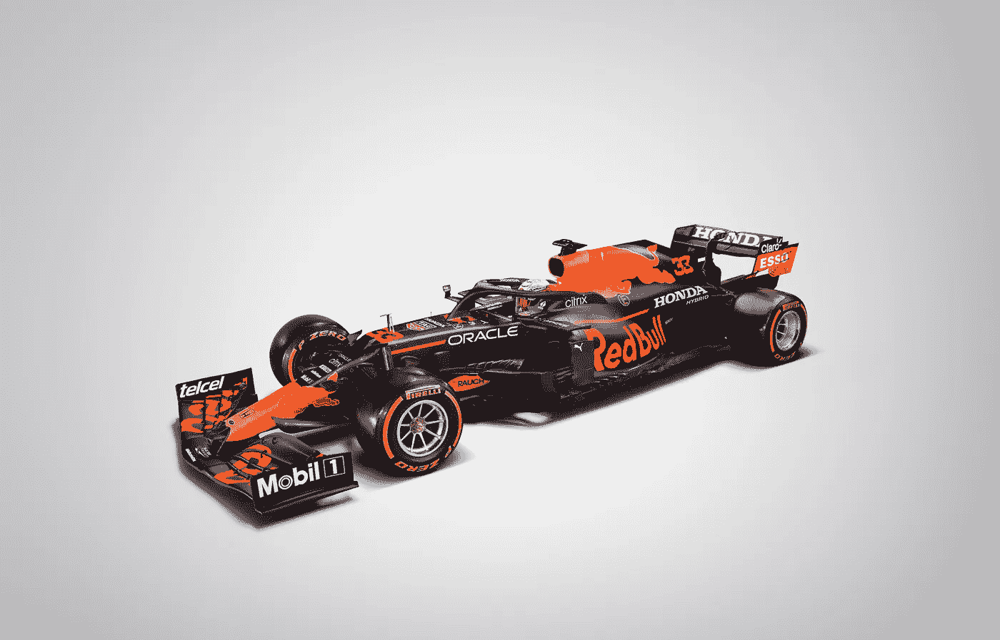

# 胜利圈—重新观看甲骨文/红牛本田车队为机器学习初学者提供的动手实验室

> 原文：<https://medium.com/oracledevs/victory-lap-rewatch-oracle-red-bull-honda-racings-hands-on-lab-for-machine-learning-503c83ff9923?source=collection_archive---------0----------------------->

数百名与会者加入了这个动手实验室，在这里，来自甲骨文 DevRel 团队的成员让机器学习对初学者来说变得触手可及。

嗯，距离甲骨文公司与红牛本田车队的第一次动手实验室已经过去了大约一个星期。初学者会议的与会者可能已经在训练机器模型来预订他们的航班，确定下一次 NBA 选秀的获胜者，并且通常只是超级进入统计套利。

好吧，也许不全是，但如果你参加了上次会议，你就会知道机器学习是一种强大而又触手可及的东西，当你有正确的工具和指导来接近它时。

在第一次动手实验中，我和 Dev 一起工作。o 自己的 Ignacio Martinez 带领与会者通过 OCI 建立他们的[自由层账户，然后收集和组织数据，最后建立一个用户界面，使用开发人员资源 Ergast 的数据预测比赛的前五名获胜者。](https://www.oracle.com/cloud/free/)

如果您未能在 8 月 11 日加入我们，或者只是想在我们忙于下一个动手实验(初级课程的参与者现在准备征服的中级实验)时复习一下，请在此处查看该实验的录音—

我们对第一次实验的惊人出席率感到欣喜若狂，我们希望你们能再次和我们一起玩！

与此同时，请关注甲骨文的社交媒体渠道和开发者页面，了解即将到来的中级红牛车队本田动手实验室注册活动！