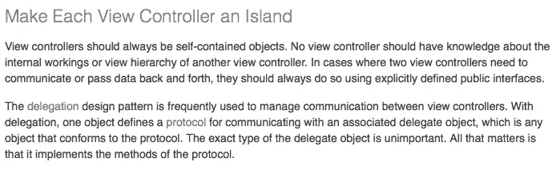

# ViewController tidak boleh tahu ViewController lain?

> 原文：<https://medium.easyread.co/viewcontroller-tidak-boleh-tahu-viewcontroller-lain-cc7c72c27c5?source=collection_archive---------7----------------------->


source by : DuckDuckGoSearch

[Artikel ini akan terus diupdate sesuai dengan apa yang diketahui penulis. Jika kalian menemukan kesalahan, *feel free* untuk menulisnya di kolom komentar!]

Di [ViewController Programming Guide](https://developer.apple.com/library/content/featuredarticles/ViewControllerPGforiPhoneOS/DesignTips.html#//apple_ref/doc/uid/TP40007457-CH5-SW1) , disebutkan bahwa ViewController tidak boleh tahu apa yang dilakukan oleh ViewController lain. Or, at least, dia tidak punya pengetahuan tentang apa sebenarnya di ViewController lain.



> Nah, disini penjelasan berhenti. Tidak ada contoh kode dimana konsep itu harus dijalankan oleh developer (programmer). Ini tentu membuat saya (pribadi) kesulitan. Di satu sisi ingin mengikuti pedoman yang digariskan oleh Apple, tapi disisi lain tidak tahu (karena masih novice) bagaimana merealisasikan hal tersebut.

Paragraf yang dibuat dalam bentuk Quote di atas adalah paragraf yang saya baca sebelum menulis artikel ini. Saya memang tidak terlalu memahaminya namun setelah menulis artikel ini dan membacanya kembali, saya sekarang paham apa yang dimaksudkan oleh Apple dengan `delegation` pattern.

Ada beberapa hal.

1.  Apa yang harus dilakukan jika saya ingin mengakses sesuatu dari ViewController lain?

Bayangkan jika kita punya CaptainAmericaViewController dan IronManViewController dan saat ini adalah The Avenger: Civil War. Jika kalian belum pernah dengan, itu adalah film dimana Cap dan Iron-Man berada di sisi yang berbeda sehingga ada satu scene di bandara private dimana mereka harus bertempur satu sama lain.

Disini kita membuat ViewController keduanya.

Karena keduanya bertempur, maka harus ada cara untuk saling mengakses satu sama lain. Sementara itu, kita tidak diperbolehkan mengakses langsung property dan method dalam kelas ViewController karena tidak punya pengetahuan tentangnya. Lalu bagaimana jika “Cap” ingin memukul Iron-Man dan membuat Jarvis offline?

Maka kita harus mendeklarasikan Protokol `PertempuranCivilWar` yang mendefinisikan aktivitas-aktivitas para “aktor” pertempuran.

```
protocol PertempuranCivilWar {
     func diSerang()}
```

Protokol ini digunakan sebagai layer (aku lupa nama seharusnya) untuk mengakses perilaku dari tiap aktor saat pertempuran civil war.

`let captainAmerica = CaptainAmericaViewController()`

`let ironMan = IronManViewController()`

CaptainAmericaVC: PertempuranCivilWar

IronManVC: PertempuranCivilWar

```
-----| Implementasi |-----// CaptainAmerica
func diSerang() {
    print("Perisainya penyok")
}// IronMan
func diSerang() {
    print("Jarvis offline")
}
```

Karena CaptainAmerica memilih IronMan sebagai musuh, maka buatlah `delegate` untuk IronMan.

```
var lawanDelegate: PertempuranCivilWar?// Membuat IronMan sebagai lawan CaptainAmerica
captainAmerica.lawanDelegate = ironMan
```

Maka ketika CaptainAmerica ingin menyerang IronMan, dia memanggil fungsi protocol PertempuranCivilWar yaitu `diSerang` yang dimiliki `lawanDelegate` yang sudah diisi dengan objek IronMan.

```
// CaptainAmerica menyerang IronMan
captainAmerica.lawanDelegate.diSerang()// Console Log
"Jarvis offline"
```

Begitu pula sebaliknya.

Sebenarnya saya agak mumet menulis seperti ini. Tujuan utama adalah sebagai catatan dan dengan menulis, kita jadi membuka konsep-konsep baru yang belum pernah terpikirkan sebelumnya. Contoh: Protocol. Saya belum memikirkannya kecuali setelah mulai menulis post ini. Jadi, tetaplah menulis.!!!