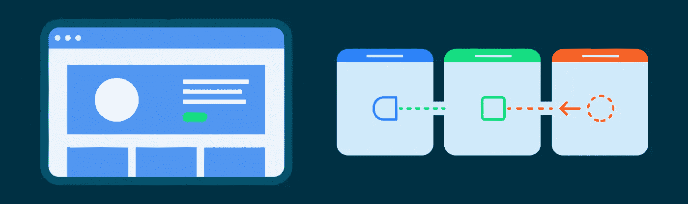
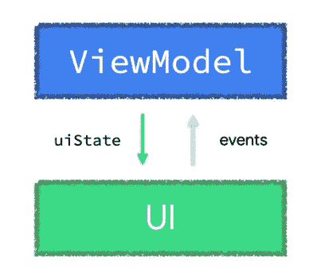

# ViewModel:一次性事件反模式

> 原文：<https://medium.com/androiddevelopers/viewmodel-one-off-event-antipatterns-16a1da869b95?source=collection_archive---------0----------------------->



[ViewModel 事件](https://developer.android.com/topic/architecture/ui-layer/events#handle-viewmodel-events)是 UI 应该执行的源自 ViewModel 的动作。例如，向用户显示信息性消息，或者在应用程序状态改变时导航到不同的屏幕。

我们对 ViewModel 事件的指导以两种不同的方式坚持己见:

1.  每当 ViewModel 中出现一次性事件时，**ViewModel 应该立即处理该事件，从而导致状态更新**。ViewModel 应该只公开应用程序状态。从 ViewModel 中暴露未被*还原*为状态的事件意味着 ViewModel 不是从这些事件中导出的状态的[真值来源](https://en.wikipedia.org/wiki/Single_source_of_truth)；[单向数据流](https://developer.android.com/jetpack/compose/architecture#udf) (UDF)描述了只将事件发送给比其生产者寿命更长的消费者的优势。
2.  应该使用可观察的数据容器类型公开状态。



Following UDF, state flows down from the ViewModel to the UI, and events go up from the UI to the ViewModel

在您的应用程序中，您可能会使用 [Kotlin 通道](https://kotlinlang.org/docs/channels.html)或其他反应流(如`[SharedFlow](https://kotlin.github.io/kotlinx.coroutines/kotlinx-coroutines-core/kotlinx.coroutines.flow/-shared-flow/)`)向 UI 公开 ViewModel 事件，或者这可能是您在其他项目中见过的模式。当生产者(`ViewModel`)比消费者(UI—组合或视图)活得长时，这可能是 ViewModel 事件的情况，**这些 API**[**不保证**](https://github.com/Kotlin/kotlinx.coroutines/issues/2886) **这些事件的交付和处理。这对开发者来说会导致错误和未来的问题，而且对大多数应用来说这也是一个不可接受的用户体验**。

> 您应该立即处理 ViewModel 事件，从而导致 UI 状态更新。试图使用其他反应式解决方案(如 Channel 或 SharedFlow)将事件公开为对象并不能保证事件的交付和处理。

# 个案研究

这里有一个在应用程序的典型支付流程中实现视图模型的例子。在下面的代码片段中，`MakePaymentViewModel`直接告诉 UI 在支付请求的结果返回时导航到支付结果屏幕。我们将使用这个例子来探索为什么像这样处理一次性 ViewModel 事件会带来问题和更高的工程成本。

然后，用户界面将使用该事件并相应地导航:

上面看到的`navigateToPaymentResultScreen`实现有多个设计缺陷。

# 反模式 1:关于支付完成的状态可能会丢失

通道[不保证](https://github.com/Kotlin/kotlinx.coroutines/issues/2886)事件的交付和处理。因此，**事件可能会丢失，使 UI 处于不一致的状态**。当 UI(消费者)在`ViewModel`(生产者)发送一个事件后立即进入后台并停止`Channel`收集时，就会发生这种情况。对于其他不属于可观察数据持有者类型的 API 也是如此，比如`SharedFlow`，即使没有消费者监听它们，它们也可以发出事件。

这是一个反模式，因为在 UI 层中建模的*支付结果状态*不是**持久的**或**原子的**，如果我们从 [ACID 事务](https://en.wikipedia.org/wiki/ACID)的角度来考虑的话。就存储库而言，支付可能已经成功，但是我们从未进入下一个屏幕。

*注意:在发送和接收事件时，可以通过使用* `*Dispatchers.Main.immediate*` *来减轻这种反模式。然而，如果没有通过 lint 检查强制执行，这个解决方案可能容易出错，因为开发人员很容易忘记它。*

# 反模式 2:告诉 UI 采取行动

对于支持多种屏幕大小的应用程序，给定 ViewModel 事件时要执行的 UI 操作可能会因屏幕大小而异。比如案例分析 app 在手机上运行时要导航到支付结果屏幕；但如果这款应用在平板电脑上运行，这个动作可以在同一个屏幕的不同部分显示结果。

**ViewModel 应该告诉 UI *什么是*应用程序状态，UI 应该决定*如何*反映这一点。视图模型不应该告诉用户界面它应该采取什么动作。**

# 反模式 3:不立即处理一次性事件

**将事件建模为*开火然后忘记*——在飞行中——会导致问题。**更难符合[酸性属性](https://en.wikipedia.org/wiki/ACID)，因此无法确保尽可能高的数据可靠性和完整性。状态*为*，事件*发生*。事件处理得越久，问题就变得越难。**对于 ViewModel 事件，尽快处理事件，并从中生成新的 UI 状态。**

在案例研究中，我们为事件创建了一个对象——表示为一个`Boolean`——并使用一个`Channel`来公开它:

```
**// Create Channel with the event modeled as a Boolean**
val _navigateToPaymentResultScreen = Channel<Boolean>()**// Trigger event**
_navigateToPaymentResultScreen.send(isPaymentSuccessful)
```

一旦你做到了这一点，你就承担了确保一次性交付和处理的责任。如果出于某种原因，您必须将事件建模为对象，请将它的生命周期限制为尽可能短，这样它就不会有机会丢失。

在视图模型中处理一次性事件通常归结为一个方法调用——例如，更新 UI 状态。一旦你调用了这个方法，你就知道它是成功完成了还是抛出了一个异常，你也知道它只发生了一次。

# 案例研究改进

如果你处于这些情况中的一种，**重新考虑*那个一次性的 ViewModel 事件对于你的 UI*** 实际上意味着什么。立即处理它们，并将其还原为 UI 状态，使用一个可观察的数据容器(如`StateFlow`或`mutableStateOf`)公开该状态。

UI 状态更好地代表了给定时间点的 UI，它为您提供了更多的交付和处理保证，通常更容易测试，并且它与您的应用程序的其余部分集成一致。

> 如果您很难找到将一次性 ViewModel 事件减少到 state 的方法，请重新考虑该事件对您的 UI 的实际意义。

在上面的例子中，ViewModel *应该*公开什么是实际的应用程序数据——在本例中是支付数据——而不是告诉 UI 要采取什么行动。下面是 ViewModel 事件的一个更好的表示，该事件被处理并简化为状态，并使用可观察的数据容器类型公开。

在上面的代码中，**事件通过用新的`paymentResult`数据(#L31)调用** `**_uiState.update**` (#L28)来立即处理；这个事件现在不可能被遗忘。事件已经还原为状态，`MakePaymentUiState`中的`paymentResult`字段反映*支付结果*申请数据。

这样，UI 将对`paymentResult`的变化做出反应，并相应地采取行动。

**注意:**如果在您的用例中，活动没有`finish()`并被保留在 backstack 中，那么您的 ViewModel 将需要公开一个函数来从 UiState 中清除`paymentResult`(即将字段设置为`null`)，该函数将在活动启动另一个活动后被调用。这方面的一个例子可以在文档的[消费事件可以触发状态更新](https://developer.android.com/topic/architecture/ui-layer/events#consuming-trigger-updates)部分找到。

正如在 [UI 层的附加考虑](https://developer.android.com/topic/architecture/ui-layer#additional-considerations)部分中提到的，如果您的用例需要，您可以使用多个流来公开您的屏幕的 UI 状态。重要的是，这些流是可观察的数据持有者类型。在上面的例子中，因为`isLoading`标志和`paymentResult`属性高度交织在一起，所以暴露了一个独特的 UI 状态流。将它们分开可能会导致 UI 不一致——例如，如果`isLoading`是`true`而`paymentResult`不是`null`。通过将它们放在同一个 UiState 类中，我们可以更好地了解构成屏幕 UI 状态的不同字段，从而减少错误。

希望这篇博文能帮助你理解为什么我们建议 1)立即处理一次性的 ViewModel 事件，并把它们简化为状态，以及 2)使用一个可观察的数据容器类型来公开状态。我们相信这种方法可以为您提供更多的交付和处理保证，它通常更容易测试，并且可以与您的应用程序的其他部分保持一致的集成。

*免责声明:与我们的架构指南的其余部分一样，将此视为指导方针，并根据需要调整它以适应您的需求。*

关于这个主题的更多信息，请查看 [UI 事件文档](https://developer.android.com/topic/architecture/ui-layer/events)。

特别感谢 [Adam Powell](https://twitter.com/adamwp) 为这篇博文提供的无尽的讨论、知识和意见。同样，感谢 [Ale Stamato](https://twitter.com/astamatok) 和 [Jose Alcérreca](https://twitter.com/ppvi) 的全面评论。