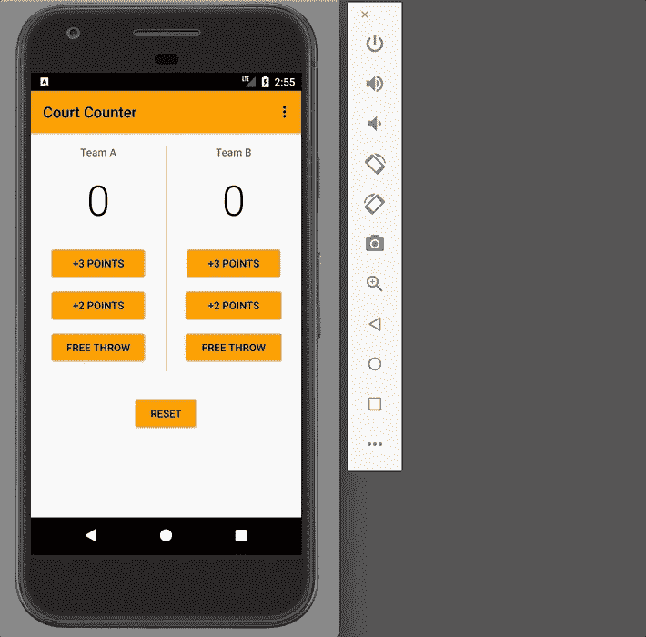
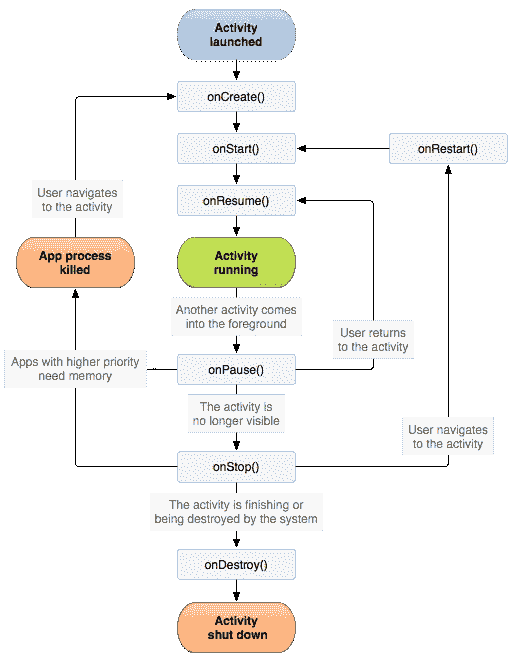
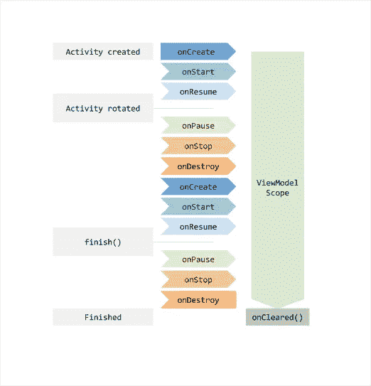
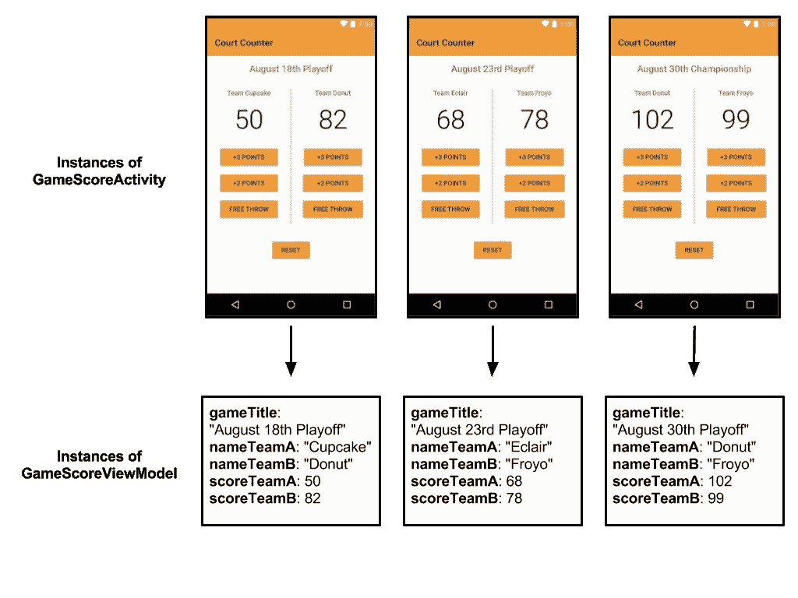

# 视图模型:简单的例子

> 原文：<https://medium.com/androiddevelopers/viewmodels-a-simple-example-ed5ac416317e?source=collection_archive---------0----------------------->

# 介绍

两年多前，我正在为初学者开发 Android。带领学生从零编程到第一个 Android 应用的课程。作为课程的一部分，学生们开发了一个非常简单的叫做[法庭计数器](https://github.com/udacity/Court-Counter)的单屏应用。

Court-Counter 是一个*非常*简单的应用程序，带有修改篮球比分的按钮。尽管完成的应用程序有一个缺陷；如果你旋转手机，你现在的分数会莫名其妙地消失。



这是怎么回事？旋转设备是应用程序在其生命周期中可以经历的少数 [**配置更改**](https://developer.android.com/guide/topics/manifest/activity-element.html#config) 之一，包括键盘可用性和更改设备语言。所有这些配置更改都会导致活动被拆除并重新创建。

这种行为允许我们在设备侧向旋转时使用横向特定布局。不幸的是，对于新的(有时不那么新的)工程师来说，这可能是一件令人头痛的事情。

在 Google I/O 2017 上，Android 框架团队推出了一组新的[架构组件](https://developer.android.com/topic/libraries/architecture/index.html)，其中一个组件处理的就是这个确切的旋转问题。

[**ViewModel**](https://developer.android.com/reference/android/arch/lifecycle/ViewModel.html) 类旨在以生命周期意识的方式保存和管理 UI 相关数据。这使得数据能够在屏幕旋转等配置更改后继续存在。

这篇文章是探索 ViewModel 的来龙去脉的系列文章的第一篇。在这篇文章中，我将:

*   解释视图模型满足的基本需求
*   通过将法庭计数器代码更改为使用 ViewModel 来解决旋转问题
*   仔细看看 ViewModel 和 UI 组件的关联

# 潜在的问题

潜在的挑战是 [Android 活动生命周期](https://developer.android.com/guide/components/activities/activity-lifecycle.html)有许多状态，并且由于配置更改，单个活动可能会在这些不同的状态中循环多次。



当一个活动经历所有这些状态时，您可能还需要将瞬态 UI 数据保存在内存中。我将把**瞬态 UI 数据**定义为 UI 所需的数据。示例包括用户输入的数据、运行时生成的数据或从数据库加载的数据。这些数据可以是位图图像、RecyclerView 所需的对象列表，或者是篮球比分。

以前，您可能在配置更改期间使用`[onRetainNonConfigurationInstance](https://developer.android.com/reference/android/app/Activity.html#onRetainNonConfigurationInstance())`保存这些数据，并在另一端解包。但是，如果您的数据不需要知道或管理活动的生命周期状态，这不是很好吗？如果数据存储在活动之外的某个地方，而不是在活动中有一个像`scoreTeamA` 这样的变量，并因此与活动生命周期的所有突发事件联系在一起，那会怎么样呢？这就是 ViewModel 类的用途。

在下图中，您可以看到一个活动的生命周期，它经历了一个循环，然后最终完成。视图模型的生命周期显示在相关活动生命周期的旁边。注意，ViewModels 可以很容易地用于片段和活动，我称之为 **UI 控制器**。这个例子着重于活动。



ViewModel 从您第一次请求 ViewModel(通常在`onCreate`活动中)开始存在，直到活动完成并销毁。`onCreate`在一个活动的生命周期中可能被调用多次，例如当应用程序被轮换时，但是 ViewModel 始终存在。

# 一个非常简单的例子

设置和使用视图模型有三个步骤:

1.  通过创建一个扩展 [ViewModel](https://developer.android.com/reference/android/arch/lifecycle/ViewModel.html) 的类，将数据从 UI 控制器中分离出来
2.  设置视图模型和 UI 控制器之间的通信
3.  在 UI 控制器中使用视图模型

## 步骤 1:创建一个视图模型类

**注意**:要创建 ViewModel，您首先需要添加正确的生命周期依赖。这里的[怎么看](https://developer.android.com/jetpack/androidx/releases/lifecycle#declaring_dependencies)。

通常，您将为应用程序中的每个屏幕创建一个 ViewModel 类。这个 ViewModel 类将保存与屏幕相关的所有数据，并为存储的数据设置 getters 和 setters。这将显示 UI 的代码(在活动和片段中实现)与数据(现在位于 ViewModel 中)分离开来。因此，让我们为 Court-Counter 中的一个屏幕创建一个 ViewModel 类:

为了简洁起见，我选择将数据作为公共成员存储在我的`ScoreViewModel.java`中，但是创建 getter 和 setter 来更好地封装数据是一个好主意。

## 步骤 2:关联 UI 控制器和视图模型

您的 UI 控制器(也称为活动或片段)需要了解您的视图模型。这是为了当 UI 交互发生时，您的 UI 控制器可以显示数据并更新数据，比如按一个按钮来增加球队在球场上的得分。

**然而，ViewModels 不应该持有对活动、** [**上下文、**](https://developer.android.com/reference/android/content/Context.html) **s** 的引用。 ****** 此外，视图模型不应该包含包含对 UI 控制器的引用的元素，例如视图，因为这将创建对上下文的间接引用。

您不应该存储这些对象的原因是，视图模型比您的特定 UI 控制器实例寿命长—如果您旋转一个活动三次，您就创建了三个不同的活动实例，但您只有一个视图模型。

记住这一点，让我们创建这个 UI 控制器/ViewModel 关联。您需要在 UI 控制器中为您的 ViewModel 创建一个成员变量。然后在`onCreate`中，你应该调用:

```
ViewModelProviders.of(**<Your UI controller>**).get(**<Your ViewModel>.class**)
```

在 Court-Counter 的情况下，这看起来像:

*** *注意:**“视图模型中没有上下文”规则有一个例外。有时候你可能需要一个 [**应用上下文**](https://developer.android.com/reference/android/content/Context.html#getApplicationContext()) (与活动上下文相对)来使用系统服务之类的东西。将应用程序上下文存储在 ViewModel 中是可以的，因为应用程序上下文与应用程序生命周期紧密相关。这与活动上下文不同，后者与活动生命周期相关联。事实上，如果您需要一个应用程序上下文，您应该扩展[**AndroidViewModel**](https://developer.android.com/reference/android/arch/lifecycle/AndroidViewModel.html)，它只是一个包含应用程序引用的视图模型。

## 步骤 3:在 UI 控制器中使用 ViewModel

要访问或更改 UI 数据，您现在可以使用 ViewModel 中的数据。这里有一个新的`onCreate`方法和一个通过给 A 队加一分来更新分数的方法的例子:

**Pro 提示:** ViewModel 还可以很好地与另一个架构组件 [LiveData](https://developer.android.com/reference/android/arch/lifecycle/LiveData.html) 配合使用，我不会在本系列中深入探讨这个组件。使用 LiveData 的额外好处是它是可见的:当数据改变时，它可以触发 UI 更新。你可以在这里了解更多关于 LiveData [的信息。](https://developer.android.com/topic/libraries/architecture/livedata.html)

# 仔细看看`ViewModelsProviders.of`

MainActivity 第一次调用`[ViewModelProviders.of](https://developer.android.com/reference/android/arch/lifecycle/ViewModelProviders.html#of(android.support.v4.app.Fragment))`方法时，它会创建一个新的 ViewModel 实例。当这个方法再次被调用时(每当调用`onCreate`时都会发生)，它将返回与特定法院计数器 MainActivity 关联的预先存在的 ViewModel。这是保存数据的方法。

这只有在您将正确的 UI 控制器作为第一个参数传入时才有效。虽然您应该**永远不要**将 UI 控制器存储在 ViewModel 中，但是 ViewModel 类确实在幕后跟踪 ViewModel 和 UI 控制器实例之间的关联，使用您作为第一个参数传入的 UI 控制器。

```
ViewModelProviders.*of*(**<THIS ARGUMENT>**).get(ScoreViewModel.**class**);
```

这允许您拥有一个打开相同活动或片段的许多不同实例的应用程序，但是具有不同的视图模型信息。让我们想象一下，如果我们扩展我们的法庭柜台的例子，有多个篮球比赛的分数。游戏以列表的形式呈现，然后点击列表中的一个游戏会打开一个看起来像我们当前的 MainActivity 的屏幕，但我会将其命名为 GameScoreActivity。

对于您打开的每个不同的游戏屏幕，如果您在`onCreate`中将 ViewModel 和`GameScoreActivity`相关联，它将创建一个不同的 ViewModel 实例。如果您旋转这些屏幕中的一个，与**相同的**视图模型的连接将保持不变。



所有这些逻辑都是通过调用`ViewModelProviders.of(<Your UI controller>).get(<Your ViewModel>.class)`来完成的。因此，只要你传入一个 UI 控制器的正确实例，它就能工作。

**最后一个想法**:视图模型非常适合将用户界面控制器代码与填充用户界面的数据分离开来。也就是说，它们不是数据持久性和保存应用程序状态的灵丹妙药。在下一篇文章中，我将探索活动生命周期与视图模型的微妙交互，以及视图模型与`onSaveInstanceState`的比较。

# 结论和进一步学习

在这篇文章中，我探索了新的 ViewModel 类的基础。关键要点是:

*   [ViewModel](https://developer.android.com/reference/android/arch/lifecycle/ViewModel.html) 类旨在以生命周期意识的方式保存和管理 UI 相关数据。这使得数据能够在屏幕旋转等配置更改后继续存在。
*   视图模型将 UI 实现与应用程序的数据分离开来。
*   一般来说，如果应用程序中的一个屏幕有瞬态数据，你应该为这个屏幕的数据创建一个单独的视图模型。
*   ViewModel 的生命周期从关联的 UI 控制器第一次被创建时开始，直到它被完全销毁。
*   不要在视图模型中直接或间接存储 UI 控制器或上下文。这包括在视图模型中存储一个视图。对 UI 控制器的直接或间接引用违背了将 UI 与数据分离的目的，并可能导致内存泄漏。
*   ViewModel 对象会经常存储 LiveData 对象，你可以在这里了解更多[的内容。](https://developer.android.com/topic/libraries/architecture/livedata.html)
*   [ViewModelProviders.of](https://developer.android.com/reference/android/arch/lifecycle/ViewModelProviders.html#of(android.support.v4.app.Fragment)) 方法通过作为参数传入的 UI 控制器跟踪 ViewModel 与哪个 UI 控制器相关联。

想要更好的视角吗？检查:

*   [添加梯度依赖关系的说明](https://developer.android.com/topic/libraries/architecture/adding-components.html)
*   [视图模型](https://developer.android.com/topic/libraries/architecture/viewmodel.html)文档
*   在有景观的[房间进行引导视图模型练习](https://codelabs.developers.google.com/codelabs/android-room-with-a-view/)和[生命周期代码实验室](https://codelabs.developers.google.com/codelabs/android-lifecycles/#0)

架构组件是根据您的反馈创建的。如果您对 ViewModel 或任何架构组件有任何问题或意见，请查看我们的[反馈页面](https://developer.android.com/topic/libraries/architecture/feedback.html)。对这个系列有什么问题或建议吗？留言评论！