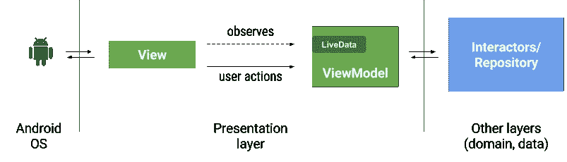

# 视图模型和活动数据:模式+反模式

> 原文：<https://medium.com/androiddevelopers/viewmodels-and-livedata-patterns-antipatterns-21efaef74a54?source=collection_archive---------0----------------------->

# 视图和视图模型

## 分配责任



*Typical interaction of entities in an app built with Architecture Components*

理想情况下，视图模型不应该知道任何关于 Android 的事情。这提高了可测试性、泄漏安全性和模块化。一般的经验法则是确保在你的视图模型中没有`android.*`导入(除了像 `android.arch.*`这样的例外)。这同样适用于演讲者。

> ❌不让视图模型(和演示者)知道 Android 框架类

条件语句、循环和一般决策应该在视图模型或应用程序的其他层中完成，而不是在活动或片段中。这个视图通常没有经过单元测试(除非你使用 [Robolectric](http://robolectric.org/) )，所以代码行越少越好。视图应该只知道如何显示数据并将用户事件发送给视图模型(或演示者)。这就是所谓的 [*被动* *视野*](https://martinfowler.com/eaaDev/PassiveScreen.html) 格局。

> ✅把活动和片断中的逻辑保持到最低限度

## 在视图模型中查看引用

[视图模型](https://developer.android.com/topic/libraries/architecture/viewmodel.html)的作用域不同于活动或片段。当一个视图模型正在运行时，一个活动可以处于它的任何一个生命周期状态。活动和片段可以在 ViewModel 不知情的情况下被销毁和重新创建。


ViewModels persist configuration changes

将视图(活动或片段)的引用传递给视图模型是一个**严重的风险**。让我们假设 ViewModel 从网络请求数据，数据在一段时间后返回。此时，视图引用可能被破坏，或者可能是一个不再可见的旧活动，从而产生内存泄漏，并可能导致崩溃。

> ❌避免在视图模型中引用视图。

在视图模型和视图之间进行通信的推荐方式是 observer 模式，使用 LiveData 或其他库中的 observables。

## 观察者模式


在 Android 中设计表示层的一个非常方便的方法是让视图(活动或片段)观察视图模型(*订阅*中的变化)。由于 ViewModel 不了解 Android，所以不知道 Android 是怎么喜欢频繁杀视图的。这有一些优点:

1.  视图模型在配置更改时保持不变，因此在轮换发生时，不需要重新查询外部数据源(如数据库或网络)。
2.  当长时间运行的操作完成时，ViewModel 中的可观察对象被更新。数据是否被观察并不重要。尝试更新不存在的视图时，不会发生空指针异常。
3.  视图模型不引用视图，所以内存泄漏的风险较小。

Typical subscription from an activity or fragment.

> ✅不是把数据推给用户界面，而是让用户界面观察数据的变化。

# 胖视图模型

无论什么能让你分开关注都是一个好主意。如果您的视图模型包含太多代码或者有太多职责，请考虑:

*   将一些逻辑转移到演示者，其范围与 ViewModel 相同。它将与应用程序的其他部分进行通信，并更新 ViewModel 中的 LiveData 容器。
*   增加一个域层，采用[清洁架构](https://8thlight.com/blog/uncle-bob/2012/08/13/the-clean-architecture.html)。这导致了一个非常可测试和可维护的架构。这也有助于快速脱离主线程。在[建筑蓝图](https://github.com/googlesamples/android-architecture)中有一个干净的建筑样本。

> ✅分配职责，如果需要，添加一个域层。

# 使用数据存储库

如[应用架构指南](https://developer.android.com/topic/libraries/architecture/guide.html)所示，大多数应用都有多个数据源，例如:

1.  远程:网络还是云
2.  本地:数据库或文件
3.  内存缓存

在你的应用程序中有一个数据层是一个好主意，完全不知道你的表示层。保持缓存和数据库与网络同步的算法并不简单。建议使用一个单独的存储库类作为处理这种复杂性的单一入口点。

如果您有多个非常不同的数据模型，请考虑添加多个存储库。

> ✅添加一个数据存储库作为您的数据的单点入口

# 处理数据状态

考虑这个场景:您正在观察一个由 ViewModel 公开的 LiveData，它包含一个要显示的项目列表。视图如何区分正在加载的数据、网络错误和空列表？

*   您可以从视图模型中公开一个`LiveData<MyDataState>`。例如，`MyDataState`可以包含关于数据当前正在加载、已经成功加载还是失败加载的信息。


您可以将数据包装在具有状态和其他元数据(如错误消息)的类中。请参见我们示例中的[资源](https://developer.android.com/topic/libraries/architecture/guide.html#addendum)类。

> ✅使用包装器或其他 LiveData 公开关于数据状态的信息。

# 保存活动状态

活动状态是在活动消失时重新创建屏幕所需的信息，这意味着活动被销毁或进程被终止。旋转是最明显的例子，我们已经用视图模型覆盖了它。如果状态保存在视图模型中，它就是安全的。

然而，在视图模型也消失的其他场景中，您可能需要恢复状态:例如，当操作系统资源不足并终止您的进程时。

为了有效地保存和恢复 UI 状态，请结合使用 persistence、`onSaveInstanceState()`和 ViewModels。

例如，请参见:[视图模型:持久性，onSaveInstanceState()，恢复 UI 状态和加载器](/google-developers/viewmodels-persistence-onsaveinstancestate-restoring-ui-state-and-loaders-fc7cc4a6c090)

# 事件

事件是只发生一次的事情。视图模型公开了数据，但是事件呢？例如，导航事件或显示 Snackbar 消息是只应执行一次的操作。

事件的概念并不完全符合 LiveData 存储和恢复数据的方式。考虑具有以下字段的视图模型:

```
LiveData<String> snackbarMessage = new MutableLiveData<>();
```

一个活动开始对此进行观察，ViewModel 完成一个操作，因此它需要更新消息:

```
snackbarMessage.setValue("Item saved!");
```

该活动接收该值并显示 Snackbar。显然，这很有效。

然而，如果用户旋转手机，新的活动被创建并开始观察。当 LiveData 观察开始时，活动立即接收旧值，这导致消息再次显示！

与其试图用库或架构组件的扩展来解决这个问题，不如把它当作一个设计问题来面对。**我们建议您将您的活动视为您所在州的一部分**。

> ✅把活动设计成你所在州的一部分。欲了解更多详情，请阅读 [LiveData with SnackBar，Navigation and other events(单个 LiveEvent 案例)](/google-developers/livedata-with-snackbar-navigation-and-other-events-the-singleliveevent-case-ac2622673150)。

# 泄漏视图模型

反应范式在 Android 中工作得很好，因为它允许 UI 和应用程序的其余层之间的方便连接。LiveData 是这个结构的关键组件，所以通常您的活动和片段将观察 LiveData 实例。

ViewModels 如何与其他组件通信由您决定，但是要注意泄漏和边缘情况。考虑这个图表，其中表示层使用观察者模式，数据层使用回调:


Observer pattern in the UI and callbacks in the data layer

如果用户退出应用程序，视图将消失，因此视图模型不再被观察到。如果储存库是单例的或者以其他方式作用于应用程序，**储存库不会被销毁，直到进程被终止**。只有在系统需要资源或者用户手动杀死 app 的情况下才会出现这种情况。如果存储库持有对 ViewModel 中回调的引用，ViewModel 将会暂时泄漏


The activity is finished but the ViewModel is still around

如果 ViewModel 是轻量级的，或者操作可以保证快速完成，那么这种泄漏不是什么大问题。然而，情况并非总是如此。理想情况下，视图模型应该可以在没有任何视图观察它们的时候自由活动:


要实现这一点，您有许多选择:

*   使用 ViewModel.onCleared() 您可以告诉存储库放弃对 ViewModel 的回调。
*   在存储库中，你可以使用一个 **WeakReference** 或者你可以使用一个 **Event Bus** (两者都容易被误用，甚至被认为是有害的)。
*   使用 LiveData 在存储库和 ViewModel 之间进行通信，就像在视图和 ViewModel 之间使用 LiveData 一样。

> ✅考虑边缘情况、泄漏以及长时间运行的操作如何影响你的架构中的实例。
> 
> ❌不要在视图模型中放置对保存干净状态至关重要或与数据相关的逻辑。您从 ViewModel 发出的任何调用都可能是最后一个调用。

# 存储库中的实时数据

为了避免泄漏视图模型和*回调地狱*，可以这样观察存储库:


当视图模型被清除或视图的生命周期结束时，订阅也被清除:


如果您尝试这种方法，会有一个问题:如果您不能访问 LifecycleOwner，如何从 ViewModel 订阅存储库？使用[转换](https://developer.android.com/topic/libraries/architecture/livedata#transform_livedata)是解决这个问题的一个非常方便的方法。`Transformations.switchMap`允许您创建新的 LiveData，该 LiveData 对其他 live data 实例的更改做出反应。它还允许在整个链中传递观察者生命周期信息:

Transformations example [[*source*](https://github.com/googlesamples/android-architecture-components/blob/master/GithubBrowserSample/app/src/main/java/com/android/example/github/ui/repo/RepoViewModel.java)]

在此示例中，当触发器获得更新时，将应用该函数，并向下游发送结果。一个活动将观察到`repo`，同一个生命周期所有者将被用于`repository.loadRepo(id)`调用。

> ✅每当你认为你需要一个[生命周期](https://developer.android.com/reference/android/arch/lifecycle/Lifecycle.html)对象在[视图模型](https://developer.android.com/reference/android/arch/lifecycle/ViewModel.html)中，一个[转换](https://developer.android.com/topic/libraries/architecture/livedata#transform_livedata)可能就是解决方案。

# 扩展 LiveData

LiveData 最常见的用例是在视图模型中使用`MutableLiveData`,并将它们公开为`LiveData`,使它们对于观察者来说是不可变的。

如果您需要更多功能，扩展 LiveData 将让您知道何时有活动的观察者。例如，当您想要开始收听位置或传感器服务时，这很有用。

## 何时不扩展 LiveData

您也可以使用`onActive()`来启动一些加载数据的服务，但是除非您有一个好的理由，否则您不需要等待 LiveData 被观察到。一些常见模式:

*   向视图模型添加一个`start()`方法，并尽快调用它【参见[蓝图示例](https://github.com/googlesamples/android-architecture/blob/dev-todo-mvvm-live/todoapp/app/src/main/java/com/example/android/architecture/blueprints/todoapp/addedittask/AddEditTaskFragment.java#L64)
*   设置一个启动加载的属性[参见 [GithubBrowserExample](https://github.com/googlesamples/android-architecture-components/blob/master/GithubBrowserSample/app/src/main/java/com/android/example/github/ui/repo/RepoFragment.kt) ]。

> ❌:你通常不会扩展 LiveData。让您的活动或片段告诉 ViewModel 什么时候开始加载数据。

您是否需要关于架构组件的任何其他主题的指导(或意见)?请在评论中告诉我们。