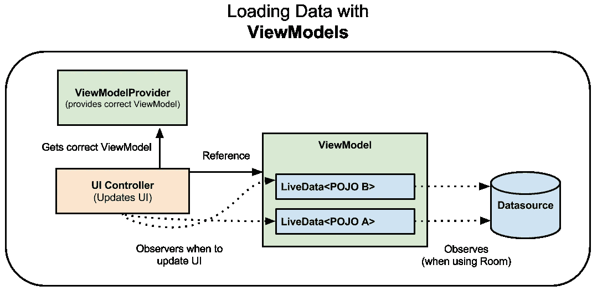

# ViewModels: Persistence，onSaveInstanceState()，恢复 UI 状态和加载器

> 原文：<https://medium.com/androiddevelopers/viewmodels-persistence-onsaveinstancestate-restoring-ui-state-and-loaders-fc7cc4a6c090?source=collection_archive---------1----------------------->

# 介绍

在[上一篇博文](/google-developers/viewmodels-a-simple-example-ed5ac416317e)中，我探索了一个简单的用例，使用新的 [ViewModel](https://developer.android.com/reference/android/arch/lifecycle/ViewModel.html) 类在配置更改期间保存篮球比分数据。视图模型旨在以生命周期意识的方式保存和管理与 UI 相关的数据。视图模型允许数据在屏幕旋转等配置变化后仍然存在。

此时，您可能会对视图模型的作用范围有一些疑问。在这篇文章中，我将回答:

*   **视图模型会保存我的数据吗？**TL；【T6 号】博士照常坚持！
*   【ViewModels 是否是[**onSaveInstanceState**](https://developer.android.com/reference/android/app/Activity.html#onSaveInstanceState(android.os.Bundle))**的替代品？**TL；不，但它们是相关的，所以继续读下去。
*   **2019 年 5 月 15 日更新:如何使用 ViewModels 高效保存和恢复 UI 状态？**t̶l̶；̶d̶r̶̶y̶o̶u̶̶u̶s̶e̶̶a̶̶c̶o̶m̶b̶i̶n̶a̶t̶i̶o̶n̶̶o̶f̶̶v̶i̶e̶w̶m̶o̶d̶e̶l̶s̶,̶̶o̶n̶s̶a̶v̶e̶i̶n̶s̶t̶a̶n̶c̶e̶s̶t̶a̶t̶e̶(̶)̶̶a̶n̶d̶̶l̶o̶c̶a̶l̶̶p̶e̶r̶s̶i̶s̶t̶e̶n̶c̶e̶.̶TL；你使用视图模型和[视图模型保存状态模块](https://developer.android.com/topic/libraries/architecture/viewmodel-savedstate)以及本地持久性。
*   ViewModels 是装载机的替代品吗？TL；是的，与其他几个类结合使用的视图模型可以代替加载器。

**2019 年 5 月 15 日更新了新的 ViewModel 保存状态模块。请注意“我如何使用视图模型来有效地保存和恢复用户界面状态？”在顶部有一个当前在 alpha 中的[视图模型保存状态模块](https://developer.android.com/topic/libraries/architecture/viewmodel-savedstate)的更新。**

# 视图模型会保存我的数据吗？

**TL；【T27 号博士】照常坚持！**

视图模型保存在 UI 中使用的瞬态数据，但是它们不保存数据。一旦相关联的 UI 控制器(片段/活动)被销毁或者进程被停止，ViewModel 和所有包含的数据就被标记为垃圾收集。

应用程序多次运行时使用的数据应该像平常一样保存在[本地数据库、共享首选项和/或云中](https://developer.android.com/guide/topics/data/data-storage.html)。如果你希望用户能够将应用程序放入后台，然后在三个小时后回到完全相同的状态，你也应该持久化数据。这是因为一旦你的活动进入后台，如果设备内存不足，你的应用程序进程就会停止。在 activity 类文档中有一个[方便的表格，它描述了在哪些活动生命周期状态下您的应用程序是可停止的:](https://developer.android.com/reference/android/app/Activity.html#ActivityLifecycle)


[Activity lifecycle documentation](https://developer.android.com/reference/android/app/Activity.html#ActivityLifecycle)

提醒一下，当一个应用程序进程由于资源限制而停止时，它的停止是没有仪式的，并且**不会调用额外的生命周期回调。**这意味着你不能依赖`[onDestroy](https://developer.android.com/reference/android/app/Activity.html#onDestroy())`被调用。在进程关闭时，您**没有**机会保存数据。因此，如果你想最大程度地确保你不会丢失数据，那么一旦用户输入了数据，就把它持久化。这意味着，即使您的应用程序进程由于资源限制而关闭，或者如果设备电池电量耗尽，数据也将被保存。如果您愿意承认在设备突然关闭的情况下丢失数据，您可以将数据保存在`[onStop()](https://developer.android.com/reference/android/app/Activity.html#onStop())` 回调**、**中，这正好在活动进入后台时发生。

# ViewModels 是 onSaveInstanceState 的替代吗？

**TL；不，博士，但是他们是相关的，所以继续读下去。**

为了理解这种差异的微妙之处，理解`[onSaveInstanceState()](https://developer.android.com/reference/android/app/Activity.html#onSaveInstanceState(android.os.Bundle, android.os.PersistableBundle))`和`[Fragment.setRetainInstance(true)](https://developer.android.com/reference/android/app/Fragment.html#setRetainInstance(boolean))`之间的差异是有帮助的

**onSaveInstanceState():** 这个回调意味着在两种情况下保留少量的与 UI 相关的数据:

*   由于内存限制，应用程序的进程在后台时会停止。
*   配置更改。

`onSaveInstanceState()`被系统在[停止](https://developer.android.com/reference/android/app/Activity.html#onStop())但[未完成](https://developer.android.com/reference/android/app/Activity.html#finish())的情况下调用。当用户显式关闭活动或在其他情况下调用`[finish()](https://developer.android.com/reference/android/app/Activity.html#finish())`时，不会调用**而不是**。

请注意，许多 UI 数据是自动保存和恢复的:

> 此方法的默认实现保存有关活动视图层次结构状态的临时信息，如 [EditText](https://developer.android.com/reference/android/widget/EditText.html) 小部件中的文本或 [ListView](https://developer.android.com/reference/android/widget/ListView.html) 小部件的滚动位置— [保存和恢复实例状态文档](https://developer.android.com/guide/components/activities/activity-lifecycle.html#saras)

这些也是应该存储在`onSaveInstanceState()`中的数据类型的好例子。`onSaveInstanceState()` [不是为了](https://developer.android.com/guide/topics/resources/runtime-changes.html#RetainingAnObject)存储大量数据而设计的，比如位图。`onSaveInstanceState()`旨在存储较小的数据，与用户界面相关，序列化或反序列化并不复杂。如果被序列化的对象很复杂，序列化会消耗大量内存。因为在配置更改期间，这个过程发生在主线程上，所以它需要很快，这样您就不会丢帧并导致视觉上的停顿。

**fragment . setretaininstance(true)**:[处理配置更改文档](https://developer.android.com/guide/topics/resources/runtime-changes.html#RetainingAnObject)描述了在配置更改期间使用保留的片段存储数据的过程。这个*听起来*不如`onSaveInstanceState()`有用，因为`onSaveInstanceState()`涵盖了配置更改和流程关闭。创建保留片段的用处在于，它意味着保留大型数据集(如图像)或保留复杂对象(如网络连接)。

**视图模型仅在与配置更改相关的破坏中存活；它们无法在停止的过程中存活。**这使得视图模型取代了使用带有`setRetainInstance(true)`的片段(事实上，视图模型在后台使用带有 [setRetainInstance](https://developer.android.com/reference/android/app/Fragment.html#setRetainInstance(boolean)) 设置为 true 的片段)。

## ViewModel 的其他优势

视图模型和`onSaveInstanceState()`以非常不同的方式处理 UI 数据。`onSaveInstanceState()`是一个生命周期回调，而视图模型从根本上改变了用户界面数据在应用中的管理方式。除了`onSaveInstanceState()`之外，这里还有一些关于使用 ViewModel 的好处的想法:

*   视图模型鼓励好的架构设计。您的数据与您的 UI 代码分离，这使得代码更加模块化并简化了测试。
*   `onSaveInstanceState()`旨在保存少量的瞬态数据，而不是复杂的对象列表或媒体数据。**ViewModel 可以委托复杂数据的加载，并且在数据加载后充当临时存储**。
*   `onSaveInstanceState()`在配置更改期间以及活动进入后台时调用；在这两种情况下，如果你把数据保存在视图模型中，你实际上不需要**重新加载或处理数据。**

# 如何使用视图模型高效地保存和恢复 UI 状态？

**更新于 2019 年 5 月 15 日**

**t̶l̶；̶d̶r̶̶**y̶o̶u̶̶u̶s̶e̶̶a̶̶c̶o̶m̶b̶i̶n̶a̶t̶i̶o̶n̶̶o̶f̶̶v̶i̶e̶w̶m̶o̶d̶e̶l̶s̶,̶̶o̶n̶s̶a̶v̶e̶i̶n̶s̶t̶a̶n̶c̶e̶s̶t̶a̶t̶e̶(̶)̶̶a̶n̶d̶̶l̶o̶c̶a̶l̶̶p̶e̶r̶s̶i̶s̶t̶e̶n̶c̶e̶.̶

**TL；**博士你使用`ViewModel` s 和 [ViewModel 保存状态模块](https://developer.android.com/topic/libraries/architecture/viewmodel-savedstate)以及本地持久性。

目前在 alpha 中有一个新的 ViewModel 保存状态模块[，你应该知道。这个模块的目的是替换 onSaveInstanceState 回调中的代码，并将其移动到 ViewModel 中。当它变得稳定时，这将是使用 ViewModel 保存 UI 状态的推荐方式。本节中的所有内容都是用 ViewModel 处理保存状态的“当前的、即将过时的”方式。](https://developer.android.com/jetpack/androidx/releases/lifecycle#viewmodel-savedstate-1.0.0-alpha01)

**了解更多信息**

要添加的依赖项是:

```
androidx.lifecycle:lifecycle-viewmodel-savedstate:1.0.0-alpha01
```

有关如何使用新模块的说明，请查阅[文档](https://developer.android.com/topic/libraries/architecture/viewmodel-savedstate)。在[生命周期代码实验室](https://codelabs.developers.google.com/codelabs/android-lifecycles/#6)中也有一个分步示例。来自 codelab 的解决方案代码有一个运行中的模块的简短示例；你可以在这里看一下[。](https://github.com/googlecodelabs/android-lifecycles/tree/master/app/src/main/java/com/example/android/lifecycles/step6_solution)

最后，在[架构组件中的新特性(Google I/O' 19)](https://youtu.be/Qxj2eBmXLHg) 演示中，Sergey 展示了一个处理 ViewModel 和 onSaveInstanceState 的旧方法的示例，以及使用 ViewModel 保存状态的新方法。可以从 [15:27](https://youtu.be/Qxj2eBmXLHg?t=926) 开始看代码示例。对于整个保存状态/视图模型难题的解释，从 [11:26](https://youtu.be/Qxj2eBmXLHg?t=687) 开始观看。

**有什么变化**

以下是不同之处的概述:

*   不需要在活动的`[onCreate](https://developer.android.com/reference/android/app/Activity.html#onCreate(android.os.Bundle))`方法中覆盖`[onSaveInstanceState](https://developer.android.com/reference/android/app/Activity.html#onSaveInstanceState(android.os.Bundle))` / `[onRestoreInstanceState](https://developer.android.com/reference/android/app/Activity.html#onRestoreInstanceState(android.os.Bundle))`或对 savedInstanceState bundle 做任何事情。
*   现在，ViewModel 中有了一个`[SavedStateHandle](https://developer.android.com/reference/androidx/lifecycle/SavedStateHandle.html)`，而不是将状态保存到活动的包中。现在，ViewModel 可以真正处理自己的所有数据了。它不再需要向活动发送状态和从活动接收状态。
*   `[SavedStateHandle](https://developer.android.com/reference/androidx/lifecycle/SavedStateHandle.html)`与 bundle 非常相似——它是一个键值映射，在内存约束相关的进程死亡后仍然存在。出于上面给出的相同原因，您应该只在`SavedStateHandle`中存储**少量的**数据。基本上，`SavedStateHandle`代替了捆绑包。
*   `SavedStateHandle`具有返回`[LiveData](https://developer.android.com/reference/androidx/lifecycle/SavedStateHandle.html#getLiveData(java.lang.String))`的额外能力。

下面是我第一次发表这篇博文时出现的“老办法”。这个建议仍然适用，只是在活动中提到使用`onSaveInstanceState`时，应该在视图模型中用`SavedStateHandle`替换。记住这一点，继续读下去。

重要的是，您的活动保持用户期望的状态，即使它被轮换、被系统关闭或被用户重启。正如我刚才提到的，不要让复杂的对象阻塞`onSaveInstanceState`也很重要。您也不希望在不需要的时候从数据库中重新加载数据。让我们来看一个允许您搜索歌曲库的活动示例:


Example of the clean state of the activity and the state after a search

有两种用户可以离开活动的一般方式，以及用户将期望的两种不同结果:

*   第一个是用户**是否完全关闭**活动。如果用户将某个活动从[最近屏幕](https://developer.android.com/guide/components/activities/recents.html)上划掉，或者如果用户[向上或向后](https://developer.android.com/training/design-navigation/ancestral-temporal.html)导航出某个活动，则用户可以完全关闭该活动。在这些情况下的假设是**用户已经永久地离开了该活动，如果他们再次打开该活动，他们将期望从一个干净的状态开始**。对于我们的歌曲应用程序，如果用户完全关闭歌曲搜索活动，然后重新打开该活动，歌曲搜索框将被清除，搜索结果也将被清除。
*   另一方面，如果用户旋转电话或将活动放在背景中，然后再回来，用户期望他们搜索的搜索结果和歌曲就在那里，和以前完全一样。有几种方法可以让用户将活动放在后台。他们可以按下 home 键或导航到应用程序的其他地方。或者他们可能在查看搜索结果的过程中收到电话或通知。但是最终，用户希望当他们回到活动时，状态和他们离开时一样。

为了在这两种情况下实现这种行为，您将一起使用本地持久性、视图模型和`onSaveInstanceState()`。每个都将存储活动使用的不同数据:

*   **本地持久化**用于存储您不想在打开和关闭活动时丢失的所有数据。
    **示例:**所有歌曲对象的集合，可能包括音频文件和元数据
*   **视图模型**用于存储显示相关 UI 控制器所需的所有数据。
    **例如:**最近搜索的结果，最近搜索查询
*   **onSaveInstanceState** 用于存储当 UI 控制器被系统停止并重新创建时，轻松重新加载活动状态所需的少量数据。不在这里存储复杂对象，而是在本地存储中持久化复杂对象，并在`onSaveInstanceState()`中存储这些对象的唯一 ID。
    **例如:**最近的搜索查询

在歌曲搜索示例中，不同的事件应该如何处理:

**当用户添加一首歌曲时—**ViewModel 将立即委托在本地保存该数据。如果新添加的歌曲应该显示在 UI 中，那么您还应该更新 ViewModel 中的数据以反映歌曲的添加。记住在主线程之外执行所有的数据库插入。

**当用户搜索歌曲时—** 无论您从数据库中为 UI 控制器加载什么样的复杂歌曲数据，都应该立即存储在 ViewModel 中。您还应该在 ViewModel 中保存搜索查询本身。

**当活动进入后台，活动被系统停止—** 当活动进入后台，会调用`onSaveInstanceState()`。您应该将搜索查询保存在`onSaveInstanceState()`包中。这种少量的数据很容易保存。这也是让活动回到当前状态所需的所有信息。

**创建活动时** —有三种不同的方式:

*   **第一次创建活动**:在这种情况下，`onSaveInstanceState()`包中没有数据，只有一个空的视图模型。创建 ViewModel 时，您将传递一个空查询，ViewModel 将知道还没有要加载的数据。该活动将以干净的空状态开始。
*   **活动在被系统**停止后创建:活动会将查询保存在`onSaveInstanceState()` bundle 中。活动应该将查询传递给 ViewModel。ViewModel 将看到它没有缓存搜索结果，并将使用给定的搜索查询委托加载搜索结果。
*   **活动是在配置更改**之后创建的:活动将查询保存在`onSaveInstanceState()`包中，视图模型已经缓存了搜索结果。您将查询从`onSaveInstanceState()`包传递到 ViewModel，ViewModel 将确定它已经加载了必要的数据，并且**不**需要重新查询数据库。

这是处理保存和恢复活动状态的一种合理方式。根据您的活动实现，您可能根本不需要使用`onSaveInstanceState()`。例如，一些活动在用户关闭后不会以干净的状态打开。目前，当我在 Android 上关闭并重新打开 Chrome 时，它会带我回到关闭之前我正在查看的网页。如果您的活动以这种方式运行，那么您可以放弃`onSaveInstanceState()`,转而在本地持久化所有内容。在歌曲搜索示例中，这意味着持续最近的查询，例如在[共享偏好](https://developer.android.com/reference/android/content/SharedPreferences.html)中。

此外，当您从意向中打开一个活动时，在配置更改和系统恢复一个活动时，会向您提供附加包。如果搜索查询作为一个额外的意图被传递，您可以使用 extras 包而不是`onSaveInstanceState()`包。

不过，在这两种场景中，您仍然可以使用 ViewModel 来避免在配置更改期间浪费从数据库重新加载数据的周期！

# 视图模型是装载机的替代品吗？

**TL；是的，与其他一些类结合使用的视图模型可以代替加载器。**

[**加载器**](https://developer.android.com/guide/components/loaders.html) 用于为 UI 控制器加载数据。此外，如果您在装载过程中旋转设备，装载器可以承受配置变化。这听起来很熟悉！

加载器，尤其是[光标加载器](https://developer.android.com/reference/android/content/CursorLoader.html)的一个常见用例是让加载器观察数据库的内容，并保持 UI 显示的数据同步。使用 CursorLoader，如果数据库中的值发生变化，加载器将自动触发数据的重新加载并更新 UI。


与其他架构组件 [LiveData](https://developer.android.com/topic/libraries/architecture/livedata.html) 和 [Room](https://developer.android.com/topic/libraries/architecture/room.html) 一起使用的视图模型可以替代加载器。ViewModel 确保数据可以在配置更改后继续存在。LiveData 确保您的 UI 可以在数据更新时更新。Room 确保当您的数据库更新时，您的 LiveData 会得到通知。



加载器是作为 UI 控制器中的回调实现的，所以视图模型的一个额外好处是它们将 UI 控制器和数据加载分开。这使得类之间的强引用更少。

使用视图模型和 LiveData 加载数据有几种方法:

*   在[的这篇博客文章](/google-developers/lifecycle-aware-data-loading-with-android-architecture-components-f95484159de4)，[中，Ian Lake](https://medium.com/u/51a4f24f5367?source=post_page-----fc7cc4a6c090--------------------------------) 概述了如何使用 ViewModel 和 LiveData 来替换 [AsyncTaskLoader](https://developer.android.com/reference/android/content/AsyncTaskLoader.html) 。
*   随着代码变得越来越复杂，您可以考虑在单独的类中进行实际的数据加载。ViewModel 类的目的是包含 UI 控制器的数据，以便该数据在配置更改后仍然存在。加载、持久化和管理数据是复杂的功能，超出了传统视图模型的范围。Android 应用架构指南[建议构建一个**知识库**类。](https://developer.android.com/topic/libraries/architecture/guide.html#fetching_data)

> 储存库模块负责处理数据操作。它们为应用程序的其余部分提供了一个干净的 API。他们知道从哪里获取数据，以及在数据更新时进行什么 API 调用。您可以将它们视为不同数据源(持久模型、web 服务、缓存等)之间的中介。)."— [应用架构指南](https://developer.android.com/topic/libraries/architecture/guide.html#fetching_data)

# 结论和进一步学习

在这篇文章中，我回答了一些关于 ViewModel 类是什么和不是什么的问题。关键要点是:

*   视图模型不能替代持久性——当数据发生变化时，可以像平常一样持久化数据。
*   视图模型不是`onSaveInstanceState()`的替代品，因为它们只能在与配置更改相关的破坏中存活；它们不会在操作系统停止应用程序的过程中存活。
*   `onSaveInstanceState()`不是指需要冗长的序列化/反序列化的复杂数据。
*   为了有效地保存和恢复用户界面状态，使用持久化、`onSaveInstanceState()`和视图模型的组合。复杂数据保存在本地持久存储中，而`onSaveInstanceState()`用于存储复杂数据的唯一标识符。视图模型在加载后将复杂数据存储在内存中。
*   在这种场景中，当活动旋转或进入后台时，视图模型仍然保留数据，这是纯粹使用`onSaveInstanceState()`不容易做到的。
*   ViewModels 和 LiveData 结合使用，可以替代加载器。您可以使用 Room 来替换 CursorLoader 功能。
*   创建存储库类是为了支持加载、缓存和同步数据的可扩展架构。

想要更好的视角吗？检查:

*   [添加梯度依赖关系的说明](https://developer.android.com/topic/libraries/architecture/adding-components.html)
*   [ViewModel](https://developer.android.com/topic/libraries/architecture/viewmodel.html) 文档
*   在带景观的[房间进行引导视图模型练习](https://codelabs.developers.google.com/codelabs/android-room-with-a-view/)和[生命周期代码实验室](https://codelabs.developers.google.com/codelabs/android-lifecycles/#0)
*   包含 ViewModel [ [架构组件](https://github.com/googlesamples/android-architecture-components) ] [ [使用生命周期组件的架构蓝图](https://github.com/googlesamples/android-architecture/tree/dev-todo-mvvm-live/) ]的有用示例
*   [应用架构指南](https://developer.android.com/topic/libraries/architecture/guide.html)

架构组件是根据您的反馈创建的。如果您对 ViewModel 或任何架构组件有任何问题或意见，请查看我们的[反馈页面](https://developer.android.com/topic/libraries/architecture/feedback.html)。关于这个系列的问题？留言评论！